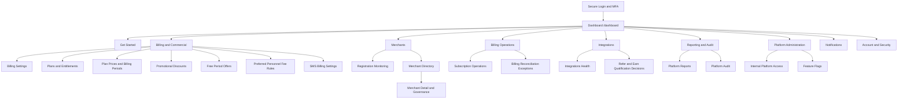
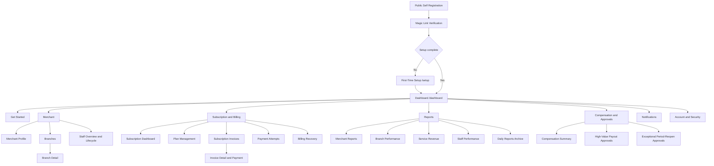
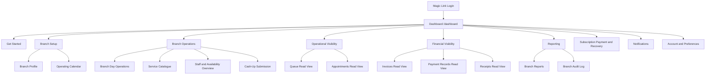
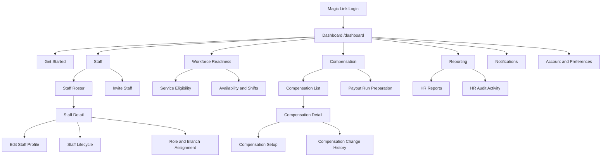
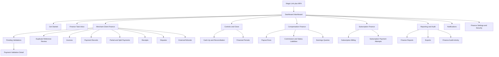
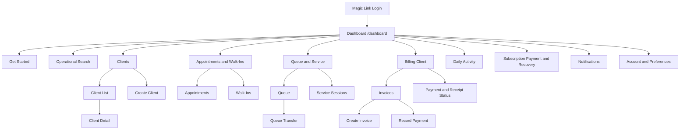
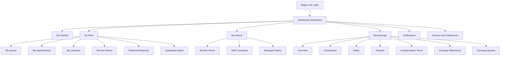
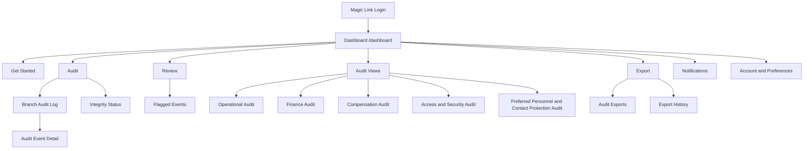
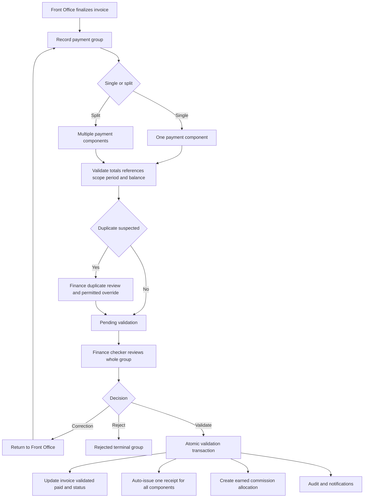
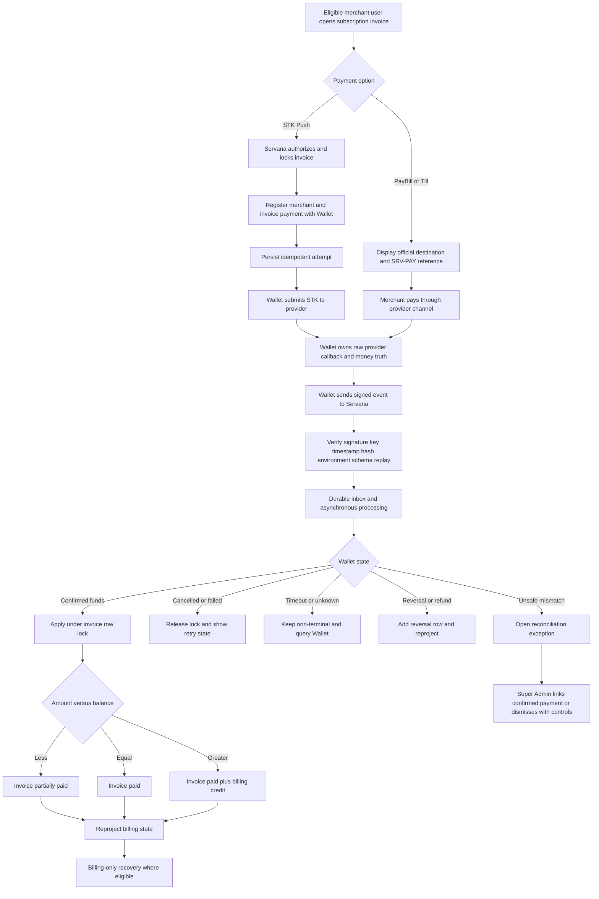

# Servana by Citrus
# Role-Specific UI/UX, Account Subdomain, Landing Page, Navigation, and Application-Surface Software Development Plan

**Document type:** Implementation-ready corrective software development plan  
**Product:** Servana by Citrus  
**Product owner and operator:** Citrus Labs Limited  
**Primary launch market:** Kenya  
**Primary audience:** African service-based SMEs and their authorized operating teams  
**Document date:** 28 July 2026  
**Target repository:** `C:\Users\nderu\Documents\Development\Product\Servana`  
**Target stack:** Laravel 12, PHP 8.3, Vue 3, TypeScript, Pinia, Vue Router, Tailwind CSS, PostgreSQL 16, Redis 7, Vite, Docker, GitHub Actions  
**Authentication:** Passwordless Magic Link only, with MFA or fresh step-up for privileged actions  
**Default currency:** KES, stored as integer minor units with an explicit ISO currency code  
**Business timezone:** `Africa/Nairobi`  
**Responsive strategy:** Mobile-first CSS using viewport-width media queries only  
**Theme:** Light mode by default; explicit persistent dark-mode option  
**Status:** Product-owner-directed UI/UX remediation, completion, and production-readiness programme  

---

# 0. Plan Purpose

This document instructs the IDE to replace the currently unacceptable, generic, incomplete, visually jumbled, and role-confused browser experience with a complete production-ready Servana user interface and user experience.

The work is not a superficial styling exercise.

The IDE must implement the complete experience from each account’s public landing page through authentication, onboarding, authenticated dashboard, navigation, functional pages, legal pages, support pages, responsive behavior, theme behavior, accessibility, browser evidence, and production deployment.

The implementation must cover all eight Servana account experiences:

1. Super Administrator.
2. Merchant Administrator.
3. Branch.
4. Finance.
5. Human Resource.
6. Front Office.
7. Personnel.
8. Audit.

The implementation must use the exact user-account pages, page purposes, sub-features, workflows, ownership boundaries, routes, and authorization expectations defined by `servana-user-account-navigation-maps.md`.

The navigation map contains **160 explicitly specified authenticated pages**:

| Account | Required page count |
|---|---:|
| Super Administrator | 22 |
| Merchant Administrator | 23 |
| Branch | 18 |
| Human Resource | 19 |
| Finance | 24 |
| Front Office | 19 |
| Personnel | 20 |
| Audit | 15 |
| **Total** | **160** |

The IDE must not collapse these pages into a small set of generic placeholders.

The IDE must not use one landing page, one dashboard, one navigation registry, or one role shell as the visible final experience for all account types.

Shared infrastructure is required. Shared final information architecture is prohibited where the account requirements differ.

---

# 1. Mandatory Engineering Method

Every phase and every defect must follow the Servana engineering manifesto.

## 1.1 Prove the problem

Before editing code, the IDE must identify:

- The governing requirement.
- The actual repository state.
- The actual running browser state.
- The exact route, host, component, layout, content source, API, policy, middleware, asset, or test involved.
- The account types affected.
- The consequence of the defect.
- The evidence proving that the defect exists.
- The exact verification that will prove resolution.

The IDE must not rely on `PROGRESS.md`, `CHANGELOG.md`, screenshots from an older commit, or comments in code as proof that a page works.

## 1.2 Perform root-cause analysis

The IDE must separate root cause from symptom.

Examples:

- A missing logo may be caused by an obsolete filename, unresolved asset URL, stale build, unused component, content-security policy, or incorrect public path.
- Shared landing pages may be caused by a generic host fallback, route alias collision, incorrect account resolver, or a single hard-coded content key.
- Incorrect role pages may be caused by route-generation defects, navigation registry drift, permission-map mismatch, stale frontend bootstrap state, or an invalid account-context switch.
- A jumbled page may be caused by duplicate shells, invalid document hierarchy, uncontrolled fixed positioning, nested scroll regions, or content sections rendered outside their intended layout.
- Missing dashboards may be caused by absent routes, unreachable components, future-phase status, incorrect inventory metadata, or an API contract that was never implemented.
- Dark mode loading first may be caused by `prefers-color-scheme`, an incorrect persisted default, or theme-class initialization after hydration.

The IDE must name the root cause before changing code.

## 1.3 Fix with precision

The IDE must implement the smallest complete correction that resolves the proven root cause.

It must not:

- Apply broad CSS changes without correcting routing and information architecture.
- Use frontend visibility as authorization.
- Create fake pages only to satisfy route-count tests.
- Populate production pages with mock data.
- Invent pricing.
- Invent testimonials.
- Invent customer logos.
- Invent ratings.
- Invent usage statistics.
- Invent compliance certifications.
- Paraphrase legal text.
- Restore a deliberately deleted asset without product-owner authorization.
- Create Wallet by Citrus-owned payment-provider functionality in Servana.
- Create Citrus Refer & Earn-owned reward functionality in Servana.
- Create a Personnel contact-export path.
- Add a Super Administrator merchant-creation or impersonation path.

## 1.4 Test thoroughly

Every relevant change must include:

- Unit tests.
- Laravel feature tests.
- API tests.
- Authentication tests.
- Host-resolution tests.
- Magic Link host-binding tests.
- Authorization tests.
- Merchant-tenant isolation tests.
- Branch-scope tests.
- Personnel-own-scope tests.
- Maker/checker tests.
- Vue component tests.
- Pinia store tests.
- Router tests.
- Navigation-map parity tests.
- Screen-inventory parity tests.
- Content-source parity tests.
- Asset-resolution tests.
- Theme tests.
- Responsive browser tests.
- Accessibility tests.
- Visual-regression tests.
- Production-build tests.
- Docker smoke tests.
- Security regression tests.

## 1.5 Demonstrate resolution

A phase is complete only when the IDE provides:

- Starting repository state.
- Commit and branch.
- File-level implementation checklist.
- Root-cause records.
- Files changed.
- Routes changed.
- APIs changed.
- Policies changed.
- Tests added.
- Exact test commands.
- Exact test output.
- Browser screenshots.
- Network evidence.
- Wrong-host denial evidence.
- Cross-tenant denial evidence.
- Cross-branch denial evidence.
- Own-scope denial evidence.
- Light-mode evidence.
- Dark-mode evidence.
- Responsive evidence.
- Accessibility evidence.
- Performance evidence.
- Updated screen inventory.
- Updated navigation registry.
- Updated traceability.
- Updated `PROGRESS.md`.
- Updated `CHANGELOG.md`.
- A phase proof document.
- A reviewed pull request.

---

# 2. Source-of-Truth Hierarchy and Non-Contradiction Rules

## 2.1 Governing order

Apply the following hierarchy:

1. `Servana Software Development Plan.md` governs architecture, business invariants, security, data integrity, phase ownership, Wallet integration, Refer & Earn integration, and testing.
2. `Servana Project Scope.md` governs product behavior and business rules where the development plan requires additional context.
3. The approved product-owner directives in this document govern the requested role subdomains, navigation placement, landing-page structure, fixed footer, light-mode default, and Apple-inspired UI direction.
4. `servana-user-account-navigation-maps.md` governs the complete role-specific frontend information architecture, page routes, page purposes, sub-features, workflows, and role boundaries.
5. `docs/auth/permission-matrix.yaml` governs canonical permission keys and assignment.
6. The actual repository governs evidence of what is built.
7. `docs/brand/Servana Brand Identity.md` governs Servana visual identity, color usage, typography, tone, logo usage, and brand expression.
8. Role-specific landing-page, legal, and FAQ documents govern public content.
9. `CLAUDE.md` governs IDE workflow only.
10. `PROGRESS.md`, `CHANGELOG.md`, and historical proof files are claims and historical records, not substitutes for browser evidence.

## 2.2 Explicit UI placement supersession

The generic navigation-shell statement in the navigation map is superseded only in this narrow respect:

- The authenticated Super Administrator account uses header navigation.
- Every other authenticated account uses left-side navigation on desktop.
- Tablet and mobile may collapse left navigation into an accessible left-anchored drawer.

This supersession changes placement only.

It does not change:

- Page ownership.
- Page names.
- Routes.
- Permissions.
- Tenant scope.
- Branch scope.
- Personnel own-scope.
- Maker/checker.
- MFA or step-up.
- Audit read-only behavior.
- Merchant Administrator authority limits.
- Super Administrator governance limits.

## 2.3 Dashboard and onboarding rules

The following rules are binding:

- `/dashboard` is the authenticated home page for every account.
- Merchant Administrator first-time `/setup` is the only pre-dashboard operational gate.
- Every account has `/get-started`.
- First login opens or highlights the role-specific get-started companion while retaining `/dashboard` as the authenticated home.
- An already-onboarded user must never be redirected back to setup without a proven account-state reason.

## 2.4 Payment boundaries

The UI must accurately represent these boundaries:

- Merchant-client service payments remain externally collected and are recorded in Servana.
- Front Office is the default payment-recording maker.
- Finance validates or rejects payment groups.
- A receipt is issued only after successful validation.
- Merchant subscription payments are orchestrated by Wallet by Citrus.
- Servana does not hold provider credentials.
- Servana does not process raw Daraja or PesaPal callbacks.
- Servana does not perform provider reconciliation.
- A browser redirect, STK initiation response, timeout, or frontend polling result is not proof of payment.
- Super Administrator reconciliation resolution may link an already Wallet-confirmed payment; it is not manual payment recording.

## 2.5 Missing or conflicting source behavior

A genuine business-rule conflict must be recorded in:

```text
docs/decisions/blocking-ambiguities.md
```

A UI implementation must not silently choose a financial, legal, permission, state-machine, or integration rule.

A visual implementation ambiguity that does not alter business behavior may be resolved through a screen specification and design review.

---

# 3. Repository Safety and Plan Adoption

## 3.1 Starting safety gate

Before changing any file, verify:

```text
current branch
HEAD
origin/main
ahead/behind state
working-tree state
staged files
untracked files
current active phase
latest merged PR
current Docker image identifiers
current Vite asset hashes
current browser-served commit
```

Do not reset, clean, stash, overwrite, amend, or delete unrelated work.

If the working tree is dirty, stop implementation and report every changed path.

If the repository is clean and on `main`, create a dedicated plan-adoption branch.

Recommended branch:

```text
plan/role-ui-ux-subdomains
```

After the adoption PR merges, each implementation phase uses its own branch and PR.

## 3.2 Plan-adoption deliverables

The adoption PR must add this plan to the repository under an approved path such as:

```text
docs/plans/servana-role-ui-ux-subdomain-development-plan.md
```

It must also:

- Register `servana-user-account-navigation-maps.md` as a binding frontend specification.
- Update `CLAUDE.md` to require reading the navigation map for frontend work.
- Update the traceability matrix.
- Record the explicit Super Administrator header-navigation supersession.
- Record the eight-host architecture decision.
- Record the light-mode-default decision.
- Record the fixed-footer requirement.
- Record the approved icon-system decision.
- Record the content-compilation decision.
- Add or update architecture decision records using the next available ADR numbers.
- Update `PROGRESS.md` and `CHANGELOG.md` with real commit references.

## 3.3 Required architecture decisions

Create ADRs for:

1. Eight account-specific hosts served by one Servana application.
2. Host context versus authorization context.
3. Cross-subdomain account-context switching.
4. Magic Link host binding.
5. Role-navigation registry and navigation-map parity.
6. Servana design tokens, light-mode default, and dark-mode persistence.
7. Static content and legal-document compilation.
8. Role-specific landing-image manifest.
9. Fixed footer layout and obstruction prevention.
10. Visual-regression and browser-proof policy.

---

# 4. Account Hosts and Public Entry Points

## 4.1 Production host map

| Account | Canonical host | Public landing page | Authenticated home |
|---|---|---|---|
| Super Administrator | `https://citrus.servana.ke` | `/` | `/dashboard` |
| Merchant Administrator | `https://servana.ke` | `/` | `/dashboard` |
| Branch | `https://branch.servana.ke` | `/` | `/dashboard` |
| Finance | `https://finance.servana.ke` | `/` | `/dashboard` |
| Human Resource | `https://hr.servana.ke` | `/` | `/dashboard` |
| Front Office | `https://office.servana.ke` | `/` | `/dashboard` |
| Personnel | `https://staff.servana.ke` | `/` | `/dashboard` |
| Audit | `https://audit.servana.ke` | `/` | `/dashboard` |

## 4.2 Public routes on every host

Each host must provide:

```text
/
 /login
 /auth/magic-link/request
 /auth/magic-link/consume
 /faq
 /legal/data-policy
 /legal/privacy-policy
 /legal/terms-of-service
```

The Merchant Administrator host additionally provides:

```text
/register
/setup
```

Invitation-based accounts additionally provide the approved invitation-acceptance route.

The route must preserve the target account host.

## 4.3 Hostnames are not authorization

The hostname selects the account experience.

It does not prove:

- User identity.
- Merchant membership.
- Branch assignment.
- Role.
- Permission.
- MFA state.
- Personnel profile.
- Audit scope.
- Resource ownership.

The backend must re-evaluate every protected request using the authenticated session and current database state.

## 4.4 Local development hosts

Use:

```text
servana.test
citrus.servana.test
branch.servana.test
finance.servana.test
hr.servana.test
office.servana.test
staff.servana.test
audit.servana.test
```

Provide a documented Windows hosts-file configuration.

The Docker reverse proxy and Vite HMR configuration must support all eight local hosts.

Do not globally disable Vite host validation.

## 4.5 Staging hosts

Use an environment-isolated staging host pattern.

An acceptable pattern is:

```text
servana.staging.citruslabs.co.ke
citrus.servana.staging.citruslabs.co.ke
branch.servana.staging.citruslabs.co.ke
finance.servana.staging.citruslabs.co.ke
hr.servana.staging.citruslabs.co.ke
office.servana.staging.citruslabs.co.ke
staff.servana.staging.citruslabs.co.ke
audit.servana.staging.citruslabs.co.ke
```

The exact staging suffix is environment configuration, not hard-coded business logic.

## 4.6 DNS and TLS

Production requires:

- An apex DNS record for `servana.ke`.
- DNS records for all seven subdomains.
- A certificate for `servana.ke`.
- A wildcard certificate for `*.servana.ke` or explicit certificates for each subdomain.
- Automated renewal.
- HTTPS-only redirects.
- Host-specific health checks.
- HSTS after production validation.
- No certificate sharing with an unapproved unrelated domain.

## 4.7 Reverse-proxy behavior

The reverse proxy must:

- Accept only allowlisted hosts.
- Preserve the original host and scheme.
- Add or preserve a correlation ID.
- Apply security headers.
- Apply request-body limits.
- Serve fingerprinted assets with immutable caching.
- Revalidate HTML.
- Route all eight hosts to the same Laravel application.
- Keep partner webhook and machine-integration routes independent from browser account-host assumptions.
- Reject unknown hosts with a safe response.

---

# 5. Cross-Subdomain Authentication and Account Switching

## 5.1 Magic Link host binding

Every Magic Link must be bound to:

- Normalized email.
- User.
- Account type.
- Intended host.
- Environment.
- Safe post-auth redirect.
- Audience.
- Creation event.
- Expiry.
- Single-use state.

A Finance Magic Link must not establish a Personnel session.

A production Magic Link must not work in staging.

A modified host, redirect, account type, or environment invalidates the link.

## 5.2 Session model

Use host-scoped browser sessions to prevent accidental permission carryover.

All host sessions must be linked to a server-side session family so that:

- Global logout revokes every related host session.
- Suspension revokes every related host session.
- Role removal revokes affected host sessions.
- Branch removal invalidates the affected context.
- Permission changes refresh immediately.
- Security administrators can inspect and revoke active sessions.

## 5.3 Switch account context

A user with multiple active roles receives an explicit **Switch account context** control.

The switch flow must:

1. Request the available account contexts from the backend.
2. Display only active, authorized contexts.
3. Create a single-use, short-lived, hashed context-handoff token.
4. Bind the token to the user, source session family, target account type, target host, environment, and safe target route.
5. Redirect to the target host.
6. Consume the token atomically.
7. Re-evaluate membership, role, permission, tenant, branch, MFA, and user state.
8. Create a target-host session with only the target context.
9. Write security and audit events.
10. Reject replay, expiry, target substitution, and downgraded assurance.

The target host must never reuse the broader permission set of the source context.

## 5.4 Unauthorized cross-domain links

An unauthorized deep link must:

- Return a role-safe access-denied state or non-enumerating `404`, according to the resource policy.
- Write a security event.
- Avoid disclosing resource existence.
- Offer logout.
- Offer account switching only to active contexts.
- Never silently redirect to a broader role.

---

# 6. Frontend Architecture

## 6.1 Application structure

Use one Vue 3 and TypeScript application.

Recommended organization:

```text
resources/spa/src/
├── app/
│   ├── bootstrap/
│   ├── account-host/
│   ├── auth/
│   ├── api/
│   └── observability/
├── router/
│   ├── index.ts
│   ├── public-routes.ts
│   ├── account-route-registry.ts
│   └── roles/
│       ├── super-administrator.ts
│       ├── merchant-administrator.ts
│       ├── branch.ts
│       ├── finance.ts
│       ├── human-resource.ts
│       ├── front-office.ts
│       ├── personnel.ts
│       └── audit.ts
├── navigation/
│   ├── account-navigation-registry.ts
│   ├── generated-navigation-map.ts
│   └── filters/
├── layouts/
│   ├── public/
│   ├── auth/
│   ├── SuperAdministratorShell.vue
│   └── SidebarAccountShell.vue
├── pages/
│   ├── public/
│   ├── super-administrator/
│   ├── merchant-administrator/
│   ├── branch/
│   ├── finance/
│   ├── human-resource/
│   ├── front-office/
│   ├── personnel/
│   └── audit/
├── components/
│   ├── ui/
│   ├── landing/
│   ├── navigation/
│   ├── dashboard/
│   ├── forms/
│   ├── tables/
│   ├── feedback/
│   ├── legal/
│   └── footer/
├── content/
│   ├── generated/
│   └── manifests/
├── stores/
├── composables/
├── types/
├── styles/
│   ├── tokens.css
│   ├── light.css
│   ├── dark.css
│   ├── motion.css
│   ├── responsive.css
│   └── utilities.css
└── tests/
```

Use the actual repository conventions where they already exist.

Do not perform a gratuitous directory rewrite.

## 6.2 Account-host registry

Create one typed registry containing:

- Account key.
- Production host.
- Local host.
- Staging host pattern.
- Public content key.
- Legal-content key.
- Landing-image directory.
- Navigation placement.
- Route-name prefix.
- Default dashboard route.
- Setup requirement.
- MFA requirement.
- Role family.

The backend must maintain an equivalent allowlist.

A parity test must fail when the two registries diverge.

## 6.3 Layout families

### 6.3.1 Public landing-page shell

Every public landing page uses:

- Top header.
- Approved Servana logo.
- Anchor navigation.
- Login action.
- Account-appropriate primary CTA.
- Full-width section layout.
- Fixed footer.

### 6.3.2 Super Administrator authenticated shell

Use:

- Header-based primary navigation.
- Account identity.
- Global search where authorized.
- Notifications.
- Tasks.
- Profile and account switch.
- Context indicators.
- Fixed footer.
- No left primary navigation on desktop.

Header navigation must remain usable when the full page inventory exceeds the available width.

Use grouped menus or accessible overflow menus rather than shrinking labels below readability.

### 6.3.3 Other authenticated account shells

Use:

- Persistent left navigation at desktop widths.
- Collapsible navigation rail at tablet widths.
- Left-anchored drawer at mobile widths.
- Page header.
- Breadcrumbs on nested pages.
- Merchant and branch context.
- Notifications.
- Profile and account switch.
- Fixed footer.
- No duplicate primary navigation in the header.

## 6.4 No restrictive root wrapper

Do not use a root-level fixed-width “app container” that prevents the interface from using available space.

Use:

- Full viewport width.
- CSS grid for authenticated shells.
- Full-bleed marketing sections.
- Inner readable-content regions where text measure requires them.
- Page-specific width constraints only where justified.
- Full available width for operational tables, dashboards, queues, and reports.

## 6.5 Lazy loading

Every role route group must be code-split.

Do not import 160 pages into the initial bundle.

Use route-level lazy loading.

Preload only:

- Current account shell.
- Current dashboard.
- Immediate navigation destination candidates.
- Critical shared components.

---

# 7. Navigation Map and Screen Contract

## 7.1 Machine-readable navigation map

Convert the human-readable navigation map into a canonical machine-readable artifact.

Recommended path:

```text
docs/frontend/navigation/servana-user-account-navigation-map.yaml
```

Each item must contain:

```yaml
key:
account_type:
label:
description:
parent_key:
order:
icon:
route_name:
route_path:
screen_key:
owner_phase:
implementation_status:
permission_any:
permission_all:
scope:
requires_mfa:
requires_step_up:
feature_flag:
billing_state_behavior:
forbidden_for:
```

## 7.2 Allowed implementation statuses

Use exactly:

```text
implemented
planned
disabled_by_gate
removed_by_authority
```

Rules:

- `implemented` requires a real route, real component, real API or truthful read model, authorization, tests, and browser proof.
- `planned` must not create a dead or fake navigation link.
- `disabled_by_gate` must display the exact gate and must not imply availability.
- `removed_by_authority` must not appear in the router or UI.
- A completed-phase page must not remain `planned`.
- A future-phase page must not be represented as complete.

## 7.3 Screen specification files

Before implementing a page, create or verify its screen specification.

Recommended path:

```text
docs/frontend/screens/{account-key}/{screen-key}.md
```

Every screen specification must contain:

- Account.
- Host.
- Page title.
- Route.
- Route name.
- Navigation group.
- Purpose.
- User story.
- Backend owner phase.
- API dependencies.
- Data fields.
- Filters.
- Sorts.
- Pagination.
- Primary action.
- Secondary actions.
- Authorization.
- Tenant scope.
- Branch scope.
- Own-scope.
- MFA or step-up.
- Billing-state behavior.
- Entitlement behavior.
- Loading state.
- Empty state.
- Error state.
- Stale-data state.
- Offline state.
- No-permission state.
- Suspended state.
- Locked-period state.
- Responsive behavior.
- Accessibility behavior.
- Audit events.
- Analytics events.
- Tests.
- Screenshot requirements.

## 7.4 Screen inventory parity

The following must agree:

- Navigation map.
- Screen specification files.
- `docs/frontend/screens/inventory.json`.
- `docs/frontend/screens/inventory.yaml`.
- Vue Router.
- Navigation registry.
- Permission matrix.
- Tests.
- Browser-rendered routes.

A parity test must fail on any missing, duplicated, renamed, or incorrectly owned page.

## 7.5 Exact authenticated page count

The implementation must account for all 160 detailed pages.

The count excludes:

- Public landing pages.
- Login.
- Registration.
- Magic Link request and consume.
- Legal pages.
- FAQ.
- Generic error pages.
- Invitation acceptance.
- Shared support overlays.
- Modal routes that are not defined as full pages.

---

# 8. Public Landing Pages

## 8.1 Role-specific landing pages

Each account host must render a different landing page.

Every page must use:

- The role’s landing-page content file.
- The role’s curated image manifest.
- The role’s FAQ.
- The role’s Data Policy.
- The role’s Privacy Policy.
- The role’s Terms of Service.
- The approved Servana logo.
- Role-appropriate calls to action.
- Role-appropriate security and trust messaging.

Do not use one generic content object with only the role title changed.

## 8.2 Required source directories

Inspect:

```text
docs/landing page/
docs/landing_page/
docs/legal/data_policy/
docs/legal/privacy_policy/
docs/legal/terms_of_service/
docs/support/faq/
public/assets/brand/
public/assets/landing_page_images/
```

The repository-authoritative populated landing-page directory must be documented.

A misfiled legal document must be moved to its canonical legal directory through a reviewed change.

## 8.3 Required landing-page structure

Every landing page must preserve these semantic regions:

1. Header and navigation.
2. Hero.
3. Social proof or approved trust evidence.
4. Problem.
5. Solution and value proposition.
6. Features.
7. How it works.
8. Benefits.
9. Product showcase.
10. Use cases.
11. Testimonials or approved verified customer evidence.
12. Pricing or role-appropriate approved plan-access content.
13. Security and compliance.
14. FAQ.
15. Final CTA.
16. Fixed footer.

The user-supplied content controls wording and applicability.

The IDE must not invent missing commercial or customer evidence.

## 8.4 Social proof and testimonials

Production must never display fabricated:

- Merchant logos.
- User counts.
- Ratings.
- Quotes.
- Names.
- Company names.
- Performance improvements.
- Adoption statistics.

The release has two acceptable states:

1. Verified evidence has been supplied and approved.
2. The product owner approves a factual trust-evidence alternative that makes no customer claim.

Unapproved placeholder testimonials are permitted only in isolated development fixtures and must be clearly marked as non-production.

## 8.5 Pricing

Pricing must come from the role-specific landing-page content and the approved plan-price source.

Do not create generic “Free, Basic, Pro, Enterprise” tiers merely because they appear in a generic landing-page example.

Do not expose an internal-role pricing CTA that contradicts the account’s relationship to the merchant subscription.

Do not show stale plan amounts.

## 8.6 Landing-page header

Include:

- Approved Servana logo.
- In-page navigation.
- Login.
- Primary CTA.
- Secondary CTA where the content requires it.
- Mobile menu with focus trapping and escape behavior.
- Visible keyboard focus.
- Current-section indication where implemented.

Public landing pages use a header even when authenticated non-Super-Administrator accounts use a sidebar.

## 8.7 Landing-image selection

Create:

```text
public/assets/landing_page_images/manifest.json
```

or an equivalent typed manifest.

For every selected image record:

- Account key.
- Source file.
- Landing section.
- Alternative text.
- Intrinsic dimensions.
- Aspect ratio.
- Focal position.
- Mobile crop.
- Tablet crop.
- Desktop crop.
- Loading strategy.
- Generated derivative paths.
- Approval status.

Use approximately two to four primary supplied images per landing page unless the authoritative content requires another number.

Do not render every image in the role directory.

Do not use another role’s image without explicit approval.

Do not materially alter the supplied art.

Optimization derivatives are allowed.

## 8.8 Content compilation

Do not read repository Markdown files dynamically from an untrusted public path in production.

Create a deterministic build step that:

1. Reads source-controlled content.
2. Validates the expected role files.
3. Computes source hashes.
4. Sanitizes permitted Markdown structures.
5. Preserves legal text verbatim.
6. Produces typed generated content artifacts.
7. Fails on missing files.
8. Fails on duplicate role mappings.
9. Fails on unsafe raw HTML.
10. Records the source path and hash.

Generated artifacts must be reproducible.

CI must fail when generated content is stale.

---

# 9. Brand Identity and Design System

## 9.1 Brand character

Servana must feel:

- Warm.
- Organized.
- Trustworthy.
- African-rooted without stereotypes.
- Practical.
- Modern.
- Human.
- Professional.

It must not feel like:

- A generic blue SaaS template.
- A cold enterprise database.
- A dark-only developer dashboard.
- A collection of unrelated cards.
- A decorative African motif exercise.
- An Apple clone.

## 9.2 Color tokens

Use the approved brand palette as design tokens.

Required light-theme foundations include:

```text
Savannah Orange: #F97316
Golden Sun: #FBBF24
Acacia Green: #3F7D20
Deep Earth Brown: #4A2208
Service Teal: #007C78
Warm Sand: #FFF3C4
Savannah Cream: #FFF8E7
Charcoal: #1F2933
Soft Gray: #F3F4F6
App Background: #F9FAFB
Success: #2E7D32
Warning: #F59E0B
Error: #DC2626
Info: #0284C7
Neutral Text: #374151
Muted Text: #6B7280
Border: #E5E7EB
```

Create semantic tokens rather than scattering raw hex values.

Examples:

```text
--sv-color-brand-primary
--sv-color-brand-primary-hover
--sv-color-brand-secondary
--sv-color-surface-page
--sv-color-surface-card
--sv-color-text-primary
--sv-color-text-muted
--sv-color-border-default
--sv-color-status-success
--sv-color-status-warning
--sv-color-status-error
--sv-color-focus-ring
```

## 9.3 Typography

Use:

- Inter for product UI.
- Manrope or Nunito Sans for approved marketing headings.
- Sentence-case buttons.
- Clear heading hierarchy.
- Scalable `rem` units.
- Readable line length.
- Strong numeric alignment for financial tables.

Do not use tiny text to fit excessive content.

## 9.4 Icon system

Do not use emoji icons.

Use one consistent icon system.

Preferred:

```text
Heroicons for Vue
```

Use custom SVGs only where required.

Rules:

- Rounded or softly filled style.
- Consistent stroke width.
- Icons support labels.
- Icons do not replace required text.
- Every icon-only button has an accessible name.
- Decorative icons are hidden from assistive technology.
- Status must not depend on icon shape or color alone.

## 9.5 Apple HIG-inspired principles

Use Apple-inspired discipline through:

- Clear hierarchy.
- Generous but controlled spacing.
- Predictable navigation.
- Strong readability.
- Subtle depth.
- Purposeful motion.
- Immediate feedback.
- Reversible actions where business rules allow.
- Confirmation for destructive actions.
- Privacy-conscious data presentation.
- Minimum 44 by 44 CSS-pixel interactive targets.

Do not copy Apple screens, assets, proprietary graphics, or trade dress.

Servana brand identity remains primary.

## 9.6 Component tokens

Define:

- Spacing scale.
- Radius scale.
- Shadow scale.
- Border scale.
- Typography scale.
- Motion durations.
- Easing curves.
- Z-index layers.
- Sidebar dimensions.
- Header dimensions.
- Footer dimensions.
- Content gutters.
- Table density.
- Form control heights.
- Touch-target minimums.

A component may not invent its own unrelated token set.

---

# 10. Shared UI Components

Create or correct production components including:

```text
SvButton
SvIconButton
SvLink
SvLogo
SvPageHeader
SvBreadcrumbs
SvCard
SvMetricCard
SvStatusBadge
SvAlert
SvBanner
SvToast
SvDialog
SvConfirmDialog
SvDrawer
SvPopover
SvMenu
SvTabs
SvAccordion
SvTooltip
SvFormField
SvTextInput
SvTextArea
SvSelect
SvCombobox
SvCheckbox
SvRadioGroup
SvDatePicker
SvMoneyInput
SvPhoneInput
SvFileUpload
SvSearchInput
SvFilterBar
SvDataTable
SvResponsiveRecordList
SvPagination
SvSkeleton
SvEmptyState
SvErrorState
SvOfflineState
SvPermissionState
SvLockedState
SvTimeline
SvAuditEvent
SvMoney
SvDateTime
SvProfileControl
SvAccountContextSwitcher
SvThemeToggle
SvNotificationsControl
SvLandingSection
SvLegalDocument
SvFaq
SvFixedFooter
```

Each component must include:

- Typed props.
- Typed emits.
- Accessible semantics.
- Keyboard behavior.
- Loading state.
- Disabled state.
- Error state.
- Light and dark tokens.
- Responsive behavior.
- Unit or component tests.
- Story or visual-fixture coverage where the project uses it.

---

# 11. Fixed Footer

## 11.1 Required contents

The fixed footer must include:

- Dark-mode control.
- Instagram: `https://www.instagram.com/@citruske`
- X: `https://x.com/LabsCitrus`
- Facebook: `https://www.facebook.com/profile.php?id=100063778943426`
- YouTube: `https://www.youtube.com/@citrus-labs`
- LinkedIn: `https://linkedin.com/company/citrus-labs`
- Corporate website: `https://citruslabs.co.ke/`
- `© 2026 Citrus Labs. All Rights Reserved.`
- Data Policy.
- Privacy Policy.
- Terms of Service.
- FAQ.

## 11.2 Fixed behavior

The footer remains fixed at the bottom of the viewport.

The rest of the page scrolls.

The page layout must reserve the footer’s block size so it never covers content.

The footer must not cover:

- Primary actions.
- Form fields.
- Validation messages.
- Pagination.
- Table records.
- Mobile safe areas.
- Focused controls.
- Toast dismissal controls.
- Modal controls.

## 11.3 Responsive footer composition

Use a compact, accessible design.

Desktop may use:

- Copyright.
- Corporate link.
- Legal menu.
- Support menu.
- Social icons.
- Theme control.

Tablet and mobile may use:

- Two compact rows.
- Accessible menus for Legal and Support.
- Icon-only social controls with visible tooltips and screen-reader labels.
- A fixed height defined through responsive design tokens.
- Internal overflow only as an accessibility fallback under extreme zoom.

Do not create horizontal page scrolling.

## 11.4 External-link security

External links must use:

```text
target="_blank"
rel="noopener noreferrer"
```

where opening a new tab is intended.

Every icon link must have a clear accessible name.

---

# 12. Light and Dark Theme

## 12.1 Default behavior

A fresh browser context must render light mode.

The following must not silently force dark mode:

- Operating-system preference.
- Browser preference.
- CSS `prefers-color-scheme`.
- A stale default in local storage.
- A server default inherited from another account.

## 12.2 Persistence

Anonymous users:

- Store an explicit selected theme per browser.
- Default to light when no selection exists.

Authenticated users:

- Persist preference to the user preference record.
- Synchronize the host-local preference after login.
- Apply the server preference before the authenticated shell becomes visible.

## 12.3 No theme flash

Set the initial theme before Vue hydration.

The initial script may read only the explicit Servana theme preference.

It must not perform device detection.

## 12.4 Theme requirements

Both themes must preserve:

- WCAG-aligned contrast.
- Visible focus.
- Visible borders.
- Visible disabled states.
- Visible validation states.
- Visible status distinctions.
- Legible charts.
- Legible tables.
- Legible fixed footer.
- Correct logo treatment.
- Correct landing-image contrast.

---

# 13. Responsive Design and CSS Contract

## 13.1 Responsive method

Use CSS media queries based on viewport width only.

Do not use:

- User-agent detection.
- Device-name detection.
- Screen-orientation logic as a substitute for width.
- JavaScript to choose desktop, tablet, or mobile layout.
- Browser minimized-state detection.
- Disabled zoom.

## 13.2 Required ranges

| View mode | Width |
|---|---|
| Mobile | `<= 767px` |
| Tablet | `768px–1024px` |
| Desktop | `>= 1025px` |

Use a mobile-first implementation.

Required explicit media-query structure:

```css
/* Mobile base: <= 767px */

@media (min-width: 768px) and (max-width: 1024px) {
  /* Tablet */
}

@media (min-width: 1025px) {
  /* Desktop */
}
```

Tailwind configuration must match these boundaries.

## 13.3 Mobile behavior

- Single-column primary content.
- Left navigation becomes a drawer.
- Tables become labelled record cards.
- Filters become a compact panel.
- Primary action remains reachable.
- Touch targets remain at least 44 by 44.
- Footer remains usable.
- No horizontal page scrolling.
- No clipped dialogs.
- No offscreen popovers.
- Safe-area insets are respected.
- Queue, payment, subscription, earnings, served-client, and SMS workflows remain fully usable.

## 13.4 Tablet behavior

- Collapsible navigation rail.
- Condensed tables.
- Two-column layouts only where content supports them.
- Sticky primary actions where useful.
- No desktop-only hover dependency.
- Dialogs fit the viewport.
- Filters and summaries may use responsive side panels.

## 13.5 Desktop behavior

- Super Administrator uses header navigation.
- Other roles use persistent left navigation.
- Operational tables use available width.
- Forms use readable content widths.
- Dashboards use intentional grids.
- No duplicate primary navigation.
- No unnecessary nested scrolling.

## 13.6 Overflow rules

Normal page content must not produce horizontal scrolling.

Large datasets must use:

- Column prioritization.
- Responsive record cards.
- Detail drawers.
- Expandable rows.
- Safe truncation with accessible full-value access where permitted.

A semantically unavoidable horizontal region requires a screen-spec justification and an accessible label.

---

# 14. Forms, Inputs, and Profile Interaction

## 14.1 Forms

Every form must provide:

- Persistent labels.
- Clear required indicators.
- Help text.
- Inline validation.
- Error summary for long forms.
- Stable field dimensions.
- Duplicate-submit prevention.
- Loading state.
- Success confirmation.
- Safe reset behavior.
- Unsaved-change protection where material.
- Correct browser autocomplete attributes.
- Correct Kenyan phone normalization where applicable.

CSS controls presentation.

Vue and backend logic control state and behavior.

## 14.2 Input states

Provide consistent styles for:

- Empty.
- Populated.
- Focused.
- Disabled.
- Read-only.
- Error.
- Warning.
- Success.
- Loading.

Placeholder text must not replace labels.

## 14.3 Profile control

The profile image, name, role, and merchant or branch context must appear as one identity unit.

The preview must:

- Open by click.
- Support keyboard focus.
- Have a hover enhancement for pointer users.
- Remain accessible without hover.
- Avoid clipping.
- Avoid covering critical controls.
- Show only permitted identity information.
- Include profile, security, preferences, account switching, and logout links as authorized.

---

# 15. Page and Dashboard Implementation Rules

## 15.1 Role-specific dashboards

Every dashboard must use the dashboard requirements in the navigation map.

A dashboard must not be a generic collection of the same cards with different labels.

Each dashboard must provide:

- Role-relevant metrics.
- Role-relevant tasks.
- Role-relevant alerts.
- Role-relevant quick actions.
- Recent activity.
- Useful empty states.
- Last-refreshed state.
- Drill-through links.
- Correct branch or merchant context.
- Correct field masking.

## 15.2 Real data only

Production pages must use:

- Real APIs.
- Real read models.
- Real permissions.
- Real feature flags.
- Real billing states.
- Real empty states.

Do not ship production mock data.

Development fixtures must be isolated and clearly marked.

## 15.3 Backend readiness

For every page:

- Identify its owning backend phase.
- Prove that the required API exists.
- Prove that authorization exists.
- Prove that tenant and branch scoping exists.
- Implement the page only against an approved contract.

When the backend phase is complete and the page is missing, the page is a defect.

When the backend phase is future work, the route must not falsely appear implemented.

The final launch gate requires all 160 pages to be implemented.

## 15.4 Billing-state behavior

Every role shell and page must implement:

- `trialing`
- `active`
- `overdue`
- `read_only_grace`
- `suspended_billing`
- operational suspension
- deactivation

The exact behavior must follow the navigation map and development plan.

A hidden button alone is not an adequate entitlement or billing-state explanation.

## 15.5 Financial-period behavior

Pages that mutate financial records must handle:

```text
423 Locked
```

The UI must:

- Preserve entered data safely where appropriate.
- Explain the locked period.
- Identify the permitted next action.
- Avoid offering an unauthorized reopen shortcut.

## 15.6 Near-real-time state

Use approved polling, server-sent events, or websocket infrastructure for:

- Queue state.
- Validation state.
- Wallet payment progress.
- Billing state.
- Task counts.
- Critical alerts.

Do not claim real-time behavior where the backend does not provide it.

---

# 16. Currency, Dates, and Kenyan Context

## 16.1 Money storage

Use integer minor units.

Do not use floating-point money in:

- PostgreSQL.
- PHP.
- TypeScript.
- JSON calculations.
- Charts.
- Exports.

## 16.2 Display

Use:

```ts
new Intl.NumberFormat('en-KE', {
  style: 'currency',
  currency: 'KES',
  currencyDisplay: 'code',
  minimumFractionDigits: 2,
  maximumFractionDigits: 2,
});
```

Expected presentation:

```text
KES 1,200.00
```

## 16.3 Dates and time

Persist event timestamps in UTC.

Display business dates in `Africa/Nairobi`.

Preserve provider timestamp context where required.

Use `en-KE` display conventions unless a user-selected supported locale exists.

## 16.4 Phone input

Where Kenyan phone numbers are collected:

- Accept common local entry forms.
- Normalize server-side.
- Display the normalized or appropriately masked form.
- Do not assume every account phone number is an M-Pesa number.
- Do not expose full values without permission.

---

# 17. Legal, FAQ, and Content Integrity

## 17.1 Per-account legal content

Each host must resolve legal links to its own account-specific source files.

Do not cross-map roles.

Required documents:

- Data Policy.
- Privacy Policy.
- Terms of Service.
- FAQ.

## 17.2 Legal text preservation

Legal text must remain verbatim except for deterministic Markdown rendering.

Do not:

- Rewrite.
- Shorten.
- Summarize.
- Correct wording without approval.
- Merge role documents.
- Inject generic legal clauses.
- Hide sections through CSS.

## 17.3 Source hashes

Record:

- Source path.
- Source hash.
- Build timestamp.
- Content version.
- Role mapping.

A parity test must detect a stale generated artifact.

## 17.4 Safe rendering

Disallow unsafe raw HTML unless explicitly approved and sanitized.

Escape user-generated content.

Do not permit script execution from Markdown.

---

# 18. Security Requirements

## 18.1 Server authorization

Every protected read and mutation must be authorized server-side.

Frontend permission maps are UX hints only.

## 18.2 Tenant isolation

Every tenant-owned query must be merchant-scoped.

Every branch-owned query must be merchant- and branch-scoped.

A foreign valid ULID must not reveal record existence.

## 18.3 Personnel own-scope

Personnel routes must derive the staff profile from the authenticated membership.

Do not accept an arbitrary staff identifier to broaden access.

Personnel contact export must not exist.

## 18.4 Audit restrictions

Audit pages are read-only against source records.

Only approved review metadata may be changed.

## 18.5 Host validation

Reject unapproved hosts.

Reject host-header injection.

Use trusted-proxy configuration correctly.

Generate absolute URLs only from allowlisted host definitions.

## 18.6 Browser security

Use:

- Secure cookies.
- HttpOnly cookies.
- CSRF protection.
- Strict CORS.
- Content Security Policy.
- HSTS in production.
- `X-Content-Type-Options`.
- `Referrer-Policy`.
- Frame restrictions.
- Safe redirect allowlists.
- Rate limiting.
- Generic Magic Link responses.

## 18.7 Logging

Do not log:

- Magic Link tokens.
- Context-handoff tokens.
- Session cookies.
- Full payment references.
- Full phone numbers.
- Full bank details.
- Secrets.
- Provider credentials.
- Legal-document private metadata.
- Unmasked customer data.

Include:

- Correlation ID.
- Host.
- Account type.
- Route name.
- Safe user identifier.
- Safe merchant and branch identifiers where authorized.
- Error code.
- Timing.

---

# 19. Accessibility Requirements

Every page must meet practical WCAG 2.1 AA expectations.

Required:

- Semantic landmarks.
- One coherent page `h1`.
- Logical heading order.
- Skip link.
- Keyboard navigation.
- Visible focus.
- Focus restoration.
- Accessible dialogs.
- Accessible drawers.
- Accessible menus.
- Accessible tables.
- Accessible responsive record cards.
- Form labels.
- Associated error messages.
- Live regions for asynchronous status.
- Color-independent status meaning.
- Minimum 44 by 44 interactive targets.
- Browser zoom support.
- Reduced-motion support.
- Screen-reader-safe navigation changes.
- `aria-current` for active navigation.
- Alternative text for meaningful images.
- Empty alternative text for decorative images.
- Accessible names for icon-only controls.

The implementation must be tested with automated tooling and manual keyboard review.

---

# 20. Motion and Feedback

Use restrained motion.

Recommended durations:

```text
micro feedback: 100–160ms
control transition: 160–220ms
drawer or dialog: 180–280ms
page-content reveal: <= 240ms
```

Use purposeful easing.

Do not use:

- Continuous decorative movement.
- Long entrance animations.
- Motion that delays financial work.
- Motion as the only state indicator.
- Parallax that harms readability.
- Forced animation under reduced-motion preference.

Provide immediate feedback for:

- Saving.
- Validation.
- Payment initiation.
- Queue updates.
- Search.
- Filtering.
- Export creation.
- Session revocation.
- Theme change.
- Account-context switch.

---

# 21. Testing Strategy

## 21.1 Backend tests

Required test classes or equivalent coverage:

```text
ApprovedAccountHostTest
UnknownHostDeniedTest
HostHeaderInjectionDeniedTest
MagicLinkHostBindingTest
MagicLinkReplayDeniedTest
MagicLinkEnvironmentBindingTest
AccountContextSwitchTest
AccountContextSwitchReplayDeniedTest
AccountContextSwitchPermissionRefreshTest
SessionFamilyRevocationTest
RoleHomeRouteTest
MerchantFirstSetupGateTest
CrossRoleDeepLinkDeniedTest
CrossTenantRouteBindingTest
CrossBranchRouteBindingTest
PersonnelOwnScopeTest
AuditReadOnlyTest
PersonnelContactExportDoesNotExistTest
NoDirectProviderIntegrationTest
```

## 21.2 Frontend unit and component tests

Test:

- Account-host registry.
- Route registry.
- Navigation filtering.
- Navigation placement.
- Header overflow behavior.
- Sidebar collapse.
- Mobile drawer.
- Theme default.
- Theme persistence.
- Theme hydration.
- Fixed footer.
- Profile control.
- Account switch.
- KES formatter.
- Nairobi date formatter.
- Responsive record cards.
- Legal renderer.
- FAQ renderer.
- Image manifest.
- Logo loading.
- Form states.
- Dialog focus.
- Toast live regions.

## 21.3 Navigation parity tests

CI must prove:

- Exactly eight account definitions.
- Exactly 160 detailed authenticated pages.
- Correct page counts per account.
- Every page has a route.
- Every route has a component.
- Every implemented route has a screen specification.
- Every implemented route has navigation metadata or an explicit non-navigation reason.
- No duplicate route within a host.
- No route is assigned to the wrong account.
- No forbidden role receives the route.
- No page is silently renamed.
- No planned page creates a dead link.

## 21.4 Landing-page tests

For all eight hosts:

- Correct logo.
- Correct landing content.
- Correct selected images.
- No cross-role image leakage.
- No broken image requests.
- Required sections exist.
- Correct FAQ.
- Correct legal links.
- Correct CTAs.
- No invented pricing.
- No invented testimonials.
- Fixed footer visible.
- Light mode default.
- Dark mode toggle works.
- Mobile menu works.

## 21.5 Browser matrix

Run Playwright on:

```text
360px
767px
768px
1024px
1025px
1280px
1440px
```

Test all eight hosts.

Required evidence:

- Public landing.
- Login.
- Dashboard.
- Representative list.
- Representative detail.
- Representative form.
- Representative table-to-card transformation.
- Fixed footer.
- Mobile navigation.
- Theme switch.
- Account switch.

## 21.6 Accessibility

Run axe or equivalent against:

- All public landing pages.
- All dashboards.
- Authentication.
- Merchant setup.
- Representative pages from every navigation group.
- Legal pages.
- FAQ.
- Dialogs.
- Drawers.
- Data tables.
- Mobile record cards.
- Light mode.
- Dark mode.

No serious or critical violations are accepted.

## 21.7 Visual regression

Create reviewed baselines for:

- Eight landing-page heroes.
- Eight authenticated dashboards.
- Super Administrator header shell.
- Sidebar shell.
- Mobile drawer.
- Fixed footer.
- Legal page.
- Form.
- Table.
- Responsive record cards.
- Light theme.
- Dark theme.
- Loading state.
- Empty state.
- Error state.
- Locked state.
- Permission state.

Snapshot updates require visual review.

## 21.8 CSS and source linting

Add checks for:

- Emoji icons in UI source.
- JavaScript device detection.
- Disabled viewport zoom.
- Hard-coded production hosts outside the host registry.
- Raw hex values outside token files.
- Unapproved fixed widths.
- Unsafe raw HTML.
- Stale generated content.
- Missing image alt text.
- Missing icon accessible names.

## 21.9 Quality commands

Run the repository-approved equivalents of:

```bash
composer pint --test
composer stan
php artisan test --parallel
npm run lint
npm run typecheck
npm run test
npm run build
npm run e2e
composer audit
npm audit
gitleaks detect
git diff --check
```

Tests must use PostgreSQL, not SQLite.

---

# 22. Performance and Scalability

## 22.1 Frontend budgets

Target:

- Landing-page LCP at or below 2.5 seconds at the agreed p75 test profile.
- CLS at or below 0.1.
- INP at or below 200 milliseconds.
- Initial account-shell JavaScript kept within a reviewed compressed budget.
- Route chunks lazy-loaded.
- Landing images responsive and optimized.
- No all-role page bundle in the initial request.

## 22.2 Image delivery

Generate approved derivatives:

- AVIF where supported.
- WebP.
- Original fallback.

Use:

- Explicit dimensions.
- `srcset`.
- `sizes`.
- Lazy loading below the fold.
- High-priority loading only for the hero image.
- CDN delivery in production where configured.

## 22.3 API behavior

Use:

- Pagination.
- Allowlisted filters.
- Indexed queries.
- Bounded page sizes.
- Eager loading.
- Cached stable reference data.
- Queue-backed exports.
- Debounced search.
- Request cancellation for superseded frontend queries.

## 22.4 Large route inventory

The 160-page inventory must not create:

- One monolithic JavaScript bundle.
- One global store containing all page state.
- One mega-component with role conditionals.
- One enormous navigation render tree.

Use role modules and route-level chunks.

---

# 23. Observability

Track:

- Host.
- Account type.
- Route.
- Page-load timing.
- API latency.
- Asset 404.
- Content-manifest mismatch.
- Image failure.
- Router failure.
- Unauthorized cross-host request.
- Context-switch failure.
- Magic Link wrong-host failure.
- Theme initialization failure.
- Frontend exception.
- Unhandled promise rejection.
- Web-vital measurements.
- Accessibility smoke-test failure.
- Visual-regression failure.

Do not include sensitive customer or financial data in telemetry.

Use correlation IDs from browser through Laravel, jobs, and partner integrations.

---

# 24. CI/CD and Branch Protection

Preserve the existing required checks:

```text
CI/Backend — Pint, Larastan, Pest
CI/Frontend — ESLint, vue-tsc, Vitest, build
CI/Security — gitleaks
```

Add a browser-quality workflow covering Playwright, accessibility, and visual regression.

After that check has run successfully on the repository and has a stable check name, add it to the protected-branch required checks through a reviewed ruleset update.

Do not bypass branch protection.

The delivery flow remains:

```text
phase branch
→ pull request
→ required checks
→ product and code review
→ squash merge
→ deployment gate
```

---

# 25. Delivery Phases

Each phase is one branch, one reviewed pull request, one proof file, and one atomic acceptance gate.

## Phase UI-00 — Plan adoption and source reconciliation

### Objective

Adopt this plan and prove all required source documents and directories.

### Work

- Add this plan.
- Register the navigation map.
- Inventory content directories.
- Inventory brand assets.
- Inventory landing images.
- Identify the approved logo.
- Record the authorized `Logo.svg` deletion.
- Reconcile `docs/landing page` and `docs/landing_page`.
- Create ADRs.
- Update traceability.
- Add document-consistency tests.

### Acceptance

- No implementation guess remains regarding source paths.
- All eight content sets are accounted for.
- All 160 page specifications parse successfully.
- The plan-adoption PR is merged.

## Phase UI-01 — As-built browser and repository audit

### Objective

Prove what the current browser is actually rendering.

### Work

- Prove served commit.
- Prove Vite asset hashes.
- Prove Docker image.
- Prove service-worker state.
- Audit routes.
- Audit components.
- Audit navigation.
- Audit page inventory.
- Audit role resolution.
- Audit theme.
- Audit assets.
- Audit legal content.
- Capture baseline screenshots.
- Create a defect register using the Bug Fix Protocol.

### Acceptance

- Every reported visual and routing defect has evidence.
- Every implemented page claim is classified as true, false, unreachable, or stale.
- No corrective code is mixed into the audit PR.

## Phase UI-02 — Multi-host foundation

### Objective

Implement the eight-host architecture safely.

### Work

- Host registry.
- Backend host resolver.
- Nginx configuration.
- Local hosts.
- Staging hosts.
- URL generation.
- Host allowlist.
- Host tests.
- Health checks.
- Environment configuration.

### Acceptance

- All eight hosts render the correct public account context.
- Unknown hosts fail safely.
- No host grants authorization.
- Production build and Docker smoke tests pass.

## Phase UI-03 — Authentication, session family, and account switching

### Objective

Bind authentication to the correct account host and support secure multi-role switching.

### Work

- Magic Link host binding.
- Host-specific sessions.
- Session family.
- Context-handoff token.
- Account switch.
- Deep-link preservation.
- Cross-host revocation.
- Security events.
- MFA state refresh.

### Acceptance

- Wrong-host token use fails.
- Replay fails.
- Multi-role switching creates only target-context permissions.
- Revocation applies across all hosts.

## Phase UI-04 — Design system and shared components

### Objective

Create the Servana visual foundation.

### Work

- Brand tokens.
- Light theme.
- Dark theme.
- Typography.
- Heroicons.
- Component library.
- Forms.
- Feedback states.
- Tables and mobile cards.
- Dialogs and drawers.
- Profile control.
- Account switch.
- Fixed footer.

### Acceptance

- Light mode is the clean-browser default.
- No emoji icons.
- Shared components pass accessibility tests.
- Fixed footer does not obstruct representative pages.

## Phase UI-05 — Content and asset pipeline

### Objective

Compile role content, legal text, FAQ, logo, and curated landing images deterministically.

### Work

- Content compiler.
- Content manifest.
- Legal source hashes.
- FAQ renderer.
- Logo mapping.
- Image manifest.
- Responsive derivatives.
- Broken-asset tests.
- Stale-generated-content tests.

### Acceptance

- All eight role content sets compile.
- Legal text remains verbatim.
- No broken asset request.
- No role receives another role’s content.

## Phase UI-06 — Eight public landing pages

### Objective

Implement all account-specific public landing pages.

### Work

- Header.
- Hero.
- Trust evidence.
- Problem.
- Solution.
- Features.
- How it works.
- Benefits.
- Product showcase.
- Use cases.
- Verified testimonials or approved alternative.
- Pricing or approved plan-access content.
- Security.
- FAQ.
- Final CTA.
- Fixed footer.
- Responsive behavior.
- Theme behavior.

### Acceptance

- Eight distinct landing pages.
- Correct content.
- Correct images.
- Correct legal links.
- Correct CTAs.
- Correct theme default.
- No fabricated evidence.

## Phase UI-07 — Navigation registry and screen contracts

### Objective

Create the machine-verifiable 160-page route contract.

### Work

- YAML navigation registry.
- Screen specs.
- Inventory generation.
- Route generation or parity.
- Navigation filtering.
- Owner-phase mapping.
- Status mapping.
- Parity tests.

### Acceptance

- Exactly 160 pages.
- Correct role counts.
- No duplicate host route.
- No dead implemented route.
- No planned route falsely exposed.

## Phase UI-08 — Super Administrator experience

### Objective

Implement the Super Administrator header-navigation shell and all 22 pages.

### Acceptance

- Header navigation is complete and responsive.
- No left primary navigation on desktop.
- No merchant-operation controls.
- Every implemented page uses real data.
- Every page has browser proof.

## Phase UI-09 — Merchant Administrator experience

### Objective

Implement first-time setup, dashboard, owner navigation, and all 23 pages.

### Acceptance

- Self-registration remains the only merchant-creation path.
- First setup is the only pre-dashboard operational gate.
- Merchant Administrator remains non-operational outside authorized owner functions.
- All pages are tenant-scoped.

## Phase UI-10 — Branch experience

### Objective

Implement the Branch shell and all 18 pages.

### Acceptance

- Branch owns service catalogue and branch day.
- Branch lacks forbidden Finance and Front Office mutations.
- Branch scope is enforced.

## Phase UI-11 — Human Resource experience

### Objective

Implement the HR shell and all 19 pages.

### Acceptance

- HR is branch-scoped.
- HR cannot self-escalate.
- Compensation setup and payout preparation follow authority boundaries.
- No client or payment export.

## Phase UI-12 — Finance experience

### Objective

Implement the Finance shell and all 24 pages.

### Acceptance

- Payment validation is maker/checker safe.
- Receipts follow validation.
- Locked periods are enforced.
- MFA and step-up are visible and enforced.
- Financial data is masked appropriately.

## Phase UI-13 — Front Office experience

### Objective

Implement the Front Office shell and all 19 pages.

### Acceptance

- Front Office can perform authorized client, queue, session, invoice, and payment-recording workflows.
- Front Office cannot validate payments or issue receipts directly.
- Branch scope is enforced.

## Phase UI-14 — Personnel experience

### Objective

Implement the Personnel shell and all 20 pages.

### Acceptance

- Strict own-scope.
- Served-client masking.
- No contact export.
- SMS is in-platform only and restricted to authorized served clients.
- Earnings and compensation pages expose only own records.

## Phase UI-15 — Audit experience

### Objective

Implement the Audit shell and all 15 pages.

### Acceptance

- Branch-scoped read-only source access.
- Only flagged-event review metadata is mutable.
- Exports are authorized, masked, and audited.
- Integrity status is visible without exposing secrets.

## Phase UI-16 — Responsive, accessibility, theme, and visual regression

### Objective

Prove complete behavior at all required viewports and themes.

### Acceptance

- No normal horizontal scrolling.
- No overlap.
- No clipping.
- No footer obstruction.
- No serious or critical accessibility violation.
- Visual baselines reviewed.
- Reduced motion respected.

## Phase UI-17 — Performance, security, production deployment, and closeout

### Objective

Deploy the completed UI safely.

### Work

- Performance budgets.
- Bundle analysis.
- Image optimization.
- DNS.
- TLS.
- CSP.
- CORS.
- Cookie validation.
- Canary deployment.
- Host smoke tests.
- Rollback.
- Monitoring.
- Final proof.
- Documentation correction.

### Acceptance

- All eight hosts healthy.
- All required CI green.
- Production screenshots captured.
- Rollback proven.
- No open critical defect.
- Product-owner review package complete.

---

# 26. Required Phase Proof Format

Each `docs/proof/ui-{phase}.md` must contain:

```text
Phase
Objective
Governing requirements
Starting branch
Starting HEAD
Origin/main
Working-tree state
Running-build provenance
Proven gaps
Root-cause records
File-level checklist
Files changed
Routes changed
APIs changed
Policies changed
Migrations changed
Components changed
Content changed
Assets changed
Tests added
Commands run
Exact results
Authorization-denial proof
Tenant-isolation proof
Branch-isolation proof
Own-scope proof
Responsive proof
Accessibility proof
Theme proof
Performance proof
Screenshot index
Residual risks
Commit
Pull request
```

---

# 27. Risk Register

| Risk | Estimated likelihood | Impact | Required mitigation |
|---|---:|---|---|
| Existing route and inventory claims do not match the browser | 85% | High | Mandatory as-built audit and route parity tests |
| Host context is mistakenly treated as authorization | 30% | Critical | Server-side membership checks and cross-host denial tests |
| Multi-role account switching leaks prior permissions | 25% | Critical | Single-use handoff, target reauthorization, host-scoped sessions |
| Fixed footer obstructs mobile workflows | 45% | High | Compact footer design, reserved layout space, viewport tests |
| Role content is mapped to the wrong host | 35% | High | Generated content manifest and host-content parity tests |
| Required social proof or testimonials are not yet verified | 80% | Medium | Production content gate; no fabricated evidence |
| Backend readiness is incomplete for some of the 160 pages | 65% | High | Owner-phase mapping and truthful implementation status |
| Initial JavaScript bundle becomes too large | 40% | High | Role modules and route-level lazy loading |
| Dark mode creates contrast regressions | 35% | High | Tokenized themes and automated contrast review |
| Responsive tables create horizontal overflow | 50% | High | Mobile record cards and column-priority rules |
| Stale Docker or Vite assets hide corrected work | 40% | High | Build provenance and cache-busting proof |
| Legal text is accidentally altered during rendering | 20% | Critical | Source hashes, verbatim tests, deterministic compiler |
| Landing pages use too many supplied images | 45% | Medium | Curated image manifest and maximum-selection review |
| Emoji icons reappear through quick UI patches | 35% | Medium | Source lint rule and icon component requirement |
| Generic component reuse erases role-specific hierarchy | 50% | High | Role shell tests, dashboard-specific fixtures, visual review |
| UI implementation introduces forbidden Wallet/provider logic | 15% | Critical | Existing ownership tests and `NoDirectProviderIntegrationTest` |
| Personnel contact export reappears through a generic export component | 20% | Critical | Negative route tests, schema/API/UI scan, explicit prohibition |

---

# 28. Comprehensive Acceptance Criteria

The programme is complete only when every statement below is proven.

## 28.1 Account hosts

- All eight canonical hosts resolve.
- Every host renders the correct public landing page.
- Every host resolves the correct login experience.
- Every host routes an authorized user to `/dashboard`.
- Merchant first-time setup behaves correctly.
- Unknown hosts fail safely.
- Wrong-role deep links fail safely.
- Host context never grants authorization.

## 28.2 Landing pages

- Eight distinct landing pages exist.
- Each uses its own content source.
- Each uses its own curated images.
- Each uses the approved logo.
- Every required semantic section exists.
- Pricing is authoritative.
- Testimonials are verified or use an approved factual alternative.
- Legal links are role-correct.
- FAQ is role-correct.
- Fixed footer is present.
- No content is visually jumbled.
- No broken image request exists.

## 28.3 Authenticated application

- Dashboard is home for every account.
- Get Started exists for every account.
- Super Administrator uses header navigation.
- Other roles use left navigation on desktop.
- Tablet navigation is usable.
- Mobile navigation is usable.
- Active route is visible and announced.
- No duplicate primary navigation exists.
- Profile and account context are clear.
- Account switching is safe.
- Notifications are role-scoped.
- Footer remains usable.

## 28.4 Complete page contract

- All 160 pages are represented.
- Page counts match the navigation map.
- Every implemented page has a real component.
- Every implemented page has a screen specification.
- Every implemented page has authorization.
- Every implemented page has browser proof.
- No future page is falsely presented as complete.
- No completed-phase page remains a placeholder.
- No dead link exists.

## 28.5 Security and authority

- Backend authorization controls every protected action.
- Tenant isolation is proven.
- Branch isolation is proven.
- Personnel own-scope is proven.
- Audit read-only behavior is proven.
- Maker/checker is proven.
- MFA and step-up are proven.
- No direct provider integration exists in Servana.
- No Super Administrator merchant creation exists.
- No impersonation exists.
- No Personnel contact export exists.
- Sensitive data remains masked.
- Foreign ULIDs do not enumerate records.

## 28.6 Theme and visual identity

- Light mode is the first-visit default.
- Dark mode is explicit.
- Preference persists.
- No theme flash occurs.
- Brand colors are tokenized.
- Typography follows the brand.
- No emoji icon is used.
- Icon style is consistent.
- Apple-inspired clarity does not replace Servana identity.
- Both themes pass accessibility checks.

## 28.7 Responsive behavior

- Mobile works at 360 and 767 pixels.
- Tablet works at 768 and 1024 pixels.
- Desktop works at 1025, 1280, and 1440 pixels.
- Resizing updates layout without reload.
- No JavaScript device detection is used.
- No normal horizontal scrolling occurs.
- No overlap occurs.
- No clipping occurs.
- Touch targets are usable.
- Footer does not cover content.
- Browser zoom is not disabled.

## 28.8 Content integrity

- Legal text is verbatim.
- Content source hashes are recorded.
- Generated artifacts are current.
- No unsafe raw HTML is rendered.
- No cross-role content leakage exists.
- No fabricated commercial or customer claim exists.

## 28.9 Quality and production

- Backend CI passes.
- Frontend CI passes.
- Security CI passes.
- Browser CI passes.
- Visual baselines are reviewed.
- Accessibility gates pass.
- Performance budgets pass or have approved evidence-based exceptions.
- DNS and TLS are valid.
- All hosts pass production smoke tests.
- Rollback is proven.
- Monitoring is active.
- `PROGRESS.md`, `CHANGELOG.md`, inventory, traceability, and proof records match the actual browser.

---

# 29. Required Final IDE Report

The IDE’s final closeout report must contain:

```text
Verified starting repository state
Plan-adoption commit
Running-build provenance
Host architecture
DNS and TLS configuration
Account-host registry
Magic Link host-binding proof
Session-family proof
Account-switch proof
Role-by-role landing-page mapping
Role-by-role content mapping
Role-by-role legal and FAQ mapping
Role-by-role image-selection mapping
Approved logo asset
Complete 160-page implementation matrix
Screen-specification index
Route inventory
Navigation inventory
Authorization matrix
Tenant-isolation proof
Branch-isolation proof
Personnel-own-scope proof
Maker/checker proof
MFA and step-up proof
Theme proof
Responsive proof
Accessibility proof
Visual-regression index
Performance results
Security results
Files changed
Migrations changed
Tests added
Exact commands and results
Production smoke results
Rollback result
Documentation updates
Remaining risks
Commit
Pull request
```

Do not close the programme with a generic statement such as “the UI has been improved.”

The completed browser experience is the acceptance boundary.

---

# 30. Complete Authenticated Route Implementation Register

The table below is generated directly from the detailed page specifications in `servana-user-account-navigation-maps.md`.

It is a binding release register.

| Navigation-map section | Account | Host | Page | Required route | Navigation placement | Purpose |
|---|---|---|---|---|---|---|
| 5.4.1 | Super Administrator | `citrus.servana.ke` | Dashboard | `/dashboard` | Home | Provide the Citrus platform owner with a live governance, commercial, billing, integration, risk, and audit control centre across all self-registered merchants. |
| 5.4.2 | Super Administrator | `citrus.servana.ke` | Get Started | `/get-started` | Home | Guide initial platform governance configuration in the correct dependency order. |
| 5.4.3 | Super Administrator | `citrus.servana.ke` | Platform Billing Settings | `/billing/settings` | Billing & Commercial | Configure the versioned, effective-dated platform billing rules used by all merchant subscriptions. |
| 5.4.4 | Super Administrator | `citrus.servana.ke` | Plans and Entitlements | `/billing/plans` | Billing & Commercial | Manage Starter, Growth, Pro Branch, and Multi-Branch plan metadata and server-enforced entitlements. |
| 5.4.5 | Super Administrator | `citrus.servana.ke` | Plan Prices and Billing Periods | `/billing/prices` | Billing & Commercial | Maintain the sole source of truth for effective-dated subscription prices and the five canonical billing intervals. |
| 5.4.6 | Super Administrator | `citrus.servana.ke` | Promotional Discounts | `/billing/promotions` | Billing & Commercial | Configure percentage or fixed-amount promotions with deterministic targeting and immutable application snapshots. |
| 5.4.7 | Super Administrator | `citrus.servana.ke` | Free-Period Offers | `/billing/free-periods` | Billing & Commercial | Configure targeted free-period offers that extend trial entitlement without mutating existing trial snapshots. |
| 5.4.8 | Super Administrator | `citrus.servana.ke` | Preferred Personnel Fee Rules | `/billing/preferred-personnel-fees` | Billing & Commercial | Manage the launch-active fixed or percentage fee applied when a client selects preferred personnel. |
| 5.4.9 | Super Administrator | `citrus.servana.ke` | SMS Billing Settings | `/billing/sms` | Billing & Commercial | Configure how in-platform personnel SMS usage is priced and added to branch/merchant billing. |
| 5.4.10 | Super Administrator | `citrus.servana.ke` | Registration Monitoring | `/merchants/registrations` | Merchants | Monitor self-registration quality and abuse without introducing manual merchant activation. |
| 5.4.11 | Super Administrator | `citrus.servana.ke` | Merchant Directory | `/merchants` | Merchants | Provide a searchable platform-wide directory of self-registered merchants for governance and billing oversight. |
| 5.4.12 | Super Administrator | `citrus.servana.ke` | Merchant Detail and Governance | `/merchants/:merchantUlid` | Merchants | Govern an existing merchant's platform lifecycle without impersonation or operational control. |
| 5.4.13 | Super Administrator | `citrus.servana.ke` | Subscription Operations | `/billing/subscriptions` | Billing Operations | Monitor platform-wide merchant subscription lifecycles, issued invoices, overdue escalation, credits, and recovery outcomes. |
| 5.4.14 | Super Administrator | `citrus.servana.ke` | Billing Reconciliation Exceptions | `/billing/reconciliation-exceptions` | Billing Operations | Resolve mismatches between Wallet-confirmed money movement and Servana billing allocation without creating a manual payment path. |
| 5.4.15 | Super Administrator | `citrus.servana.ke` | Integrations Health | `/integrations` | Integrations | Monitor Servana's side of Wallet by Citrus and Citrus Refer & Earn contracts. |
| 5.4.16 | Super Administrator | `citrus.servana.ke` | Refer & Earn Qualification Decisions | `/integrations/refer-and-earn/qualifications` | Integrations | Review Servana-source referral attribution facts, active-use qualification decisions, corrections, and reconciliation evidence. |
| 5.4.17 | Super Administrator | `citrus.servana.ke` | Platform Reports | `/reports` | Reporting & Audit | Provide precise, filterable platform business, billing, registration, integration, and risk reports. |
| 5.4.18 | Super Administrator | `citrus.servana.ke` | Platform Audit | `/audit` | Reporting & Audit | Inspect append-only platform governance, billing, integration, security, and administrative events. |
| 5.4.19 | Super Administrator | `citrus.servana.ke` | Internal Platform Access | `/platform-access` | Platform Administration | Manage Citrus Labs internal platform users, roles, permissions, MFA status, and access lifecycle. |
| 5.4.20 | Super Administrator | `citrus.servana.ke` | Feature Flags | `/platform/feature-flags` | Platform Administration | Control approved platform feature rollout without bypassing permissions, entitlements, or billing rules. |
| 5.4.21 | Super Administrator | `citrus.servana.ke` | Notifications | `/notifications` | Utility | Centralize platform governance, billing, integration, registration, and security alerts. |
| 5.4.22 | Super Administrator | `citrus.servana.ke` | Account and Security | `/account` | Utility | Manage the current Super Administrator's own identity, sessions, MFA, preferences, and security recovery. |
| 6.4.1 | Merchant Administrator | `servana.ke` | First-Time Setup | `/setup` | Pre-dashboard onboarding | Complete the mandatory merchant-owner setup before the first operational dashboard visit. |
| 6.4.2 | Merchant Administrator | `servana.ke` | Dashboard | `/dashboard` | Home | Give the merchant owner a real-time all-branch ownership, billing, performance, and compensation oversight home without operational-superuser controls. |
| 6.4.3 | Merchant Administrator | `servana.ke` | Get Started | `/get-started` | Home | Provide a resumable owner checklist after mandatory setup and help the merchant reach a usable operating state. |
| 6.4.4 | Merchant Administrator | `servana.ke` | Merchant Profile | `/merchant/profile` | Merchant | Manage tenant-level business identity and branding used across branches, invoices, receipts, reports, and billing communications. |
| 6.4.5 | Merchant Administrator | `servana.ke` | Branches | `/branches` | Merchant | Create and oversee merchant branches within plan entitlements. |
| 6.4.6 | Merchant Administrator | `servana.ke` | Branch Detail | `/branches/:branchUlid` | Merchant > Branches | Provide tenant-owner oversight for one branch without taking over Branch Manager, HR, Front Office, or Finance functions. |
| 6.4.7 | Merchant Administrator | `servana.ke` | Staff Overview and Lifecycle | `/staff` | Merchant | Give the account owner a tenant-wide staff directory and safe lifecycle oversight while preserving HR ownership of operational staff setup. |
| 6.4.8 | Merchant Administrator | `servana.ke` | Subscription Dashboard | `/subscription` | Subscription & Billing | Provide the merchant owner with the single authoritative view of plan, billing lifecycle, charges, payment, and recovery. |
| 6.4.9 | Merchant Administrator | `servana.ke` | Plan Management | `/subscription/plan` | Subscription & Billing | Compare plans and schedule a plan or billing-interval change for the next billing cycle. |
| 6.4.10 | Merchant Administrator | `servana.ke` | Subscription Invoices | `/subscription/invoices` | Subscription & Billing | List and manage merchant-to-Servana subscription invoices and related billing documents. |
| 6.4.11 | Merchant Administrator | `servana.ke` | Subscription Invoice Detail and Payment | `/subscription/invoices/:invoiceUlid` | Subscription & Billing > Invoices | Explain one invoice and provide the full Wallet-orchestrated M-Pesa payment workflow. |
| 6.4.12 | Merchant Administrator | `servana.ke` | Billing Payment Attempts | `/subscription/payment-attempts` | Subscription & Billing | Let the merchant owner inspect tenant-level subscription payment attempt progress and outcomes. |
| 6.4.13 | Merchant Administrator | `servana.ke` | Billing Recovery | `/subscription/recovery` | Subscription & Billing | Provide the only operational recovery path during read-only grace or billing suspension. |
| 6.4.14 | Merchant Administrator | `servana.ke` | Merchant Reports | `/reports` | Reports | Provide tenant-wide, precisely defined business, billing, operational, and compensation reporting. |
| 6.4.15 | Merchant Administrator | `servana.ke` | Branch Performance | `/reports/branches` | Reports | Compare branches using consistent operational and financial metrics. |
| 6.4.16 | Merchant Administrator | `servana.ke` | Service Revenue | `/reports/services` | Reports | Show service-level revenue and demand across branches without permitting catalogue edits. |
| 6.4.17 | Merchant Administrator | `servana.ke` | Staff Performance | `/reports/staff` | Reports | Provide owner-level performance oversight by branch and individual staff while protecting compensation and client privacy. |
| 6.4.18 | Merchant Administrator | `servana.ke` | Compensation Summary | `/compensation` | Compensation & Approvals | Give the owner branch-aware oversight of salary-only, commission-only, and salary-plus-commission liabilities and payouts. |
| 6.4.19 | Merchant Administrator | `servana.ke` | High-Value Payout Approvals | `/compensation/payout-approvals` | Compensation & Approvals | Allow the owner to approve or reject payout runs that exceed the configured high-value threshold. |
| 6.4.20 | Merchant Administrator | `servana.ke` | Exceptional Period-Reopen Approvals | `/finance/period-reopen-approvals` | Compensation & Approvals | Approve or reject an exceptional Finance request to reopen a locked period where merchant policy requires owner approval. |
| 6.4.21 | Merchant Administrator | `servana.ke` | Daily Reports Archive | `/reports/daily` | Reports | Store and deliver branch day-close and cash-up/reconciliation PDFs to the authorized merchant owner. |
| 6.4.22 | Merchant Administrator | `servana.ke` | Notifications | `/notifications` | Utility | Centralize owner alerts for billing, pricing, branches, staff lifecycle, compensation approvals, period approvals, and daily reports. |
| 6.4.23 | Merchant Administrator | `servana.ke` | Account and Security | `/account` | Utility | Manage the merchant owner's own profile, Magic Link sessions, security, preferences, and business-context switching. |
| 7.4.1 | Branch | `branch.servana.ke` | Dashboard | `/dashboard` | Home | Give the Branch Manager a live branch-operating home focused on branch readiness, catalogue, day state, workload visibility, cash-up submission, and branch performance. |
| 7.4.2 | Branch | `branch.servana.ke` | Get Started | `/get-started` | Home | Guide the Branch Manager through branch readiness in the correct order. |
| 7.4.3 | Branch | `branch.servana.ke` | Branch Profile | `/branch/profile` | Branch Setup | Maintain the assigned branch's identity, location, contacts, category, and operational status context. |
| 7.4.4 | Branch | `branch.servana.ke` | Operating Calendar | `/branch/calendar` | Branch Setup | Define when the branch can accept appointments, walk-ins, queues, and service sessions. |
| 7.4.5 | Branch | `branch.servana.ke` | Branch Day Operations | `/branch/day` | Branch Operations | Control the branch business-day lifecycle and make close requirements explicit. |
| 7.4.6 | Branch | `branch.servana.ke` | Service Catalogue | `/services` | Branch Operations | Create, price, schedule, and archive the branch's services. |
| 7.4.7 | Branch | `branch.servana.ke` | Staff and Availability Overview | `/staff` | Branch Operations | Show branch personnel readiness and HR-controlled assignment/availability/eligibility in real time. |
| 7.4.8 | Branch | `branch.servana.ke` | Queue Read View | `/operations/queue` | Operational Visibility | Monitor the branch queue without taking over Front Office assignment or transfer ownership. |
| 7.4.9 | Branch | `branch.servana.ke` | Appointments Read View | `/operations/appointments` | Operational Visibility | Monitor today's and future branch appointments without performing Front Office scheduling or transfer actions. |
| 7.4.10 | Branch | `branch.servana.ke` | Invoices Read View | `/finance/invoices` | Financial Visibility | Provide branch-level invoice status and revenue context without invoice-creation or finance-mutation authority. |
| 7.4.11 | Branch | `branch.servana.ke` | Payment Records Read View | `/finance/payments` | Financial Visibility | Show recorded merchant-client payment groups and validation states for branch operational awareness. |
| 7.4.12 | Branch | `branch.servana.ke` | Receipts Read View | `/finance/receipts` | Financial Visibility | Provide branch receipt visibility after Finance validation. |
| 7.4.13 | Branch | `branch.servana.ke` | Cash-Up Submission | `/cash-up` | Branch Operations | Let the Branch Manager prepare and submit daily method-level reconciliation to Finance. |
| 7.4.14 | Branch | `branch.servana.ke` | Branch Reports | `/reports` | Reporting | Provide branch-scoped operational, service, queue, day-close, cash-up, and financial visibility. |
| 7.4.15 | Branch | `branch.servana.ke` | Branch Audit Log | `/audit` | Reporting | Provide Branch Manager read visibility into relevant branch changes without replacing the Audit account. |
| 7.4.16 | Branch | `branch.servana.ke` | Subscription Payment and Recovery | `/subscription/payment` | Billing Notice | Allow an authorized Branch Manager to pay the merchant's due subscription invoice from branch context to preserve branch operations. |
| 7.4.17 | Branch | `branch.servana.ke` | Notifications | `/notifications` | Utility | Show branch-day, catalogue, staffing-readiness, cash-up, billing, and operational alerts. |
| 7.4.18 | Branch | `branch.servana.ke` | Account and Preferences | `/account` | Utility | Manage the Branch Manager's own profile, sessions, preferences, and branch context. |
| 8.4.1 | Human Resource | `hr.servana.ke` | Dashboard | `/dashboard` | Home | Provide a branch-scoped workforce, access, eligibility, availability, compensation, payout-preparation, and HR-task home. |
| 8.4.2 | Human Resource | `hr.servana.ke` | Get Started | `/get-started` | Home | Guide HR through staff activation, service readiness, and compensation setup. |
| 8.4.3 | Human Resource | `hr.servana.ke` | Staff Roster | `/staff` | Staff | List, search, filter, and administer staff identities and access within HR's branch. |
| 8.4.4 | Human Resource | `hr.servana.ke` | Invite Staff | `/staff/invite` | Staff | Create an invitation for an operational merchant user in the assigned branch. |
| 8.4.5 | Human Resource | `hr.servana.ke` | Staff Detail | `/staff/:staffUlid` | Staff | Provide a complete branch-scoped staff profile, access, readiness, history, and compensation entry point. |
| 8.4.6 | Human Resource | `hr.servana.ke` | Edit Staff Profile | `/staff/:staffUlid/edit` | Staff > Staff Detail | Maintain employment and profile fields without bypassing access or compensation workflows. |
| 8.4.7 | Human Resource | `hr.servana.ke` | Staff Lifecycle | `/staff/:staffUlid/lifecycle` | Staff > Staff Detail | Control invitation, activation, suspension, reactivation, and deactivation with immediate access revocation and historical preservation. |
| 8.4.8 | Human Resource | `hr.servana.ke` | Role and Branch Assignment | `/staff/:staffUlid/access` | Staff > Staff Detail | Assign permitted operational role and current-branch access with a clear permission preview. |
| 8.4.9 | Human Resource | `hr.servana.ke` | Service Eligibility | `/eligibility` | Workforce Readiness | Define which Personnel can perform which branch services. |
| 8.4.10 | Human Resource | `hr.servana.ke` | Availability and Shifts | `/availability` | Workforce Readiness | Manage personnel schedules and operational availability inputs used by appointments and queues. |
| 8.4.11 | Human Resource | `hr.servana.ke` | Compensation List | `/compensation` | Compensation | Show all branch personnel compensation models, configuration status, liabilities, and action requirements. |
| 8.4.12 | Human Resource | `hr.servana.ke` | Compensation Detail | `/compensation/:staffUlid` | Compensation | Inspect one personnel member's current, scheduled, historical, and payout-linked compensation. |
| 8.4.13 | Human Resource | `hr.servana.ke` | Compensation Setup | `/compensation/:staffUlid/setup` | Compensation > Detail | Create an effective-dated commission-only, salary-plus-commission, or salary-only compensation plan. |
| 8.4.14 | Human Resource | `hr.servana.ke` | Compensation Change History | `/compensation/:staffUlid/history` | Compensation > Detail | Preserve and explain every compensation version and approval decision. |
| 8.4.15 | Human Resource | `hr.servana.ke` | Payout Run Preparation | `/payouts` | Compensation | Prepare and submit branch compensation payout runs for Finance verification. |
| 8.4.16 | Human Resource | `hr.servana.ke` | HR Reports | `/reports` | Reporting | Provide staff status, availability, eligibility, compensation configuration, and change reporting. |
| 8.4.17 | Human Resource | `hr.servana.ke` | HR Audit Activity | `/audit` | Reporting | Review branch HR, access, eligibility, availability, compensation, and payout-preparation events. |
| 8.4.18 | Human Resource | `hr.servana.ke` | Notifications | `/notifications` | Utility | Centralize HR invitations, readiness, compensation, payout, and earnings-query tasks. |
| 8.4.19 | Human Resource | `hr.servana.ke` | Account and Preferences | `/account` | Utility | Manage the HR user's own identity, sessions, preferences, and active branch context. |
| 9.4.1 | Finance | `finance.servana.ke` | Dashboard | `/dashboard` | Home | Provide the Finance checker with a live branch-scoped financial-control home for validation, reconciliation, cash-up, period locks, payouts, liabilities, subscription payment, and high-risk tasks. |
| 9.4.2 | Finance | `finance.servana.ke` | Get Started | `/get-started` | Home | Teach the Finance user the exact checker workflows and controls. |
| 9.4.3 | Finance | `finance.servana.ke` | Finance Task Inbox | `/tasks` | Home | Unify all actionable Finance work in one prioritized queue. |
| 9.4.4 | Finance | `finance.servana.ke` | Pending Validations | `/payments/validations` | Merchant-Client Finance | List merchant-client payment recording groups awaiting Finance checker decision. |
| 9.4.5 | Finance | `finance.servana.ke` | Payment Validation Detail | `/payments/validations/:groupUlid` | Merchant-Client Finance > Pending Validations | Validate, reject, or request correction for one payment recording group atomically. |
| 9.4.6 | Finance | `finance.servana.ke` | Duplicate Reference Review | `/payments/duplicates` | Merchant-Client Finance | Investigate suspected duplicate offline payment references and control exceptional override. |
| 9.4.7 | Finance | `finance.servana.ke` | Invoices | `/invoices` | Merchant-Client Finance | Review branch invoices and perform Finance-owned controlled void/adjustment workflows. |
| 9.4.8 | Finance | `finance.servana.ke` | Payment Records | `/payments` | Merchant-Client Finance | Inspect all branch payment recording groups and component records across their lifecycle. |
| 9.4.9 | Finance | `finance.servana.ke` | Partial and Split Payments | `/payments/partial-split` | Merchant-Client Finance | Review invoices with multiple payment groups or multi-method component allocations. |
| 9.4.10 | Finance | `finance.servana.ke` | Receipts | `/receipts` | Merchant-Client Finance | Review automatically issued receipts and perform permissioned reissue. |
| 9.4.11 | Finance | `finance.servana.ke` | Disputes | `/disputes` | Merchant-Client Finance | Manage finance disputes against invoices and payment records. |
| 9.4.12 | Finance | `finance.servana.ke` | External Refunds | `/refunds` | Merchant-Client Finance | Record and approve merchant-client refunds executed outside Servana. |
| 9.4.13 | Finance | `finance.servana.ke` | Cash-Up and Reconciliation | `/cash-up` | Controls & Close | Review Branch Manager cash-up submissions and approve, reject, or request correction. |
| 9.4.14 | Finance | `finance.servana.ke` | Financial Periods | `/periods` | Controls & Close | Create, inspect, lock, and controlled-reopen branch financial periods. |
| 9.4.15 | Finance | `finance.servana.ke` | Payout Runs | `/payouts` | Compensation Finance | Verify, approve, and record external payment of personnel compensation payout runs. |
| 9.4.16 | Finance | `finance.servana.ke` | Commission and Salary Liabilities | `/compensation/liabilities` | Compensation Finance | Review earned-unpaid commission, salary accrual/due amounts, approved liabilities, reversals, and adjustments. |
| 9.4.17 | Finance | `finance.servana.ke` | Earnings Queries | `/compensation/queries` | Compensation Finance | Respond to Personnel questions about missing commission, reversal, salary, payout, adjustment, or other own earnings. |
| 9.4.18 | Finance | `finance.servana.ke` | Subscription Billing | `/subscription` | Subscription Finance | Provide Finance with detailed branch/merchant subscription billing, amount-due, invoice, allocation, and recovery visibility. |
| 9.4.19 | Finance | `finance.servana.ke` | Subscription Payment Attempts | `/subscription/payment-attempts` | Subscription Finance | Investigate Wallet-orchestrated attempt lifecycle and application state. |
| 9.4.20 | Finance | `finance.servana.ke` | Finance Reports | `/reports` | Reporting & Audit | Provide defined branch financial, cash-up, liability, payout, and subscription reports. |
| 9.4.21 | Finance | `finance.servana.ke` | Exports | `/exports` | Reporting & Audit | Request, monitor, and download controlled Finance exports. |
| 9.4.22 | Finance | `finance.servana.ke` | Finance Audit Activity | `/audit` | Reporting & Audit | Review branch finance events and maker/checker evidence. |
| 9.4.23 | Finance | `finance.servana.ke` | Notifications | `/notifications` | Utility | Centralize Finance validation, reconciliation, close, payout, subscription, and security alerts. |
| 9.4.24 | Finance | `finance.servana.ke` | Finance Settings and Security | `/settings` | Utility | Manage Finance user preferences, MFA, permitted workflow defaults, and own sessions without changing merchant-wide financial policy. |
| 10.4.1 | Front Office | `office.servana.ke` | Dashboard | `/dashboard` | Home | Provide a fast, client-facing branch operations home for arrivals, queue flow, service sessions, invoices, payment recording, receipt status, and simplified subscription recovery. |
| 10.4.2 | Front Office | `office.servana.ke` | Get Started | `/get-started` | Home | Guide Front Office through the complete client-to-receipt operational workflow. |
| 10.4.3 | Front Office | `office.servana.ke` | Operational Search | `/search` | Quick Access | Find branch-scoped operational records rapidly without exposing unauthorized or cross-branch data. |
| 10.4.4 | Front Office | `office.servana.ke` | Clients | `/clients` | Clients | Search and manage branch client records used for appointments, walk-ins, sessions, invoices, and communication preferences. |
| 10.4.5 | Front Office | `office.servana.ke` | Create Client | `/clients/create` | Clients | Create a branch-scoped client record with server-side duplicate-phone prevention and consent capture. |
| 10.4.6 | Front Office | `office.servana.ke` | Client Detail | `/clients/:clientUlid` | Clients | Show a branch client's profile and service history needed for front-office operations. |
| 10.4.7 | Front Office | `office.servana.ke` | Appointments | `/appointments` | Appointments & Walk-Ins | Create, schedule, check in, reschedule, cancel, no-show, assign, and transfer branch appointments. |
| 10.4.8 | Front Office | `office.servana.ke` | Walk-Ins | `/walk-ins` | Appointments & Walk-Ins | Create and monitor walk-in arrivals atomically. |
| 10.4.9 | Front Office | `office.servana.ke` | Queue | `/queue` | Queue & Service | Operate the branch queue from waiting through completed handoff. |
| 10.4.10 | Front Office | `office.servana.ke` | Queue Transfer | `/queue/:queueUlid/transfer` | Queue & Service > Queue | Safely reassign a queue entry or associated appointment for operational continuity. |
| 10.4.11 | Front Office | `office.servana.ke` | Service Sessions | `/sessions` | Queue & Service | Create and manage the operational service-delivery record linked to queue/appointment and later invoicing. |
| 10.4.12 | Front Office | `office.servana.ke` | Invoices | `/invoices` | Billing Client | Create and view merchant-client invoices for completed or otherwise billable branch service activity. |
| 10.4.13 | Front Office | `office.servana.ke` | Create Invoice | `/invoices/create` | Billing Client > Invoices | Build and finalize an invoice from completed service activity. |
| 10.4.14 | Front Office | `office.servana.ke` | Record Payment | `/invoices/:invoiceUlid/payments/create` | Billing Client > Invoice | Record external merchant-client payment evidence as the maker and submit it for Finance validation. |
| 10.4.15 | Front Office | `office.servana.ke` | Payment and Receipt Status | `/payments/status` | Billing Client | Track recorded groups through Finance validation and receipt availability. |
| 10.4.16 | Front Office | `office.servana.ke` | Daily Activity | `/activity` | Operations | Provide a chronological branch work log for the current day. |
| 10.4.17 | Front Office | `office.servana.ke` | Subscription Payment and Recovery | `/subscription/payment` | Billing Banner | Provide a simplified, safe way for Front Office to help restore merchant billing access without exposing detailed billing administration. |
| 10.4.18 | Front Office | `office.servana.ke` | Notifications | `/notifications` | Utility | Centralize operational, validation, receipt, queue, appointment, and billing notices. |
| 10.4.19 | Front Office | `office.servana.ke` | Account and Preferences | `/account` | Utility | Manage the Front Office user's own profile, sessions, preferences, and branch context. |
| 11.4.1 | Personnel | `staff.servana.ke` | Dashboard | `/dashboard` | Home | Provide each service provider with a private, mobile-first own-work and own-earnings home. |
| 11.4.2 | Personnel | `staff.servana.ke` | Get Started | `/get-started` | Home | Help Personnel understand their own work, compensation terms, client access, and permitted messaging. |
| 11.4.3 | Personnel | `staff.servana.ke` | My Queue | `/work/queue` | My Work | Show only queue entries assigned to the logged-in Personnel member. |
| 11.4.4 | Personnel | `staff.servana.ke` | My Appointments | `/work/appointments` | My Work | Show appointments assigned to the logged-in Personnel member. |
| 11.4.5 | Personnel | `staff.servana.ke` | My Sessions | `/work/sessions` | My Work | Show service sessions performed by the logged-in Personnel member. |
| 11.4.6 | Personnel | `staff.servana.ke` | Service History | `/work/history` | My Work | Provide a personal record of completed services and own performance. |
| 11.4.7 | Personnel | `staff.servana.ke` | Preferred Requests | `/work/preferred-requests` | My Work | Show clients who specifically requested the logged-in Personnel member. |
| 11.4.8 | Personnel | `staff.servana.ke` | Served Clients | `/clients` | My Clients | Show only clients personally served by the logged-in Personnel member for permitted relationship follow-up. |
| 11.4.9 | Personnel | `staff.servana.ke` | SMS Composer | `/messages/compose` | My Clients | Send in-platform SMS to all or selected personally served clients without exposing raw contact data. |
| 11.4.10 | Personnel | `staff.servana.ke` | Message History | `/messages` | My Clients | Show the logged-in Personnel member's own in-platform SMS sends and outcomes. |
| 11.4.11 | Personnel | `staff.servana.ke` | My Earnings — Overview | `/earnings` | My Earnings | Answer how the logged-in Personnel member is paid, what is pending, what is earned/accrued, and what has been paid. |
| 11.4.12 | Personnel | `staff.servana.ke` | Commission | `/earnings/commission` | My Earnings | Show service-linked commission entries for commission-only or salary-plus-commission Personnel. |
| 11.4.13 | Personnel | `staff.servana.ke` | Salary | `/earnings/salary` | My Earnings | Show salary terms, accrual, due, approved, paid, and adjusted amounts for salary-only or salary-plus-commission Personnel. |
| 11.4.14 | Personnel | `staff.servana.ke` | Payouts | `/earnings/payouts` | My Earnings | Show external compensation payments recorded as paid by Finance. |
| 11.4.15 | Personnel | `staff.servana.ke` | Compensation Terms | `/earnings/terms` | My Earnings | Provide a read-only, plain-language explanation of the Personnel member's current pay arrangement. |
| 11.4.16 | Personnel | `staff.servana.ke` | Earnings Statements | `/earnings/statements` | My Earnings | Generate and download private own-scope earnings statements. |
| 11.4.17 | Personnel | `staff.servana.ke` | Earnings Queries | `/earnings/queries` | My Earnings | Create and track questions about own compensation without directly editing financial records. |
| 11.4.18 | Personnel | `staff.servana.ke` | Availability Status | `/availability` | My Work | Show HR-controlled schedule and permit only limited live status toggles allowed by policy. |
| 11.4.19 | Personnel | `staff.servana.ke` | Notifications | `/notifications` | Utility | Show own work, preferred-request, SMS, compensation, payout, and query notices. |
| 11.4.20 | Personnel | `staff.servana.ke` | Account and Preferences | `/account` | Utility | Manage Personnel's own identity, sessions, accessibility, theme, and notifications. |
| 12.4.1 | Audit | `audit.servana.ke` | Dashboard | `/dashboard` | Home | Provide a branch-scoped, read-only risk and audit home with a narrow flagged-event review-metadata workflow. |
| 12.4.2 | Audit | `audit.servana.ke` | Get Started | `/get-started` | Home | Teach the Audit user branch filters, masking, flagged-event review, and export controls. |
| 12.4.3 | Audit | `audit.servana.ke` | Branch Audit Log | `/audit` | Audit | Search the append-only branch audit record across all permitted modules. |
| 12.4.4 | Audit | `audit.servana.ke` | Audit Event Detail | `/audit/:eventUlid` | Audit > Branch Audit Log | Explain one event, its before/after state, actors, context, integrity, and related review status. |
| 12.4.5 | Audit | `audit.servana.ke` | Flagged Events | `/audit/flags` | Review | Manage the only Audit-role mutation: review metadata attached to suspicious audit events. |
| 12.4.6 | Audit | `audit.servana.ke` | Operational Audit | `/audit/operations` | Audit Views | Review branch clients, appointments, walk-ins, queues, sessions, services, and day operations through audit events and masked context. |
| 12.4.7 | Audit | `audit.servana.ke` | Finance Audit | `/audit/finance` | Audit Views | Review branch invoice, merchant-client payment, receipt, refund, dispute, cash-up, period-lock, and subscription-billing visibility. |
| 12.4.8 | Audit | `audit.servana.ke` | Compensation Audit | `/audit/compensation` | Audit Views | Audit salary, commission, compensation-plan, payout, adjustment, and earnings-query events for the branch. |
| 12.4.9 | Audit | `audit.servana.ke` | Access and Security Audit | `/audit/access` | Audit Views | Review authentication, invitations, role/permission changes, branch access, lifecycle revocation, and unauthorized access attempts. |
| 12.4.10 | Audit | `audit.servana.ke` | Preferred Personnel and Contact Protection Audit | `/audit/privacy-preferred` | Audit Views | Focus review on preferred-personnel overrides, client contact access, SMS, masking, and prohibited export attempts. |
| 12.4.11 | Audit | `audit.servana.ke` | Audit Exports | `/exports` | Export | Request a branch-scoped, permissioned, reason-required, masked audit export. |
| 12.4.12 | Audit | `audit.servana.ke` | Export History | `/exports/history` | Export | Review audit export generation and download history. |
| 12.4.13 | Audit | `audit.servana.ke` | Integrity Status | `/audit/integrity` | Audit | Display audit-chain verification status and incidents relevant to the assigned branch. |
| 12.4.14 | Audit | `audit.servana.ke` | Notifications | `/notifications` | Utility | Show high-risk event, flagged review, export, integrity, and access-security alerts. |
| 12.4.15 | Audit | `audit.servana.ke` | Account and Preferences | `/account` | Utility | Manage the Audit user's own identity, sessions, security, branch context, theme, and notifications. |

---

# Appendix A — Binding Servana User Account Navigation Maps and Page Functional Scope

The complete source document is reproduced below without truncation.

<!-- BEGIN VERBATIM NAVIGATION MAP -->

# Servana Platform User Account Navigation Maps and Page Functional Scope

**Product:** Servana by Citrus  
**Document type:** Role-based frontend navigation, page-purpose, sub-feature, workflow, and Mermaid navigation specification  
**Primary market:** Service-based SMEs in Kenya and the broader African market  
**Default currency:** KES  
**Business timezone:** Africa/Nairobi  
**Account types covered:** Super Administrator, Merchant Administrator, Branch, Finance, Human Resource, Front Office, Personnel, and Audit  
**Status:** Comprehensive launch scope  
**Controlling payment implementation:** Servana Software Development Plan v4 — merchant subscription collections are orchestrated through Wallet by Citrus; merchant-client service payments remain off-platform records.

---

## 1. Binding Interpretation and Non-Contradiction Rules

This document converts the Servana Project Scope and the Servana Software Development Plan into a complete, role-specific frontend information architecture. It is a functional requirement, not a suggestion.

1. The **dashboard is the authenticated home page** for every account. After successful authentication, an already-onboarded user is redirected to `/dashboard` on that role's assigned domain.
2. The **Merchant Administrator first-time setup is the only pre-dashboard operational gate**. A newly self-registered Merchant Administrator completes `/setup` before the first dashboard visit. After setup completion, every later login opens `/dashboard`.
3. Every role also has `/get-started`. On first login, the dashboard automatically opens or highlights the role-specific get-started companion. The dashboard remains the authenticated home route.
4. Navigation visibility never substitutes for authorization. Tenant scope, branch scope, own-scope, permissions, entitlements, billing status, period locks, field masking, maker/checker separation, and MFA/step-up requirements are enforced server-side.
5. The Merchant Administrator is the merchant account owner, **not** an operational superuser.
6. The Branch Manager owns the branch service catalogue and day operations, but not invoice creation, queue transfer, payment validation, refunds, or cash-up approval.
7. HR owns staff administration, personnel eligibility, availability, compensation setup, and payout-run preparation within branch scope.
8. Front Office owns ordinary client creation, appointments, walk-ins, queue assignment/transfer, service-session workflow, invoice creation, and default merchant-client payment recording.
9. Finance owns merchant-client payment validation, duplicate-reference override, receipt reissue, external refunds, disputes, cash-up approval, financial period locks, payout verification/approval/mark-paid, compensation adjustments, and earnings-query responses.
10. Personnel is strictly own-scope. Personnel contact export does not exist in any format.
11. Audit is branch-scoped and read-only against source records. Audit may change only flagged-event review metadata.
12. Super Administrator governance begins after merchant self-registration. There is no Super Administrator merchant-create, first-admin-create, impersonation, or merchant-operations page.
13. The exact payment boundary in the development plan controls this navigation specification:
- Merchant-client service funds are collected outside Servana and recorded in Servana for validation, receipts, reconciliation, and audit.
- Merchant-to-Servana subscription payments use M-Pesa through Wallet by Citrus.
- Servana does not hold Daraja credentials, receive raw provider callbacks, enforce provider receipt uniqueness, or perform provider reconciliation.
- Super Administrator can resolve a billing reconciliation exception by linking an already Wallet-confirmed payment; this is not a manual payment-recording capability.

---

## 2. Account Domains and Authenticated Home Routes

| Account | Required domain | Authenticated home | Login/onboarding rule |
|---|---|---|---|
| Super Administrator | `https://citrus.servana.ke` | `https://citrus.servana.ke/dashboard` | Secure platform authentication; MFA enrollment/challenge/recovery is required for privileged production use. |
| Merchant Administrator / Merchant Owner | `https://servana.ke` | `https://servana.ke/dashboard` | Public self-registration is the only merchant-creation path; Magic Link verification; first-time `/setup` before first dashboard access. |
| Branch account / Branch Manager | `https://branch.servana.ke` | `https://branch.servana.ke/dashboard` | Invitation acceptance and Magic Link; active tenant, role, user, and branch assignment required. |
| Finance account | `https://finance.servana.ke` | `https://finance.servana.ke/dashboard` | Invitation acceptance and Magic Link; Finance MFA/step-up for designated financial actions. |
| Human Resource account | `https://hr.servana.ke` | `https://hr.servana.ke/dashboard` | Invitation acceptance and Magic Link; active branch assignment required. |
| Front Office account | `https://office.servana.ke` | `https://office.servana.ke/dashboard` | Invitation acceptance and Magic Link; active branch assignment required. |
| Personnel account | `https://staff.servana.ke` | `https://staff.servana.ke/dashboard` | Invitation acceptance and Magic Link; active staff profile and branch assignment required. |
| Audit account | `https://audit.servana.ke` | `https://audit.servana.ke/dashboard` | Invitation acceptance and Magic Link; active branch assignment and read permissions required. |

### 2.1 Cross-Subdomain Session Behaviour

- A user signs in on the domain that corresponds to the active account role.
- A user holding more than one role sees an explicit **Switch account context** control. Context switching redirects to the correct subdomain and re-evaluates permissions; it never reuses a broader permission set from the previous domain.
- Deep links preserve the intended destination after Magic Link verification, provided the user is authorized for the destination.
- An unauthorized cross-domain deep link returns a role-safe access-denied page and an audit event; it does not reveal whether a protected record exists.
- External record identifiers in URLs use UUIDs/ULIDs, never sequential database identifiers.
- Session revocation, user suspension, deactivation, branch removal, role removal, and permission revocation take effect immediately across all subdomains.

---

## 3. Shared Navigation Shell and User-Friendly Interaction Requirements

### 3.1 Desktop, Tablet, and Mobile Shell

- **Desktop:** persistent left navigation, fixed role/domain identity, branch/merchant context indicator, page header, breadcrumbs, global task/notification access, and a content area with no unnecessary nested scrolling.
- **Tablet:** collapsible navigation rail, condensed tables, sticky primary action, and accessible labelled scrolling only where unavoidable.
- **Mobile:** single-column pages, drawer navigation, records rendered as cards, sticky primary action, compact filters, and fully usable queue, payment, subscription payment, earnings, served-client, and SMS workflows.
- The active navigation item is visually distinct and announced to assistive technology.
- Navigation groups use plain business language. Icons support labels and never replace them.
- Destructive actions are separated from ordinary actions, require confirmation, and show the affected entity and consequence.
- KES values are formatted consistently, for example `KES 1,200.00`, while storage and calculations use integer minor units.
- Dates and business-day boundaries use `Africa/Nairobi`; event timestamps retain timezone context.
- Every list page provides search where safe, allowlisted filters, sorting, pagination, record count, clear filters, and a useful empty state.
- Every detail page provides a concise status header, important metadata, timeline/history where relevant, and role-permitted actions.
- Near-real-time updates are used for queue state, validation state, Wallet payment progress, billing state, pricing notices, task counts, and critical alerts.

### 3.2 Shared Utility Navigation

Every authenticated account includes a compact utility area. Utility items do not grant access to another role's business modules.

| Utility page | Route | Required functionality |
|---|---|---|
| Notifications | `/notifications` | Role-scoped inbox; unread count; severity; type/date/status filters; deep links; mark one/all read; no cross-branch or cross-tenant leakage. |
| Account profile | `/account/profile` | View own name, email, display identity, assigned role, merchant/branch context, and permitted contact fields; edits limited by policy. |
| Security | `/account/security` | Active sessions, session revocation, MFA enrollment/challenge/recovery where applicable, recent login activity, and security notices. |
| Preferences | `/account/preferences` | Theme, density, date/time display, notification preferences, and accessibility preferences; no business-rule configuration. |
| Help and support | `/help` | Role-specific guides, workflow help, payment-status explanations, error-code guidance, and support escalation without exposing sensitive internals. |

### 3.3 Required Screen States

Every page specification must define:

- Loading, empty, error, success, stale-data, and offline/connectivity states.
- No-permission, no-branch-assignment, inactive-user, suspended-user, and deactivated-user states.
- Trial, active, read-only grace, overdue, and billing-suspended behaviour.
- Locked financial period behaviour, including `423 Locked` handling on prohibited financial mutations.
- Plan-entitlement unavailable behaviour with a plain explanation and Merchant Administrator upgrade path; a hidden control alone is insufficient.
- Field-masked behaviour, including why a value is masked and the controlled unmask flow where permitted.
- Confirmation and step-up requirements for sensitive financial, governance, compensation, export, and security actions.

---

## 4. Payment Processing Architecture Reflected in Navigation

### 4.1 Merchant-Client Service Payments

Servana does not move merchant-client service funds at launch. The platform records the merchant's external collection evidence and applies maker/checker financial control.

1. Front Office creates and finalizes the merchant-client invoice.
2. Front Office records a payment recording group against an issued or partially paid invoice.
3. Supported methods are cash, offline M-Pesa, bank transfer, card terminal, voucher, split/multi-method payment, and merchant-defined other.
4. A single-method payment is a group with one component; a split payment is one group with multiple component payment records.
5. The backend validates positive amounts, one currency, branch and tenant scope, invoice balance, billing mutation allowance, open financial period, and `group total = component total`.
6. Merchant-client overpayment is rejected by default.
7. Offline M-Pesa, bank, card, voucher, and applicable custom references are checked for duplicates. A suspected duplicate requires Finance permission, a reason, and step-up where classified high-risk.
8. Every new group starts as `pending_validation`.
9. Finance validates or rejects the group as a unit. The maker cannot validate the same group unless a separately approved small-team exception policy supplies an independent checker.
10. Successful validation atomically updates the invoice, issues one receipt for all validated components, creates earned commission entries, emits notifications, and writes audit events.
11. Receipts are never generated before validation.
12. Refunds are external-money records only. Finance records approval, method, reference, evidence, and adjustment/reversal entries; original financial history is preserved.
13. Branch Manager submits cash-up. Finance approves, rejects, or requests correction.
14. Finance owns period locks and controlled reopen. Merchant Administrator participates only in an exceptional reopen approval where configured.

### 4.2 Merchant Subscription Payments to Servana

Merchant subscription payments use M-Pesa through Wallet by Citrus.

1. An eligible Merchant Administrator, Branch Manager, Finance user, or Front Office user opens a payable subscription invoice in the UX permitted for that role.
2. The user chooses:
   - **STK Push:** provides a Kenyan phone number and starts a Wallet-orchestrated attempt.
   - **PayBill/Till instructions:** receives the official payment destination, exact amount due, and the immutable structured account reference in the format `SRV-PAY-…`.
3. Servana authorizes role, permission, merchant/branch context, recovery allowlist, invoice payable state, and balance.
4. Servana acquires an invoice/payment lock, normalizes the phone number, ensures the merchant account and invoice payment resource are registered with Wallet, persists the attempt, and calls Wallet with an idempotency key.
5. The frontend never treats initiation as payment success. It displays the attempt lifecycle: initiating, submitting, prompt sent, awaiting customer action, confirmed, applied, customer cancelled, timeout, failed, provider unavailable, submission unknown, reconciliation required, reversed, or externally refunded.
6. Wallet owns provider credentials, STK submission, raw callbacks, provider receipt uniqueness, provider status queries, provider reconciliation, and authoritative money-movement state.
7. Wallet sends signed events to Servana. Servana verifies signature, key, timestamp, content hash, environment, schema, and replay identity before durable acceptance.
8. A confirmed amount is applied under an invoice row lock. Partial payment reduces the balance; exact payment marks the invoice paid; subscription overpayment creates merchant billing credit.
9. A qualifying paid invoice may restore only a billing suspension. Fraud, security, legal, compliance, manual platform suspension, and deactivation remain blocked.
10. Timeout or ambiguous submission does not prove that funds did not move. Servana polls Wallet or waits for a verified event and retains the same attempt identity.
11. Super Administrator does not record a payment. Reconciliation resolution can link an already Wallet-confirmed payment to the correct Servana invoice with reason, MFA step-up, audit, and maker/checker for critical exceptions.

### 4.3 Payment Access Matrix

| Role | Record merchant-client payment | Validate merchant-client payment | Subscription payment initiation | Subscription attempt detail | Reconciliation exception resolution |
|---|---:|---:|---:|---:|---:|
| Super Administrator | No | No | No normal path | Platform monitoring only | Yes, confirmed-payment linkage only |
| Merchant Administrator | No by default | No | Full merchant billing UX | Detailed tenant view | No |
| Branch Manager | No | No | Branch-context pay action | Own branch-context progress | No |
| HR | No | No | No default access | No default access | No |
| Finance | Optional exception permission only | Yes | Full branch/merchant billing UX | Detailed masked view | No |
| Front Office | Yes, default maker | No | Simplified pay/recovery UX | Initiator-safe progress only | No |
| Personnel | No | No | No | No | No |
| Audit | No | No | No | Read-only only where explicitly permitted and masked | No |

---


## 5. Super Administrator Account

**Domain:** `https://citrus.servana.ke`  
**Authenticated home:** `https://citrus.servana.ke/dashboard`

**Account purpose:** Govern the Servana SaaS platform across all self-registered merchants, including commercial configuration, billing enforcement, integrations, risk, internal platform access, reporting, and audit.

**Hard boundary:** The role cannot create merchants or first Merchant Administrators, impersonate merchant users, join merchant membership structures, create branches or operational staff, or conduct merchant operations.

### 5.1 Dashboard Home Requirements

The dashboard is the first authenticated page after successful login. It must show role-true, actionable, near-real-time information rather than a generic welcome screen.

**Required dashboard cards, panels, and task surfaces**

- Merchant lifecycle totals and critical governance exceptions.
- Subscription revenue, outstanding balance, trial conversion, plan distribution, billing-mode usage, and overdue funnel.
- Wallet payment attempt health, confirmed-but-unapplied funds, reconciliation exceptions, and allocation drift.
- Registration monitoring and suspicious-pattern queue.
- Wallet and R&E integration health and dead-letter alerts.
- High-severity platform audit alerts and credential/security notices.

**Required quick actions**

- Configure the active billing mode.
- Create and verify plan entitlements and effective prices.
- Configure trial, grace, overdue, and suspension settings.
- Configure preferred-personnel and SMS billing rules.
- Verify Wallet and R&E integration health.

### 5.2 Primary Navigation Grouping

- `Home`: Dashboard, Get Started.
- `Billing & Commercial`: Billing Settings, Plans and Entitlements, Plan Prices, Promotions, Free Periods, Preferred Personnel Fees, SMS Billing.
- `Merchants`: Registration Monitoring, Merchant Directory, Merchant Detail and Governance.
- `Billing Operations`: Subscription Operations, Billing Reconciliation Exceptions.
- `Integrations`: Integrations Health, Refer & Earn Qualification Decisions.
- `Reporting & Audit`: Platform Reports, Platform Audit.
- `Platform Administration`: Internal Platform Access, Feature Flags.
- `Utility`: Notifications, Account and Security, Help.

### 5.3 Get-Started Checklist

- Configure the active billing mode.
- Create and verify plan entitlements and effective prices.
- Configure trial, grace, overdue, and suspension settings.
- Configure preferred-personnel and SMS billing rules.
- Verify Wallet and R&E integration health.
- Review merchant registration monitoring.
- Enroll and verify MFA.

The checklist persists completion, deep-links to the required page, can be dismissed after completion, and can be reopened from the account menu.

### 5.4 Detailed Page Specifications


### 5.4.1 — Dashboard

- **Required frontend route:** `/dashboard`
- **Navigation placement:** Home
- **Purpose:** Provide the Citrus platform owner with a live governance, commercial, billing, integration, risk, and audit control centre across all self-registered merchants.

**Sub-features and functionality**

- Platform KPI cards: total merchants, active merchants, trialing merchants, read-only-grace merchants, billing-suspended merchants, manually suspended merchants, deactivated merchants, and total active branches.
- Commercial cards: subscription revenue, outstanding subscription balance, trial conversion, plan distribution, billing-mode usage, promotions applied, free-period usage, extra-branch charges, SMS charges, and percentage-fee liability where active.
- Wallet cards: attempts initiated, success/failure/cancellation/timeout ratios, confirmed-but-unapplied count, open reconciliation exceptions by severity, oldest exception age, and nightly allocation-drift alerts.
- Registration monitoring: new registrations, duplicate-business warnings, suspicious referral/trial patterns, abusive trial signals, and registration source trends.
- Integration health: Wallet availability/circuit-breaker state, signed-webhook processing lag, inbox failures/dead letters, R&E outbox backlog, qualification run status, and credential-expiry alerts.
- Governance task queue: merchant suspension/reactivation requests, critical reconciliation exceptions, policy violations, high-severity audit alerts, and integration incidents.
- Trend panels with date-range comparison and drill-through to the controlling page.

**Primary user actions**

- Open a merchant record.
- Open a critical billing reconciliation exception.
- Review integration health.
- Review registration-risk signals.
- Open platform audit alerts.

**Scope, permissions, and control rules**

- Platform-only access; merchant users receive `403` without record enumeration.
- MFA required; fresh step-up required for sensitive mutations opened from dashboard cards.
- Dashboard actions never expose merchant-operational mutation controls.
- Masked payment/provider data only; no raw provider callback or credential data.

**Usability and state behaviour**

- Use a clear page title, one-sentence context line, breadcrumbs on nested pages, and one visually dominant primary action.
- Provide skeleton loading, actionable empty states, inline validation, retryable error states, and success confirmation without requiring a full-page refresh.
- Preserve filters, sort order, pagination, selected branch/date range, and tab state when the user returns to the page.
- Render full desktop tables at 1025 px and above; condense columns on tablets; transform records into labelled cards on mobile without horizontal scrolling.
- Support keyboard navigation, visible focus, screen-reader labels, WCAG 2.1 AA contrast, 44 px minimum touch targets, and light/dark modes.
- Critical items remain pinned until resolved or explicitly acknowledged.
- Each KPI states its exact business definition and last-refreshed time.


### 5.4.2 — Get Started

- **Required frontend route:** `/get-started`
- **Navigation placement:** Home
- **Purpose:** Guide initial platform governance configuration in the correct dependency order.

**Sub-features and functionality**

- Checklist for active billing mode configuration.
- Checklist for plan catalogue, effective-dated prices, billing intervals, entitlements, staff/branch limits, and extra-branch charges.
- Checklist for trial, read-only grace, overdue reminder, and suspension thresholds.
- Checklist for preferred-personnel fee rules and SMS billing settings.
- Checklist for Wallet machine-account connectivity, signed-webhook verification readiness, and reconciliation operations.
- Checklist for registration monitoring and R&E integration health.
- Completion evidence and deep links for every step.

**Primary user actions**

- Open the next incomplete configuration page.
- Mark a training-only step complete.
- Dismiss or reopen the companion.

**Scope, permissions, and control rules**

- Platform-only.
- Configuration completion does not bypass change approval, MFA, step-up, or audit requirements.

**Usability and state behaviour**

- Use a clear page title, one-sentence context line, breadcrumbs on nested pages, and one visually dominant primary action.
- Provide skeleton loading, actionable empty states, inline validation, retryable error states, and success confirmation without requiring a full-page refresh.
- Preserve filters, sort order, pagination, selected branch/date range, and tab state when the user returns to the page.
- Render full desktop tables at 1025 px and above; condense columns on tablets; transform records into labelled cards on mobile without horizontal scrolling.
- Support keyboard navigation, visible focus, screen-reader labels, WCAG 2.1 AA contrast, 44 px minimum touch targets, and light/dark modes.
- Display dependency warnings, for example plan prices cannot be considered complete while no active billing interval exists.


### 5.4.3 — Platform Billing Settings

- **Required frontend route:** `/billing/settings`
- **Navigation placement:** Billing & Commercial
- **Purpose:** Configure the versioned, effective-dated platform billing rules used by all merchant subscriptions.

**Sub-features and functionality**

- Select exactly one active billing mode: `fixed_amount`, `percentage_on_merchant_client_invoice`, or `fixed_amount_plus_percentage_on_merchant_client_invoice`.
- Configure default currency, default billing interval, fixed amount, percentage basis points, applicable service-fee tier behavior when a percentage component is active, and effective date.
- Configure trial length, read-only-grace length, overdue reminder cadence, suspension-after window, and recovery policy.
- Show current active settings, scheduled future settings, and immutable history.
- Preview affected merchant cohorts and expected future-cycle effect before submission.
- Prevent overlapping active setting versions and prevent editing an already-active historical version; changes supersede through a new version.

**Primary user actions**

- Create a scheduled billing-settings version.
- Preview impact.
- Activate or cancel a future version before its effective time.
- View change history.

**Scope, permissions, and control rules**

- Permission `platform.billing_settings.manage`; MFA and fresh step-up required.
- No setting may retroactively rewrite issued invoices, existing trial snapshots, or current-cycle charges.
- All changes write before/after audit events.

**Usability and state behaviour**

- Use a clear page title, one-sentence context line, breadcrumbs on nested pages, and one visually dominant primary action.
- Provide skeleton loading, actionable empty states, inline validation, retryable error states, and success confirmation without requiring a full-page refresh.
- Preserve filters, sort order, pagination, selected branch/date range, and tab state when the user returns to the page.
- Render full desktop tables at 1025 px and above; condense columns on tablets; transform records into labelled cards on mobile without horizontal scrolling.
- Support keyboard navigation, visible focus, screen-reader labels, WCAG 2.1 AA contrast, 44 px minimum touch targets, and light/dark modes.
- Show a plain-language summary of the effective commercial rule before confirmation.
- Highlight that plan changes and price changes do not prorate the current cycle.


### 5.4.4 — Plans and Entitlements

- **Required frontend route:** `/billing/plans`
- **Navigation placement:** Billing & Commercial
- **Purpose:** Manage Starter, Growth, Pro Branch, and Multi-Branch plan metadata and server-enforced entitlements.

**Sub-features and functionality**

- Plan list with active/inactive status, positioning, merchant count, effective prices, branch limit, staff limit, and entitlement count.
- Plan detail with included capabilities, limits, upgrade triggers, and affected pages/features.
- Entitlement editor using canonical keys and typed values.
- Branch and staff limit configuration and extra-branch eligibility.
- Plan activation/deactivation controls that preserve existing subscription history.
- Permission and UI impact preview for each entitlement change.

**Primary user actions**

- Create or edit plan metadata.
- Add, edit, or retire an entitlement version.
- Compare plans.
- View merchants on a plan.

**Scope, permissions, and control rules**

- MFA and step-up required for mutations.
- Entitlements are enforced server-side; this page cannot create frontend-only restrictions.
- Plan deletion is soft lifecycle removal when referenced.

**Usability and state behaviour**

- Use a clear page title, one-sentence context line, breadcrumbs on nested pages, and one visually dominant primary action.
- Provide skeleton loading, actionable empty states, inline validation, retryable error states, and success confirmation without requiring a full-page refresh.
- Preserve filters, sort order, pagination, selected branch/date range, and tab state when the user returns to the page.
- Render full desktop tables at 1025 px and above; condense columns on tablets; transform records into labelled cards on mobile without horizontal scrolling.
- Support keyboard navigation, visible focus, screen-reader labels, WCAG 2.1 AA contrast, 44 px minimum touch targets, and light/dark modes.
- Provide side-by-side plan comparison and clear inheritance/difference display.
- Warn when an entitlement change would remove a currently used capability at the next applicable boundary.


### 5.4.5 — Plan Prices and Billing Periods

- **Required frontend route:** `/billing/prices`
- **Navigation placement:** Billing & Commercial
- **Purpose:** Maintain the sole source of truth for effective-dated subscription prices and the five canonical billing intervals.

**Sub-features and functionality**

- Price matrix for weekly, bi-weekly, monthly, quarterly, and annual intervals by plan.
- Current, scheduled, expired, and superseded price versions.
- Effective-from scheduling with overlap prevention.
- Merchant exposure preview showing the notice that will appear on landing, billing, subscription, and plan-management pages.
- Price-change impact counts by plan and billing interval.
- Immutable invoice snapshot rule and no-automatic-grandfathering rule display.

**Primary user actions**

- Schedule a new price.
- Cancel a future price before activation.
- View price history.
- Preview merchant communication.

**Scope, permissions, and control rules**

- Prices come only from `subscription_plan_prices`; no duplicated price field is editable elsewhere.
- No mid-cycle proration; the current issued invoice remains unchanged.
- MFA, fresh step-up, and audit required.

**Usability and state behaviour**

- Use a clear page title, one-sentence context line, breadcrumbs on nested pages, and one visually dominant primary action.
- Provide skeleton loading, actionable empty states, inline validation, retryable error states, and success confirmation without requiring a full-page refresh.
- Preserve filters, sort order, pagination, selected branch/date range, and tab state when the user returns to the page.
- Render full desktop tables at 1025 px and above; condense columns on tablets; transform records into labelled cards on mobile without horizontal scrolling.
- Support keyboard navigation, visible focus, screen-reader labels, WCAG 2.1 AA contrast, 44 px minimum touch targets, and light/dark modes.
- Use a calendar/timeline visualization for price effectiveness.
- Display old price, new price, effective date, affected count, and next-cycle examples before confirmation.


### 5.4.6 — Promotional Discounts

- **Required frontend route:** `/billing/promotions`
- **Navigation placement:** Billing & Commercial
- **Purpose:** Configure percentage or fixed-amount promotions with deterministic targeting and immutable application snapshots.

**Sub-features and functionality**

- Promotion list with draft, scheduled, active, paused, expired, and cancelled states.
- Target scope: specific merchant, plan, billing mode, or all new merchants.
- Discount type, value, effective dates, duration, usage count, and budget/limit where configured.
- Precedence preview: merchant target over plan, plan over billing mode, billing mode over global; deterministic tie-breaking.
- Eligibility simulator for a selected merchant and billing date.
- Applied-promotion history without rewriting issued invoices.

**Primary user actions**

- Create, schedule, pause, resume, cancel, or expire a promotion.
- Preview eligibility and charge impact.
- View usage report.

**Scope, permissions, and control rules**

- At most one discount applies to a subscription issuance under the settled resolver.
- MFA and step-up required for changes.
- Applied discount snapshots are immutable.

**Usability and state behaviour**

- Use a clear page title, one-sentence context line, breadcrumbs on nested pages, and one visually dominant primary action.
- Provide skeleton loading, actionable empty states, inline validation, retryable error states, and success confirmation without requiring a full-page refresh.
- Preserve filters, sort order, pagination, selected branch/date range, and tab state when the user returns to the page.
- Render full desktop tables at 1025 px and above; condense columns on tablets; transform records into labelled cards on mobile without horizontal scrolling.
- Support keyboard navigation, visible focus, screen-reader labels, WCAG 2.1 AA contrast, 44 px minimum touch targets, and light/dark modes.
- Use explicit conflict warnings and show which promotion wins before activation.


### 5.4.7 — Free-Period Offers

- **Required frontend route:** `/billing/free-periods`
- **Navigation placement:** Billing & Commercial
- **Purpose:** Configure targeted free-period offers that extend trial entitlement without mutating existing trial snapshots.

**Sub-features and functionality**

- Offer list with lifecycle status and target scope.
- Free-day amount, effective dates, applicable plans/billing modes/merchants, and usage limits.
- Eligibility simulator and precedence result.
- Applied-offer history and trial-end impact report.
- Pause, resume, cancel, and expiry controls.

**Primary user actions**

- Create or schedule an offer.
- Preview eligibility.
- Pause, resume, or cancel an offer.
- View applied offers.

**Scope, permissions, and control rules**

- At most one free-period offer applies at issuance.
- Existing trial snapshots are not recalculated after offer edits.
- MFA, step-up, and audit required.

**Usability and state behaviour**

- Use a clear page title, one-sentence context line, breadcrumbs on nested pages, and one visually dominant primary action.
- Provide skeleton loading, actionable empty states, inline validation, retryable error states, and success confirmation without requiring a full-page refresh.
- Preserve filters, sort order, pagination, selected branch/date range, and tab state when the user returns to the page.
- Render full desktop tables at 1025 px and above; condense columns on tablets; transform records into labelled cards on mobile without horizontal scrolling.
- Support keyboard navigation, visible focus, screen-reader labels, WCAG 2.1 AA contrast, 44 px minimum touch targets, and light/dark modes.
- Show the resulting absolute trial-end date, not only the number of added days.


### 5.4.8 — Preferred Personnel Fee Rules

- **Required frontend route:** `/billing/preferred-personnel-fees`
- **Navigation placement:** Billing & Commercial
- **Purpose:** Manage the launch-active fixed or percentage fee applied when a client selects preferred personnel.

**Sub-features and functionality**

- Platform-default and per-service rule scopes.
- Fixed-amount or percentage-in-basis-points model.
- Effective dates, current/scheduled/superseded states, no-overlap validation, and immutable active terms.
- Round-half-up calculation preview and sample invoice display.
- Merchant/branch applicability and total fee reporting.
- Rule history and invoice-snapshot traceability.

**Primary user actions**

- Create a rule.
- Schedule a superseding rule.
- Preview calculation.
- View affected services and historical application.

**Scope, permissions, and control rules**

- MFA and step-up required.
- Branch users may view the effective rule but cannot edit it.
- Existing invoices never recalculate when a rule changes.

**Usability and state behaviour**

- Use a clear page title, one-sentence context line, breadcrumbs on nested pages, and one visually dominant primary action.
- Provide skeleton loading, actionable empty states, inline validation, retryable error states, and success confirmation without requiring a full-page refresh.
- Preserve filters, sort order, pagination, selected branch/date range, and tab state when the user returns to the page.
- Render full desktop tables at 1025 px and above; condense columns on tablets; transform records into labelled cards on mobile without horizontal scrolling.
- Support keyboard navigation, visible focus, screen-reader labels, WCAG 2.1 AA contrast, 44 px minimum touch targets, and light/dark modes.
- Provide sample calculations for common service prices before save.


### 5.4.9 — SMS Billing Settings

- **Required frontend route:** `/billing/sms`
- **Navigation placement:** Billing & Commercial
- **Purpose:** Configure how in-platform personnel SMS usage is priced and added to branch/merchant billing.

**Sub-features and functionality**

- SMS unit pricing, currency, effective date, taxes/fees where configured, and active provider-independent billing rule.
- Branch usage aggregation and invoice-line mapping.
- Cost-notice wording preview used before personnel sends a message.
- Usage thresholds and anomaly alerts.
- Historical pricing versions and charge reconciliation.

**Primary user actions**

- Schedule SMS pricing.
- Preview cost notice.
- Review usage and billing totals.

**Scope, permissions, and control rules**

- No raw client contact export or recipient list is exposed here.
- Pricing changes do not rewrite already-recorded SMS usage.
- MFA, step-up, and audit required for pricing changes.

**Usability and state behaviour**

- Use a clear page title, one-sentence context line, breadcrumbs on nested pages, and one visually dominant primary action.
- Provide skeleton loading, actionable empty states, inline validation, retryable error states, and success confirmation without requiring a full-page refresh.
- Preserve filters, sort order, pagination, selected branch/date range, and tab state when the user returns to the page.
- Render full desktop tables at 1025 px and above; condense columns on tablets; transform records into labelled cards on mobile without horizontal scrolling.
- Support keyboard navigation, visible focus, screen-reader labels, WCAG 2.1 AA contrast, 44 px minimum touch targets, and light/dark modes.
- Clearly distinguish message count, recipient count, billable units, and amount.


### 5.4.10 — Registration Monitoring

- **Required frontend route:** `/merchants/registrations`
- **Navigation placement:** Merchants
- **Purpose:** Monitor self-registration quality and abuse without introducing manual merchant activation.

**Sub-features and functionality**

- Chronological registration feed with merchant identity, owner email, creation time, source/referral snapshot, plan selection status, setup status, and trial start.
- Suspicious-pattern indicators, duplicate-business warnings, repeated trial signals, velocity/IP/device risk metadata where lawfully retained, and referral anomalies.
- Filters by date, status, plan, setup completion, risk severity, and source.
- Risk detail timeline and governance-note history.
- Deep link to the created merchant detail.

**Primary user actions**

- Review a registration.
- Add a governance note.
- Open the merchant detail.
- Escalate a suspicious pattern for governance review.

**Scope, permissions, and control rules**

- No approve/activate/create merchant action exists.
- No KYC document gate is introduced.
- Risk data is masked and retention-controlled.

**Usability and state behaviour**

- Use a clear page title, one-sentence context line, breadcrumbs on nested pages, and one visually dominant primary action.
- Provide skeleton loading, actionable empty states, inline validation, retryable error states, and success confirmation without requiring a full-page refresh.
- Preserve filters, sort order, pagination, selected branch/date range, and tab state when the user returns to the page.
- Render full desktop tables at 1025 px and above; condense columns on tablets; transform records into labelled cards on mobile without horizontal scrolling.
- Support keyboard navigation, visible focus, screen-reader labels, WCAG 2.1 AA contrast, 44 px minimum touch targets, and light/dark modes.
- Separate informational warnings from confirmed policy violations to avoid false-positive suspensions.


### 5.4.11 — Merchant Directory

- **Required frontend route:** `/merchants`
- **Navigation placement:** Merchants
- **Purpose:** Provide a searchable platform-wide directory of self-registered merchants for governance and billing oversight.

**Sub-features and functionality**

- Columns/cards: merchant name, owner, plan, billing interval, operational status, billing status, branch count, staff count, trial/grace dates, overdue amount, last activity, and risk flags.
- Search by merchant name, public identifier, owner email, business phone, or structured governance reference within policy.
- Filters by operational status, billing status, plan, billing mode, registration date, trial cohort, overdue state, and risk severity.
- Saved platform filters and export only where permissioned and masked.
- Direct navigation to merchant detail, subscription state, invoices, and audit history.

**Primary user actions**

- Open merchant detail.
- Apply governance filters.
- Create a permissioned masked export.

**Scope, permissions, and control rules**

- Read access does not grant merchant operations.
- No create-merchant button or route.
- Sensitive values are masked by permission.

**Usability and state behaviour**

- Use a clear page title, one-sentence context line, breadcrumbs on nested pages, and one visually dominant primary action.
- Provide skeleton loading, actionable empty states, inline validation, retryable error states, and success confirmation without requiring a full-page refresh.
- Preserve filters, sort order, pagination, selected branch/date range, and tab state when the user returns to the page.
- Render full desktop tables at 1025 px and above; condense columns on tablets; transform records into labelled cards on mobile without horizontal scrolling.
- Support keyboard navigation, visible focus, screen-reader labels, WCAG 2.1 AA contrast, 44 px minimum touch targets, and light/dark modes.
- Default sort prioritizes critical billing/governance attention, while preserving a neutral all-merchants view.


### 5.4.12 — Merchant Detail and Governance

- **Required frontend route:** `/merchants/:merchantUlid`
- **Navigation placement:** Merchants
- **Purpose:** Govern an existing merchant's platform lifecycle without impersonation or operational control.

**Sub-features and functionality**

- Overview: profile, owner, branches, plan, subscription, billing status, operational status, setup status, and risk summary.
- Tabs: Governance timeline, Billing, Subscription invoices, Wallet attempts, Branches, Staff overview, Audit, Referral/qualification facts, and Notes.
- Governance actions: suspend operationally, reactivate operationally, suspend/reactivate for allowed platform-policy reasons, deactivate, and add notes.
- Reason capture, evidence attachment where allowed, impact preview, active-session revocation outcome, and historical preservation notice.
- Billing recovery status and explicit distinction between billing suspension and non-billing suspension.
- Read-only merchant operational summaries; no queue, invoice, payment, or service mutation actions.

**Primary user actions**

- Add governance note.
- Suspend, reactivate, or deactivate under an allowed workflow.
- Open billing and audit evidence.

**Scope, permissions, and control rules**

- No impersonation.
- No merchant setup completion, branch creation, staff creation, invoice creation, payment validation, or receipt editing.
- Sensitive lifecycle actions require MFA, step-up, reason, before/after audit, and maker/checker where configured.
- A billing payment never clears a non-billing suspension.

**Usability and state behaviour**

- Use a clear page title, one-sentence context line, breadcrumbs on nested pages, and one visually dominant primary action.
- Provide skeleton loading, actionable empty states, inline validation, retryable error states, and success confirmation without requiring a full-page refresh.
- Preserve filters, sort order, pagination, selected branch/date range, and tab state when the user returns to the page.
- Render full desktop tables at 1025 px and above; condense columns on tablets; transform records into labelled cards on mobile without horizontal scrolling.
- Support keyboard navigation, visible focus, screen-reader labels, WCAG 2.1 AA contrast, 44 px minimum touch targets, and light/dark modes.
- Use separate, prominently labelled Operational status and Billing status cards to prevent conflation.


### 5.4.13 — Subscription Operations

- **Required frontend route:** `/billing/subscriptions`
- **Navigation placement:** Billing Operations
- **Purpose:** Monitor platform-wide merchant subscription lifecycles, issued invoices, overdue escalation, credits, and recovery outcomes.

**Sub-features and functionality**

- Subscription list by plan, interval, status, renewal date, trial end, grace end, overdue age, outstanding balance, and scheduled plan change.
- Invoice list with issued, pending payment, partially paid, paid, overdue, reconciliation required, and void states.
- Billing-credit balances and application history.
- Shared escalation timeline: reminders, grace entered, overdue, suspended billing, and recovered.
- Drill-down to merchant, invoice, Wallet attempt, and reconciliation exception.
- Aggregated funnel and cohort analysis.

**Primary user actions**

- Open a subscription or invoice.
- Review escalation history.
- Open related reconciliation issue.

**Scope, permissions, and control rules**

- Monitoring only; no manual payment recording.
- Issued invoices are immutable; permitted administrative corrections use documented void/supersession/adjustment workflows.
- MFA required for privileged views.

**Usability and state behaviour**

- Use a clear page title, one-sentence context line, breadcrumbs on nested pages, and one visually dominant primary action.
- Provide skeleton loading, actionable empty states, inline validation, retryable error states, and success confirmation without requiring a full-page refresh.
- Preserve filters, sort order, pagination, selected branch/date range, and tab state when the user returns to the page.
- Render full desktop tables at 1025 px and above; condense columns on tablets; transform records into labelled cards on mobile without horizontal scrolling.
- Support keyboard navigation, visible focus, screen-reader labels, WCAG 2.1 AA contrast, 44 px minimum touch targets, and light/dark modes.
- Show absolute next-action dates and explain why an account is in its current billing state.


### 5.4.14 — Billing Reconciliation Exceptions

- **Required frontend route:** `/billing/reconciliation-exceptions`
- **Navigation placement:** Billing Operations
- **Purpose:** Resolve mismatches between Wallet-confirmed money movement and Servana billing allocation without creating a manual payment path.

**Sub-features and functionality**

- Exception queue by type: unknown payment, unmatched reference, duplicate confirmation, amount mismatch, Wallet payment reused, reversal exceeds allocation, allocation drift, stale no status, and overpayment review.
- Severity, age, Wallet payment identifier, masked provider reference, amount, currency, candidate merchant/invoice, event history, and current resolution status.
- Wallet status query and Servana allocation comparison.
- Resolution choices limited to linking a confirmed payment to a valid invoice or dismissing with a reason.
- Critical maker/checker assignment and review trail.
- Before/after allocation preview and billing-status projection impact.

**Primary user actions**

- Open exception detail.
- Link a Wallet-confirmed payment to the correct invoice.
- Dismiss an invalid/unrelated exception.
- Assign a checker for a critical resolution.

**Scope, permissions, and control rules**

- Platform permission, MFA, fresh step-up, idempotency, and reason required.
- Linking applies the existing Wallet-confirmed payment under invoice lock; no amount or provider receipt can be invented.
- Critical severity requires maker/checker.
- Every resolution is high/critical audit severity.

**Usability and state behaviour**

- Use a clear page title, one-sentence context line, breadcrumbs on nested pages, and one visually dominant primary action.
- Provide skeleton loading, actionable empty states, inline validation, retryable error states, and success confirmation without requiring a full-page refresh.
- Preserve filters, sort order, pagination, selected branch/date range, and tab state when the user returns to the page.
- Render full desktop tables at 1025 px and above; condense columns on tablets; transform records into labelled cards on mobile without horizontal scrolling.
- Support keyboard navigation, visible focus, screen-reader labels, WCAG 2.1 AA contrast, 44 px minimum touch targets, and light/dark modes.
- Prevent resolution until the user reviews amount, currency, merchant, invoice balance, Wallet state, and projected billing-status effect.


### 5.4.15 — Integrations Health

- **Required frontend route:** `/integrations`
- **Navigation placement:** Integrations
- **Purpose:** Monitor Servana's side of Wallet by Citrus and Citrus Refer & Earn contracts.

**Sub-features and functionality**

- Wallet client health, latency, error rate, circuit-breaker state, merchant-account synchronization failures, payment-registration failures, webhook verification failures, inbox processing lag, failed/dead-letter jobs, and allocation reconciliation status.
- R&E outbox depth, oldest pending event, delivery success by event type, dead letters, inbound reconciliation queries, qualification run completion, and correction events.
- Credential/key identifiers, contract version, environment, rotation due date, and last successful signed exchange; no secret value display.
- Incident timeline, alert thresholds, runbook links, and correlation IDs.
- Environment mismatch and signature-failure alerts.

**Primary user actions**

- Open integration detail.
- Review an incident.
- Acknowledge an alert.
- Open the relevant reconciliation or dead-letter record.

**Scope, permissions, and control rules**

- No provider credentials, Daraja configuration, raw callbacks, or secret values are exposed.
- MFA required; credential rotation actions require step-up and critical audit.
- Servana manages only its side of each integration contract.

**Usability and state behaviour**

- Use a clear page title, one-sentence context line, breadcrumbs on nested pages, and one visually dominant primary action.
- Provide skeleton loading, actionable empty states, inline validation, retryable error states, and success confirmation without requiring a full-page refresh.
- Preserve filters, sort order, pagination, selected branch/date range, and tab state when the user returns to the page.
- Render full desktop tables at 1025 px and above; condense columns on tablets; transform records into labelled cards on mobile without horizontal scrolling.
- Support keyboard navigation, visible focus, screen-reader labels, WCAG 2.1 AA contrast, 44 px minimum touch targets, and light/dark modes.
- Use green/amber/red health states with exact numeric evidence and last-known-good timestamps.


### 5.4.16 — Refer & Earn Qualification Decisions

- **Required frontend route:** `/integrations/refer-and-earn/qualifications`
- **Navigation placement:** Integrations
- **Purpose:** Review Servana-source referral attribution facts, active-use qualification decisions, corrections, and reconciliation evidence.

**Sub-features and functionality**

- Merchant referral capture snapshot and attribution outcome.
- Qualification period, activity facts, final decision, decision reason, emitted event identity, delivery status, and correction history.
- Filters by period, campaign/referrer reference, merchant, decision, delivery state, and reconciliation status.
- Dead-letter and re-delivery evidence without changing R&E reward truth.
- Read-only view of R&E-owned reward outcome where returned by contract.

**Primary user actions**

- Review qualification evidence.
- Open an event delivery failure.
- Review a correction or reconciliation query.

**Scope, permissions, and control rules**

- Servana owns its activity qualification decision; R&E owns rewards and payouts.
- No reward calculation or referrer payout mutation is available.
- Sensitive referral identifiers are masked.

**Usability and state behaviour**

- Use a clear page title, one-sentence context line, breadcrumbs on nested pages, and one visually dominant primary action.
- Provide skeleton loading, actionable empty states, inline validation, retryable error states, and success confirmation without requiring a full-page refresh.
- Preserve filters, sort order, pagination, selected branch/date range, and tab state when the user returns to the page.
- Render full desktop tables at 1025 px and above; condense columns on tablets; transform records into labelled cards on mobile without horizontal scrolling.
- Support keyboard navigation, visible focus, screen-reader labels, WCAG 2.1 AA contrast, 44 px minimum touch targets, and light/dark modes.
- Show the exact Servana activity facts used for each decision and distinguish source-product truth from R&E reward truth.


### 5.4.17 — Platform Reports

- **Required frontend route:** `/reports`
- **Navigation placement:** Reporting & Audit
- **Purpose:** Provide precise, filterable platform business, billing, registration, integration, and risk reports.

**Sub-features and functionality**

- Registration and suspicious-pattern reports.
- Plan adoption, billing interval, trial-to-paid, grace, overdue, suspension, and recovery funnels.
- Subscription revenue, outstanding balances, billing credits, promotion usage, free-period usage, SMS billing, extra-branch charges, and percentage-fee liabilities where active.
- Wallet payment success/failure/cancellation/timeout, confirmed-to-applied latency, exception backlog, and allocation-drift reports.
- Merchant and branch growth, active usage, and service-operation aggregate reports without enabling merchant operations.
- Scheduled reports, permissioned masked exports, private file delivery, expiry, download count, and audit.

**Primary user actions**

- Run a report.
- Save a filter.
- Schedule an authorized report.
- Generate a masked export.

**Scope, permissions, and control rules**

- Every report defines formula, date boundary, freshness, scope, masking, export permission, and retention.
- Revenue is based on defined validated/applied financial events, not ambiguous gross issuance.
- Exports require permission and reason where sensitive.

**Usability and state behaviour**

- Use a clear page title, one-sentence context line, breadcrumbs on nested pages, and one visually dominant primary action.
- Provide skeleton loading, actionable empty states, inline validation, retryable error states, and success confirmation without requiring a full-page refresh.
- Preserve filters, sort order, pagination, selected branch/date range, and tab state when the user returns to the page.
- Render full desktop tables at 1025 px and above; condense columns on tablets; transform records into labelled cards on mobile without horizontal scrolling.
- Support keyboard navigation, visible focus, screen-reader labels, WCAG 2.1 AA contrast, 44 px minimum touch targets, and light/dark modes.
- Display metric definitions inline and make date boundaries explicit.


### 5.4.18 — Platform Audit

- **Required frontend route:** `/audit`
- **Navigation placement:** Reporting & Audit
- **Purpose:** Inspect append-only platform governance, billing, integration, security, and administrative events.

**Sub-features and functionality**

- Search/filter by date, actor, role, merchant, branch, module, action, entity, severity, event status, correlation ID, and IP risk where allowed.
- Before/after values for sensitive changes.
- Hash-chain status and verifier incidents.
- Wallet, billing reconciliation, merchant lifecycle, plan/price, promotion, free-period, preferred-fee, integration, credential-rotation, and R&E events.
- Unauthorized-access and forbidden-route attempt review.
- Permissioned masked export and evidence package generation.

**Primary user actions**

- Search events.
- Open event detail.
- Verify related chain status.
- Generate a permissioned audit export.

**Scope, permissions, and control rules**

- Append-only; no update/delete of audit log rows.
- Platform audit permissions and MFA required.
- Export is audited and privacy-masked.

**Usability and state behaviour**

- Use a clear page title, one-sentence context line, breadcrumbs on nested pages, and one visually dominant primary action.
- Provide skeleton loading, actionable empty states, inline validation, retryable error states, and success confirmation without requiring a full-page refresh.
- Preserve filters, sort order, pagination, selected branch/date range, and tab state when the user returns to the page.
- Render full desktop tables at 1025 px and above; condense columns on tablets; transform records into labelled cards on mobile without horizontal scrolling.
- Support keyboard navigation, visible focus, screen-reader labels, WCAG 2.1 AA contrast, 44 px minimum touch targets, and light/dark modes.
- Event detail uses a readable before/after diff and links to related entities without exposing unauthorized data.


### 5.4.19 — Internal Platform Access

- **Required frontend route:** `/platform-access`
- **Navigation placement:** Platform Administration
- **Purpose:** Manage Citrus Labs internal platform users, roles, permissions, MFA status, and access lifecycle.

**Sub-features and functionality**

- Platform user roster with status, role, MFA enrollment, last login, active sessions, and high-risk permission summary.
- Invite, suspend, reactivate, deactivate, resend/revoke invitation, and revoke sessions.
- Role and permission assignment with non-overridable guardrails against merchant-role assignment.
- Access history and permission-change audit.
- Separation-of-duties warnings for critical billing reconciliation and credential operations.

**Primary user actions**

- Invite a platform user.
- Assign an allowed platform role.
- Suspend/reactivate/deactivate access.
- Revoke sessions.

**Scope, permissions, and control rules**

- Cannot insert platform users into merchant membership, branch assignment, or staff profile structures.
- Self-escalation and sole-required-admin lockout are prevented.
- MFA and step-up required for high-risk changes.

**Usability and state behaviour**

- Use a clear page title, one-sentence context line, breadcrumbs on nested pages, and one visually dominant primary action.
- Provide skeleton loading, actionable empty states, inline validation, retryable error states, and success confirmation without requiring a full-page refresh.
- Preserve filters, sort order, pagination, selected branch/date range, and tab state when the user returns to the page.
- Render full desktop tables at 1025 px and above; condense columns on tablets; transform records into labelled cards on mobile without horizontal scrolling.
- Support keyboard navigation, visible focus, screen-reader labels, WCAG 2.1 AA contrast, 44 px minimum touch targets, and light/dark modes.
- Show a permission-impact preview before saving role changes.


### 5.4.20 — Feature Flags

- **Required frontend route:** `/platform/feature-flags`
- **Navigation placement:** Platform Administration
- **Purpose:** Control approved platform feature rollout without bypassing permissions, entitlements, or billing rules.

**Sub-features and functionality**

- Flag catalogue with owner, description, environments, status, rollout cohort, effective date, and dependencies.
- Merchant/plan/cohort targeting where an approved flag supports it.
- Kill switch and staged rollout controls.
- Change history and affected screen/API inventory.
- Health metrics and rollback criteria.

**Primary user actions**

- Schedule or change a flag.
- Pause a rollout.
- View impact and history.

**Scope, permissions, and control rules**

- Feature flags cannot grant unauthorized role access, bypass server-side entitlement, or alter settled financial history.
- MFA, step-up, approval, and audit required for production-sensitive flags.

**Usability and state behaviour**

- Use a clear page title, one-sentence context line, breadcrumbs on nested pages, and one visually dominant primary action.
- Provide skeleton loading, actionable empty states, inline validation, retryable error states, and success confirmation without requiring a full-page refresh.
- Preserve filters, sort order, pagination, selected branch/date range, and tab state when the user returns to the page.
- Render full desktop tables at 1025 px and above; condense columns on tablets; transform records into labelled cards on mobile without horizontal scrolling.
- Support keyboard navigation, visible focus, screen-reader labels, WCAG 2.1 AA contrast, 44 px minimum touch targets, and light/dark modes.
- Require a plain-language impact and rollback plan before production activation.


### 5.4.21 — Notifications

- **Required frontend route:** `/notifications`
- **Navigation placement:** Utility
- **Purpose:** Centralize platform governance, billing, integration, registration, and security alerts.

**Sub-features and functionality**

- Severity and category filters.
- Unread/acknowledged/resolved state.
- Deep links to merchant, exception, audit, and integration records.
- Alert assignment and acknowledgement where permitted.
- Email notification preference linkage.

**Primary user actions**

- Open an alert.
- Mark read or acknowledge.
- Navigate to the controlling record.

**Scope, permissions, and control rules**

- Platform-only and permission-scoped.
- Notification content is redacted and never contains secrets or full sensitive references.

**Usability and state behaviour**

- Use a clear page title, one-sentence context line, breadcrumbs on nested pages, and one visually dominant primary action.
- Provide skeleton loading, actionable empty states, inline validation, retryable error states, and success confirmation without requiring a full-page refresh.
- Preserve filters, sort order, pagination, selected branch/date range, and tab state when the user returns to the page.
- Render full desktop tables at 1025 px and above; condense columns on tablets; transform records into labelled cards on mobile without horizontal scrolling.
- Support keyboard navigation, visible focus, screen-reader labels, WCAG 2.1 AA contrast, 44 px minimum touch targets, and light/dark modes.
- Critical alerts cannot be bulk-dismissed without the controlling workflow outcome.


### 5.4.22 — Account and Security

- **Required frontend route:** `/account`
- **Navigation placement:** Utility
- **Purpose:** Manage the current Super Administrator's own identity, sessions, MFA, preferences, and security recovery.

**Sub-features and functionality**

- Profile and display identity.
- MFA enrollment, challenge methods, recovery codes, and reset workflow.
- Active sessions and remote revocation.
- Recent login/security events.
- Theme, density, timezone display, and notifications.

**Primary user actions**

- Update permitted profile fields.
- Enroll or rotate MFA.
- Revoke a session.
- Update preferences.

**Scope, permissions, and control rules**

- A user cannot lower required platform MFA policy.
- Sensitive changes require reauthentication/step-up and audit.

**Usability and state behaviour**

- Use a clear page title, one-sentence context line, breadcrumbs on nested pages, and one visually dominant primary action.
- Provide skeleton loading, actionable empty states, inline validation, retryable error states, and success confirmation without requiring a full-page refresh.
- Preserve filters, sort order, pagination, selected branch/date range, and tab state when the user returns to the page.
- Render full desktop tables at 1025 px and above; condense columns on tablets; transform records into labelled cards on mobile without horizontal scrolling.
- Support keyboard navigation, visible focus, screen-reader labels, WCAG 2.1 AA contrast, 44 px minimum touch targets, and light/dark modes.
- Security recovery is explicit, tested, and does not reveal whether another platform account exists.


### 5.5 Mermaid Navigation Map — Super Administrator




## 6. Merchant Administrator / Merchant Owner Account

**Domain:** `https://servana.ke`  
**Authenticated home:** `https://servana.ke/dashboard`

**Account purpose:** Own the merchant tenant, complete self-registration, manage merchant identity and branches, control subscription and billing recovery, oversee users and performance, review compensation, and perform only explicitly assigned owner approvals.

**Hard boundary:** The owner is not an operational superuser and cannot take over Branch service management, HR staff/eligibility/compensation setup, Front Office client/invoice/payment recording, or Finance validation/refund/cash-up/period-lock execution.

### 6.1 Dashboard Home Requirements

The dashboard is the first authenticated page after successful login. It must show role-true, actionable, near-real-time information rather than a generic welcome screen.

**Required dashboard cards, panels, and task surfaces**

- Current plan, billing status, trial/grace countdown, next invoice, amount due, credits, promotions, and scheduled pricing/plan changes.
- Validated revenue and branch performance for today, week, month, and last three months.
- Branch operational status, day-close/cash-up completion, and entitlement capacity.
- Staff status, activation, branch distribution, and performance.
- Salary/commission liabilities, payout-run states, and high-value approval tasks.
- Daily branch report availability and urgent owner actions.

**Required quick actions**

- Verify email and complete mandatory setup.
- Choose plan and billing interval.
- Confirm merchant profile and logo.
- Create the first branch.
- Invite initial Branch Manager and HR.

### 6.2 Primary Navigation Grouping

- `Home`: Dashboard, Get Started.
- `Merchant`: Merchant Profile, Branches, Staff Overview.
- `Subscription & Billing`: Subscription Dashboard, Plan Management, Invoices, Payment Attempts, Billing Recovery.
- `Reports`: Merchant Reports, Branch Performance, Service Revenue, Staff Performance, Daily Reports.
- `Compensation & Approvals`: Compensation Summary, High-Value Payout Approvals, Exceptional Period-Reopen Approvals.
- `Utility`: Notifications, Account and Security, Help.

### 6.3 Get-Started Checklist

- Verify email and complete mandatory setup.
- Choose plan and billing interval.
- Confirm merchant profile and logo.
- Create the first branch.
- Invite initial Branch Manager and HR.
- Confirm billing/M-Pesa phone.
- Review operational-role readiness and first daily reports.

The checklist persists completion, deep-links to the required page, can be dismissed after completion, and can be reopened from the account menu.

### 6.4 Detailed Page Specifications


### 6.4.1 — First-Time Setup

- **Required frontend route:** `/setup`
- **Navigation placement:** Pre-dashboard onboarding
- **Purpose:** Complete the mandatory merchant-owner setup before the first operational dashboard visit.

**Sub-features and functionality**

- Magic Link email verification result and retry path.
- Subscription plan selection: Starter, Growth, Pro Branch, or Multi-Branch, with billing interval and entitlement comparison.
- Merchant profile confirmation including legal/display business name, category, contacts, address, billing contact, and invoice/receipt logo.
- First branch creation and complete branch profile.
- Initial Branch Manager and HR invitation fields with branch selection; only these two account types are available in this Merchant Administrator setup step.
- Billing phone confirmation for Wallet-orchestrated M-Pesa subscription collection.
- Review screen showing merchant, plan, price, trial end, branch, invited users, and effective settings.
- Atomic completion that sets setup completion and redirects to `/dashboard`.

**Primary user actions**

- Complete each setup step.
- Save and resume.
- Send or resend initial invitations.
- Finish setup and enter dashboard.

**Scope, permissions, and control rules**

- Only the self-registered Merchant Administrator can complete this setup.
- No Super Administrator activation or KYC approval gate.
- No operational dashboard access until required setup steps are valid.
- Trial starts at Merchant Administrator account creation, not setup completion.

**Usability and state behaviour**

- Use a clear page title, one-sentence context line, breadcrumbs on nested pages, and one visually dominant primary action.
- Provide skeleton loading, actionable empty states, inline validation, retryable error states, and success confirmation without requiring a full-page refresh.
- Preserve filters, sort order, pagination, selected branch/date range, and tab state when the user returns to the page.
- Render full desktop tables at 1025 px and above; condense columns on tablets; transform records into labelled cards on mobile without horizontal scrolling.
- Support keyboard navigation, visible focus, screen-reader labels, WCAG 2.1 AA contrast, 44 px minimum touch targets, and light/dark modes.
- Use a visible progress stepper and preserve progress across sessions.
- Explain that plan changes take effect next cycle and are not prorated.


### 6.4.2 — Dashboard

- **Required frontend route:** `/dashboard`
- **Navigation placement:** Home
- **Purpose:** Give the merchant owner a real-time all-branch ownership, billing, performance, and compensation oversight home without operational-superuser controls.

**Sub-features and functionality**

- Commercial summary: current plan, billing interval, billing status, trial/grace countdown, next invoice amount/date, outstanding balance, billing credits, promotions, scheduled price/plan changes, and recovery action.
- Revenue summary: today, week, month, last three months, and branch comparison, calculated from validated payments.
- Operations summary: branches active/suspended, services completed, clients served, repeat clients, invoices, payment-method mix, and preferred-personnel demand.
- Staff summary: active/suspended/deactivated users, pending Branch Manager/HR invitations, branch staffing, and performance by branch/personnel.
- Compensation summary: salary liability, commission liability, combined liability, payout-run status, exceptions, and high-value approvals.
- Daily report status: branch day-close and cash-up PDFs received/missing.
- Action centre: billing payment due, plan change notice, staff lifecycle attention, branch capacity/entitlement warning, high-value payout approval, and exceptional period-reopen approval.

**Primary user actions**

- Pay a subscription invoice.
- Create a branch where entitled.
- Invite initial Branch Manager or HR through allowed owner workflow.
- Open merchant reports.
- Review compensation or approval tasks.

**Scope, permissions, and control rules**

- Tenant-wide read visibility and only explicitly granted owner mutations.
- No service catalogue edit, personnel eligibility edit, compensation setup, invoice creation, merchant-client payment validation, or queue transfer.
- Billing/operational state and entitlement restrictions enforced server-side.

**Usability and state behaviour**

- Use a clear page title, one-sentence context line, breadcrumbs on nested pages, and one visually dominant primary action.
- Provide skeleton loading, actionable empty states, inline validation, retryable error states, and success confirmation without requiring a full-page refresh.
- Preserve filters, sort order, pagination, selected branch/date range, and tab state when the user returns to the page.
- Render full desktop tables at 1025 px and above; condense columns on tablets; transform records into labelled cards on mobile without horizontal scrolling.
- Support keyboard navigation, visible focus, screen-reader labels, WCAG 2.1 AA contrast, 44 px minimum touch targets, and light/dark modes.
- Pricing changes appear in near real time with effective date and next-cycle impact.
- Clearly separate ownership oversight cards from actions owned by Branch, HR, Finance, or Front Office.


### 6.4.3 — Get Started

- **Required frontend route:** `/get-started`
- **Navigation placement:** Home
- **Purpose:** Provide a resumable owner checklist after mandatory setup and help the merchant reach a usable operating state.

**Sub-features and functionality**

- Verify merchant profile completeness and logo.
- Confirm active subscription plan, billing interval, M-Pesa billing phone, and trial end.
- Create additional entitled branches.
- Confirm Branch Manager and HR activation.
- Confirm Branch Manager has created services and operating calendar.
- Confirm HR has invited operational staff and configured eligibility/compensation.
- Confirm Finance and Front Office users are activated.
- Review first day-close, cash-up, invoice, payment-validation, receipt, and payout workflows.

**Primary user actions**

- Open the next incomplete owner dependency.
- Dismiss or reopen the checklist.
- View blocked steps and the responsible role.

**Scope, permissions, and control rules**

- The checklist may observe cross-role completion but does not grant the Merchant Administrator the underlying operational mutation.
- Plan entitlement limits are shown with an upgrade path.

**Usability and state behaviour**

- Use a clear page title, one-sentence context line, breadcrumbs on nested pages, and one visually dominant primary action.
- Provide skeleton loading, actionable empty states, inline validation, retryable error states, and success confirmation without requiring a full-page refresh.
- Preserve filters, sort order, pagination, selected branch/date range, and tab state when the user returns to the page.
- Render full desktop tables at 1025 px and above; condense columns on tablets; transform records into labelled cards on mobile without horizontal scrolling.
- Support keyboard navigation, visible focus, screen-reader labels, WCAG 2.1 AA contrast, 44 px minimum touch targets, and light/dark modes.
- Show responsible role and deep link for every item; where the owner lacks permission, provide an invitation or reminder action instead of the restricted action.


### 6.4.4 — Merchant Profile

- **Required frontend route:** `/merchant/profile`
- **Navigation placement:** Merchant
- **Purpose:** Manage tenant-level business identity and branding used across branches, invoices, receipts, reports, and billing communications.

**Sub-features and functionality**

- Business name, display name, category, registration/reference fields where applicable, merchant contact, billing contact, physical/postal address, timezone, default currency, and status.
- Merchant logo upload, validation, crop/preview, private storage, replacement history, and fallback branding.
- Billing/M-Pesa contact phone used for subscription-payment initiation defaults.
- Communication preferences and daily report recipients restricted to authorized merchant owners.
- Profile completeness status and audit history.

**Primary user actions**

- Edit permitted profile fields.
- Upload/replace logo.
- Update billing contact and report recipients.

**Scope, permissions, and control rules**

- Tenant-only; sensitive profile changes are audited.
- Logo files are private-by-default, validated by size/type/content, and served via controlled URLs.
- Operational status cannot be casually edited here; lifecycle actions use staff/governance workflows.

**Usability and state behaviour**

- Use a clear page title, one-sentence context line, breadcrumbs on nested pages, and one visually dominant primary action.
- Provide skeleton loading, actionable empty states, inline validation, retryable error states, and success confirmation without requiring a full-page refresh.
- Preserve filters, sort order, pagination, selected branch/date range, and tab state when the user returns to the page.
- Render full desktop tables at 1025 px and above; condense columns on tablets; transform records into labelled cards on mobile without horizontal scrolling.
- Support keyboard navigation, visible focus, screen-reader labels, WCAG 2.1 AA contrast, 44 px minimum touch targets, and light/dark modes.
- Show invoice and receipt branding previews before saving.


### 6.4.5 — Branches

- **Required frontend route:** `/branches`
- **Navigation placement:** Merchant
- **Purpose:** Create and oversee merchant branches within plan entitlements.

**Sub-features and functionality**

- Branch list with name, code, location, status, plan entitlement consumption, staff count, service count, current branch-day state, revenue, queue state, cash-up status, and billing notice.
- Create-branch flow with branch profile, address, contact, category, and initial state.
- Entitlement meter showing included branch limit, extra-branch eligibility, scheduled plan change, and required upgrade.
- Filters by status, location, activity, and cash-up/day-close status.
- Safe archive/suspend entry points with blocker preview.

**Primary user actions**

- Create a branch.
- Open branch detail.
- Suspend/reactivate/archive under owner policy.
- Review entitlement usage.

**Scope, permissions, and control rules**

- Merchant Administrator creates branches; Branch Manager cannot.
- Branch archival is blocked while live queues, sessions, invoices, validations, receipts, appointments, branch day, or cash-up discrepancies remain.
- Creating beyond entitlement is blocked server-side.

**Usability and state behaviour**

- Use a clear page title, one-sentence context line, breadcrumbs on nested pages, and one visually dominant primary action.
- Provide skeleton loading, actionable empty states, inline validation, retryable error states, and success confirmation without requiring a full-page refresh.
- Preserve filters, sort order, pagination, selected branch/date range, and tab state when the user returns to the page.
- Render full desktop tables at 1025 px and above; condense columns on tablets; transform records into labelled cards on mobile without horizontal scrolling.
- Support keyboard navigation, visible focus, screen-reader labels, WCAG 2.1 AA contrast, 44 px minimum touch targets, and light/dark modes.
- The create button explains entitlement availability before opening the form.


### 6.4.6 — Branch Detail

- **Required frontend route:** `/branches/:branchUlid`
- **Navigation placement:** Merchant > Branches
- **Purpose:** Provide tenant-owner oversight for one branch without taking over Branch Manager, HR, Front Office, or Finance functions.

**Sub-features and functionality**

- Branch profile and lifecycle status.
- Read-only operating hours/calendar and current branch-day state.
- Read-only service catalogue and pricing.
- Read-only staffing, availability, eligibility, and role assignment overview.
- Branch revenue, service performance, staff performance, queue delays, appointments/walk-ins/sessions, invoices, validated payment totals, receipt counts, and cash-up status.
- Daily day-close and cash-up report archive.
- Branch staff lifecycle actions where owner permission allows, with historical preservation.

**Primary user actions**

- Edit owner-permitted branch profile/lifecycle fields.
- Open branch reports.
- Open branch staff overview.
- Download authorized daily reports.

**Scope, permissions, and control rules**

- No service edit, personnel assignment/eligibility edit, invoice creation, payment validation, cash-up approval, refund, receipt reissue, or queue transfer.
- All data remains branch-scoped within the tenant.

**Usability and state behaviour**

- Use a clear page title, one-sentence context line, breadcrumbs on nested pages, and one visually dominant primary action.
- Provide skeleton loading, actionable empty states, inline validation, retryable error states, and success confirmation without requiring a full-page refresh.
- Preserve filters, sort order, pagination, selected branch/date range, and tab state when the user returns to the page.
- Render full desktop tables at 1025 px and above; condense columns on tablets; transform records into labelled cards on mobile without horizontal scrolling.
- Support keyboard navigation, visible focus, screen-reader labels, WCAG 2.1 AA contrast, 44 px minimum touch targets, and light/dark modes.
- Label each read-only section with the role responsible for changes.


### 6.4.7 — Staff Overview and Lifecycle

- **Required frontend route:** `/staff`
- **Navigation placement:** Merchant
- **Purpose:** Give the account owner a tenant-wide staff directory and safe lifecycle oversight while preserving HR ownership of operational staff setup.

**Sub-features and functionality**

- All merchant users grouped by branch, account type, status, activation, invitation state, last login, and active-session status.
- Branch Manager and HR invitation controls within the allowed Merchant Administrator owner flow.
- View staff detail, role/branch assignment history, status history, and audit events.
- Activate, suspend, reactivate, or deactivate merchant staff where permitted.
- Live-record reassignment warnings before suspension/deactivation.
- Immediate session, unused Magic Link, and invitation revocation status.

**Primary user actions**

- Invite Branch Manager or HR in the allowed owner flow.
- Suspend/reactivate/deactivate a staff account.
- Open staff detail and history.

**Scope, permissions, and control rules**

- No direct creation of Personnel, Front Office, Finance, or Audit users; HR owns those invitations.
- No linking Personnel to accounts or editing service eligibility/compensation.
- Soft removal preserves history; hard delete is not offered for referenced users.

**Usability and state behaviour**

- Use a clear page title, one-sentence context line, breadcrumbs on nested pages, and one visually dominant primary action.
- Provide skeleton loading, actionable empty states, inline validation, retryable error states, and success confirmation without requiring a full-page refresh.
- Preserve filters, sort order, pagination, selected branch/date range, and tab state when the user returns to the page.
- Render full desktop tables at 1025 px and above; condense columns on tablets; transform records into labelled cards on mobile without horizontal scrolling.
- Support keyboard navigation, visible focus, screen-reader labels, WCAG 2.1 AA contrast, 44 px minimum touch targets, and light/dark modes.
- Show access impact and unresolved live-work blockers before lifecycle confirmation.


### 6.4.8 — Subscription Dashboard

- **Required frontend route:** `/subscription`
- **Navigation placement:** Subscription & Billing
- **Purpose:** Provide the merchant owner with the single authoritative view of plan, billing lifecycle, charges, payment, and recovery.

**Sub-features and functionality**

- Current plan, billing interval, active price version, entitlements, limits, usage, next renewal, and current-cycle invoice.
- Operational status and billing status displayed separately.
- Trial end, read-only-grace end, overdue age, suspension date, and recovery allowlist explanation.
- Current active terms, scheduled plan/interval/price change, promotions, one-time credits, extra-branch charges, SMS charges, and percentage component where active.
- Outstanding invoices and payment attempts.
- Primary payment action and PayBill/Till instruction fallback.
- Billing event timeline including reminders, grace, overdue, suspension, payment application, and recovery.

**Primary user actions**

- Pay amount due.
- Open plan management.
- Open invoice detail.
- Review payment attempts.
- Download billing documents.

**Scope, permissions, and control rules**

- Tenant owner scope.
- Issued invoices and current-cycle charge are immutable except documented billing adjustments.
- Billing payment cannot reactivate non-billing suspension.

**Usability and state behaviour**

- Use a clear page title, one-sentence context line, breadcrumbs on nested pages, and one visually dominant primary action.
- Provide skeleton loading, actionable empty states, inline validation, retryable error states, and success confirmation without requiring a full-page refresh.
- Preserve filters, sort order, pagination, selected branch/date range, and tab state when the user returns to the page.
- Render full desktop tables at 1025 px and above; condense columns on tablets; transform records into labelled cards on mobile without horizontal scrolling.
- Support keyboard navigation, visible focus, screen-reader labels, WCAG 2.1 AA contrast, 44 px minimum touch targets, and light/dark modes.
- Never collapse current terms and scheduled future terms into one price.
- Show an exact recovery checklist during read-only grace or billing suspension.


### 6.4.9 — Plan Management

- **Required frontend route:** `/subscription/plan`
- **Navigation placement:** Subscription & Billing
- **Purpose:** Compare plans and schedule a plan or billing-interval change for the next billing cycle.

**Sub-features and functionality**

- Side-by-side comparison of Starter, Growth, Pro Branch, and Multi-Branch entitlements, limits, prices, and upgrade triggers.
- Current usage against each candidate plan's branch/staff/feature limits.
- Change effective date at next cycle and explicit no-proration notice.
- Downgrade blocker analysis for excess branches, staff, or active features.
- Scheduled-change summary, cancellation before boundary where permitted, and change history.
- Price-change notices from Super Administrator with effective dates.

**Primary user actions**

- Schedule an upgrade, downgrade, or interval change.
- Cancel a pending change where permitted.
- Review required remediation for downgrade.

**Scope, permissions, and control rules**

- No mid-cycle proration.
- A downgrade cannot schedule while unresolved entitlement violations remain unless an approved remediation plan exists.
- Changes are tenant-specific and never affect another merchant.

**Usability and state behaviour**

- Use a clear page title, one-sentence context line, breadcrumbs on nested pages, and one visually dominant primary action.
- Provide skeleton loading, actionable empty states, inline validation, retryable error states, and success confirmation without requiring a full-page refresh.
- Preserve filters, sort order, pagination, selected branch/date range, and tab state when the user returns to the page.
- Render full desktop tables at 1025 px and above; condense columns on tablets; transform records into labelled cards on mobile without horizontal scrolling.
- Support keyboard navigation, visible focus, screen-reader labels, WCAG 2.1 AA contrast, 44 px minimum touch targets, and light/dark modes.
- Show current-cycle charge, next-cycle charge, effective date, and feature changes in one confirmation view.


### 6.4.10 — Subscription Invoices

- **Required frontend route:** `/subscription/invoices`
- **Navigation placement:** Subscription & Billing
- **Purpose:** List and manage merchant-to-Servana subscription invoices and related billing documents.

**Sub-features and functionality**

- Invoice list with number/public identifier, issue date, due date, period, status, total, applied amount, balance, plan, line items, structured payment-reference registration status, and download status.
- Filters by date, status, plan, payment state, and overdue age.
- Invoice detail links, payment action, PayBill/Till instructions, payment attempts, credits, and reconciliation state.
- Private invoice PDF generation/download and audit trail.
- Read-only history during grace or suspension.

**Primary user actions**

- Open invoice detail.
- Pay a payable invoice.
- Download invoice PDF.
- View attempts and applied allocations.

**Scope, permissions, and control rules**

- Only payable invoices expose payment controls.
- No manual mark-paid action.
- Invoice registration failure shows instructions pending and retry/support state; invoice issuance remains valid.

**Usability and state behaviour**

- Use a clear page title, one-sentence context line, breadcrumbs on nested pages, and one visually dominant primary action.
- Provide skeleton loading, actionable empty states, inline validation, retryable error states, and success confirmation without requiring a full-page refresh.
- Preserve filters, sort order, pagination, selected branch/date range, and tab state when the user returns to the page.
- Render full desktop tables at 1025 px and above; condense columns on tablets; transform records into labelled cards on mobile without horizontal scrolling.
- Support keyboard navigation, visible focus, screen-reader labels, WCAG 2.1 AA contrast, 44 px minimum touch targets, and light/dark modes.
- Balance, due date, status, and primary pay action remain visible on mobile.


### 6.4.11 — Subscription Invoice Detail and Payment

- **Required frontend route:** `/subscription/invoices/:invoiceUlid`
- **Navigation placement:** Subscription & Billing > Invoices
- **Purpose:** Explain one invoice and provide the full Wallet-orchestrated M-Pesa payment workflow.

**Sub-features and functionality**

- Invoice header, line items, price snapshots, promotion/credit application, extra-branch/SMS/percentage charges where applicable, total, applied amount, and balance.
- STK form with normalized Kenyan phone input, default billing phone, validation, amount lock, and idempotent submission.
- PayBill/Till instructions with exact `SRV-PAY-…` account reference, official destination, exact remaining amount, copy controls, and registration-pending state.
- Attempt progress: initiating, submitting, submitted, prompt sent, awaiting action, submission unknown, confirmed, applied, cancelled, timeout, failed, provider unavailable, reconciliation required, reversed, and refunded externally.
- Polling/near-real-time updates without manual refresh.
- Applied payment allocation and billing-credit history.
- Recovery outcome showing billing-status reactivation only where eligible.

**Primary user actions**

- Initiate STK Push.
- Copy PayBill/Till instructions.
- Retry after an allowed terminal/provider-unavailable state.
- Open attempt detail.
- Download invoice.

**Scope, permissions, and control rules**

- No success message at initiation; success requires verified Wallet confirmation and Servana application.
- One unexpired payment lock prevents duplicate STK initiation.
- Full phone number is never displayed after submission.
- Timeout/submission-unknown retains original attempt identity and is resolved through Wallet status.
- No direct Daraja/provider fields are accepted.

**Usability and state behaviour**

- Use a clear page title, one-sentence context line, breadcrumbs on nested pages, and one visually dominant primary action.
- Provide skeleton loading, actionable empty states, inline validation, retryable error states, and success confirmation without requiring a full-page refresh.
- Preserve filters, sort order, pagination, selected branch/date range, and tab state when the user returns to the page.
- Render full desktop tables at 1025 px and above; condense columns on tablets; transform records into labelled cards on mobile without horizontal scrolling.
- Support keyboard navigation, visible focus, screen-reader labels, WCAG 2.1 AA contrast, 44 px minimum touch targets, and light/dark modes.
- Keep the progress screen open safely across refresh/reconnect.
- Use plain-language recovery and support messages without claiming failure when status is ambiguous.


### 6.4.12 — Billing Payment Attempts

- **Required frontend route:** `/subscription/payment-attempts`
- **Navigation placement:** Subscription & Billing
- **Purpose:** Let the merchant owner inspect tenant-level subscription payment attempt progress and outcomes.

**Sub-features and functionality**

- Attempt ID, invoice, created time, amount, currency, masked phone, method, initiator role, status, applied invoice, Wallet status where permissioned, and last update.
- Filters for active, ambiguous, failed, applied, reversed, and reconciliation-required attempts.
- Timeline of local submission, Wallet projection, confirmed event, application, and recovery.
- Safe retry eligibility and support escalation.
- Correlation reference for support without exposing provider secrets.

**Primary user actions**

- Open attempt detail.
- Return to invoice.
- Retry from invoice where permitted.
- Escalate a stale/reconciliation-required attempt.

**Scope, permissions, and control rules**

- Tenant-only detailed permission.
- Masked phone and provider reference.
- No attempt mutation except supported retry from the invoice flow.

**Usability and state behaviour**

- Use a clear page title, one-sentence context line, breadcrumbs on nested pages, and one visually dominant primary action.
- Provide skeleton loading, actionable empty states, inline validation, retryable error states, and success confirmation without requiring a full-page refresh.
- Preserve filters, sort order, pagination, selected branch/date range, and tab state when the user returns to the page.
- Render full desktop tables at 1025 px and above; condense columns on tablets; transform records into labelled cards on mobile without horizontal scrolling.
- Support keyboard navigation, visible focus, screen-reader labels, WCAG 2.1 AA contrast, 44 px minimum touch targets, and light/dark modes.
- Explain the difference between `confirmed` and `applied to invoice`.


### 6.4.13 — Billing Recovery

- **Required frontend route:** `/subscription/recovery`
- **Navigation placement:** Subscription & Billing
- **Purpose:** Provide the only operational recovery path during read-only grace or billing suspension.

**Sub-features and functionality**

- Current billing state, reason, dates, outstanding invoices, total required to recover, and non-billing status warning.
- Allowed historical access links: clients, past invoices, receipts, and reports according to the shared allowlist.
- Blocked-operation list with role owner and reason.
- Pay now action, PayBill/Till instructions, active attempt status, and support path.
- Post-payment projection status and exact remaining blockers.

**Primary user actions**

- Pay outstanding subscription invoice.
- Open allowed historical records.
- Track recovery attempt.
- Contact support with a safe correlation reference.

**Scope, permissions, and control rules**

- Available while ordinary mutations are blocked.
- Payment restores only billing-caused suspension and only after verified application.
- No bypass or temporary operational unlock button.

**Usability and state behaviour**

- Use a clear page title, one-sentence context line, breadcrumbs on nested pages, and one visually dominant primary action.
- Provide skeleton loading, actionable empty states, inline validation, retryable error states, and success confirmation without requiring a full-page refresh.
- Preserve filters, sort order, pagination, selected branch/date range, and tab state when the user returns to the page.
- Render full desktop tables at 1025 px and above; condense columns on tablets; transform records into labelled cards on mobile without horizontal scrolling.
- Support keyboard navigation, visible focus, screen-reader labels, WCAG 2.1 AA contrast, 44 px minimum touch targets, and light/dark modes.
- Use a focused recovery layout with one clear primary action and no misleading operational CTAs.


### 6.4.14 — Merchant Reports

- **Required frontend route:** `/reports`
- **Navigation placement:** Reports
- **Purpose:** Provide tenant-wide, precisely defined business, billing, operational, and compensation reporting.

**Sub-features and functionality**

- Revenue overview based on validated merchant-client payments allocated in the selected period.
- Branch comparison for today, week, month, last three months, and custom ranges.
- Service revenue, service volume, preferred-personnel demand, clients served, repeat clients, appointments, walk-ins, queue waits, sessions, no-shows, and cancellations.
- Staff performance based on completed sessions and validated revenue, excluding transferred/cancelled work.
- Subscription/billing report: current plan, invoices, attempts, credits, promotions, charges, and lifecycle.
- Compensation liabilities, payout history, exceptions, and model distribution.
- Report definitions, freshness, timezone, filters, masking, scheduled delivery, and authorized export.

**Primary user actions**

- Run report.
- Drill into branch/service/staff.
- Save filter.
- Download an authorized report.
- Schedule delivery where supported.

**Scope, permissions, and control rules**

- Tenant-wide and branch-aware; no cross-tenant data.
- Read-only grace allows existing report access/download but blocks generating new reports where the billing allowlist prohibits it.
- Sensitive exports are permissioned and audited.

**Usability and state behaviour**

- Use a clear page title, one-sentence context line, breadcrumbs on nested pages, and one visually dominant primary action.
- Provide skeleton loading, actionable empty states, inline validation, retryable error states, and success confirmation without requiring a full-page refresh.
- Preserve filters, sort order, pagination, selected branch/date range, and tab state when the user returns to the page.
- Render full desktop tables at 1025 px and above; condense columns on tablets; transform records into labelled cards on mobile without horizontal scrolling.
- Support keyboard navigation, visible focus, screen-reader labels, WCAG 2.1 AA contrast, 44 px minimum touch targets, and light/dark modes.
- Every metric includes a definition tooltip and last-refreshed time.


### 6.4.15 — Branch Performance

- **Required frontend route:** `/reports/branches`
- **Navigation placement:** Reports
- **Purpose:** Compare branches using consistent operational and financial metrics.

**Sub-features and functionality**

- Branch cards/table with validated revenue, completed sessions, clients served, repeat clients, appointment/walk-in mix, average queue wait, no-shows, cancellations, unpaid invoices, pending validations, cash-up status, and personnel output.
- Today/week/month/quarter/custom comparisons and variance from prior period.
- Plan/entitlement context for branch count and extra-branch charges.
- Drill-down to branch detail and daily reports.

**Primary user actions**

- Compare branches.
- Change period.
- Open branch report.
- Export authorized comparison.

**Scope, permissions, and control rules**

- Tenant owner read-only; branch operational actions remain on branch-role domain.
- Metric formulas are identical across branches.

**Usability and state behaviour**

- Use a clear page title, one-sentence context line, breadcrumbs on nested pages, and one visually dominant primary action.
- Provide skeleton loading, actionable empty states, inline validation, retryable error states, and success confirmation without requiring a full-page refresh.
- Preserve filters, sort order, pagination, selected branch/date range, and tab state when the user returns to the page.
- Render full desktop tables at 1025 px and above; condense columns on tablets; transform records into labelled cards on mobile without horizontal scrolling.
- Support keyboard navigation, visible focus, screen-reader labels, WCAG 2.1 AA contrast, 44 px minimum touch targets, and light/dark modes.
- Use sortable table plus concise comparative charts; avoid ranking without showing volume/context.


### 6.4.16 — Service Revenue

- **Required frontend route:** `/reports/services`
- **Navigation placement:** Reports
- **Purpose:** Show service-level revenue and demand across branches without permitting catalogue edits.

**Sub-features and functionality**

- Service, branch, category, current price, completed count, validated revenue, discounts, preferred-personnel fees, average ticket, and trend.
- Filters by branch, service, category, personnel, and date.
- Comparison of current and previous periods.
- Read-only link to branch catalogue context.

**Primary user actions**

- Filter and compare services.
- Open branch/service context.
- Export authorized report.

**Scope, permissions, and control rules**

- Read-only; Branch Manager owns service mutation.
- Revenue excludes unvalidated payments and reflects finalized adjustments/refunds.

**Usability and state behaviour**

- Use a clear page title, one-sentence context line, breadcrumbs on nested pages, and one visually dominant primary action.
- Provide skeleton loading, actionable empty states, inline validation, retryable error states, and success confirmation without requiring a full-page refresh.
- Preserve filters, sort order, pagination, selected branch/date range, and tab state when the user returns to the page.
- Render full desktop tables at 1025 px and above; condense columns on tablets; transform records into labelled cards on mobile without horizontal scrolling.
- Support keyboard navigation, visible focus, screen-reader labels, WCAG 2.1 AA contrast, 44 px minimum touch targets, and light/dark modes.
- Flag materially changed prices so comparisons are not misleading.


### 6.4.17 — Staff Performance

- **Required frontend route:** `/reports/staff`
- **Navigation placement:** Reports
- **Purpose:** Provide owner-level performance oversight by branch and individual staff while protecting compensation and client privacy.

**Sub-features and functionality**

- Completed sessions, validated revenue attributed, client count, repeat-client count, preferred requests, transfer/cancellation exclusions, availability context, and service mix.
- Branch/team/role/date filters.
- Personnel detail drill-through to permitted performance and compensation summary.
- Separation between performance metrics and compensation amounts.

**Primary user actions**

- Compare staff performance.
- Open permitted staff detail.
- Export authorized report.

**Scope, permissions, and control rules**

- No access to another merchant; client PII is not exposed in aggregate reports.
- Performance does not grant ability to edit assignments, eligibility, or compensation.

**Usability and state behaviour**

- Use a clear page title, one-sentence context line, breadcrumbs on nested pages, and one visually dominant primary action.
- Provide skeleton loading, actionable empty states, inline validation, retryable error states, and success confirmation without requiring a full-page refresh.
- Preserve filters, sort order, pagination, selected branch/date range, and tab state when the user returns to the page.
- Render full desktop tables at 1025 px and above; condense columns on tablets; transform records into labelled cards on mobile without horizontal scrolling.
- Support keyboard navigation, visible focus, screen-reader labels, WCAG 2.1 AA contrast, 44 px minimum touch targets, and light/dark modes.
- Display workload and availability context alongside output to reduce misleading comparisons.


### 6.4.18 — Compensation Summary

- **Required frontend route:** `/compensation`
- **Navigation placement:** Compensation & Approvals
- **Purpose:** Give the owner branch-aware oversight of salary-only, commission-only, and salary-plus-commission liabilities and payouts.

**Sub-features and functionality**

- Compensation model distribution by branch and role.
- Salary liability, commission liability, combined liability, accrued/due/approved/paid amounts, adjustments, and exceptions.
- Personnel summary with active plan type, effective date, payout status, and approval state.
- Payout-run list and high-value approval queue.
- Compensation-change history and exceptions, read-only unless a specific approval permission applies.
- Earnings-query volume and unresolved aging summary.

**Primary user actions**

- Open personnel compensation summary.
- Open payout run.
- Approve/reject a high-value run where required.
- Review exceptions.

**Scope, permissions, and control rules**

- Merchant Administrator does not directly configure compensation.
- Sensitive amounts are permissioned; all approval actions require reason, step-up, and audit where designated.
- Tenant-wide, branch-aware.

**Usability and state behaviour**

- Use a clear page title, one-sentence context line, breadcrumbs on nested pages, and one visually dominant primary action.
- Provide skeleton loading, actionable empty states, inline validation, retryable error states, and success confirmation without requiring a full-page refresh.
- Preserve filters, sort order, pagination, selected branch/date range, and tab state when the user returns to the page.
- Render full desktop tables at 1025 px and above; condense columns on tablets; transform records into labelled cards on mobile without horizontal scrolling.
- Support keyboard navigation, visible focus, screen-reader labels, WCAG 2.1 AA contrast, 44 px minimum touch targets, and light/dark modes.
- Clearly separate calculated, approved, and paid amounts.


### 6.4.19 — High-Value Payout Approvals

- **Required frontend route:** `/compensation/payout-approvals`
- **Navigation placement:** Compensation & Approvals
- **Purpose:** Allow the owner to approve or reject payout runs that exceed the configured high-value threshold.

**Sub-features and functionality**

- Queue of `pending_merchant_admin_approval` runs.
- Branch, period, personnel count, salary total, commission total, adjustments, gross total, threshold, preparer, Finance verifier, and supporting references.
- Personnel item breakdown and exception flags.
- Approval/rejection reason, step-up, and immutable decision timeline.

**Primary user actions**

- Approve high-value payout run.
- Reject and return with reason.
- Open supporting compensation detail.

**Scope, permissions, and control rules**

- The owner never prepares, Finance-verifies, or marks the run paid.
- Maker/checker enforced; preparer cannot approve.
- Approval does not move funds; Finance records external payment later.

**Usability and state behaviour**

- Use a clear page title, one-sentence context line, breadcrumbs on nested pages, and one visually dominant primary action.
- Provide skeleton loading, actionable empty states, inline validation, retryable error states, and success confirmation without requiring a full-page refresh.
- Preserve filters, sort order, pagination, selected branch/date range, and tab state when the user returns to the page.
- Render full desktop tables at 1025 px and above; condense columns on tablets; transform records into labelled cards on mobile without horizontal scrolling.
- Support keyboard navigation, visible focus, screen-reader labels, WCAG 2.1 AA contrast, 44 px minimum touch targets, and light/dark modes.
- Require review of totals and exception flags before enabling approval.


### 6.4.20 — Exceptional Period-Reopen Approvals

- **Required frontend route:** `/finance/period-reopen-approvals`
- **Navigation placement:** Compensation & Approvals
- **Purpose:** Approve or reject an exceptional Finance request to reopen a locked period where merchant policy requires owner approval.

**Sub-features and functionality**

- Period, branch, lock date, requestor, reason, affected records, financial impact preview, and prior reopen history.
- Approval/rejection workflow and audit evidence.
- Link to period-lock detail and affected invoices/payments/cash-up.

**Primary user actions**

- Approve exceptional reopen.
- Reject with reason.
- Review affected records.

**Scope, permissions, and control rules**

- Finance owns routine lock/reopen execution; owner approval appears only for configured exceptional workflow.
- Approval alone does not mutate records; it authorizes Finance's controlled reopen.
- Step-up and high-severity audit required.

**Usability and state behaviour**

- Use a clear page title, one-sentence context line, breadcrumbs on nested pages, and one visually dominant primary action.
- Provide skeleton loading, actionable empty states, inline validation, retryable error states, and success confirmation without requiring a full-page refresh.
- Preserve filters, sort order, pagination, selected branch/date range, and tab state when the user returns to the page.
- Render full desktop tables at 1025 px and above; condense columns on tablets; transform records into labelled cards on mobile without horizontal scrolling.
- Support keyboard navigation, visible focus, screen-reader labels, WCAG 2.1 AA contrast, 44 px minimum touch targets, and light/dark modes.
- Show a prominent warning that reopening permits controlled future adjustments but never destructive history edits.


### 6.4.21 — Daily Reports Archive

- **Required frontend route:** `/reports/daily`
- **Navigation placement:** Reports
- **Purpose:** Store and deliver branch day-close and cash-up/reconciliation PDFs to the authorized merchant owner.

**Sub-features and functionality**

- Branch/date/report-type list with generation status, close status, cash-up status, discrepancies, file version, delivered time, and download count.
- Private PDF download through expiring signed URL.
- Missing/failed report alerts and regeneration state where permitted.
- Email delivery history and authorized recipient list.

**Primary user actions**

- Download day-close report.
- Download cash-up report.
- Open branch/day detail.
- Retry failed generation where permitted.

**Scope, permissions, and control rules**

- Tenant owner only; files are private, scoped, expiring, and audited.
- Idempotent report generation prevents duplicate authoritative files.

**Usability and state behaviour**

- Use a clear page title, one-sentence context line, breadcrumbs on nested pages, and one visually dominant primary action.
- Provide skeleton loading, actionable empty states, inline validation, retryable error states, and success confirmation without requiring a full-page refresh.
- Preserve filters, sort order, pagination, selected branch/date range, and tab state when the user returns to the page.
- Render full desktop tables at 1025 px and above; condense columns on tablets; transform records into labelled cards on mobile without horizontal scrolling.
- Support keyboard navigation, visible focus, screen-reader labels, WCAG 2.1 AA contrast, 44 px minimum touch targets, and light/dark modes.
- Group reports by business date in Africa/Nairobi and show missing expected reports.


### 6.4.22 — Notifications

- **Required frontend route:** `/notifications`
- **Navigation placement:** Utility
- **Purpose:** Centralize owner alerts for billing, pricing, branches, staff lifecycle, compensation approvals, period approvals, and daily reports.

**Sub-features and functionality**

- Trial/grace/overdue/suspension/recovery notices.
- Pricing and scheduled-plan-change notices.
- Branch day-close/cash-up and discrepancy notices.
- Staff invitation/lifecycle notices.
- Payout and compensation approval tasks.
- Daily report delivery and failure notices.

**Primary user actions**

- Open related record.
- Mark read.
- Adjust notification preferences.

**Scope, permissions, and control rules**

- Tenant-only and permission-filtered.
- Sensitive notification content is masked.

**Usability and state behaviour**

- Use a clear page title, one-sentence context line, breadcrumbs on nested pages, and one visually dominant primary action.
- Provide skeleton loading, actionable empty states, inline validation, retryable error states, and success confirmation without requiring a full-page refresh.
- Preserve filters, sort order, pagination, selected branch/date range, and tab state when the user returns to the page.
- Render full desktop tables at 1025 px and above; condense columns on tablets; transform records into labelled cards on mobile without horizontal scrolling.
- Support keyboard navigation, visible focus, screen-reader labels, WCAG 2.1 AA contrast, 44 px minimum touch targets, and light/dark modes.
- Critical billing and approval notices stay visible on the dashboard until resolved.


### 6.4.23 — Account and Security

- **Required frontend route:** `/account`
- **Navigation placement:** Utility
- **Purpose:** Manage the merchant owner's own profile, Magic Link sessions, security, preferences, and business-context switching.

**Sub-features and functionality**

- Own profile and verified email.
- Active sessions and remote sign-out.
- MFA where enabled/required for sensitive actions.
- Theme, density, accessibility, and notification preferences.
- Subdomain/context switch links for separately assigned roles.

**Primary user actions**

- Update own permitted details.
- Revoke sessions.
- Manage MFA.
- Update preferences.

**Scope, permissions, and control rules**

- Cannot edit another user's identity here.
- Changes are audited where security-sensitive.

**Usability and state behaviour**

- Use a clear page title, one-sentence context line, breadcrumbs on nested pages, and one visually dominant primary action.
- Provide skeleton loading, actionable empty states, inline validation, retryable error states, and success confirmation without requiring a full-page refresh.
- Preserve filters, sort order, pagination, selected branch/date range, and tab state when the user returns to the page.
- Render full desktop tables at 1025 px and above; condense columns on tablets; transform records into labelled cards on mobile without horizontal scrolling.
- Support keyboard navigation, visible focus, screen-reader labels, WCAG 2.1 AA contrast, 44 px minimum touch targets, and light/dark modes.
- Explain which business profile fields are edited under Merchant Profile versus personal account fields here.


### 6.5 Mermaid Navigation Map — Merchant Administrator




## 7. Branch Account / Branch Manager

**Domain:** `https://branch.servana.ke`  
**Authenticated home:** `https://branch.servana.ke/dashboard`

**Account purpose:** Manage one assigned branch's profile, operating calendar, service catalogue, branch-day lifecycle, cash-up submission, and branch performance, with read-only operational and financial visibility where permitted.

**Hard boundary:** The Branch Manager does not create branches, manage other branches, administer HR-owned staff assignments/eligibility/compensation, create invoices, record/validate payments, transfer queues/appointments, approve cash-up, manage refunds/disputes, reissue receipts, or manage financial period locks.

### 7.1 Dashboard Home Requirements

The dashboard is the first authenticated page after successful login. It must show role-true, actionable, near-real-time information rather than a generic welcome screen.

**Required dashboard cards, panels, and task surfaces**

- Branch-day state and opening/closing blockers.
- Appointments, walk-ins, queue, waiting/in-service/completed counts, delays, no-shows, and cancellations.
- Service catalogue completeness and eligible-personnel readiness.
- Unpaid invoices, pending validations, receipts, validated revenue, and method mix as read-only context.
- Cash-up draft/submission/correction status.
- Subscription due/recovery notice.

**Required quick actions**

- Confirm branch profile.
- Configure operating hours and exceptions.
- Build and price the service catalogue.
- Review personnel assignment and eligibility readiness.
- Open the branch day.

### 7.2 Primary Navigation Grouping

- `Home`: Dashboard, Get Started.
- `Branch Setup`: Branch Profile, Operating Calendar.
- `Branch Operations`: Branch Day, Service Catalogue, Staff and Availability Overview, Cash-Up Submission.
- `Operational Visibility`: Queue Read View, Appointments Read View.
- `Financial Visibility`: Invoices, Payment Records, Receipts.
- `Reporting`: Branch Reports, Branch Audit Log.
- `Billing Notice`: Subscription Payment and Recovery.
- `Utility`: Notifications, Account and Preferences, Help.

### 7.3 Get-Started Checklist

- Confirm branch profile.
- Configure operating hours and exceptions.
- Build and price the service catalogue.
- Review personnel assignment and eligibility readiness.
- Open the branch day.
- Prepare and submit first cash-up.

The checklist persists completion, deep-links to the required page, can be dismissed after completion, and can be reopened from the account menu.

### 7.4 Detailed Page Specifications


### 7.4.1 — Dashboard

- **Required frontend route:** `/dashboard`
- **Navigation placement:** Home
- **Purpose:** Give the Branch Manager a live branch-operating home focused on branch readiness, catalogue, day state, workload visibility, cash-up submission, and branch performance.

**Sub-features and functionality**

- Branch day status: not opened, open, paused, closed, or reopened with reason.
- Today's appointments, walk-ins, active queue, waiting clients, clients in service, completed sessions, no-shows, cancellations, and queue delays.
- Today's validated revenue, unpaid invoices, pending payment validations, receipts issued, and payment-method breakdown as read-only operational context.
- Active personnel count, availability, service eligibility gaps, and temporary unavailability as HR-controlled read-only information.
- Cash-up readiness, draft/submitted/correction-requested status, unresolved discrepancy warnings, and close blockers.
- Service-catalogue completeness, archived/unavailable services, price/duration warnings, and applicable preferred-personnel fee rule.
- Subscription amount-due banner and branch-context payment action where authorized.

**Primary user actions**

- Open or close the branch day.
- Create or update a service.
- Open queue/appointment read views.
- Prepare or submit cash-up.
- Pay a due subscription invoice from branch context.

**Scope, permissions, and control rules**

- Assigned branch only.
- No client/invoice creation, queue transfer, payment validation, refund, receipt reissue, cash-up approval, period lock, or HR mutation.
- Billing and branch lifecycle state enforced server-side.

**Usability and state behaviour**

- Use a clear page title, one-sentence context line, breadcrumbs on nested pages, and one visually dominant primary action.
- Provide skeleton loading, actionable empty states, inline validation, retryable error states, and success confirmation without requiring a full-page refresh.
- Preserve filters, sort order, pagination, selected branch/date range, and tab state when the user returns to the page.
- Render full desktop tables at 1025 px and above; condense columns on tablets; transform records into labelled cards on mobile without horizontal scrolling.
- Support keyboard navigation, visible focus, screen-reader labels, WCAG 2.1 AA contrast, 44 px minimum touch targets, and light/dark modes.
- Place branch-day action and critical close blockers above secondary analytics.
- Use near-real-time queue and payment-validation counts.


### 7.4.2 — Get Started

- **Required frontend route:** `/get-started`
- **Navigation placement:** Home
- **Purpose:** Guide the Branch Manager through branch readiness in the correct order.

**Sub-features and functionality**

- Confirm branch profile and contact details.
- Configure weekly operating hours and exceptions.
- Create service categories/services, prices, durations, and availability.
- Review the effective preferred-personnel fee rule.
- Confirm HR has assigned active personnel and service eligibility.
- Open the first branch day and review day-close requirements.
- Prepare the first cash-up submission and review report access.

**Primary user actions**

- Open next incomplete step.
- Dismiss or reopen checklist.
- Send a role-safe reminder to HR where an HR-owned dependency is incomplete.

**Scope, permissions, and control rules**

- Checklist does not permit editing HR-owned assignments/eligibility.
- Completion is branch-scoped.

**Usability and state behaviour**

- Use a clear page title, one-sentence context line, breadcrumbs on nested pages, and one visually dominant primary action.
- Provide skeleton loading, actionable empty states, inline validation, retryable error states, and success confirmation without requiring a full-page refresh.
- Preserve filters, sort order, pagination, selected branch/date range, and tab state when the user returns to the page.
- Render full desktop tables at 1025 px and above; condense columns on tablets; transform records into labelled cards on mobile without horizontal scrolling.
- Support keyboard navigation, visible focus, screen-reader labels, WCAG 2.1 AA contrast, 44 px minimum touch targets, and light/dark modes.
- Show the responsible role for every dependency and a direct link to the relevant read or edit page.


### 7.4.3 — Branch Profile

- **Required frontend route:** `/branch/profile`
- **Navigation placement:** Branch Setup
- **Purpose:** Maintain the assigned branch's identity, location, contacts, category, and operational status context.

**Sub-features and functionality**

- Branch name, merchant-unique branch code, physical address, town/city/area, phone, email, category, and status.
- Profile completeness indicator and change history.
- Read-only merchant identity and branch entitlement context.
- Controlled status-change request/entry point where Branch Manager permission allows, with blockers.

**Primary user actions**

- Edit branch profile.
- Review status history.
- Open closure blockers.

**Scope, permissions, and control rules**

- Only assigned branch.
- Cannot create another branch or manage another branch.
- Archive/closure blocked while live records or unresolved day/cash-up conditions exist.

**Usability and state behaviour**

- Use a clear page title, one-sentence context line, breadcrumbs on nested pages, and one visually dominant primary action.
- Provide skeleton loading, actionable empty states, inline validation, retryable error states, and success confirmation without requiring a full-page refresh.
- Preserve filters, sort order, pagination, selected branch/date range, and tab state when the user returns to the page.
- Render full desktop tables at 1025 px and above; condense columns on tablets; transform records into labelled cards on mobile without horizontal scrolling.
- Support keyboard navigation, visible focus, screen-reader labels, WCAG 2.1 AA contrast, 44 px minimum touch targets, and light/dark modes.
- Validate branch code uniqueness immediately and explain closure blockers individually.


### 7.4.4 — Operating Calendar

- **Required frontend route:** `/branch/calendar`
- **Navigation placement:** Branch Setup
- **Purpose:** Define when the branch can accept appointments, walk-ins, queues, and service sessions.

**Sub-features and functionality**

- Weekly operating hours by day.
- Break periods and appointment availability impact.
- Public-holiday exceptions and modified hours.
- Special one-off closures with mandatory reason.
- Same-day emergency closure that immediately blocks new queue/appointment intake.
- Calendar timeline, upcoming exceptions, and audit history.

**Primary user actions**

- Edit weekly hours.
- Add/edit a calendar exception.
- Trigger same-day emergency closure.
- Reopen after an allowed closure.

**Scope, permissions, and control rules**

- Assigned branch only.
- Every change is audited.
- Calendar changes cannot move or reassign existing bookings without the Front Office workflow.

**Usability and state behaviour**

- Use a clear page title, one-sentence context line, breadcrumbs on nested pages, and one visually dominant primary action.
- Provide skeleton loading, actionable empty states, inline validation, retryable error states, and success confirmation without requiring a full-page refresh.
- Preserve filters, sort order, pagination, selected branch/date range, and tab state when the user returns to the page.
- Render full desktop tables at 1025 px and above; condense columns on tablets; transform records into labelled cards on mobile without horizontal scrolling.
- Support keyboard navigation, visible focus, screen-reader labels, WCAG 2.1 AA contrast, 44 px minimum touch targets, and light/dark modes.
- Preview affected future appointments before confirming a closure or hours reduction.


### 7.4.5 — Branch Day Operations

- **Required frontend route:** `/branch/day`
- **Navigation placement:** Branch Operations
- **Purpose:** Control the branch business-day lifecycle and make close requirements explicit.

**Sub-features and functionality**

- Open-day checklist: active personnel, available services, operating calendar, queue-open state, prior-day closure, and billing access state.
- Open, pause, resume, close, and reopen-with-reason actions.
- Live day summary: appointments, walk-ins, sessions, invoices, recorded payments, pending validations, receipts, and cash-up state.
- Close blocker list for active queue entries, in-progress sessions, unpaid/pending records according to policy, unissued receipts, appointment check-ins, and unresolved discrepancies.
- Day-close record and generated PDF status.

**Primary user actions**

- Open day.
- Pause/resume day.
- Close day.
- Reopen with reason where permitted.
- Open cash-up draft.

**Scope, permissions, and control rules**

- Assigned branch and permission required.
- Reopen may require policy approval.
- Close cannot bypass blockers.
- No Finance validation or approval control appears.

**Usability and state behaviour**

- Use a clear page title, one-sentence context line, breadcrumbs on nested pages, and one visually dominant primary action.
- Provide skeleton loading, actionable empty states, inline validation, retryable error states, and success confirmation without requiring a full-page refresh.
- Preserve filters, sort order, pagination, selected branch/date range, and tab state when the user returns to the page.
- Render full desktop tables at 1025 px and above; condense columns on tablets; transform records into labelled cards on mobile without horizontal scrolling.
- Support keyboard navigation, visible focus, screen-reader labels, WCAG 2.1 AA contrast, 44 px minimum touch targets, and light/dark modes.
- Use a step-by-step close checklist with exact record links for every blocker.


### 7.4.6 — Service Catalogue

- **Required frontend route:** `/services`
- **Navigation placement:** Branch Operations
- **Purpose:** Create, price, schedule, and archive the branch's services.

**Sub-features and functionality**

- Service list with name, category, price, duration, availability, active/archive status, eligible-personnel count, and effective preferred-personnel fee.
- Create/edit form for name, description, category, KES price, duration, preparation/cleanup notes where supported, and branch availability.
- Availability schedule aligned to operating calendar.
- Archive/supersede behavior preserving historical invoice/session records.
- Read-only personnel eligibility list controlled by HR.
- Calculation preview for preferred-personnel fee and resulting invoice line.
- Service performance link.

**Primary user actions**

- Create service.
- Edit price/duration/availability.
- Archive/reactivate where allowed.
- View HR-managed eligibility.

**Scope, permissions, and control rules**

- Branch Manager owns catalogue mutation only for assigned branch.
- Cannot add/remove personnel eligibility.
- Price changes do not alter finalized invoices.
- Entitlements and billing state enforced.

**Usability and state behaviour**

- Use a clear page title, one-sentence context line, breadcrumbs on nested pages, and one visually dominant primary action.
- Provide skeleton loading, actionable empty states, inline validation, retryable error states, and success confirmation without requiring a full-page refresh.
- Preserve filters, sort order, pagination, selected branch/date range, and tab state when the user returns to the page.
- Render full desktop tables at 1025 px and above; condense columns on tablets; transform records into labelled cards on mobile without horizontal scrolling.
- Support keyboard navigation, visible focus, screen-reader labels, WCAG 2.1 AA contrast, 44 px minimum touch targets, and light/dark modes.
- Use inline price/duration validation and a clear unsaved-change warning.
- Show zero-eligible-personnel warnings without giving the Branch Manager the HR action.


### 7.4.7 — Staff and Availability Overview

- **Required frontend route:** `/staff`
- **Navigation placement:** Branch Operations
- **Purpose:** Show branch personnel readiness and HR-controlled assignment/availability/eligibility in real time.

**Sub-features and functionality**

- Staff roster for the branch with role, employment/access status, activation state, current availability, shift, active service session, and queue state.
- Personnel service-eligibility matrix, read-only.
- Availability calendar, unavailable dates, temporary unavailability, and emergency unavailability, read-only.
- Missing eligibility, no active compensation, and staffing-gap warnings where the Branch Manager is permitted to see the status but not sensitive terms.
- Deep link or reminder workflow to HR.

**Primary user actions**

- View staff detail.
- Filter by role/availability/service.
- Notify HR of a readiness issue.

**Scope, permissions, and control rules**

- Read-only HR-controlled data.
- No invitation, role assignment, branch assignment, compensation, availability schedule, or eligibility mutation.
- Sensitive compensation amounts are not shown.

**Usability and state behaviour**

- Use a clear page title, one-sentence context line, breadcrumbs on nested pages, and one visually dominant primary action.
- Provide skeleton loading, actionable empty states, inline validation, retryable error states, and success confirmation without requiring a full-page refresh.
- Preserve filters, sort order, pagination, selected branch/date range, and tab state when the user returns to the page.
- Render full desktop tables at 1025 px and above; condense columns on tablets; transform records into labelled cards on mobile without horizontal scrolling.
- Support keyboard navigation, visible focus, screen-reader labels, WCAG 2.1 AA contrast, 44 px minimum touch targets, and light/dark modes.
- Prioritize today’s operational availability over historical employment fields.


### 7.4.8 — Queue Read View

- **Required frontend route:** `/operations/queue`
- **Navigation placement:** Operational Visibility
- **Purpose:** Monitor the branch queue without taking over Front Office assignment or transfer ownership.

**Sub-features and functionality**

- Queue entries with public/client-safe identifier, service, assignment mode, assigned personnel, preferred-personnel request, entered time, estimated wait, current state, and delay indicator.
- Filters by status, service, personnel, preferred request, and wait threshold.
- Near-real-time state updates.
- Read-only detail and links to permitted session/invoice context.
- Queue-open/closed state from branch-day controls.

**Primary user actions**

- View queue.
- Filter and inspect an entry.
- Open permitted related record.

**Scope, permissions, and control rules**

- No assign, transfer, reorder, check-in, cancel, no-show, or session-start actions.
- Assigned branch only.
- Client contacts masked according to permission.

**Usability and state behaviour**

- Use a clear page title, one-sentence context line, breadcrumbs on nested pages, and one visually dominant primary action.
- Provide skeleton loading, actionable empty states, inline validation, retryable error states, and success confirmation without requiring a full-page refresh.
- Preserve filters, sort order, pagination, selected branch/date range, and tab state when the user returns to the page.
- Render full desktop tables at 1025 px and above; condense columns on tablets; transform records into labelled cards on mobile without horizontal scrolling.
- Support keyboard navigation, visible focus, screen-reader labels, WCAG 2.1 AA contrast, 44 px minimum touch targets, and light/dark modes.
- Use a live board and a chronological list; clearly label the view as read-only.


### 7.4.9 — Appointments Read View

- **Required frontend route:** `/operations/appointments`
- **Navigation placement:** Operational Visibility
- **Purpose:** Monitor today's and future branch appointments without performing Front Office scheduling or transfer actions.

**Sub-features and functionality**

- Calendar/list views with date, time, client display, service, assigned personnel, status, arrival/check-in state, and conflict indicator.
- Filters by date, service, personnel, status, and no-show/cancellation.
- Operating-calendar closure overlays.
- Read-only appointment detail and audit timeline.

**Primary user actions**

- View calendar/list.
- Filter appointments.
- Open appointment detail.

**Scope, permissions, and control rules**

- No create, reschedule, cancel, check-in, assign, or transfer controls.
- Assigned branch only.
- PII masked by permission.

**Usability and state behaviour**

- Use a clear page title, one-sentence context line, breadcrumbs on nested pages, and one visually dominant primary action.
- Provide skeleton loading, actionable empty states, inline validation, retryable error states, and success confirmation without requiring a full-page refresh.
- Preserve filters, sort order, pagination, selected branch/date range, and tab state when the user returns to the page.
- Render full desktop tables at 1025 px and above; condense columns on tablets; transform records into labelled cards on mobile without horizontal scrolling.
- Support keyboard navigation, visible focus, screen-reader labels, WCAG 2.1 AA contrast, 44 px minimum touch targets, and light/dark modes.
- Default to today and make closure conflicts visually explicit.


### 7.4.10 — Invoices Read View

- **Required frontend route:** `/finance/invoices`
- **Navigation placement:** Financial Visibility
- **Purpose:** Provide branch-level invoice status and revenue context without invoice-creation or finance-mutation authority.

**Sub-features and functionality**

- Invoice number, client-safe display, issue date, services, total, validated paid, balance, status, creator, and period-lock state.
- Filters for unpaid, partial, paid, void, adjustment-required, and date range.
- Read-only invoice detail, line items, preferred-personnel fee snapshot, and linked payment/receipt records.

**Primary user actions**

- View invoice.
- Filter status/date.
- Open related payment or receipt.

**Scope, permissions, and control rules**

- No invoice create, finalize, void, adjust, or reopen.
- Assigned branch only.
- Locked-period status is visible.

**Usability and state behaviour**

- Use a clear page title, one-sentence context line, breadcrumbs on nested pages, and one visually dominant primary action.
- Provide skeleton loading, actionable empty states, inline validation, retryable error states, and success confirmation without requiring a full-page refresh.
- Preserve filters, sort order, pagination, selected branch/date range, and tab state when the user returns to the page.
- Render full desktop tables at 1025 px and above; condense columns on tablets; transform records into labelled cards on mobile without horizontal scrolling.
- Support keyboard navigation, visible focus, screen-reader labels, WCAG 2.1 AA contrast, 44 px minimum touch targets, and light/dark modes.
- Show validated paid and pending-recorded amounts separately.


### 7.4.11 — Payment Records Read View

- **Required frontend route:** `/finance/payments`
- **Navigation placement:** Financial Visibility
- **Purpose:** Show recorded merchant-client payment groups and validation states for branch operational awareness.

**Sub-features and functionality**

- Group amount, component methods, masked references, recorder, recorded time, validation state, validator, invoice, and dispute/refund indicators.
- Filters by pending, validated, rejected, correction requested, disputed, method, and date.
- Read-only component breakdown and validation timeline.
- Duplicate-reference warning status where visible.

**Primary user actions**

- View group detail.
- Filter pending validations.
- Open invoice/receipt.

**Scope, permissions, and control rules**

- No record, validate, reject, correct, override, dispute, or refund actions.
- Assigned branch only.
- References masked.

**Usability and state behaviour**

- Use a clear page title, one-sentence context line, breadcrumbs on nested pages, and one visually dominant primary action.
- Provide skeleton loading, actionable empty states, inline validation, retryable error states, and success confirmation without requiring a full-page refresh.
- Preserve filters, sort order, pagination, selected branch/date range, and tab state when the user returns to the page.
- Render full desktop tables at 1025 px and above; condense columns on tablets; transform records into labelled cards on mobile without horizontal scrolling.
- Support keyboard navigation, visible focus, screen-reader labels, WCAG 2.1 AA contrast, 44 px minimum touch targets, and light/dark modes.
- Use group-level status as primary, with expandable component methods.


### 7.4.12 — Receipts Read View

- **Required frontend route:** `/finance/receipts`
- **Navigation placement:** Financial Visibility
- **Purpose:** Provide branch receipt visibility after Finance validation.

**Sub-features and functionality**

- Receipt number, invoice, validated group, issue date, validated amount, component methods, reissue status, and PDF availability.
- Filters by date, method, original/reissue, and amount.
- Private PDF access where permitted.
- Receipt timeline and related audit event link.

**Primary user actions**

- View receipt.
- Download permitted PDF.
- Open invoice/payment context.

**Scope, permissions, and control rules**

- No manual issue, reversal, or reissue.
- Receipt exists only after payment-group validation.
- Assigned branch only.

**Usability and state behaviour**

- Use a clear page title, one-sentence context line, breadcrumbs on nested pages, and one visually dominant primary action.
- Provide skeleton loading, actionable empty states, inline validation, retryable error states, and success confirmation without requiring a full-page refresh.
- Preserve filters, sort order, pagination, selected branch/date range, and tab state when the user returns to the page.
- Render full desktop tables at 1025 px and above; condense columns on tablets; transform records into labelled cards on mobile without horizontal scrolling.
- Support keyboard navigation, visible focus, screen-reader labels, WCAG 2.1 AA contrast, 44 px minimum touch targets, and light/dark modes.
- Explain pending-validation records have no receipt yet.


### 7.4.13 — Cash-Up Submission

- **Required frontend route:** `/cash-up`
- **Navigation placement:** Branch Operations
- **Purpose:** Let the Branch Manager prepare and submit daily method-level reconciliation to Finance.

**Sub-features and functionality**

- Business date and branch-day linkage.
- Expected amounts by cash, offline M-Pesa, bank, card, voucher, split components, and other methods.
- Counted/confirmed amounts, variance, explanation, evidence attachments, and preparer notes.
- Draft, submitted, correction requested, resubmitted, approved, rejected, and locked states.
- Read-only Finance review notes and discrepancy history.
- Close-day blocker integration and PDF generation status.

**Primary user actions**

- Create/update draft.
- Attach evidence.
- Submit to Finance.
- Correct and resubmit.
- View approved/locked cash-up.

**Scope, permissions, and control rules**

- Branch Manager submits; cannot approve/reject/lock.
- Maker/checker enforced.
- Locked/approved figures cannot be destructively edited; corrections use controlled workflow.
- Assigned branch and open period required.

**Usability and state behaviour**

- Use a clear page title, one-sentence context line, breadcrumbs on nested pages, and one visually dominant primary action.
- Provide skeleton loading, actionable empty states, inline validation, retryable error states, and success confirmation without requiring a full-page refresh.
- Preserve filters, sort order, pagination, selected branch/date range, and tab state when the user returns to the page.
- Render full desktop tables at 1025 px and above; condense columns on tablets; transform records into labelled cards on mobile without horizontal scrolling.
- Support keyboard navigation, visible focus, screen-reader labels, WCAG 2.1 AA contrast, 44 px minimum touch targets, and light/dark modes.
- Auto-populate expected totals and highlight variance immediately.
- Disable submission until required method lines and explanations are complete.


### 7.4.14 — Branch Reports

- **Required frontend route:** `/reports`
- **Navigation placement:** Reporting
- **Purpose:** Provide branch-scoped operational, service, queue, day-close, cash-up, and financial visibility.

**Sub-features and functionality**

- Operational dashboard report: appointments, walk-ins, sessions, completions, no-shows, cancellations, and current queue.
- Queue-delay and wait-time report using documented formula and exclusions.
- Service performance and validated-revenue report.
- Personnel activity/performance for the branch, without compensation mutation.
- Invoice, validated payment, receipt, and payment-method breakdown.
- Day-close and cash-up report archive.
- Scheduled/private PDF access and authorized export where entitlement/permission allows.

**Primary user actions**

- Run report.
- Filter date/service/personnel.
- Download authorized report/PDF.

**Scope, permissions, and control rules**

- Assigned branch only.
- Revenue uses validated payments.
- Exports are permissioned, masked, signed, expiring, and audited.

**Usability and state behaviour**

- Use a clear page title, one-sentence context line, breadcrumbs on nested pages, and one visually dominant primary action.
- Provide skeleton loading, actionable empty states, inline validation, retryable error states, and success confirmation without requiring a full-page refresh.
- Preserve filters, sort order, pagination, selected branch/date range, and tab state when the user returns to the page.
- Render full desktop tables at 1025 px and above; condense columns on tablets; transform records into labelled cards on mobile without horizontal scrolling.
- Support keyboard navigation, visible focus, screen-reader labels, WCAG 2.1 AA contrast, 44 px minimum touch targets, and light/dark modes.
- Show report definitions and business-date boundary.


### 7.4.15 — Branch Audit Log

- **Required frontend route:** `/audit`
- **Navigation placement:** Reporting
- **Purpose:** Provide Branch Manager read visibility into relevant branch changes without replacing the Audit account.

**Sub-features and functionality**

- Branch profile, calendar, service, day-state, staff-assignment visibility events, queue, appointment, session, invoice, payment, receipt, and cash-up events.
- Filters by date, actor, module, action, severity, and entity.
- Before/after values where permissioned and masked.
- Links to related branch records.

**Primary user actions**

- Search audit events.
- Open event detail.

**Scope, permissions, and control rules**

- Read-only; no flagged-event metadata workflow unless separately granted Audit role.
- Assigned branch only and field-masked.

**Usability and state behaviour**

- Use a clear page title, one-sentence context line, breadcrumbs on nested pages, and one visually dominant primary action.
- Provide skeleton loading, actionable empty states, inline validation, retryable error states, and success confirmation without requiring a full-page refresh.
- Preserve filters, sort order, pagination, selected branch/date range, and tab state when the user returns to the page.
- Render full desktop tables at 1025 px and above; condense columns on tablets; transform records into labelled cards on mobile without horizontal scrolling.
- Support keyboard navigation, visible focus, screen-reader labels, WCAG 2.1 AA contrast, 44 px minimum touch targets, and light/dark modes.
- Use concise event language and a readable before/after diff.


### 7.4.16 — Subscription Payment and Recovery

- **Required frontend route:** `/subscription/payment`
- **Navigation placement:** Billing Notice
- **Purpose:** Allow an authorized Branch Manager to pay the merchant's due subscription invoice from branch context to preserve branch operations.

**Sub-features and functionality**

- Amount due, due date, billing state, branch impact, and merchant invoice reference.
- STK Push form and PayBill/Till `SRV-PAY-…` instructions.
- Branch-context permission and initiator attribution.
- Safe attempt progress and near-real-time applied/recovery result.
- Link to Merchant Administrator billing contact and support.

**Primary user actions**

- Initiate STK Push.
- Copy PayBill/Till instructions.
- Track the attempt.
- Retry when allowed.

**Scope, permissions, and control rules**

- Permission `merchant.subscription.pay_from_branch` or equivalent required.
- No detailed tenant billing configuration or plan mutation.
- No success at initiation; Wallet-confirmed application controls outcome.
- Cannot clear non-billing branch/merchant suspension.

**Usability and state behaviour**

- Use a clear page title, one-sentence context line, breadcrumbs on nested pages, and one visually dominant primary action.
- Provide skeleton loading, actionable empty states, inline validation, retryable error states, and success confirmation without requiring a full-page refresh.
- Preserve filters, sort order, pagination, selected branch/date range, and tab state when the user returns to the page.
- Render full desktop tables at 1025 px and above; condense columns on tablets; transform records into labelled cards on mobile without horizontal scrolling.
- Support keyboard navigation, visible focus, screen-reader labels, WCAG 2.1 AA contrast, 44 px minimum touch targets, and light/dark modes.
- Use a focused payment panel and show exactly which merchant invoice is being paid.


### 7.4.17 — Notifications

- **Required frontend route:** `/notifications`
- **Navigation placement:** Utility
- **Purpose:** Show branch-day, catalogue, staffing-readiness, cash-up, billing, and operational alerts.

**Sub-features and functionality**

- Branch opening/closure reminders.
- Service/eligibility readiness warnings.
- Queue delay and appointment alerts.
- Cash-up correction/approval notices.
- Subscription due/recovery notices.
- Report availability.

**Primary user actions**

- Open related record.
- Mark read.
- Adjust preferences.

**Scope, permissions, and control rules**

- Assigned branch and permission scoped.

**Usability and state behaviour**

- Use a clear page title, one-sentence context line, breadcrumbs on nested pages, and one visually dominant primary action.
- Provide skeleton loading, actionable empty states, inline validation, retryable error states, and success confirmation without requiring a full-page refresh.
- Preserve filters, sort order, pagination, selected branch/date range, and tab state when the user returns to the page.
- Render full desktop tables at 1025 px and above; condense columns on tablets; transform records into labelled cards on mobile without horizontal scrolling.
- Support keyboard navigation, visible focus, screen-reader labels, WCAG 2.1 AA contrast, 44 px minimum touch targets, and light/dark modes.
- Prioritize alerts that block opening or closing the branch day.


### 7.4.18 — Account and Preferences

- **Required frontend route:** `/account`
- **Navigation placement:** Utility
- **Purpose:** Manage the Branch Manager's own profile, sessions, preferences, and branch context.

**Sub-features and functionality**

- Own identity and assigned branch.
- Active sessions and sign-out.
- MFA where required for subscription payment or sensitive actions.
- Theme/accessibility/notification preferences.

**Primary user actions**

- Update permitted profile data.
- Revoke session.
- Manage MFA/preferences.

**Scope, permissions, and control rules**

- Cannot switch to or enumerate unauthorized branches.
- No branch business configuration is edited here.

**Usability and state behaviour**

- Use a clear page title, one-sentence context line, breadcrumbs on nested pages, and one visually dominant primary action.
- Provide skeleton loading, actionable empty states, inline validation, retryable error states, and success confirmation without requiring a full-page refresh.
- Preserve filters, sort order, pagination, selected branch/date range, and tab state when the user returns to the page.
- Render full desktop tables at 1025 px and above; condense columns on tablets; transform records into labelled cards on mobile without horizontal scrolling.
- Support keyboard navigation, visible focus, screen-reader labels, WCAG 2.1 AA contrast, 44 px minimum touch targets, and light/dark modes.
- Always display the active branch in the account header.


### 7.5 Mermaid Navigation Map — Branch Account




## 8. Human Resource Account

**Domain:** `https://hr.servana.ke`  
**Authenticated home:** `https://hr.servana.ke/dashboard`

**Account purpose:** Manage branch-scoped staff identity, invitations, roles, access lifecycle, service eligibility, availability, compensation plans, and payout-run preparation.

**Hard boundary:** HR cannot manage another branch, control Merchant Administrator activation, export client/payment data, self-escalate, initiate subscription payment by default, validate merchant-client payments, verify/approve/mark payout runs paid, or edit Finance-owned financial history.

### 8.1 Dashboard Home Requirements

The dashboard is the first authenticated page after successful login. It must show role-true, actionable, near-real-time information rather than a generic welcome screen.

**Required dashboard cards, panels, and task surfaces**

- Staff status and invitation/activation counts.
- Personnel availability and staffing readiness.
- Missing eligibility and service coverage warnings.
- Missing, pending, scheduled, expiring, or rejected compensation plans.
- Payout-run draft/submission/return tasks.
- Earnings-query and high-risk compensation-change tasks.

**Required quick actions**

- Invite staff.
- Complete staff profiles.
- Assign allowed roles and current branch access.
- Configure personnel service eligibility.
- Configure availability and shifts.

### 8.2 Primary Navigation Grouping

- `Home`: Dashboard, Get Started.
- `Staff`: Staff Roster, Invite Staff, Staff Detail/Edit/Lifecycle, Role and Branch Assignment.
- `Workforce Readiness`: Service Eligibility, Availability and Shifts.
- `Compensation`: Compensation List, Detail, Setup, History, Payout Run Preparation.
- `Reporting`: HR Reports, HR Audit Activity.
- `Utility`: Notifications, Account and Preferences, Help.

### 8.3 Get-Started Checklist

- Invite staff.
- Complete staff profiles.
- Assign allowed roles and current branch access.
- Configure personnel service eligibility.
- Configure availability and shifts.
- Configure all personnel compensation models.
- Prepare the first payout run.

The checklist persists completion, deep-links to the required page, can be dismissed after completion, and can be reopened from the account menu.

### 8.4 Detailed Page Specifications


### 8.4.1 — Dashboard

- **Required frontend route:** `/dashboard`
- **Navigation placement:** Home
- **Purpose:** Provide a branch-scoped workforce, access, eligibility, availability, compensation, payout-preparation, and HR-task home.

**Sub-features and functionality**

- Staff counts by active, invited, pending activation, suspended, deactivated, and employment status.
- Invitation aging, expired/revoked invites, and activation follow-up.
- Today’s available, busy, on-break, offline, unavailable, and suspended personnel.
- Missing branch assignment, service eligibility, schedule, staff profile, or compensation-plan warnings.
- Compensation model distribution, pending approvals, scheduled changes, salary/commission configuration exceptions, and expiring plans.
- Payout-run drafts, submission deadlines, Finance return/rejection tasks, and unresolved earnings queries assigned to HR.
- Recent staff/access/compensation audit activity.

**Primary user actions**

- Invite staff.
- Open staff roster.
- Fix eligibility/availability gaps.
- Configure compensation.
- Prepare a payout run.

**Scope, permissions, and control rules**

- Assigned branch only.
- No cross-branch staff management, self-escalation, subscription payment, client/payment export, payout verification/approval/mark-paid, or Finance mutation.

**Usability and state behaviour**

- Use a clear page title, one-sentence context line, breadcrumbs on nested pages, and one visually dominant primary action.
- Provide skeleton loading, actionable empty states, inline validation, retryable error states, and success confirmation without requiring a full-page refresh.
- Preserve filters, sort order, pagination, selected branch/date range, and tab state when the user returns to the page.
- Render full desktop tables at 1025 px and above; condense columns on tablets; transform records into labelled cards on mobile without horizontal scrolling.
- Support keyboard navigation, visible focus, screen-reader labels, WCAG 2.1 AA contrast, 44 px minimum touch targets, and light/dark modes.
- Prioritize missing setup that blocks branch operations or compensation calculation.


### 8.4.2 — Get Started

- **Required frontend route:** `/get-started`
- **Navigation placement:** Home
- **Purpose:** Guide HR through staff activation, service readiness, and compensation setup.

**Sub-features and functionality**

- Invite required Personnel, Front Office, Finance, and Audit users.
- Complete mandatory staff profiles.
- Assign allowed roles and current branch access.
- Configure Personnel service eligibility.
- Configure shifts, working hours, breaks, and unavailable dates.
- Create compensation plans for all applicable personnel.
- Review missing-compensation and payout-preparation warnings.

**Primary user actions**

- Open next incomplete HR task.
- Resend an invitation.
- Dismiss/reopen checklist.

**Scope, permissions, and control rules**

- Branch scope and self-escalation guard apply to every deep link.

**Usability and state behaviour**

- Use a clear page title, one-sentence context line, breadcrumbs on nested pages, and one visually dominant primary action.
- Provide skeleton loading, actionable empty states, inline validation, retryable error states, and success confirmation without requiring a full-page refresh.
- Preserve filters, sort order, pagination, selected branch/date range, and tab state when the user returns to the page.
- Render full desktop tables at 1025 px and above; condense columns on tablets; transform records into labelled cards on mobile without horizontal scrolling.
- Support keyboard navigation, visible focus, screen-reader labels, WCAG 2.1 AA contrast, 44 px minimum touch targets, and light/dark modes.
- Show completion percentage by staff member and a branch readiness summary.


### 8.4.3 — Staff Roster

- **Required frontend route:** `/staff`
- **Navigation placement:** Staff
- **Purpose:** List, search, filter, and administer staff identities and access within HR's branch.

**Sub-features and functionality**

- Name, display name, account type, role title, employment type/status, access status, activation/invitation state, phone/email masking, start date, availability, eligibility count, and compensation status.
- Search and filters by status, account type, role, availability, eligibility, compensation, and invitation state.
- Pagination, bulk-safe selection for non-sensitive HR actions, and roster export.
- Direct links to staff detail, invitation, lifecycle, eligibility, availability, and compensation.

**Primary user actions**

- Invite staff.
- Open staff detail.
- Filter roster.
- Export authorized staff roster.

**Scope, permissions, and control rules**

- Branch-only.
- Roster export excludes client/payment data and follows permission, masking, signed URL, expiry, and audit rules.
- Duplicate active email/phone prevention is server-side.

**Usability and state behaviour**

- Use a clear page title, one-sentence context line, breadcrumbs on nested pages, and one visually dominant primary action.
- Provide skeleton loading, actionable empty states, inline validation, retryable error states, and success confirmation without requiring a full-page refresh.
- Preserve filters, sort order, pagination, selected branch/date range, and tab state when the user returns to the page.
- Render full desktop tables at 1025 px and above; condense columns on tablets; transform records into labelled cards on mobile without horizontal scrolling.
- Support keyboard navigation, visible focus, screen-reader labels, WCAG 2.1 AA contrast, 44 px minimum touch targets, and light/dark modes.
- Use actionable status badges such as `Invite expired`, `No compensation`, and `No eligible service`.


### 8.4.4 — Invite Staff

- **Required frontend route:** `/staff/invite`
- **Navigation placement:** Staff
- **Purpose:** Create an invitation for an operational merchant user in the assigned branch.

**Sub-features and functionality**

- Email, phone where required, account type: Personnel, Front Office, Finance, or Audit.
- Specific staff role title, employment data, start date, and current branch assignment.
- Personnel-only service eligibility starter selection.
- Permission preview for the selected account type/role.
- Invitation expiry, welcome email preview, send status, and pending activation state.
- Resend, replace, and revoke invitation workflow.

**Primary user actions**

- Send invitation.
- Save draft profile where supported.
- Resend/replace/revoke invite.

**Scope, permissions, and control rules**

- Cannot invite Merchant Administrator; Merchant Administrator controls initial Branch Manager/HR owner setup.
- Cannot assign a branch outside HR scope.
- Cannot self-escalate or assign forbidden permissions.
- Email and phone duplicate checks apply platform-wide for active staff.

**Usability and state behaviour**

- Use a clear page title, one-sentence context line, breadcrumbs on nested pages, and one visually dominant primary action.
- Provide skeleton loading, actionable empty states, inline validation, retryable error states, and success confirmation without requiring a full-page refresh.
- Preserve filters, sort order, pagination, selected branch/date range, and tab state when the user returns to the page.
- Render full desktop tables at 1025 px and above; condense columns on tablets; transform records into labelled cards on mobile without horizontal scrolling.
- Support keyboard navigation, visible focus, screen-reader labels, WCAG 2.1 AA contrast, 44 px minimum touch targets, and light/dark modes.
- Explain account type versus job title and show the resulting permissions before send.


### 8.4.5 — Staff Detail

- **Required frontend route:** `/staff/:staffUlid`
- **Navigation placement:** Staff
- **Purpose:** Provide a complete branch-scoped staff profile, access, readiness, history, and compensation entry point.

**Sub-features and functionality**

- Identity and mandatory profile fields.
- Account type, role, branch assignment, access status, employment status, start/end dates, invitation/activation state, and active sessions.
- Availability summary and calendar.
- Service eligibility list for Personnel.
- Current compensation model/status and link to compensation detail.
- Role/branch/status history, invitation history, and HR audit timeline.
- Live-work warnings for queue, appointments, or sessions before lifecycle change.

**Primary user actions**

- Edit staff profile.
- Manage role/access within scope.
- Manage eligibility/availability.
- Open compensation.
- Suspend/reactivate/deactivate.

**Scope, permissions, and control rules**

- Branch-only; PII masked by permission.
- No direct editing of Finance-owned payout/paid states.
- Historical records remain preserved after deactivation.

**Usability and state behaviour**

- Use a clear page title, one-sentence context line, breadcrumbs on nested pages, and one visually dominant primary action.
- Provide skeleton loading, actionable empty states, inline validation, retryable error states, and success confirmation without requiring a full-page refresh.
- Preserve filters, sort order, pagination, selected branch/date range, and tab state when the user returns to the page.
- Render full desktop tables at 1025 px and above; condense columns on tablets; transform records into labelled cards on mobile without horizontal scrolling.
- Support keyboard navigation, visible focus, screen-reader labels, WCAG 2.1 AA contrast, 44 px minimum touch targets, and light/dark modes.
- Use tabs for Profile, Access, Eligibility, Availability, Compensation, and History.


### 8.4.6 — Edit Staff Profile

- **Required frontend route:** `/staff/:staffUlid/edit`
- **Navigation placement:** Staff > Staff Detail
- **Purpose:** Maintain employment and profile fields without bypassing access or compensation workflows.

**Sub-features and functionality**

- First/last/display name, profile picture, email, phone, job title, employment type, employment status, start/end date, and internal HR notes.
- Validated file upload for profile image where policy requires.
- Duplicate email/phone conflict handling.
- Change preview and reason for sensitive/backdated employment changes.

**Primary user actions**

- Save profile changes.
- Cancel without losing original data.
- Open controlled lifecycle or compensation flow.

**Scope, permissions, and control rules**

- Changing email/phone triggers verification and access safeguards.
- Role, branch, compensation, and access status use their dedicated workflows rather than free-form fields.
- Branch-only.

**Usability and state behaviour**

- Use a clear page title, one-sentence context line, breadcrumbs on nested pages, and one visually dominant primary action.
- Provide skeleton loading, actionable empty states, inline validation, retryable error states, and success confirmation without requiring a full-page refresh.
- Preserve filters, sort order, pagination, selected branch/date range, and tab state when the user returns to the page.
- Render full desktop tables at 1025 px and above; condense columns on tablets; transform records into labelled cards on mobile without horizontal scrolling.
- Support keyboard navigation, visible focus, screen-reader labels, WCAG 2.1 AA contrast, 44 px minimum touch targets, and light/dark modes.
- Show field-level server errors and a before/after preview for sensitive changes.


### 8.4.7 — Staff Lifecycle

- **Required frontend route:** `/staff/:staffUlid/lifecycle`
- **Navigation placement:** Staff > Staff Detail
- **Purpose:** Control invitation, activation, suspension, reactivation, and deactivation with immediate access revocation and historical preservation.

**Sub-features and functionality**

- Current access/employment states and allowed transitions.
- Reason, effective time, affected sessions/Magic Links/invitations, and live-work reassignment blockers.
- Reassignment checklist for active queue entries, appointments, or service sessions.
- Session and unused Magic Link revocation result.
- Status history and audit evidence.

**Primary user actions**

- Suspend.
- Reactivate.
- Deactivate.
- Revoke or resend invitation.

**Scope, permissions, and control rules**

- Soft removal only for referenced users.
- Cannot deactivate the sole required active owner/critical role where orphan guard applies.
- Branch-only and permissioned.
- No self-escalation or self-protective bypass.

**Usability and state behaviour**

- Use a clear page title, one-sentence context line, breadcrumbs on nested pages, and one visually dominant primary action.
- Provide skeleton loading, actionable empty states, inline validation, retryable error states, and success confirmation without requiring a full-page refresh.
- Preserve filters, sort order, pagination, selected branch/date range, and tab state when the user returns to the page.
- Render full desktop tables at 1025 px and above; condense columns on tablets; transform records into labelled cards on mobile without horizontal scrolling.
- Support keyboard navigation, visible focus, screen-reader labels, WCAG 2.1 AA contrast, 44 px minimum touch targets, and light/dark modes.
- Require typed confirmation for deactivation and show exactly what access ends immediately.


### 8.4.8 — Role and Branch Assignment

- **Required frontend route:** `/staff/:staffUlid/access`
- **Navigation placement:** Staff > Staff Detail
- **Purpose:** Assign permitted operational role and current-branch access with a clear permission preview.

**Sub-features and functionality**

- Current account type, role, branch assignment, permission grants/denies, and active overrides where policy permits.
- Role selection limited to HR-allowed merchant roles.
- Current branch assignment and effective-date/history controls.
- Permission-impact preview and conflict/self-escalation warnings.
- Session revocation after access reduction.

**Primary user actions**

- Assign/change permitted role.
- Confirm current branch access.
- Remove access where allowed.

**Scope, permissions, and control rules**

- HR cannot assign staff to a branch outside its scope.
- Cannot assign Merchant Administrator or elevate self.
- Backend permission matrix and non-overridable rules control final access.

**Usability and state behaviour**

- Use a clear page title, one-sentence context line, breadcrumbs on nested pages, and one visually dominant primary action.
- Provide skeleton loading, actionable empty states, inline validation, retryable error states, and success confirmation without requiring a full-page refresh.
- Preserve filters, sort order, pagination, selected branch/date range, and tab state when the user returns to the page.
- Render full desktop tables at 1025 px and above; condense columns on tablets; transform records into labelled cards on mobile without horizontal scrolling.
- Support keyboard navigation, visible focus, screen-reader labels, WCAG 2.1 AA contrast, 44 px minimum touch targets, and light/dark modes.
- Use a plain-language capability preview rather than raw permission keys alone.


### 8.4.9 — Service Eligibility

- **Required frontend route:** `/eligibility`
- **Navigation placement:** Workforce Readiness
- **Purpose:** Define which Personnel can perform which branch services.

**Sub-features and functionality**

- Personnel-by-service matrix and service-by-personnel views.
- Filters by service category, active service, staff status, missing eligibility, and availability.
- Effective dates and eligibility history.
- Bulk assign/remove for selected active personnel/services with confirmation.
- Warnings for services with zero eligible active personnel and personnel with zero eligible services.
- Read-only service price/duration context from Branch Manager catalogue.

**Primary user actions**

- Assign eligibility.
- Remove/end eligibility.
- Review readiness gaps.

**Scope, permissions, and control rules**

- Branch-only; HR owns eligibility.
- Cannot create/edit/archive service catalogue entries.
- Cannot assign ineligible, inactive, deactivated, or wrong-branch personnel.

**Usability and state behaviour**

- Use a clear page title, one-sentence context line, breadcrumbs on nested pages, and one visually dominant primary action.
- Provide skeleton loading, actionable empty states, inline validation, retryable error states, and success confirmation without requiring a full-page refresh.
- Preserve filters, sort order, pagination, selected branch/date range, and tab state when the user returns to the page.
- Render full desktop tables at 1025 px and above; condense columns on tablets; transform records into labelled cards on mobile without horizontal scrolling.
- Support keyboard navigation, visible focus, screen-reader labels, WCAG 2.1 AA contrast, 44 px minimum touch targets, and light/dark modes.
- Provide both matrix and accessible list modes; never rely only on a dense grid.


### 8.4.10 — Availability and Shifts

- **Required frontend route:** `/availability`
- **Navigation placement:** Workforce Readiness
- **Purpose:** Manage personnel schedules and operational availability inputs used by appointments and queues.

**Sub-features and functionality**

- Working days/hours, shift patterns, breaks, off-duty periods, unavailable dates, emergency unavailable state, and temporary absence.
- Calendar and roster views.
- Overlap/conflict detection against operating calendar, appointments, active queue, and service sessions.
- Availability state history and reason capture.
- Limited personnel self-toggle policy display.

**Primary user actions**

- Create/edit shift.
- Mark unavailable.
- Set emergency unavailable.
- Resolve schedule conflict.

**Scope, permissions, and control rules**

- Branch-only.
- Cannot silently reassign appointments/queues; Front Office handles operational transfer.
- Permanent policy controlled by HR/merchant, limited live toggles by Personnel only where allowed.

**Usability and state behaviour**

- Use a clear page title, one-sentence context line, breadcrumbs on nested pages, and one visually dominant primary action.
- Provide skeleton loading, actionable empty states, inline validation, retryable error states, and success confirmation without requiring a full-page refresh.
- Preserve filters, sort order, pagination, selected branch/date range, and tab state when the user returns to the page.
- Render full desktop tables at 1025 px and above; condense columns on tablets; transform records into labelled cards on mobile without horizontal scrolling.
- Support keyboard navigation, visible focus, screen-reader labels, WCAG 2.1 AA contrast, 44 px minimum touch targets, and light/dark modes.
- Preview affected appointments and queue assignments before confirming unavailability.


### 8.4.11 — Compensation List

- **Required frontend route:** `/compensation`
- **Navigation placement:** Compensation
- **Purpose:** Show all branch personnel compensation models, configuration status, liabilities, and action requirements.

**Sub-features and functionality**

- Personnel, role, model, current plan status, effective dates, salary amount where permitted, commission rule summary, approval state, payout status, and warning flags.
- Filters by model, status, missing setup, pending approval, expiring plan, role, and personnel.
- Summary totals by salary-only, commission-only, and salary-plus-commission.
- Links to detail, setup, history, and payout preparation.

**Primary user actions**

- Open compensation detail.
- Start setup.
- Filter exceptions.
- Open payout preparation.

**Scope, permissions, and control rules**

- Branch-only.
- HR configures plans; cannot mark payouts paid or create Finance adjustments.
- Sensitive amounts follow permission/masking.

**Usability and state behaviour**

- Use a clear page title, one-sentence context line, breadcrumbs on nested pages, and one visually dominant primary action.
- Provide skeleton loading, actionable empty states, inline validation, retryable error states, and success confirmation without requiring a full-page refresh.
- Preserve filters, sort order, pagination, selected branch/date range, and tab state when the user returns to the page.
- Render full desktop tables at 1025 px and above; condense columns on tablets; transform records into labelled cards on mobile without horizontal scrolling.
- Support keyboard navigation, visible focus, screen-reader labels, WCAG 2.1 AA contrast, 44 px minimum touch targets, and light/dark modes.
- Default view highlights missing or invalid configuration rather than hiding it.


### 8.4.12 — Compensation Detail

- **Required frontend route:** `/compensation/:staffUlid`
- **Navigation placement:** Compensation
- **Purpose:** Inspect one personnel member's current, scheduled, historical, and payout-linked compensation.

**Sub-features and functionality**

- Personnel identity, role, branch, employment status, service eligibility, and compensation model.
- Current salary terms, commission rules, effective dates, statuses, acknowledgements, and approval evidence.
- Salary accrual summary, commission pending/earned/paid/reversed summary, adjustments, payout items, and earnings queries where permitted.
- Plan history with before/after values and reasons.
- Warnings for overlap, missing rule, ended employment, suspension, or backdating.

**Primary user actions**

- Create/edit draft compensation plan.
- Submit for approval.
- Open history.
- Open payout/query context.

**Scope, permissions, and control rules**

- Branch-only.
- No direct editing of earned/paid ledger rows.
- Sensitive changes require documented approval workflow.
- Only one active plan per personnel per branch.

**Usability and state behaviour**

- Use a clear page title, one-sentence context line, breadcrumbs on nested pages, and one visually dominant primary action.
- Provide skeleton loading, actionable empty states, inline validation, retryable error states, and success confirmation without requiring a full-page refresh.
- Preserve filters, sort order, pagination, selected branch/date range, and tab state when the user returns to the page.
- Render full desktop tables at 1025 px and above; condense columns on tablets; transform records into labelled cards on mobile without horizontal scrolling.
- Support keyboard navigation, visible focus, screen-reader labels, WCAG 2.1 AA contrast, 44 px minimum touch targets, and light/dark modes.
- Separate Terms, Calculations, Payouts, Queries, and History tabs.


### 8.4.13 — Compensation Setup

- **Required frontend route:** `/compensation/:staffUlid/setup`
- **Navigation placement:** Compensation > Detail
- **Purpose:** Create an effective-dated commission-only, salary-plus-commission, or salary-only compensation plan.

**Sub-features and functionality**

- Step 1 personnel/context review.
- Step 2 model selection with dynamic fields.
- Commission fields: type, value, basis, applicable services/categories/all, preferred-personnel fee applicability, effective dates, notes.
- Salary fields: amount in integer minor units, currency, period, effective dates, optional payout day, notes.
- Validation: positive values, maximum commission policy, no overlaps, incompatible fields empty, reason for change, and active employment/branch.
- Human-readable compensation preview before submit.
- Draft, submit-for-approval, scheduled activation, and rejection handling.

**Primary user actions**

- Save draft.
- Submit for approval.
- Cancel draft.
- Preview terms.

**Scope, permissions, and control rules**

- HR setup only within branch.
- Salary/commission changes, model switches, termination, backdating, and high-value changes require approval per policy.
- Existing earned commissions and issued financial records are not retroactively recalculated without controlled correction.

**Usability and state behaviour**

- Use a clear page title, one-sentence context line, breadcrumbs on nested pages, and one visually dominant primary action.
- Provide skeleton loading, actionable empty states, inline validation, retryable error states, and success confirmation without requiring a full-page refresh.
- Preserve filters, sort order, pagination, selected branch/date range, and tab state when the user returns to the page.
- Render full desktop tables at 1025 px and above; condense columns on tablets; transform records into labelled cards on mobile without horizontal scrolling.
- Support keyboard navigation, visible focus, screen-reader labels, WCAG 2.1 AA contrast, 44 px minimum touch targets, and light/dark modes.
- Reveal only fields relevant to the selected model and show a complete sentence describing how the person will be paid.


### 8.4.14 — Compensation Change History

- **Required frontend route:** `/compensation/:staffUlid/history`
- **Navigation placement:** Compensation > Detail
- **Purpose:** Preserve and explain every compensation version and approval decision.

**Sub-features and functionality**

- Chronological plan versions and statuses: draft, pending approval, scheduled, active, expired, superseded, rejected, cancelled.
- Effective dates, changed fields, actor, reason, approver, decision, and audit reference.
- Before/after salary, commission, applicability, and model changes with masking.
- Backdated correction linkage and affected calculation periods.

**Primary user actions**

- Open version detail.
- Compare versions.
- Open approval/audit evidence.

**Scope, permissions, and control rules**

- Read-only history; no delete.
- Branch-only and amount masking by permission.

**Usability and state behaviour**

- Use a clear page title, one-sentence context line, breadcrumbs on nested pages, and one visually dominant primary action.
- Provide skeleton loading, actionable empty states, inline validation, retryable error states, and success confirmation without requiring a full-page refresh.
- Preserve filters, sort order, pagination, selected branch/date range, and tab state when the user returns to the page.
- Render full desktop tables at 1025 px and above; condense columns on tablets; transform records into labelled cards on mobile without horizontal scrolling.
- Support keyboard navigation, visible focus, screen-reader labels, WCAG 2.1 AA contrast, 44 px minimum touch targets, and light/dark modes.
- Use a timeline and a field-level diff.


### 8.4.15 — Payout Run Preparation

- **Required frontend route:** `/payouts`
- **Navigation placement:** Compensation
- **Purpose:** Prepare and submit branch compensation payout runs for Finance verification.

**Sub-features and functionality**

- Run list with period, personnel count, salary total, commission total, adjustments, gross total, status, high-value flag, preparer, and submission date.
- Draft creation from eligible salary and commission liabilities.
- Per-person item review, exclusions, missing compensation warnings, query/dispute flags, and calculation evidence.
- External-payment reference field remains unavailable until Finance mark-paid stage.
- Submit, cancel draft, correct returned run, and resubmit.
- High-value threshold preview and expected Merchant Administrator approval path.

**Primary user actions**

- Create draft run.
- Review items.
- Exclude/hold item with reason where policy allows.
- Submit to Finance.
- Correct and resubmit.

**Scope, permissions, and control rules**

- HR is maker and cannot Finance-verify, approve, or mark the same run paid.
- Servana does not move payout funds.
- Branch-only; period and duplicate-liability guards apply.

**Usability and state behaviour**

- Use a clear page title, one-sentence context line, breadcrumbs on nested pages, and one visually dominant primary action.
- Provide skeleton loading, actionable empty states, inline validation, retryable error states, and success confirmation without requiring a full-page refresh.
- Preserve filters, sort order, pagination, selected branch/date range, and tab state when the user returns to the page.
- Render full desktop tables at 1025 px and above; condense columns on tablets; transform records into labelled cards on mobile without horizontal scrolling.
- Support keyboard navigation, visible focus, screen-reader labels, WCAG 2.1 AA contrast, 44 px minimum touch targets, and light/dark modes.
- Show validation errors at run and individual item level before submission.


### 8.4.16 — HR Reports

- **Required frontend route:** `/reports`
- **Navigation placement:** Reporting
- **Purpose:** Provide staff status, availability, eligibility, compensation configuration, and change reporting.

**Sub-features and functionality**

- Staff status and invitation/activation report.
- Availability and staffing-gap report.
- Missing eligibility and zero-eligible-service report.
- Missing compensation and compensation-expiry report.
- Compensation change/configuration summary.
- Payout-preparation and return/rejection report.
- Authorized staff-roster export and scheduled reports.

**Primary user actions**

- Run report.
- Filter by period/role/status.
- Export authorized roster/report.

**Scope, permissions, and control rules**

- Branch-only.
- No client or payment data export.
- Report formulas, masking, retention, and permissions are explicit.

**Usability and state behaviour**

- Use a clear page title, one-sentence context line, breadcrumbs on nested pages, and one visually dominant primary action.
- Provide skeleton loading, actionable empty states, inline validation, retryable error states, and success confirmation without requiring a full-page refresh.
- Preserve filters, sort order, pagination, selected branch/date range, and tab state when the user returns to the page.
- Render full desktop tables at 1025 px and above; condense columns on tablets; transform records into labelled cards on mobile without horizontal scrolling.
- Support keyboard navigation, visible focus, screen-reader labels, WCAG 2.1 AA contrast, 44 px minimum touch targets, and light/dark modes.
- Provide direct remediation links from exception rows.


### 8.4.17 — HR Audit Activity

- **Required frontend route:** `/audit`
- **Navigation placement:** Reporting
- **Purpose:** Review branch HR, access, eligibility, availability, compensation, and payout-preparation events.

**Sub-features and functionality**

- Invitation, activation, role, branch access, staff lifecycle, availability, eligibility, compensation-plan, approval, and payout-submission events.
- Date/actor/action/entity/severity filters.
- Before/after values and reason display.
- Unauthorized/self-escalation attempt events.

**Primary user actions**

- Search events.
- Open event detail.

**Scope, permissions, and control rules**

- Read-only, branch-scoped, field-masked.
- Does not replace Audit flagged-event workflow.

**Usability and state behaviour**

- Use a clear page title, one-sentence context line, breadcrumbs on nested pages, and one visually dominant primary action.
- Provide skeleton loading, actionable empty states, inline validation, retryable error states, and success confirmation without requiring a full-page refresh.
- Preserve filters, sort order, pagination, selected branch/date range, and tab state when the user returns to the page.
- Render full desktop tables at 1025 px and above; condense columns on tablets; transform records into labelled cards on mobile without horizontal scrolling.
- Support keyboard navigation, visible focus, screen-reader labels, WCAG 2.1 AA contrast, 44 px minimum touch targets, and light/dark modes.
- Highlight high-risk backdated compensation and permission changes.


### 8.4.18 — Notifications

- **Required frontend route:** `/notifications`
- **Navigation placement:** Utility
- **Purpose:** Centralize HR invitations, readiness, compensation, payout, and earnings-query tasks.

**Sub-features and functionality**

- Invitation and activation notices.
- Availability/eligibility conflicts.
- Compensation approval/rejection/activation notices.
- Payout return/verification/approval/paid notices.
- Earnings-query assignments and updates.

**Primary user actions**

- Open task.
- Mark read.
- Adjust preferences.

**Scope, permissions, and control rules**

- Branch and permission scoped.

**Usability and state behaviour**

- Use a clear page title, one-sentence context line, breadcrumbs on nested pages, and one visually dominant primary action.
- Provide skeleton loading, actionable empty states, inline validation, retryable error states, and success confirmation without requiring a full-page refresh.
- Preserve filters, sort order, pagination, selected branch/date range, and tab state when the user returns to the page.
- Render full desktop tables at 1025 px and above; condense columns on tablets; transform records into labelled cards on mobile without horizontal scrolling.
- Support keyboard navigation, visible focus, screen-reader labels, WCAG 2.1 AA contrast, 44 px minimum touch targets, and light/dark modes.
- Task notifications show due/aging and responsible next role.


### 8.4.19 — Account and Preferences

- **Required frontend route:** `/account`
- **Navigation placement:** Utility
- **Purpose:** Manage the HR user's own identity, sessions, preferences, and active branch context.

**Sub-features and functionality**

- Own profile and assigned branch.
- Session revocation.
- MFA where required.
- Theme/accessibility/notification preferences.

**Primary user actions**

- Update permitted details.
- Revoke session.
- Manage preferences.

**Scope, permissions, and control rules**

- No self-role/permission/branch escalation.

**Usability and state behaviour**

- Use a clear page title, one-sentence context line, breadcrumbs on nested pages, and one visually dominant primary action.
- Provide skeleton loading, actionable empty states, inline validation, retryable error states, and success confirmation without requiring a full-page refresh.
- Preserve filters, sort order, pagination, selected branch/date range, and tab state when the user returns to the page.
- Render full desktop tables at 1025 px and above; condense columns on tablets; transform records into labelled cards on mobile without horizontal scrolling.
- Support keyboard navigation, visible focus, screen-reader labels, WCAG 2.1 AA contrast, 44 px minimum touch targets, and light/dark modes.
- Keep active branch visible throughout the shell.


### 8.5 Mermaid Navigation Map — Human Resource Account




## 9. Finance Account

**Domain:** `https://finance.servana.ke`  
**Authenticated home:** `https://finance.servana.ke/dashboard`

**Account purpose:** Act as the branch-scoped financial checker for merchant-client payments, receipts, invoice financial controls, disputes, external refunds, cash-up approval, period locks, compensation liabilities and payouts, earnings queries, subscription billing, reports, exports, and finance audit.

**Hard boundary:** Finance is not the default merchant-client payment recorder and cannot become maker and checker for the same transaction without an approved separation policy. Finance cannot create merchant-client invoices, edit HR compensation terms, move personnel payout funds, or bypass locked periods.

### 9.1 Dashboard Home Requirements

The dashboard is the first authenticated page after successful login. It must show role-true, actionable, near-real-time information rather than a generic welcome screen.

**Required dashboard cards, panels, and task surfaces**

- Pending validations and duplicate-reference risk.
- Invoice balances, validated revenue, pending recorded amounts, and receipts.
- Disputes, external refunds, cash-up discrepancies, and periods ready for lock.
- Salary/commission liabilities and payout-run tasks.
- Subscription amount due, Wallet attempts, and reconciliation state.
- High-risk audit and step-up notices.

**Required quick actions**

- Enroll in MFA and understand step-up.
- Review pending validation and method-specific reference rules.
- Review duplicate-reference controls.
- Review cash-up checker workflow.
- Review period lock/reopen workflow.

### 9.2 Primary Navigation Grouping

- `Home`: Dashboard, Get Started, Finance Task Inbox.
- `Merchant-Client Finance`: Pending Validations, Validation Detail, Duplicate Review, Invoices, Payment Records, Partial & Split Payments, Receipts, Disputes, External Refunds.
- `Controls & Close`: Cash-Up and Reconciliation, Financial Periods.
- `Compensation Finance`: Payout Runs, Commission and Salary Liabilities, Earnings Queries.
- `Subscription Finance`: Subscription Billing, Subscription Payment Attempts.
- `Reporting & Audit`: Finance Reports, Exports, Finance Audit Activity.
- `Utility`: Notifications, Finance Settings and Security, Help.

### 9.3 Get-Started Checklist

- Enroll in MFA and understand step-up.
- Review pending validation and method-specific reference rules.
- Review duplicate-reference controls.
- Review cash-up checker workflow.
- Review period lock/reopen workflow.
- Review payout verification/approval/mark-paid separation.
- Review Wallet subscription attempt states.

The checklist persists completion, deep-links to the required page, can be dismissed after completion, and can be reopened from the account menu.

### 9.4 Detailed Page Specifications


### 9.4.1 — Dashboard

- **Required frontend route:** `/dashboard`
- **Navigation placement:** Home
- **Purpose:** Provide the Finance checker with a live branch-scoped financial-control home for validation, reconciliation, cash-up, period locks, payouts, liabilities, subscription payment, and high-risk tasks.

**Sub-features and functionality**

- Pending payment recording groups by age, amount, method, recorder, duplicate-reference risk, and invoice.
- Paid/unpaid/partial invoices, outstanding balances, validated revenue, recorded-but-unvalidated amounts, and payment-method breakdown.
- Receipt issue/reissue status, paid invoice awaiting side-effect exception alerts, disputes, refund requests, and void/adjustment tasks.
- Cash-up submissions, discrepancies, correction requests, approvals, and ready-to-lock periods.
- Salary and commission liabilities, payout runs awaiting verification/approval/mark-paid, adjustments, and unresolved earnings queries.
- Subscription amount due, Wallet attempts, ambiguous/stale attempts, reconciliation status, and branch billing impact.
- High-severity finance audit events and fresh step-up status.

**Primary user actions**

- Open pending validations.
- Review duplicate reference.
- Review cash-up.
- Open period lock task.
- Verify payout run.
- Pay subscription invoice.

**Scope, permissions, and control rules**

- Assigned branch only unless explicitly tenant-wide Finance authority exists.
- MFA is mandatory for Finance production access; fresh step-up required for designated sensitive actions.
- Maker/checker, period locks, billing state, tenant/branch scope, and permission controls are server-side.

**Usability and state behaviour**

- Use a clear page title, one-sentence context line, breadcrumbs on nested pages, and one visually dominant primary action.
- Provide skeleton loading, actionable empty states, inline validation, retryable error states, and success confirmation without requiring a full-page refresh.
- Preserve filters, sort order, pagination, selected branch/date range, and tab state when the user returns to the page.
- Render full desktop tables at 1025 px and above; condense columns on tablets; transform records into labelled cards on mobile without horizontal scrolling.
- Support keyboard navigation, visible focus, screen-reader labels, WCAG 2.1 AA contrast, 44 px minimum touch targets, and light/dark modes.
- Task cards sort by severity and age and retain a visible maker/checker indicator.


### 9.4.2 — Get Started

- **Required frontend route:** `/get-started`
- **Navigation placement:** Home
- **Purpose:** Teach the Finance user the exact checker workflows and controls.

**Sub-features and functionality**

- Review pending validation workflow and reference rules by method.
- Review duplicate-reference override and correction process.
- Review automatic receipt issuance and reissue controls.
- Review cash-up approval and discrepancy handling.
- Review period lock/reopen requirements.
- Review payout verification/approval/mark-paid separation.
- Review subscription Wallet attempt detail and billing recovery.
- Enroll and verify MFA/step-up.

**Primary user actions**

- Open next training task.
- Complete safe walkthrough.
- Dismiss/reopen checklist.

**Scope, permissions, and control rules**

- Training completion does not bypass permission, MFA, maker/checker, or period-lock controls.

**Usability and state behaviour**

- Use a clear page title, one-sentence context line, breadcrumbs on nested pages, and one visually dominant primary action.
- Provide skeleton loading, actionable empty states, inline validation, retryable error states, and success confirmation without requiring a full-page refresh.
- Preserve filters, sort order, pagination, selected branch/date range, and tab state when the user returns to the page.
- Render full desktop tables at 1025 px and above; condense columns on tablets; transform records into labelled cards on mobile without horizontal scrolling.
- Support keyboard navigation, visible focus, screen-reader labels, WCAG 2.1 AA contrast, 44 px minimum touch targets, and light/dark modes.
- Use sample records in guidance without exposing production PII.


### 9.4.3 — Finance Task Inbox

- **Required frontend route:** `/tasks`
- **Navigation placement:** Home
- **Purpose:** Unify all actionable Finance work in one prioritized queue.

**Sub-features and functionality**

- Task types: payment validation, duplicate reference, correction request, dispute, refund approval/finalization, cash-up review, period lock/reopen, payout verification/approval/paid, compensation adjustment, earnings query, subscription attempt/reconciliation attention.
- Severity, due time, age, branch, amount, maker, required permission, step-up requirement, and blocking dependencies.
- Assignment, claim/release, status, notes, and deep link.
- Saved views for My tasks, Unassigned, Critical, Aging, and Due today.

**Primary user actions**

- Claim task.
- Open controlling record.
- Add internal note.
- Complete via controlling workflow.

**Scope, permissions, and control rules**

- Task completion occurs only on the domain page; inbox cannot bypass validation.
- Branch/permission scoped; sensitive amounts/references masked.

**Usability and state behaviour**

- Use a clear page title, one-sentence context line, breadcrumbs on nested pages, and one visually dominant primary action.
- Provide skeleton loading, actionable empty states, inline validation, retryable error states, and success confirmation without requiring a full-page refresh.
- Preserve filters, sort order, pagination, selected branch/date range, and tab state when the user returns to the page.
- Render full desktop tables at 1025 px and above; condense columns on tablets; transform records into labelled cards on mobile without horizontal scrolling.
- Support keyboard navigation, visible focus, screen-reader labels, WCAG 2.1 AA contrast, 44 px minimum touch targets, and light/dark modes.
- Keyboard-friendly next-task flow and clear indication when step-up has expired.


### 9.4.4 — Pending Validations

- **Required frontend route:** `/payments/validations`
- **Navigation placement:** Merchant-Client Finance
- **Purpose:** List merchant-client payment recording groups awaiting Finance checker decision.

**Sub-features and functionality**

- Group ID, invoice, amount, currency, component methods, masked references, recorder, recorded time, balance, duplicate status, evidence status, period status, and risk severity.
- Filters by age, amount, method, recorder, duplicate flag, evidence, invoice status, and date.
- Bulk selection only for safe navigation/assignment; validation decisions remain per group unless a documented batch checker workflow preserves atomicity and evidence.
- Direct access to validation detail.

**Primary user actions**

- Open validation detail.
- Claim task.
- Request missing evidence from maker.

**Scope, permissions, and control rules**

- Finance checker permission required.
- Cannot validate a group recorded by the same Finance user under exception permission without separate checker/small-team policy.
- Locked periods and billing mutation blocks enforced.

**Usability and state behaviour**

- Use a clear page title, one-sentence context line, breadcrumbs on nested pages, and one visually dominant primary action.
- Provide skeleton loading, actionable empty states, inline validation, retryable error states, and success confirmation without requiring a full-page refresh.
- Preserve filters, sort order, pagination, selected branch/date range, and tab state when the user returns to the page.
- Render full desktop tables at 1025 px and above; condense columns on tablets; transform records into labelled cards on mobile without horizontal scrolling.
- Support keyboard navigation, visible focus, screen-reader labels, WCAG 2.1 AA contrast, 44 px minimum touch targets, and light/dark modes.
- Default sort oldest/highest risk first; show component count for split payments.


### 9.4.5 — Payment Validation Detail

- **Required frontend route:** `/payments/validations/:groupUlid`
- **Navigation placement:** Merchant-Client Finance > Pending Validations
- **Purpose:** Validate, reject, or request correction for one payment recording group atomically.

**Sub-features and functionality**

- Invoice total, validated amount, remaining balance, pending concurrent groups, issue date, branch, period-lock state, and client-safe context.
- Group total and component table: method, amount, currency, masked reference, normalization result, duplicate check, evidence, and recorder.
- Method-specific validation checklist for cash, offline M-Pesa, bank, card, voucher, split, and other.
- Maker/checker conflict warning and step-up prompt.
- Decision options: validate, reject, correction required; reason/note fields.
- Atomic result preview: invoice status, one auto-generated receipt, earned commission allocation, notifications, and audit.

**Primary user actions**

- Validate entire group.
- Reject entire group.
- Request correction.
- Open duplicate-reference review.

**Scope, permissions, and control rules**

- Validation locks invoice and all components.
- Group total must equal component total and remain within balance.
- Receipt and earned commission side effects must commit atomically with validation or be outbox-guaranteed.
- No component-only partial validation of one group.
- Reason required for rejection/correction; step-up where designated.

**Usability and state behaviour**

- Use a clear page title, one-sentence context line, breadcrumbs on nested pages, and one visually dominant primary action.
- Provide skeleton loading, actionable empty states, inline validation, retryable error states, and success confirmation without requiring a full-page refresh.
- Preserve filters, sort order, pagination, selected branch/date range, and tab state when the user returns to the page.
- Render full desktop tables at 1025 px and above; condense columns on tablets; transform records into labelled cards on mobile without horizontal scrolling.
- Support keyboard navigation, visible focus, screen-reader labels, WCAG 2.1 AA contrast, 44 px minimum touch targets, and light/dark modes.
- Disable the decision until every checklist item is reviewed and display the exact resulting invoice balance.


### 9.4.6 — Duplicate Reference Review

- **Required frontend route:** `/payments/duplicates`
- **Navigation placement:** Merchant-Client Finance
- **Purpose:** Investigate suspected duplicate offline payment references and control exceptional override.

**Sub-features and functionality**

- Reference fingerprint/masked value, method, current group, potential conflicting merchant/branch records, amounts, dates, recorders, validation states, and evidence.
- Normalized-format validation result.
- Unique, duplicate suspected, and override approved outcomes.
- Override reason, evidence, risk score, step-up, and audit preview.
- Link to affected payment validation.

**Primary user actions**

- Confirm unique.
- Approve override with reason.
- Reject/request correction.
- Open conflicting record where authorized.

**Scope, permissions, and control rules**

- Only Finance with duplicate-override permission.
- Cross-tenant records are never exposed; same-merchant conflict may show branch-safe context.
- Original reference is never silently edited.
- High-risk override requires fresh step-up and critical audit.

**Usability and state behaviour**

- Use a clear page title, one-sentence context line, breadcrumbs on nested pages, and one visually dominant primary action.
- Provide skeleton loading, actionable empty states, inline validation, retryable error states, and success confirmation without requiring a full-page refresh.
- Preserve filters, sort order, pagination, selected branch/date range, and tab state when the user returns to the page.
- Render full desktop tables at 1025 px and above; condense columns on tablets; transform records into labelled cards on mobile without horizontal scrolling.
- Support keyboard navigation, visible focus, screen-reader labels, WCAG 2.1 AA contrast, 44 px minimum touch targets, and light/dark modes.
- Show why the reference was flagged and separate exact match from weak similarity.


### 9.4.7 — Invoices

- **Required frontend route:** `/invoices`
- **Navigation placement:** Merchant-Client Finance
- **Purpose:** Review branch invoices and perform Finance-owned controlled void/adjustment workflows.

**Sub-features and functionality**

- Invoice number, client-safe identity, issue date, items, total, validated paid, balance, status, creator, period-lock state, dispute/refund indicators, and receipt status.
- Filters for issued, partial, paid, void pending, voided, adjustment required, refund pending, and date.
- Invoice detail with snapshots for service price, preferred-personnel fee, discount/tax, and platform-fee configuration where active.
- Void unpaid, request/approve paid-invoice adjustment, correction/reopen workflows according to permissions.
- Immutable history and linked payment groups, receipts, refunds, disputes, commission entries, and audit.

**Primary user actions**

- Open invoice.
- Start permitted void/adjustment workflow.
- Review linked finance records.

**Scope, permissions, and control rules**

- Finance does not create invoices.
- Paid/settled history is never destructively edited.
- Locked period returns `423` for prohibited mutations.
- Reasons, approval, and step-up required by risk.

**Usability and state behaviour**

- Use a clear page title, one-sentence context line, breadcrumbs on nested pages, and one visually dominant primary action.
- Provide skeleton loading, actionable empty states, inline validation, retryable error states, and success confirmation without requiring a full-page refresh.
- Preserve filters, sort order, pagination, selected branch/date range, and tab state when the user returns to the page.
- Render full desktop tables at 1025 px and above; condense columns on tablets; transform records into labelled cards on mobile without horizontal scrolling.
- Support keyboard navigation, visible focus, screen-reader labels, WCAG 2.1 AA contrast, 44 px minimum touch targets, and light/dark modes.
- Show issued total, validated paid, pending recorded, refunded/adjusted, and remaining balance separately.


### 9.4.8 — Payment Records

- **Required frontend route:** `/payments`
- **Navigation placement:** Merchant-Client Finance
- **Purpose:** Inspect all branch payment recording groups and component records across their lifecycle.

**Sub-features and functionality**

- Recorded/pending/validated/rejected/correction/disputed/reversed/adjusted states.
- Group and component views with method, amount, masked reference, recorder/checker, invoice, receipt, refund, and commission allocation.
- Filters by state, method, date, recorder, validator, invoice, duplicate status, and amount.
- Correction workflow creates controlled new records/events rather than silent edits.
- Optional Finance back-office recording entry point only when explicit permission exists.

**Primary user actions**

- Open payment group.
- Start permitted correction.
- Record payment under exception permission where configured.
- Open receipt/refund/dispute.

**Scope, permissions, and control rules**

- Default Finance role is checker, not maker.
- Exception recording remains maker-only and cannot self-validate.
- No overpayment for merchant-client invoices by default.
- Locked period and idempotency enforced.

**Usability and state behaviour**

- Use a clear page title, one-sentence context line, breadcrumbs on nested pages, and one visually dominant primary action.
- Provide skeleton loading, actionable empty states, inline validation, retryable error states, and success confirmation without requiring a full-page refresh.
- Preserve filters, sort order, pagination, selected branch/date range, and tab state when the user returns to the page.
- Render full desktop tables at 1025 px and above; condense columns on tablets; transform records into labelled cards on mobile without horizontal scrolling.
- Support keyboard navigation, visible focus, screen-reader labels, WCAG 2.1 AA contrast, 44 px minimum touch targets, and light/dark modes.
- Always present group total and expandable component detail.


### 9.4.9 — Partial and Split Payments

- **Required frontend route:** `/payments/partial-split`
- **Navigation placement:** Merchant-Client Finance
- **Purpose:** Review invoices with multiple payment groups or multi-method component allocations.

**Sub-features and functionality**

- Invoice balance composition: validated, pending, rejected, refunded/adjusted, and remaining.
- Payment group sequence and component methods.
- Concurrent-pending guard and balance-lock evidence.
- One receipt per validated group, including all components.
- Commission allocation by validated component.
- Exception indicators for group-total mismatch, currency mismatch, or duplicate references.

**Primary user actions**

- Open invoice/payment group.
- Validate pending group.
- Review allocation.

**Scope, permissions, and control rules**

- No manual recalculation of invoice balance.
- Each group is single currency and validates atomically.
- Pending groups collectively cannot exceed balance.

**Usability and state behaviour**

- Use a clear page title, one-sentence context line, breadcrumbs on nested pages, and one visually dominant primary action.
- Provide skeleton loading, actionable empty states, inline validation, retryable error states, and success confirmation without requiring a full-page refresh.
- Preserve filters, sort order, pagination, selected branch/date range, and tab state when the user returns to the page.
- Render full desktop tables at 1025 px and above; condense columns on tablets; transform records into labelled cards on mobile without horizontal scrolling.
- Support keyboard navigation, visible focus, screen-reader labels, WCAG 2.1 AA contrast, 44 px minimum touch targets, and light/dark modes.
- Use a balance waterfall and component table that remains readable on mobile.


### 9.4.10 — Receipts

- **Required frontend route:** `/receipts`
- **Navigation placement:** Merchant-Client Finance
- **Purpose:** Review automatically issued receipts and perform permissioned reissue.

**Sub-features and functionality**

- Receipt number, original/reissue link, invoice, validated payment group, component methods, amount, issued time, PDF, delivery status, and issuer service event.
- Filters by date, original/reissue, method, amount, and delivery.
- Receipt detail and immutable source linkage.
- Reissue workflow that creates a new receipt row referencing the original.
- Failed side-effect exception monitoring.

**Primary user actions**

- Open/download receipt.
- Reissue with reason where permitted.
- Resend availability notification where permitted.

**Scope, permissions, and control rules**

- No manual initial receipt generation.
- Receipt only follows validated group.
- Reissue never overwrites original.
- Period lock, permission, reason, and audit apply.

**Usability and state behaviour**

- Use a clear page title, one-sentence context line, breadcrumbs on nested pages, and one visually dominant primary action.
- Provide skeleton loading, actionable empty states, inline validation, retryable error states, and success confirmation without requiring a full-page refresh.
- Preserve filters, sort order, pagination, selected branch/date range, and tab state when the user returns to the page.
- Render full desktop tables at 1025 px and above; condense columns on tablets; transform records into labelled cards on mobile without horizontal scrolling.
- Support keyboard navigation, visible focus, screen-reader labels, WCAG 2.1 AA contrast, 44 px minimum touch targets, and light/dark modes.
- Clearly label original versus reissue and show why reissue occurred.


### 9.4.11 — Disputes

- **Required frontend route:** `/disputes`
- **Navigation placement:** Merchant-Client Finance
- **Purpose:** Manage finance disputes against invoices and payment records.

**Sub-features and functionality**

- Statuses: open, under review, evidence requested, resolved, rejected, escalated, closed.
- Dispute type, invoice/payment, amount, raiser, assignee, reason, evidence, timeline, and resolution.
- Task aging, severity, and related refund/adjustment linkage.
- Internal notes and controlled evidence files.

**Primary user actions**

- Open dispute.
- Assign/review.
- Request evidence.
- Resolve/reject/escalate/close with reason.

**Scope, permissions, and control rules**

- Finance permission and branch scope.
- Resolution never deletes or silently edits original financial records.
- Sensitive evidence private and masked; step-up for money-impacting resolution.

**Usability and state behaviour**

- Use a clear page title, one-sentence context line, breadcrumbs on nested pages, and one visually dominant primary action.
- Provide skeleton loading, actionable empty states, inline validation, retryable error states, and success confirmation without requiring a full-page refresh.
- Preserve filters, sort order, pagination, selected branch/date range, and tab state when the user returns to the page.
- Render full desktop tables at 1025 px and above; condense columns on tablets; transform records into labelled cards on mobile without horizontal scrolling.
- Support keyboard navigation, visible focus, screen-reader labels, WCAG 2.1 AA contrast, 44 px minimum touch targets, and light/dark modes.
- Separate dispute status from underlying payment status and show financial effect preview.


### 9.4.12 — External Refunds

- **Required frontend route:** `/refunds`
- **Navigation placement:** Merchant-Client Finance
- **Purpose:** Record and approve merchant-client refunds executed outside Servana.

**Sub-features and functionality**

- Refund request against validated payment allocation and component method.
- Full/partial amount, method, external reference, reason, evidence, requester, approver, and finalizer.
- Statuses requested, approved, finalized, rejected.
- Period-lock check and available refundable balance.
- Finalization preview: recognized paid balance adjustment, invoice state, proportional commission reversal, and audit.
- Original payment/receipt preservation.

**Primary user actions**

- Create refund request.
- Approve/reject.
- Finalize external refund with reference.
- Open related invoice/payment/commission.

**Scope, permissions, and control rules**

- Servana records but does not move refund funds.
- Amount cannot exceed validated refundable allocation.
- Maker/checker, step-up on finalize, reason/evidence, and period-lock controls.
- No destructive edit of original rows.

**Usability and state behaviour**

- Use a clear page title, one-sentence context line, breadcrumbs on nested pages, and one visually dominant primary action.
- Provide skeleton loading, actionable empty states, inline validation, retryable error states, and success confirmation without requiring a full-page refresh.
- Preserve filters, sort order, pagination, selected branch/date range, and tab state when the user returns to the page.
- Render full desktop tables at 1025 px and above; condense columns on tablets; transform records into labelled cards on mobile without horizontal scrolling.
- Support keyboard navigation, visible focus, screen-reader labels, WCAG 2.1 AA contrast, 44 px minimum touch targets, and light/dark modes.
- State prominently that external money movement must already have occurred or be independently controlled by merchant policy.


### 9.4.13 — Cash-Up and Reconciliation

- **Required frontend route:** `/cash-up`
- **Navigation placement:** Controls & Close
- **Purpose:** Review Branch Manager cash-up submissions and approve, reject, or request correction.

**Sub-features and functionality**

- Business date, branch day, expected and counted totals by method, variance, explanation, evidence, preparer, submission history, and close status.
- Drill-down to invoices, payment groups, validated amounts, cash collector, and references.
- Discrepancy severity, threshold rules, and prior-day unresolved items.
- Decision workflow: approve, reject, correction requested; resubmission comparison.
- Approved/locked status and PDF/report generation.

**Primary user actions**

- Approve cash-up.
- Reject.
- Request correction.
- Open discrepancy evidence.
- Lock period/day where applicable.

**Scope, permissions, and control rules**

- Branch Manager maker; Finance checker.
- Finance cannot approve own submission.
- Approved history immutable; corrections use new events/versions.
- Step-up for high-risk discrepancies.

**Usability and state behaviour**

- Use a clear page title, one-sentence context line, breadcrumbs on nested pages, and one visually dominant primary action.
- Provide skeleton loading, actionable empty states, inline validation, retryable error states, and success confirmation without requiring a full-page refresh.
- Preserve filters, sort order, pagination, selected branch/date range, and tab state when the user returns to the page.
- Render full desktop tables at 1025 px and above; condense columns on tablets; transform records into labelled cards on mobile without horizontal scrolling.
- Support keyboard navigation, visible focus, screen-reader labels, WCAG 2.1 AA contrast, 44 px minimum touch targets, and light/dark modes.
- Provide expected-versus-counted variance table with clear totals and required explanation thresholds.


### 9.4.14 — Financial Periods

- **Required frontend route:** `/periods`
- **Navigation placement:** Controls & Close
- **Purpose:** Create, inspect, lock, and controlled-reopen branch financial periods.

**Sub-features and functionality**

- Daily/monthly period list with open, locked, reopened state, lock time, locker, reopen count, and readiness checks.
- Readiness checklist: pending validations, unresolved cash-up, receipts, disputes/refunds/adjustments, and policy blockers.
- Lock action with impact preview.
- Reopen request/execution with reason, affected records, step-up, and exceptional Merchant Administrator approval where configured.
- Audit timeline and `423` mutation-denial evidence.

**Primary user actions**

- Lock period.
- Request/execute controlled reopen.
- Open blockers/history.

**Scope, permissions, and control rules**

- Finance owns routine lock/reopen.
- Merchant Administrator only approves exceptional reopen where policy requires; does not execute routine lock.
- Locked periods block payment edits/validation into period, invoice void/adjust, receipt reissue/reversal, refund, and cash-up figure change.
- No scattered bypass; central PeriodLockService authority.

**Usability and state behaviour**

- Use a clear page title, one-sentence context line, breadcrumbs on nested pages, and one visually dominant primary action.
- Provide skeleton loading, actionable empty states, inline validation, retryable error states, and success confirmation without requiring a full-page refresh.
- Preserve filters, sort order, pagination, selected branch/date range, and tab state when the user returns to the page.
- Render full desktop tables at 1025 px and above; condense columns on tablets; transform records into labelled cards on mobile without horizontal scrolling.
- Support keyboard navigation, visible focus, screen-reader labels, WCAG 2.1 AA contrast, 44 px minimum touch targets, and light/dark modes.
- Require all blockers acknowledged and show exact operations that become locked.


### 9.4.15 — Payout Runs

- **Required frontend route:** `/payouts`
- **Navigation placement:** Compensation Finance
- **Purpose:** Verify, approve, and record external payment of personnel compensation payout runs.

**Sub-features and functionality**

- Run list with branch, period, personnel count, salary, commission, adjustments, gross total, status, high-value flag, HR preparer/submitter, verifier, approver, payer, and payment reference.
- Per-item calculation evidence and compensation-plan linkage.
- Finance verification workflow and rejection/return.
- Ordinary approval by Finance; high-value routing to Merchant Administrator.
- Mark-paid workflow with external payroll/bank/mobile-money reference and paid time.
- Post-paid adjustment workflow preserving original run.

**Primary user actions**

- Verify run.
- Reject/return.
- Approve ordinary run.
- Send high-value run for owner approval.
- Mark approved run paid.
- Create controlled adjustment.

**Scope, permissions, and control rules**

- HR preparer cannot verify/approve/mark paid.
- Finance verifier/checker separation applies according to configured maker/checker policy.
- Servana does not move payout funds.
- Paid runs are adjusted additively, never edited destructively.
- Step-up required for approval/mark-paid/adjustment.

**Usability and state behaviour**

- Use a clear page title, one-sentence context line, breadcrumbs on nested pages, and one visually dominant primary action.
- Provide skeleton loading, actionable empty states, inline validation, retryable error states, and success confirmation without requiring a full-page refresh.
- Preserve filters, sort order, pagination, selected branch/date range, and tab state when the user returns to the page.
- Render full desktop tables at 1025 px and above; condense columns on tablets; transform records into labelled cards on mobile without horizontal scrolling.
- Support keyboard navigation, visible focus, screen-reader labels, WCAG 2.1 AA contrast, 44 px minimum touch targets, and light/dark modes.
- Use a staged progress indicator and disable actions not valid for current status/actor.


### 9.4.16 — Commission and Salary Liabilities

- **Required frontend route:** `/compensation/liabilities`
- **Navigation placement:** Compensation Finance
- **Purpose:** Review earned-unpaid commission, salary accrual/due amounts, approved liabilities, reversals, and adjustments.

**Sub-features and functionality**

- Liability totals by branch, period, personnel, model, status, and source.
- Commission pending/earned/paid/reversed/disputed and salary accruing/due/approved/paid/adjusted states.
- Drill-through to invoice/payment validation, compensation plan, payout item, and refund reversal.
- Ageing and exception reports.
- Adjustment entry workflow with reason, evidence, approval, and audit.

**Primary user actions**

- Review liability.
- Open source records.
- Create permitted adjustment.
- Add to/verify payout context.

**Scope, permissions, and control rules**

- Finance cannot edit compensation terms; HR owns plan setup.
- Earned/paid ledgers are additive and immutable.
- Branch scope, step-up, maker/checker, and period policy apply.

**Usability and state behaviour**

- Use a clear page title, one-sentence context line, breadcrumbs on nested pages, and one visually dominant primary action.
- Provide skeleton loading, actionable empty states, inline validation, retryable error states, and success confirmation without requiring a full-page refresh.
- Preserve filters, sort order, pagination, selected branch/date range, and tab state when the user returns to the page.
- Render full desktop tables at 1025 px and above; condense columns on tablets; transform records into labelled cards on mobile without horizontal scrolling.
- Support keyboard navigation, visible focus, screen-reader labels, WCAG 2.1 AA contrast, 44 px minimum touch targets, and light/dark modes.
- Separate forecast/accrual from due/approved/paid amounts.


### 9.4.17 — Earnings Queries

- **Required frontend route:** `/compensation/queries`
- **Navigation placement:** Compensation Finance
- **Purpose:** Respond to Personnel questions about missing commission, reversal, salary, payout, adjustment, or other own earnings.

**Sub-features and functionality**

- Query type, personnel, period, linked commission/salary/payout record, message, age, assignee, status, and priority.
- Conversation/audit thread with HR collaboration.
- Evidence links and response templates.
- Resolve, escalate, reopen, and closure reason.

**Primary user actions**

- Assign query.
- Respond.
- Request information.
- Resolve/escalate/reopen.

**Scope, permissions, and control rules**

- Personnel sees only own query; Finance sees branch-assigned queries.
- Responding does not directly alter earnings; corrections use compensation/finance adjustment workflows.
- PII and amounts masked by permission.

**Usability and state behaviour**

- Use a clear page title, one-sentence context line, breadcrumbs on nested pages, and one visually dominant primary action.
- Provide skeleton loading, actionable empty states, inline validation, retryable error states, and success confirmation without requiring a full-page refresh.
- Preserve filters, sort order, pagination, selected branch/date range, and tab state when the user returns to the page.
- Render full desktop tables at 1025 px and above; condense columns on tablets; transform records into labelled cards on mobile without horizontal scrolling.
- Support keyboard navigation, visible focus, screen-reader labels, WCAG 2.1 AA contrast, 44 px minimum touch targets, and light/dark modes.
- Show linked financial evidence beside the conversation to reduce context switching.


### 9.4.18 — Subscription Billing

- **Required frontend route:** `/subscription`
- **Navigation placement:** Subscription Finance
- **Purpose:** Provide Finance with detailed branch/merchant subscription billing, amount-due, invoice, allocation, and recovery visibility.

**Sub-features and functionality**

- Current plan/billing interval, billing status, operational status distinction, outstanding invoices, credits, promotions, charges, and escalation timeline.
- Payable invoice action through Wallet by Citrus.
- Detailed attempt list, masked phone, Wallet status, masked provider reference, applied allocation, and reconciliation state.
- PayBill/Till instructions with structured `SRV-PAY-…` reference.
- Billing-only recovery outcome and non-billing suspension warning.

**Primary user actions**

- Initiate payment.
- Open invoice/attempt detail.
- Copy payment instructions.
- Review allocation/reconciliation.

**Scope, permissions, and control rules**

- Finance subscription-pay and detailed-attempt permissions required.
- No plan mutation unless separately Merchant Administrator role.
- No direct provider integration or manual mark-paid.
- Verified Wallet event/application controls paid/recovery state.

**Usability and state behaviour**

- Use a clear page title, one-sentence context line, breadcrumbs on nested pages, and one visually dominant primary action.
- Provide skeleton loading, actionable empty states, inline validation, retryable error states, and success confirmation without requiring a full-page refresh.
- Preserve filters, sort order, pagination, selected branch/date range, and tab state when the user returns to the page.
- Render full desktop tables at 1025 px and above; condense columns on tablets; transform records into labelled cards on mobile without horizontal scrolling.
- Support keyboard navigation, visible focus, screen-reader labels, WCAG 2.1 AA contrast, 44 px minimum touch targets, and light/dark modes.
- Use more detailed status fields than Front Office while still masking phone/provider references.


### 9.4.19 — Subscription Payment Attempts

- **Required frontend route:** `/subscription/payment-attempts`
- **Navigation placement:** Subscription Finance
- **Purpose:** Investigate Wallet-orchestrated attempt lifecycle and application state.

**Sub-features and functionality**

- Attempt ID, invoice, initiator, amount, currency, masked phone, method, local status, Wallet status, resource version, last event, applied invoice, lock/cooldown, and reconciliation indicator.
- Timeline of initiation, submission, prompt, customer action, confirmation, application, reversal/refund.
- Stale/submission-unknown handling and Wallet status-query result.
- Filters by status, age, invoice, initiator, and reconciliation need.

**Primary user actions**

- Open attempt.
- Return to invoice.
- Trigger permitted safe status refresh/query workflow.
- Escalate reconciliation issue.

**Scope, permissions, and control rules**

- No second STK during active lock.
- Ambiguous timeout/submission unknown remains non-terminal for funds.
- No manual status override or provider receipt edit.
- Branch/tenant scope and masking.

**Usability and state behaviour**

- Use a clear page title, one-sentence context line, breadcrumbs on nested pages, and one visually dominant primary action.
- Provide skeleton loading, actionable empty states, inline validation, retryable error states, and success confirmation without requiring a full-page refresh.
- Preserve filters, sort order, pagination, selected branch/date range, and tab state when the user returns to the page.
- Render full desktop tables at 1025 px and above; condense columns on tablets; transform records into labelled cards on mobile without horizontal scrolling.
- Support keyboard navigation, visible focus, screen-reader labels, WCAG 2.1 AA contrast, 44 px minimum touch targets, and light/dark modes.
- Explain authoritative versus projected status and show last verified update.


### 9.4.20 — Finance Reports

- **Required frontend route:** `/reports`
- **Navigation placement:** Reporting & Audit
- **Purpose:** Provide defined branch financial, cash-up, liability, payout, and subscription reports.

**Sub-features and functionality**

- Pending validations and validation aging.
- Payment-method breakdown, validated revenue, outstanding invoices, partial/split payments, and duplicate-reference events.
- Refund/dispute and adjustment report.
- Cash-up variance and approval report.
- Locked/reopened periods report.
- Salary/commission liability and payout-run report.
- Subscription invoices and Wallet attempt outcomes.
- Authorized scheduled reports and exports.

**Primary user actions**

- Run report.
- Filter/drill down.
- Save view.
- Export where authorized.

**Scope, permissions, and control rules**

- Branch/permission scoped; exact formulas and Africa/Nairobi boundaries.
- Validated revenue excludes unvalidated payments and reflects finalized adjustments.
- Sensitive exports require reason and audit.

**Usability and state behaviour**

- Use a clear page title, one-sentence context line, breadcrumbs on nested pages, and one visually dominant primary action.
- Provide skeleton loading, actionable empty states, inline validation, retryable error states, and success confirmation without requiring a full-page refresh.
- Preserve filters, sort order, pagination, selected branch/date range, and tab state when the user returns to the page.
- Render full desktop tables at 1025 px and above; condense columns on tablets; transform records into labelled cards on mobile without horizontal scrolling.
- Support keyboard navigation, visible focus, screen-reader labels, WCAG 2.1 AA contrast, 44 px minimum touch targets, and light/dark modes.
- Show formula definitions and separate operational recorded amounts from recognized validated amounts.


### 9.4.21 — Exports

- **Required frontend route:** `/exports`
- **Navigation placement:** Reporting & Audit
- **Purpose:** Request, monitor, and download controlled Finance exports.

**Sub-features and functionality**

- Export type, branch, date range, filters, masking level, reason, requester, status, expiry, download count, and file hash/reference.
- Generation queue and failure/retry state.
- Private expiring signed URL.
- Export history and audit link.

**Primary user actions**

- Request export.
- Download before expiry.
- Cancel pending export where allowed.
- Retry failed generation.

**Scope, permissions, and control rules**

- Explicit export permission and reason required.
- No export in billing state where generation is blocked; existing allowed files remain controlled.
- Sensitive data masked unless higher permission explicitly allows.
- Every generation/download audited.

**Usability and state behaviour**

- Use a clear page title, one-sentence context line, breadcrumbs on nested pages, and one visually dominant primary action.
- Provide skeleton loading, actionable empty states, inline validation, retryable error states, and success confirmation without requiring a full-page refresh.
- Preserve filters, sort order, pagination, selected branch/date range, and tab state when the user returns to the page.
- Render full desktop tables at 1025 px and above; condense columns on tablets; transform records into labelled cards on mobile without horizontal scrolling.
- Support keyboard navigation, visible focus, screen-reader labels, WCAG 2.1 AA contrast, 44 px minimum touch targets, and light/dark modes.
- Show estimated record count and masking summary before request.


### 9.4.22 — Finance Audit Activity

- **Required frontend route:** `/audit`
- **Navigation placement:** Reporting & Audit
- **Purpose:** Review branch finance events and maker/checker evidence.

**Sub-features and functionality**

- Payment recorded/edited/validated/rejected/correction, duplicate override, receipt issue/reissue, invoice void/adjust, dispute, refund, cash-up, period lock/reopen, compensation liability/adjustment, payout, subscription payment, and export events.
- Filters by actor, action, amount band, severity, entity, date, and correlation ID.
- Before/after values and maker/checker identities.
- Unauthorized attempt and locked-period denial events.

**Primary user actions**

- Search.
- Open event detail.
- Open related record.

**Scope, permissions, and control rules**

- Read-only, branch-scoped, masked.
- Audit logs append-only.

**Usability and state behaviour**

- Use a clear page title, one-sentence context line, breadcrumbs on nested pages, and one visually dominant primary action.
- Provide skeleton loading, actionable empty states, inline validation, retryable error states, and success confirmation without requiring a full-page refresh.
- Preserve filters, sort order, pagination, selected branch/date range, and tab state when the user returns to the page.
- Render full desktop tables at 1025 px and above; condense columns on tablets; transform records into labelled cards on mobile without horizontal scrolling.
- Support keyboard navigation, visible focus, screen-reader labels, WCAG 2.1 AA contrast, 44 px minimum touch targets, and light/dark modes.
- Highlight separation-of-duties violations and blocked attempts.


### 9.4.23 — Notifications

- **Required frontend route:** `/notifications`
- **Navigation placement:** Utility
- **Purpose:** Centralize Finance validation, reconciliation, close, payout, subscription, and security alerts.

**Sub-features and functionality**

- Pending validation and duplicate alerts.
- Receipt/side-effect exceptions.
- Dispute/refund tasks.
- Cash-up discrepancy/review.
- Period ready-to-lock/reopen approval.
- Payout and earnings-query tasks.
- Subscription overdue/attempt/recovery notices.

**Primary user actions**

- Open task.
- Mark read.
- Adjust preferences.

**Scope, permissions, and control rules**

- Branch/permission scoped and redacted.

**Usability and state behaviour**

- Use a clear page title, one-sentence context line, breadcrumbs on nested pages, and one visually dominant primary action.
- Provide skeleton loading, actionable empty states, inline validation, retryable error states, and success confirmation without requiring a full-page refresh.
- Preserve filters, sort order, pagination, selected branch/date range, and tab state when the user returns to the page.
- Render full desktop tables at 1025 px and above; condense columns on tablets; transform records into labelled cards on mobile without horizontal scrolling.
- Support keyboard navigation, visible focus, screen-reader labels, WCAG 2.1 AA contrast, 44 px minimum touch targets, and light/dark modes.
- Critical duplicate, cash-up, unapplied-payment, and payout alerts remain pinned.


### 9.4.24 — Finance Settings and Security

- **Required frontend route:** `/settings`
- **Navigation placement:** Utility
- **Purpose:** Manage Finance user preferences, MFA, permitted workflow defaults, and own sessions without changing merchant-wide financial policy.

**Sub-features and functionality**

- MFA/step-up methods and recovery.
- Active sessions.
- Default date/branch filters and table density.
- Notification preferences.
- Permitted finance workflow preferences such as saved views, not business rules.

**Primary user actions**

- Manage MFA.
- Revoke session.
- Save preferences.

**Scope, permissions, and control rules**

- Cannot change maker/checker, period-lock, payment-method, or merchant billing policy here.
- Security changes audited.

**Usability and state behaviour**

- Use a clear page title, one-sentence context line, breadcrumbs on nested pages, and one visually dominant primary action.
- Provide skeleton loading, actionable empty states, inline validation, retryable error states, and success confirmation without requiring a full-page refresh.
- Preserve filters, sort order, pagination, selected branch/date range, and tab state when the user returns to the page.
- Render full desktop tables at 1025 px and above; condense columns on tablets; transform records into labelled cards on mobile without horizontal scrolling.
- Support keyboard navigation, visible focus, screen-reader labels, WCAG 2.1 AA contrast, 44 px minimum touch targets, and light/dark modes.
- Show step-up validity status and require reauthentication for security changes.


### 9.5 Mermaid Navigation Map — Finance Account




## 10. Front Office Account

**Domain:** `https://office.servana.ke`  
**Authenticated home:** `https://office.servana.ke/dashboard`

**Account purpose:** Run branch client-facing operations: client records, appointments, walk-ins, queue assignment/transfer, service sessions, invoice creation, default merchant-client payment recording, receipt-status follow-up, and simplified subscription recovery.

**Hard boundary:** Front Office cannot validate/reject merchant-client payments, approve duplicate references, issue receipts manually, process Finance adjustments/refunds/disputes, approve cash-up, manage period locks, configure services, assign eligibility, manage staff access, or view another branch.

### 10.1 Dashboard Home Requirements

The dashboard is the first authenticated page after successful login. It must show role-true, actionable, near-real-time information rather than a generic welcome screen.

**Required dashboard cards, panels, and task surfaces**

- Next client, waiting, in-service, completed, no-show, cancelled, and transferred work.
- Today's appointments and walk-ins.
- Active queue, estimated waits, preferred requests, and personnel availability.
- Sessions ready to start/complete/invoice.
- Invoices and payments awaiting Finance validation or correction.
- Receipts ready and simplified subscription recovery banner.

**Required quick actions**

- Register or retrieve a client.
- Create a walk-in.
- Assign eligible personnel.
- Check in an appointment.
- Complete a service session.

### 10.2 Primary Navigation Grouping

- `Home`: Dashboard, Get Started.
- `Quick Access`: Operational Search, Daily Activity.
- `Clients`: Client List, Create Client, Client Detail.
- `Appointments & Walk-Ins`: Appointments, Walk-Ins.
- `Queue & Service`: Queue, Queue Transfer, Service Sessions.
- `Billing Client`: Invoices, Create Invoice, Record Payment, Payment and Receipt Status.
- `Billing Banner`: Subscription Payment and Recovery.
- `Utility`: Notifications, Account and Preferences, Help.

### 10.3 Get-Started Checklist

- Register or retrieve a client.
- Create a walk-in.
- Assign eligible personnel.
- Check in an appointment.
- Complete a service session.
- Create an invoice.
- Record payment and confirm receipt after Finance validation.

The checklist persists completion, deep-links to the required page, can be dismissed after completion, and can be reopened from the account menu.

### 10.4 Detailed Page Specifications


### 10.4.1 — Dashboard

- **Required frontend route:** `/dashboard`
- **Navigation placement:** Home
- **Purpose:** Provide a fast, client-facing branch operations home for arrivals, queue flow, service sessions, invoices, payment recording, receipt status, and simplified subscription recovery.

**Sub-features and functionality**

- Next client, waiting, assigned/called, in service, completed today, no-show, cancelled, and transferred counts.
- Today's appointments and walk-ins with arrival/check-in state.
- Active queue with estimated wait, preferred-personnel requests, delay alerts, and eligible personnel availability.
- Service sessions ready to start/complete/invoice.
- Unpaid/partial invoices, payments pending Finance validation, rejected/correction-required groups, and receipts ready.
- Speed-sensitive global search for clients, appointments, queue entries, sessions, invoices, payment groups, and receipts within branch scope.
- Simplified subscription amount-due/recovery banner where permissioned.

**Primary user actions**

- Register/search client.
- Start walk-in.
- Check in appointment.
- Assign/transfer queue.
- Create invoice.
- Record payment.

**Scope, permissions, and control rules**

- Assigned branch only.
- Cannot validate payments, override duplicates, issue receipt manually, approve cash-up, refund, manage disputes, lock periods, edit services/eligibility, or manage staff access.

**Usability and state behaviour**

- Use a clear page title, one-sentence context line, breadcrumbs on nested pages, and one visually dominant primary action.
- Provide skeleton loading, actionable empty states, inline validation, retryable error states, and success confirmation without requiring a full-page refresh.
- Preserve filters, sort order, pagination, selected branch/date range, and tab state when the user returns to the page.
- Render full desktop tables at 1025 px and above; condense columns on tablets; transform records into labelled cards on mobile without horizontal scrolling.
- Support keyboard navigation, visible focus, screen-reader labels, WCAG 2.1 AA contrast, 44 px minimum touch targets, and light/dark modes.
- Optimize for keyboard and touch speed; primary actions remain one or two interactions from dashboard.
- Near-real-time queue and validation updates.


### 10.4.2 — Get Started

- **Required frontend route:** `/get-started`
- **Navigation placement:** Home
- **Purpose:** Guide Front Office through the complete client-to-receipt operational workflow.

**Sub-features and functionality**

- Create or retrieve a client.
- Start a walk-in and select service.
- Assign next-available or preferred eligible personnel.
- Check in an appointment and move it into queue/service without duplicate records.
- Start/complete a service session.
- Create/finalize an invoice.
- Record an offline payment and submit for Finance validation.
- Confirm automatic receipt availability after validation.

**Primary user actions**

- Open next guided workflow.
- Dismiss/reopen checklist.

**Scope, permissions, and control rules**

- Guidance cannot bypass branch-open, eligibility, billing-state, invoice, or maker/checker rules.

**Usability and state behaviour**

- Use a clear page title, one-sentence context line, breadcrumbs on nested pages, and one visually dominant primary action.
- Provide skeleton loading, actionable empty states, inline validation, retryable error states, and success confirmation without requiring a full-page refresh.
- Preserve filters, sort order, pagination, selected branch/date range, and tab state when the user returns to the page.
- Render full desktop tables at 1025 px and above; condense columns on tablets; transform records into labelled cards on mobile without horizontal scrolling.
- Support keyboard navigation, visible focus, screen-reader labels, WCAG 2.1 AA contrast, 44 px minimum touch targets, and light/dark modes.
- Use contextual walkthroughs on real empty states rather than long documentation.


### 10.4.3 — Operational Search

- **Required frontend route:** `/search`
- **Navigation placement:** Quick Access
- **Purpose:** Find branch-scoped operational records rapidly without exposing unauthorized or cross-branch data.

**Sub-features and functionality**

- Search clients by permitted name/phone fragments, appointments, queue entries, sessions, invoices, payment groups, and receipts.
- Typeahead categories, recent searches, keyboard shortcuts, and exact identifier lookup.
- Permission-aware indexing and masked results.
- Result actions limited to the user's permissions and current state.
- Safe zero-result response without revealing cross-branch existence.

**Primary user actions**

- Search.
- Open permitted result.
- Start new client workflow after a true branch-local no-match.

**Scope, permissions, and control rules**

- Branch-scoped, permission-aware, rate-limited, and server-enforced.
- No contact export or unscoped cached result.
- Sensitive references masked.

**Usability and state behaviour**

- Use a clear page title, one-sentence context line, breadcrumbs on nested pages, and one visually dominant primary action.
- Provide skeleton loading, actionable empty states, inline validation, retryable error states, and success confirmation without requiring a full-page refresh.
- Preserve filters, sort order, pagination, selected branch/date range, and tab state when the user returns to the page.
- Render full desktop tables at 1025 px and above; condense columns on tablets; transform records into labelled cards on mobile without horizontal scrolling.
- Support keyboard navigation, visible focus, screen-reader labels, WCAG 2.1 AA contrast, 44 px minimum touch targets, and light/dark modes.
- Default focus on search and support barcode/reference paste where applicable.


### 10.4.4 — Clients

- **Required frontend route:** `/clients`
- **Navigation placement:** Clients
- **Purpose:** Search and manage branch client records used for appointments, walk-ins, sessions, invoices, and communication preferences.

**Sub-features and functionality**

- Client list with name, masked phone/email, last visit, next appointment, visit count, preferred personnel indicator, consent status, and notes indicator.
- Search/filter by name, phone fragment, last visit, service, preferred personnel, and consent where permitted.
- Create button, duplicate warning, and direct links to detail.
- No client login/account status because client portal is out of launch scope.

**Primary user actions**

- Search/open client.
- Create client.
- Edit permitted client profile.

**Scope, permissions, and control rules**

- Assigned branch only.
- Same branch + same normalized phone is blocked; different branch is allowed.
- No cross-branch client search.
- Contact display and export follow permission/masking; Front Office does not receive uncontrolled export.

**Usability and state behaviour**

- Use a clear page title, one-sentence context line, breadcrumbs on nested pages, and one visually dominant primary action.
- Provide skeleton loading, actionable empty states, inline validation, retryable error states, and success confirmation without requiring a full-page refresh.
- Preserve filters, sort order, pagination, selected branch/date range, and tab state when the user returns to the page.
- Render full desktop tables at 1025 px and above; condense columns on tablets; transform records into labelled cards on mobile without horizontal scrolling.
- Support keyboard navigation, visible focus, screen-reader labels, WCAG 2.1 AA contrast, 44 px minimum touch targets, and light/dark modes.
- Search precedes create to reduce duplicates.


### 10.4.5 — Create Client

- **Required frontend route:** `/clients/create`
- **Navigation placement:** Clients
- **Purpose:** Create a branch-scoped client record with server-side duplicate-phone prevention and consent capture.

**Sub-features and functionality**

- Name, phone, optional email, demographic/service notes where lawful, communication preference, consent records, and preferred personnel preference.
- Phone normalization and branch-level duplicate check.
- `409 Conflict` handling with the exact existing branch-client link where authorized.
- Audit event and creator attribution.
- Save-and-start-walk-in or save-and-create-appointment next actions.

**Primary user actions**

- Create client.
- Open existing duplicate.
- Create and continue to walk-in/appointment.

**Scope, permissions, and control rules**

- Server blocks same-branch duplicate phone.
- Cannot override duplicate by merely acknowledging a UI warning.
- Data minimization and consent rules apply.

**Usability and state behaviour**

- Use a clear page title, one-sentence context line, breadcrumbs on nested pages, and one visually dominant primary action.
- Provide skeleton loading, actionable empty states, inline validation, retryable error states, and success confirmation without requiring a full-page refresh.
- Preserve filters, sort order, pagination, selected branch/date range, and tab state when the user returns to the page.
- Render full desktop tables at 1025 px and above; condense columns on tablets; transform records into labelled cards on mobile without horizontal scrolling.
- Support keyboard navigation, visible focus, screen-reader labels, WCAG 2.1 AA contrast, 44 px minimum touch targets, and light/dark modes.
- On conflict, preserve entered non-duplicate fields and offer a safe open-existing action.


### 10.4.6 — Client Detail

- **Required frontend route:** `/clients/:clientUlid`
- **Navigation placement:** Clients
- **Purpose:** Show a branch client's profile and service history needed for front-office operations.

**Sub-features and functionality**

- Profile, masked/full contact according to permission, communication consent, notes, preferred personnel, and status.
- Appointment, walk-in, queue, service-session, invoice, payment-status, and receipt history.
- Quick actions for appointment, walk-in, and permitted profile update.
- Duplicate/merge is not silently performed; any future controlled merge is separate.
- Contact-access audit indication where policy requires.

**Primary user actions**

- Create appointment.
- Start walk-in.
- Edit permitted profile.
- Open historical operational record.

**Scope, permissions, and control rules**

- Branch-only.
- No Finance validation/refund/receipt mutation.
- Sensitive fields masked and access audited.

**Usability and state behaviour**

- Use a clear page title, one-sentence context line, breadcrumbs on nested pages, and one visually dominant primary action.
- Provide skeleton loading, actionable empty states, inline validation, retryable error states, and success confirmation without requiring a full-page refresh.
- Preserve filters, sort order, pagination, selected branch/date range, and tab state when the user returns to the page.
- Render full desktop tables at 1025 px and above; condense columns on tablets; transform records into labelled cards on mobile without horizontal scrolling.
- Support keyboard navigation, visible focus, screen-reader labels, WCAG 2.1 AA contrast, 44 px minimum touch targets, and light/dark modes.
- Place current/next operational action before long history.


### 10.4.7 — Appointments

- **Required frontend route:** `/appointments`
- **Navigation placement:** Appointments & Walk-Ins
- **Purpose:** Create, schedule, check in, reschedule, cancel, no-show, assign, and transfer branch appointments.

**Sub-features and functionality**

- Day/week/list views with operating-calendar constraints.
- Create appointment: client, service, date/time, next-available or preferred eligible personnel, notes, and confirmation.
- Statuses and allowed transitions: scheduled, confirmed, checked in, queued/in service, rescheduled, cancelled, no-show.
- Availability, eligibility, branch-open, service duration, and double-booking validation.
- Arrival conversion into queue/service flow without duplicate appointment/queue/session records.
- Transfer/reassignment to eligible personnel with reason and audit.
- Client notification status.

**Primary user actions**

- Create/reschedule/cancel appointment.
- Confirm/check in.
- Mark no-show.
- Assign/transfer eligible personnel.

**Scope, permissions, and control rules**

- Assigned branch only.
- Eligibility/availability revalidated on assign/transfer.
- Branch Manager cannot perform these actions.
- Closed/suspended branch and billing state can block new operational mutations.

**Usability and state behaviour**

- Use a clear page title, one-sentence context line, breadcrumbs on nested pages, and one visually dominant primary action.
- Provide skeleton loading, actionable empty states, inline validation, retryable error states, and success confirmation without requiring a full-page refresh.
- Preserve filters, sort order, pagination, selected branch/date range, and tab state when the user returns to the page.
- Render full desktop tables at 1025 px and above; condense columns on tablets; transform records into labelled cards on mobile without horizontal scrolling.
- Support keyboard navigation, visible focus, screen-reader labels, WCAG 2.1 AA contrast, 44 px minimum touch targets, and light/dark modes.
- Show clear conflict reasons and nearest valid alternatives.


### 10.4.8 — Walk-Ins

- **Required frontend route:** `/walk-ins`
- **Navigation placement:** Appointments & Walk-Ins
- **Purpose:** Create and monitor walk-in arrivals atomically.

**Sub-features and functionality**

- Create flow that creates or attaches client, selected service, branch, queue entry, assignment mode, and optional preferred-personnel fee.
- Client search/create embedded in workflow.
- Next-available or preferred-personnel selection with effective fee disclosure.
- Active walk-in list and status progression.
- Cancellation/no-show handling and audit.

**Primary user actions**

- Start walk-in.
- Assign personnel.
- Open queue entry.
- Cancel with reason.

**Scope, permissions, and control rules**

- Atomic creation prevents orphan or duplicate records.
- Assigned branch, open branch day, active service, billing mutation allowance, and eligible personnel rules.
- Preferred-personnel fee is snapshotted later on invoice finalization.

**Usability and state behaviour**

- Use a clear page title, one-sentence context line, breadcrumbs on nested pages, and one visually dominant primary action.
- Provide skeleton loading, actionable empty states, inline validation, retryable error states, and success confirmation without requiring a full-page refresh.
- Preserve filters, sort order, pagination, selected branch/date range, and tab state when the user returns to the page.
- Render full desktop tables at 1025 px and above; condense columns on tablets; transform records into labelled cards on mobile without horizontal scrolling.
- Support keyboard navigation, visible focus, screen-reader labels, WCAG 2.1 AA contrast, 44 px minimum touch targets, and light/dark modes.
- Use a compact step flow and show total expected service plus preferred fee before confirmation.


### 10.4.9 — Queue

- **Required frontend route:** `/queue`
- **Navigation placement:** Queue & Service
- **Purpose:** Operate the branch queue from waiting through completed handoff.

**Sub-features and functionality**

- Live board/list for waiting, assigned, called, in service, completed, transferred, cancelled, and no-show.
- Entry details: client-safe display, service, entered time, estimated wait, assignment mode, preferred request, assigned personnel, and delay.
- Assign next-available eligible personnel.
- Call/check-in/start handoff, transfer/reassign, reorder where permitted, cancel/no-show, and client notification.
- Wait-time calculation and delay alerts.
- Audit timeline for every state/assignment change.

**Primary user actions**

- Assign/call/transfer/reorder.
- Open/start service session.
- Cancel/mark no-show.
- Notify client.

**Scope, permissions, and control rules**

- Front Office owns assignment/transfer; Personnel sees only own entries; Branch Manager read-only.
- Transfers require eligible personnel and reason.
- No cross-branch transfer unless explicitly scoped future workflow exists.

**Usability and state behaviour**

- Use a clear page title, one-sentence context line, breadcrumbs on nested pages, and one visually dominant primary action.
- Provide skeleton loading, actionable empty states, inline validation, retryable error states, and success confirmation without requiring a full-page refresh.
- Preserve filters, sort order, pagination, selected branch/date range, and tab state when the user returns to the page.
- Render full desktop tables at 1025 px and above; condense columns on tablets; transform records into labelled cards on mobile without horizontal scrolling.
- Support keyboard navigation, visible focus, screen-reader labels, WCAG 2.1 AA contrast, 44 px minimum touch targets, and light/dark modes.
- Use optimistic updates only when rollback is safe and preserve real-time consistency.


### 10.4.10 — Queue Transfer

- **Required frontend route:** `/queue/:queueUlid/transfer`
- **Navigation placement:** Queue & Service > Queue
- **Purpose:** Safely reassign a queue entry or associated appointment for operational continuity.

**Sub-features and functionality**

- Current service, personnel, state, wait time, preferred-personnel request, and reason for transfer.
- Eligible replacement personnel filtered by branch assignment, service eligibility, availability, active session, and queue workload.
- Impact preview on wait order and preferred fee/request status.
- Mandatory transfer reason and client-notification option.
- Before/after audit.

**Primary user actions**

- Transfer to eligible personnel.
- Cancel and return.

**Scope, permissions, and control rules**

- Front Office only.
- Cannot override HR eligibility or availability policy.
- Preferred request override is explicit and audited.

**Usability and state behaviour**

- Use a clear page title, one-sentence context line, breadcrumbs on nested pages, and one visually dominant primary action.
- Provide skeleton loading, actionable empty states, inline validation, retryable error states, and success confirmation without requiring a full-page refresh.
- Preserve filters, sort order, pagination, selected branch/date range, and tab state when the user returns to the page.
- Render full desktop tables at 1025 px and above; condense columns on tablets; transform records into labelled cards on mobile without horizontal scrolling.
- Support keyboard navigation, visible focus, screen-reader labels, WCAG 2.1 AA contrast, 44 px minimum touch targets, and light/dark modes.
- Rank eligible options using explainable availability/workload, not hidden opaque ordering.


### 10.4.11 — Service Sessions

- **Required frontend route:** `/sessions`
- **Navigation placement:** Queue & Service
- **Purpose:** Create and manage the operational service-delivery record linked to queue/appointment and later invoicing.

**Sub-features and functionality**

- Ready, in-progress, completed, cancelled session lists.
- Session detail with client, services/items, assigned eligible personnel, start/end, preferred-personnel selection, notes, and source queue/appointment.
- Start, complete, cancel, and add permitted service items before completion.
- Duplicate-active-session protection.
- Completion creates only a commission preview; earning occurs after Finance validates payment.
- Create-invoice handoff after completion.

**Primary user actions**

- Start session.
- Update permitted service items.
- Complete/cancel.
- Create invoice.

**Scope, permissions, and control rules**

- Assigned branch and eligibility required for every service item.
- No earned commission before validated payment.
- Closed/locked/billing states enforced as applicable.

**Usability and state behaviour**

- Use a clear page title, one-sentence context line, breadcrumbs on nested pages, and one visually dominant primary action.
- Provide skeleton loading, actionable empty states, inline validation, retryable error states, and success confirmation without requiring a full-page refresh.
- Preserve filters, sort order, pagination, selected branch/date range, and tab state when the user returns to the page.
- Render full desktop tables at 1025 px and above; condense columns on tablets; transform records into labelled cards on mobile without horizontal scrolling.
- Support keyboard navigation, visible focus, screen-reader labels, WCAG 2.1 AA contrast, 44 px minimum touch targets, and light/dark modes.
- Keep elapsed time and next required action visible.


### 10.4.12 — Invoices

- **Required frontend route:** `/invoices`
- **Navigation placement:** Billing Client
- **Purpose:** Create and view merchant-client invoices for completed or otherwise billable branch service activity.

**Sub-features and functionality**

- Draft/issued/partial/paid/void/adjustment/refund status list.
- Create from service session or permitted manual service selection.
- Snapshot service prices, discounts/taxes, preferred-personnel fee, and percentage-fee configuration at finalization.
- Gap-free merchant-wide number with optional branch prefix.
- Invoice detail with balance based on validated payments only.
- Payment-record action for issued/partially-paid invoice.

**Primary user actions**

- Create/finalize invoice.
- Open invoice.
- Record payment.
- Share/download invoice where permitted.

**Scope, permissions, and control rules**

- Front Office creates; Finance voids/adjusts.
- Cannot edit finalized financial snapshots outside controlled Finance workflow.
- Locked period and billing-state restrictions apply.
- Merchant-client overpayment not accepted by default.

**Usability and state behaviour**

- Use a clear page title, one-sentence context line, breadcrumbs on nested pages, and one visually dominant primary action.
- Provide skeleton loading, actionable empty states, inline validation, retryable error states, and success confirmation without requiring a full-page refresh.
- Preserve filters, sort order, pagination, selected branch/date range, and tab state when the user returns to the page.
- Render full desktop tables at 1025 px and above; condense columns on tablets; transform records into labelled cards on mobile without horizontal scrolling.
- Support keyboard navigation, visible focus, screen-reader labels, WCAG 2.1 AA contrast, 44 px minimum touch targets, and light/dark modes.
- Before finalization, show a full line-item preview and the exact preferred-personnel fee.


### 10.4.13 — Create Invoice

- **Required frontend route:** `/invoices/create`
- **Navigation placement:** Billing Client > Invoices
- **Purpose:** Build and finalize an invoice from completed service activity.

**Sub-features and functionality**

- Select client/session, service items, quantities where applicable, price snapshots, discounts/tax fields where allowed, preferred-personnel fee, notes, and due state.
- Validation against completed service/session and branch.
- Draft save and finalization.
- Finalization number allocation and immutable snapshot.
- Post-finalization actions: record payment, download/share invoice.

**Primary user actions**

- Save draft.
- Finalize invoice.
- Cancel draft.
- Continue to payment recording.

**Scope, permissions, and control rules**

- Front Office permission and assigned branch.
- Cannot alter service catalogue price here; invoice uses resolved snapshot.
- Finalized invoice cannot be silently edited.

**Usability and state behaviour**

- Use a clear page title, one-sentence context line, breadcrumbs on nested pages, and one visually dominant primary action.
- Provide skeleton loading, actionable empty states, inline validation, retryable error states, and success confirmation without requiring a full-page refresh.
- Preserve filters, sort order, pagination, selected branch/date range, and tab state when the user returns to the page.
- Render full desktop tables at 1025 px and above; condense columns on tablets; transform records into labelled cards on mobile without horizontal scrolling.
- Support keyboard navigation, visible focus, screen-reader labels, WCAG 2.1 AA contrast, 44 px minimum touch targets, and light/dark modes.
- Show validation summary and final total before number allocation.


### 10.4.14 — Record Payment

- **Required frontend route:** `/invoices/:invoiceUlid/payments/create`
- **Navigation placement:** Billing Client > Invoice
- **Purpose:** Record external merchant-client payment evidence as the maker and submit it for Finance validation.

**Sub-features and functionality**

- Invoice total, validated paid, pending recorded, remaining allowable amount, and period status.
- Single or split/multi-method group builder.
- Methods: cash, offline M-Pesa, bank transfer, card terminal, voucher, and merchant-defined other.
- Per-component amount, reference/evidence requirements, normalized reference preview, and group-total validation.
- Duplicate-reference warning that routes to Finance; Front Office cannot approve override.
- Idempotent submit creating `pending_validation` group and notifying Finance.
- Saved/unsaved/pending validation state and correction-request response flow.

**Primary user actions**

- Add payment component.
- Submit group for validation.
- Correct and resubmit when Finance requests correction.

**Scope, permissions, and control rules**

- Front Office maker; cannot validate.
- All amounts positive, one currency, group total equals component total, pending total cannot exceed invoice balance, and period must be open.
- Offline M-Pesa reference required and normalized; cash reference optional.
- No receipt generated at record time.

**Usability and state behaviour**

- Use a clear page title, one-sentence context line, breadcrumbs on nested pages, and one visually dominant primary action.
- Provide skeleton loading, actionable empty states, inline validation, retryable error states, and success confirmation without requiring a full-page refresh.
- Preserve filters, sort order, pagination, selected branch/date range, and tab state when the user returns to the page.
- Render full desktop tables at 1025 px and above; condense columns on tablets; transform records into labelled cards on mobile without horizontal scrolling.
- Support keyboard navigation, visible focus, screen-reader labels, WCAG 2.1 AA contrast, 44 px minimum touch targets, and light/dark modes.
- Continuously display component sum and remaining allowable amount; prevent duplicate submit.


### 10.4.15 — Payment and Receipt Status

- **Required frontend route:** `/payments/status`
- **Navigation placement:** Billing Client
- **Purpose:** Track recorded groups through Finance validation and receipt availability.

**Sub-features and functionality**

- Pending, correction requested, rejected, validated, disputed, and refunded/adjusted status.
- Group/component amount and masked reference.
- Finance note/rejection reason and correction action.
- Automatic receipt availability after validation.
- Invoice balance update and commission-status explanation.

**Primary user actions**

- Open group.
- Correct requested record.
- Open/download receipt after validation.
- Return to invoice.

**Scope, permissions, and control rules**

- No validate/reject/override/reissue/refund controls.
- Receipt appears only after validated group.
- Assigned branch only.

**Usability and state behaviour**

- Use a clear page title, one-sentence context line, breadcrumbs on nested pages, and one visually dominant primary action.
- Provide skeleton loading, actionable empty states, inline validation, retryable error states, and success confirmation without requiring a full-page refresh.
- Preserve filters, sort order, pagination, selected branch/date range, and tab state when the user returns to the page.
- Render full desktop tables at 1025 px and above; condense columns on tablets; transform records into labelled cards on mobile without horizontal scrolling.
- Support keyboard navigation, visible focus, screen-reader labels, WCAG 2.1 AA contrast, 44 px minimum touch targets, and light/dark modes.
- Use clear state language: `Recorded — awaiting Finance`, `Correction required`, `Validated — receipt ready`.


### 10.4.16 — Daily Activity

- **Required frontend route:** `/activity`
- **Navigation placement:** Operations
- **Purpose:** Provide a chronological branch work log for the current day.

**Sub-features and functionality**

- Appointments, walk-ins, queue changes, session starts/completions, invoice creation, payment recording, validation outcomes, and receipt availability.
- Filters by record type, status, personnel, and time.
- Deep links to permitted records.
- Shift handover notes where supported and audited.

**Primary user actions**

- Review activity.
- Filter/open record.
- Add permitted handover note.

**Scope, permissions, and control rules**

- Branch-only and permission-filtered.
- Does not replace audit log or allow restricted mutations.

**Usability and state behaviour**

- Use a clear page title, one-sentence context line, breadcrumbs on nested pages, and one visually dominant primary action.
- Provide skeleton loading, actionable empty states, inline validation, retryable error states, and success confirmation without requiring a full-page refresh.
- Preserve filters, sort order, pagination, selected branch/date range, and tab state when the user returns to the page.
- Render full desktop tables at 1025 px and above; condense columns on tablets; transform records into labelled cards on mobile without horizontal scrolling.
- Support keyboard navigation, visible focus, screen-reader labels, WCAG 2.1 AA contrast, 44 px minimum touch targets, and light/dark modes.
- Default to current business day and support fast shift handover.


### 10.4.17 — Subscription Payment and Recovery

- **Required frontend route:** `/subscription/payment`
- **Navigation placement:** Billing Banner
- **Purpose:** Provide a simplified, safe way for Front Office to help restore merchant billing access without exposing detailed billing administration.

**Sub-features and functionality**

- Amount due, due date, current billing state, and simplified operational impact.
- STK Push phone form and PayBill/Till `SRV-PAY-…` instructions.
- Initiator-safe progress states and applied/recovery result.
- Link/contact to Merchant Administrator or Finance for detailed billing questions.

**Primary user actions**

- Initiate payment.
- Copy instructions.
- Track/retry when allowed.

**Scope, permissions, and control rules**

- Permission `merchant.subscription.pay_simple` or equivalent.
- No plan change, pricing detail beyond amount due, detailed provider reference, or reconciliation controls.
- No success at initiation; verified Wallet application controls state.

**Usability and state behaviour**

- Use a clear page title, one-sentence context line, breadcrumbs on nested pages, and one visually dominant primary action.
- Provide skeleton loading, actionable empty states, inline validation, retryable error states, and success confirmation without requiring a full-page refresh.
- Preserve filters, sort order, pagination, selected branch/date range, and tab state when the user returns to the page.
- Render full desktop tables at 1025 px and above; condense columns on tablets; transform records into labelled cards on mobile without horizontal scrolling.
- Support keyboard navigation, visible focus, screen-reader labels, WCAG 2.1 AA contrast, 44 px minimum touch targets, and light/dark modes.
- Keep language simple and action-focused while accurately representing ambiguous/timeout states.


### 10.4.18 — Notifications

- **Required frontend route:** `/notifications`
- **Navigation placement:** Utility
- **Purpose:** Centralize operational, validation, receipt, queue, appointment, and billing notices.

**Sub-features and functionality**

- Appointment/queue/client status notices.
- Payment validation/correction/rejection notices.
- Receipt availability.
- Service/branch closure notices.
- Subscription due/recovery notice.

**Primary user actions**

- Open record.
- Mark read.
- Adjust preferences.

**Scope, permissions, and control rules**

- Branch and permission scoped; contact details masked.

**Usability and state behaviour**

- Use a clear page title, one-sentence context line, breadcrumbs on nested pages, and one visually dominant primary action.
- Provide skeleton loading, actionable empty states, inline validation, retryable error states, and success confirmation without requiring a full-page refresh.
- Preserve filters, sort order, pagination, selected branch/date range, and tab state when the user returns to the page.
- Render full desktop tables at 1025 px and above; condense columns on tablets; transform records into labelled cards on mobile without horizontal scrolling.
- Support keyboard navigation, visible focus, screen-reader labels, WCAG 2.1 AA contrast, 44 px minimum touch targets, and light/dark modes.
- Operational notices deep-link directly to the next action.


### 10.4.19 — Account and Preferences

- **Required frontend route:** `/account`
- **Navigation placement:** Utility
- **Purpose:** Manage the Front Office user's own profile, sessions, preferences, and branch context.

**Sub-features and functionality**

- Own identity and branch.
- Active sessions.
- MFA where required for payment initiation policy.
- Theme, density, accessibility, notifications, and keyboard shortcuts.

**Primary user actions**

- Update permitted details.
- Revoke session.
- Update preferences.

**Scope, permissions, and control rules**

- No role/branch self-change.

**Usability and state behaviour**

- Use a clear page title, one-sentence context line, breadcrumbs on nested pages, and one visually dominant primary action.
- Provide skeleton loading, actionable empty states, inline validation, retryable error states, and success confirmation without requiring a full-page refresh.
- Preserve filters, sort order, pagination, selected branch/date range, and tab state when the user returns to the page.
- Render full desktop tables at 1025 px and above; condense columns on tablets; transform records into labelled cards on mobile without horizontal scrolling.
- Support keyboard navigation, visible focus, screen-reader labels, WCAG 2.1 AA contrast, 44 px minimum touch targets, and light/dark modes.
- Offer a compact-workspace density suitable for front-desk use.


### 10.5 Mermaid Navigation Map — Front Office Account




## 11. Personnel Account

**Domain:** `https://staff.servana.ke`  
**Authenticated home:** `https://staff.servana.ke/dashboard`

**Account purpose:** Give each service provider secure own-scope access to assigned work, personally served clients, in-platform SMS, and private compensation/earnings information.

**Hard boundary:** Personnel cannot view another personnel member's records, merchant-wide clients/revenue/earnings, export contacts in any form, initiate subscription payment, configure compensation, validate payments, create Finance records, or administer branch/staff settings.

### 11.1 Dashboard Home Requirements

The dashboard is the first authenticated page after successful login. It must show role-true, actionable, near-real-time information rather than a generic welcome screen.

**Required dashboard cards, panels, and task surfaces**

- Own next assignment, queue order, appointments, and active sessions.
- Own completed services and preferred-personnel requests.
- Own served clients and permitted SMS.
- Compensation model and current-period earnings.
- Own payouts, statements, and earnings queries.
- Current availability status and schedule.

**Required quick actions**

- Review My Earnings.
- Review and acknowledge compensation terms.
- Review own queue, appointments, and sessions.
- Review served-client access and privacy.
- Send an approved SMS.

### 11.2 Primary Navigation Grouping

- `Home`: Dashboard, Get Started.
- `My Work`: My Queue, My Appointments, My Sessions, Service History, Preferred Requests, Availability Status.
- `My Clients`: Served Clients, SMS Composer, Message History.
- `My Earnings`: Overview, Commission, Salary, Payouts, Compensation Terms, Statements, Earnings Queries.
- `Utility`: Notifications, Account and Preferences, Help.

### 11.3 Get-Started Checklist

- Review My Earnings.
- Review and acknowledge compensation terms.
- Review own queue, appointments, and sessions.
- Review served-client access and privacy.
- Send an approved SMS.
- Learn to raise an earnings query.

The checklist persists completion, deep-links to the required page, can be dismissed after completion, and can be reopened from the account menu.

### 11.4 Detailed Page Specifications


### 11.4.1 — Dashboard

- **Required frontend route:** `/dashboard`
- **Navigation placement:** Home
- **Purpose:** Provide each service provider with a private, mobile-first own-work and own-earnings home.

**Sub-features and functionality**

- Own next assignment, own waiting/assigned/called/in-service queue entries, and estimated order.
- Own appointments with time, service, client-safe display, and status.
- Own active/recent service sessions and service history.
- Preferred-personnel requests specifically naming the logged-in personnel member.
- Own served-client count and SMS availability.
- Own compensation model, current-period salary accrual where applicable, pending/earned/paid/reversed commission where applicable, payout status, and unresolved earnings queries.
- Permitted live availability toggle and current HR-controlled schedule.

**Primary user actions**

- Open own queue entry.
- Open own appointment/session.
- Open My Earnings.
- View served clients.
- Compose permitted SMS.
- Raise earnings query.

**Scope, permissions, and control rules**

- Strict own-scope derived from authenticated staff profile; no other personnel identifier accepted.
- No merchant-wide client list, revenue, earnings, queue, appointment, session, or payout access.
- No subscription payment or contact export.

**Usability and state behaviour**

- Use a clear page title, one-sentence context line, breadcrumbs on nested pages, and one visually dominant primary action.
- Provide skeleton loading, actionable empty states, inline validation, retryable error states, and success confirmation without requiring a full-page refresh.
- Preserve filters, sort order, pagination, selected branch/date range, and tab state when the user returns to the page.
- Render full desktop tables at 1025 px and above; condense columns on tablets; transform records into labelled cards on mobile without horizontal scrolling.
- Support keyboard navigation, visible focus, screen-reader labels, WCAG 2.1 AA contrast, 44 px minimum touch targets, and light/dark modes.
- Mobile-first with large touch targets and a one-tap path to next assigned work.
- Do not show empty salary/commission tabs that do not apply to the compensation model.


### 11.4.2 — Get Started

- **Required frontend route:** `/get-started`
- **Navigation placement:** Home
- **Purpose:** Help Personnel understand their own work, compensation terms, client access, and permitted messaging.

**Sub-features and functionality**

- Review current compensation model.
- Open and acknowledge compensation terms.
- Review My Earnings tabs and status meanings.
- Review own queue, appointments, and sessions.
- Review served-client privacy and masking.
- Send a permitted test/first SMS with cost notice where enabled.
- Learn how to raise an earnings query.

**Primary user actions**

- Open next item.
- Acknowledge terms.
- Dismiss/reopen checklist.

**Scope, permissions, and control rules**

- No setup item grants access outside own-scope.
- Acknowledgement records viewing; it does not approve or edit compensation terms.

**Usability and state behaviour**

- Use a clear page title, one-sentence context line, breadcrumbs on nested pages, and one visually dominant primary action.
- Provide skeleton loading, actionable empty states, inline validation, retryable error states, and success confirmation without requiring a full-page refresh.
- Preserve filters, sort order, pagination, selected branch/date range, and tab state when the user returns to the page.
- Render full desktop tables at 1025 px and above; condense columns on tablets; transform records into labelled cards on mobile without horizontal scrolling.
- Support keyboard navigation, visible focus, screen-reader labels, WCAG 2.1 AA contrast, 44 px minimum touch targets, and light/dark modes.
- Use plain-language pay explanations and privacy guidance.


### 11.4.3 — My Queue

- **Required frontend route:** `/work/queue`
- **Navigation placement:** My Work
- **Purpose:** Show only queue entries assigned to the logged-in Personnel member.

**Sub-features and functionality**

- Waiting, assigned, called, in-service, completed, transferred-away, cancelled, and no-show states where relevant.
- Service, entered time, estimated order/wait, preferred-request indicator, and client-safe display.
- Near-real-time updates.
- Allowed operational acknowledgement/status action only where policy grants it; core assignment/transfer remains Front Office.
- Audit-safe link to own service session.

**Primary user actions**

- Open own queue entry.
- Perform permitted limited status acknowledgement.
- Open own session.

**Scope, permissions, and control rules**

- Own-scope only.
- Cannot view, search, reorder, assign, transfer, or message another personnel member's queue.
- Client contact masked.

**Usability and state behaviour**

- Use a clear page title, one-sentence context line, breadcrumbs on nested pages, and one visually dominant primary action.
- Provide skeleton loading, actionable empty states, inline validation, retryable error states, and success confirmation without requiring a full-page refresh.
- Preserve filters, sort order, pagination, selected branch/date range, and tab state when the user returns to the page.
- Render full desktop tables at 1025 px and above; condense columns on tablets; transform records into labelled cards on mobile without horizontal scrolling.
- Support keyboard navigation, visible focus, screen-reader labels, WCAG 2.1 AA contrast, 44 px minimum touch targets, and light/dark modes.
- Show one prominent next assignment and an ordered list of remaining work.


### 11.4.4 — My Appointments

- **Required frontend route:** `/work/appointments`
- **Navigation placement:** My Work
- **Purpose:** Show appointments assigned to the logged-in Personnel member.

**Sub-features and functionality**

- Today/upcoming/past tabs.
- Date/time, service, duration, client-safe display, status, preferred-request indicator, and branch calendar conflict notice.
- Read-only appointment history and allowed personal acknowledgement where configured.
- Link to own queue/session after check-in.

**Primary user actions**

- Open own appointment.
- Acknowledge permitted status.
- Open linked work item.

**Scope, permissions, and control rules**

- Own-scope only.
- Cannot create, reschedule, cancel, assign, or transfer unless a future explicit permission is defined; Front Office owns those actions.
- No other personnel schedule access.

**Usability and state behaviour**

- Use a clear page title, one-sentence context line, breadcrumbs on nested pages, and one visually dominant primary action.
- Provide skeleton loading, actionable empty states, inline validation, retryable error states, and success confirmation without requiring a full-page refresh.
- Preserve filters, sort order, pagination, selected branch/date range, and tab state when the user returns to the page.
- Render full desktop tables at 1025 px and above; condense columns on tablets; transform records into labelled cards on mobile without horizontal scrolling.
- Support keyboard navigation, visible focus, screen-reader labels, WCAG 2.1 AA contrast, 44 px minimum touch targets, and light/dark modes.
- Default to today and show time-to-appointment clearly.


### 11.4.5 — My Sessions

- **Required frontend route:** `/work/sessions`
- **Navigation placement:** My Work
- **Purpose:** Show service sessions performed by the logged-in Personnel member.

**Sub-features and functionality**

- Pending/in-progress/completed/cancelled lists.
- Client-safe display, services, start/end/duration, source appointment/queue, preferred request, and invoice/payment/commission status summary.
- Permitted start/complete action where operational policy assigns it to Personnel; otherwise status is read-only and Front Office controls workflow.
- Commission preview versus earned status explanation.
- History filters by date, service, and status.

**Primary user actions**

- Open session.
- Start/complete where explicitly permitted.
- Open own earnings linkage.

**Scope, permissions, and control rules**

- Own-scope only and service eligibility enforced.
- No invoice/payment validation or other personnel session access.
- Completion alone does not earn commission.

**Usability and state behaviour**

- Use a clear page title, one-sentence context line, breadcrumbs on nested pages, and one visually dominant primary action.
- Provide skeleton loading, actionable empty states, inline validation, retryable error states, and success confirmation without requiring a full-page refresh.
- Preserve filters, sort order, pagination, selected branch/date range, and tab state when the user returns to the page.
- Render full desktop tables at 1025 px and above; condense columns on tablets; transform records into labelled cards on mobile without horizontal scrolling.
- Support keyboard navigation, visible focus, screen-reader labels, WCAG 2.1 AA contrast, 44 px minimum touch targets, and light/dark modes.
- Use explicit labels `Preview`, `Pending payment validation`, `Earned`, and `Paid`.


### 11.4.6 — Service History

- **Required frontend route:** `/work/history`
- **Navigation placement:** My Work
- **Purpose:** Provide a personal record of completed services and own performance.

**Sub-features and functionality**

- Completed service count, service mix, clients served, validated revenue attributed where personnel permission allows, preferred requests, and commission linkage.
- Date/service/status filters.
- Links to own sessions, masked served-client profile, and own earnings entries.
- Own performance report with documented exclusions for transferred/cancelled work.

**Primary user actions**

- Filter history.
- Open own session/client/earnings record.
- Download own performance statement where permitted.

**Scope, permissions, and control rules**

- Own-scope only.
- No merchant-wide revenue or staff comparison.
- Client contacts masked and no export.

**Usability and state behaviour**

- Use a clear page title, one-sentence context line, breadcrumbs on nested pages, and one visually dominant primary action.
- Provide skeleton loading, actionable empty states, inline validation, retryable error states, and success confirmation without requiring a full-page refresh.
- Preserve filters, sort order, pagination, selected branch/date range, and tab state when the user returns to the page.
- Render full desktop tables at 1025 px and above; condense columns on tablets; transform records into labelled cards on mobile without horizontal scrolling.
- Support keyboard navigation, visible focus, screen-reader labels, WCAG 2.1 AA contrast, 44 px minimum touch targets, and light/dark modes.
- Separate operational performance from payment/earnings status.


### 11.4.7 — Preferred Requests

- **Required frontend route:** `/work/preferred-requests`
- **Navigation placement:** My Work
- **Purpose:** Show clients who specifically requested the logged-in Personnel member.

**Sub-features and functionality**

- Active, cancelled, reassigned, completed request states.
- Service, requested time, queue/appointment position, estimated wait, and fee-status context without merchant billing controls.
- Read-only transfer/override reason where Front Office changed assignment.
- Link to own queue/appointment/session.

**Primary user actions**

- Open related work item.
- Acknowledge permitted notification.

**Scope, permissions, and control rules**

- Own requests only.
- No ability to alter preferred-personnel fee rule, assign another worker, or expose broader client list.

**Usability and state behaviour**

- Use a clear page title, one-sentence context line, breadcrumbs on nested pages, and one visually dominant primary action.
- Provide skeleton loading, actionable empty states, inline validation, retryable error states, and success confirmation without requiring a full-page refresh.
- Preserve filters, sort order, pagination, selected branch/date range, and tab state when the user returns to the page.
- Render full desktop tables at 1025 px and above; condense columns on tablets; transform records into labelled cards on mobile without horizontal scrolling.
- Support keyboard navigation, visible focus, screen-reader labels, WCAG 2.1 AA contrast, 44 px minimum touch targets, and light/dark modes.
- Clearly distinguish a request from a confirmed assignment.


### 11.4.8 — Served Clients

- **Required frontend route:** `/clients`
- **Navigation placement:** My Clients
- **Purpose:** Show only clients personally served by the logged-in Personnel member for permitted relationship follow-up.

**Sub-features and functionality**

- Client-safe name, masked contact, last personally served date, services personally delivered, visit count with this personnel member, communication consent, and SMS eligibility.
- Own-scope search and filters by date, service, and consent.
- Client detail limited to personally relevant service history.
- Recipient selection for in-platform SMS.
- Every contact/profile view audit event.

**Primary user actions**

- Open permitted client context.
- Select recipients for SMS.
- Open message history.

**Scope, permissions, and control rules**

- No merchant-wide client list and no clients served only by others.
- Contact fields masked where required.
- No CSV, Excel, PDF, JSON, clipboard, API, bulk full-phone, or any other contact export.
- Export-shaped requests return `404` and create an unauthorized-access audit event.

**Usability and state behaviour**

- Use a clear page title, one-sentence context line, breadcrumbs on nested pages, and one visually dominant primary action.
- Provide skeleton loading, actionable empty states, inline validation, retryable error states, and success confirmation without requiring a full-page refresh.
- Preserve filters, sort order, pagination, selected branch/date range, and tab state when the user returns to the page.
- Render full desktop tables at 1025 px and above; condense columns on tablets; transform records into labelled cards on mobile without horizontal scrolling.
- Support keyboard navigation, visible focus, screen-reader labels, WCAG 2.1 AA contrast, 44 px minimum touch targets, and light/dark modes.
- Do not render reusable full phone lists; provide in-platform actions instead.


### 11.4.9 — SMS Composer

- **Required frontend route:** `/messages/compose`
- **Navigation placement:** My Clients
- **Purpose:** Send in-platform SMS to all or selected personally served clients without exposing raw contact data.

**Sub-features and functionality**

- Recipient selection from own served-client list only.
- Consent filtering and ineligible-recipient explanation.
- Message editor, character count, segment/billable-unit estimate, template support where approved, and preview.
- Mandatory cost notice: charges billed to the branch with the Servana subscription invoice.
- Confirmation, queued/sent/failed status, and audit.
- Masked recipient summary rather than raw exportable numbers.

**Primary user actions**

- Select recipients.
- Compose/preview.
- Confirm cost and send.
- Review delivery status.

**Scope, permissions, and control rules**

- Own-scope recipients only.
- No phone-number export, copy-all, download, or API exposure.
- Promotional messages respect consent.
- Message and charge are audited and attributed to branch.

**Usability and state behaviour**

- Use a clear page title, one-sentence context line, breadcrumbs on nested pages, and one visually dominant primary action.
- Provide skeleton loading, actionable empty states, inline validation, retryable error states, and success confirmation without requiring a full-page refresh.
- Preserve filters, sort order, pagination, selected branch/date range, and tab state when the user returns to the page.
- Render full desktop tables at 1025 px and above; condense columns on tablets; transform records into labelled cards on mobile without horizontal scrolling.
- Support keyboard navigation, visible focus, screen-reader labels, WCAG 2.1 AA contrast, 44 px minimum touch targets, and light/dark modes.
- Require a clear cost confirmation showing recipient count, message segments, and estimated charge.


### 11.4.10 — Message History

- **Required frontend route:** `/messages`
- **Navigation placement:** My Clients
- **Purpose:** Show the logged-in Personnel member's own in-platform SMS sends and outcomes.

**Sub-features and functionality**

- Sent time, purpose/template, recipient count, delivered/failed/pending counts, billable units, charge estimate/final charge, and audit status.
- Message detail with masked recipient outcomes.
- Filters by date and status.
- Retry failed recipients only where consent/scope still valid and policy permits.

**Primary user actions**

- Open send detail.
- Retry permitted failures.
- Compose new message.

**Scope, permissions, and control rules**

- Own messages only.
- No raw recipient export.
- Billing detail limited to own send/branch charge context.

**Usability and state behaviour**

- Use a clear page title, one-sentence context line, breadcrumbs on nested pages, and one visually dominant primary action.
- Provide skeleton loading, actionable empty states, inline validation, retryable error states, and success confirmation without requiring a full-page refresh.
- Preserve filters, sort order, pagination, selected branch/date range, and tab state when the user returns to the page.
- Render full desktop tables at 1025 px and above; condense columns on tablets; transform records into labelled cards on mobile without horizontal scrolling.
- Support keyboard navigation, visible focus, screen-reader labels, WCAG 2.1 AA contrast, 44 px minimum touch targets, and light/dark modes.
- Show delivery outcomes without exposing a downloadable contact list.


### 11.4.11 — My Earnings — Overview

- **Required frontend route:** `/earnings`
- **Navigation placement:** My Earnings
- **Purpose:** Answer how the logged-in Personnel member is paid, what is pending, what is earned/accrued, and what has been paid.

**Sub-features and functionality**

- Compensation model: commission-only, salary-only, or salary-plus-commission.
- Current pay period and effective terms.
- Pending commission, earned commission, paid commission, reversed/disputed commission where applicable.
- Base salary, current-period accrual estimate, due/approved/paid salary where applicable.
- Estimated gross earnings and paid-to-date.
- Next payout/run status and unresolved earnings queries.
- Tab visibility adapted to model.

**Primary user actions**

- Open Commission or Salary tab where applicable.
- Open Payouts.
- Open Compensation Terms.
- Raise earnings query.
- Download own statement.

**Scope, permissions, and control rules**

- Own-scope only.
- No other personnel or merchant-wide liability data.
- Amounts are view-only; corrections require query/HR/Finance workflow.

**Usability and state behaviour**

- Use a clear page title, one-sentence context line, breadcrumbs on nested pages, and one visually dominant primary action.
- Provide skeleton loading, actionable empty states, inline validation, retryable error states, and success confirmation without requiring a full-page refresh.
- Preserve filters, sort order, pagination, selected branch/date range, and tab state when the user returns to the page.
- Render full desktop tables at 1025 px and above; condense columns on tablets; transform records into labelled cards on mobile without horizontal scrolling.
- Support keyboard navigation, visible focus, screen-reader labels, WCAG 2.1 AA contrast, 44 px minimum touch targets, and light/dark modes.
- Clearly distinguish estimate, pending validation, earned/due, approved, and paid.


### 11.4.12 — Commission

- **Required frontend route:** `/earnings/commission`
- **Navigation placement:** My Earnings
- **Purpose:** Show service-linked commission entries for commission-only or salary-plus-commission Personnel.

**Sub-features and functionality**

- Date, client-safe display, service, invoice number, calculation base, rate/rule, commission amount, status, and reversal/adjustment reason.
- Statuses pending, earned, paid, reversed, disputed, and cancelled where relevant.
- Filters by period, service, and status.
- Link to own session, invoice-safe context, payout item, and earnings query.
- Explanation that commission becomes earned only after Finance validates payment.

**Primary user actions**

- Filter entries.
- Open entry.
- Raise query against entry.
- Download own statement.

**Scope, permissions, and control rules**

- Visible only when model includes commission.
- Own-scope only; no merchant revenue or other earnings.
- No edit.

**Usability and state behaviour**

- Use a clear page title, one-sentence context line, breadcrumbs on nested pages, and one visually dominant primary action.
- Provide skeleton loading, actionable empty states, inline validation, retryable error states, and success confirmation without requiring a full-page refresh.
- Preserve filters, sort order, pagination, selected branch/date range, and tab state when the user returns to the page.
- Render full desktop tables at 1025 px and above; condense columns on tablets; transform records into labelled cards on mobile without horizontal scrolling.
- Support keyboard navigation, visible focus, screen-reader labels, WCAG 2.1 AA contrast, 44 px minimum touch targets, and light/dark modes.
- Use status explanations and show payment-validation date separately from service date.


### 11.4.13 — Salary

- **Required frontend route:** `/earnings/salary`
- **Navigation placement:** My Earnings
- **Purpose:** Show salary terms, accrual, due, approved, paid, and adjusted amounts for salary-only or salary-plus-commission Personnel.

**Sub-features and functionality**

- Salary amount, period, effective dates, current period, accrued estimate, due amount, approved payout, paid amount/date, and status.
- Adjustments visible where policy permits, with reason.
- Mid-period effective-date split explanation.
- Link to payout and earnings query.

**Primary user actions**

- Review salary.
- Raise query.
- Download own statement.

**Scope, permissions, and control rules**

- Visible only when model includes salary.
- Own-scope and view-only.
- No HR/Finance internal notes beyond permitted response.

**Usability and state behaviour**

- Use a clear page title, one-sentence context line, breadcrumbs on nested pages, and one visually dominant primary action.
- Provide skeleton loading, actionable empty states, inline validation, retryable error states, and success confirmation without requiring a full-page refresh.
- Preserve filters, sort order, pagination, selected branch/date range, and tab state when the user returns to the page.
- Render full desktop tables at 1025 px and above; condense columns on tablets; transform records into labelled cards on mobile without horizontal scrolling.
- Support keyboard navigation, visible focus, screen-reader labels, WCAG 2.1 AA contrast, 44 px minimum touch targets, and light/dark modes.
- Explain accrual is an estimate until approved/paid.


### 11.4.14 — Payouts

- **Required frontend route:** `/earnings/payouts`
- **Navigation placement:** My Earnings
- **Purpose:** Show external compensation payments recorded as paid by Finance.

**Sub-features and functionality**

- Period, salary paid, commission paid, adjustments, gross paid, status, paid date, masked external reference, and statement link.
- Paid, adjusted, and disputed states.
- Filters by period/status.
- Link to earnings query.

**Primary user actions**

- Open payout detail.
- Download statement.
- Raise payout-status query.

**Scope, permissions, and control rules**

- Own-scope only.
- Servana records payout status but does not move funds.
- External references masked.

**Usability and state behaviour**

- Use a clear page title, one-sentence context line, breadcrumbs on nested pages, and one visually dominant primary action.
- Provide skeleton loading, actionable empty states, inline validation, retryable error states, and success confirmation without requiring a full-page refresh.
- Preserve filters, sort order, pagination, selected branch/date range, and tab state when the user returns to the page.
- Render full desktop tables at 1025 px and above; condense columns on tablets; transform records into labelled cards on mobile without horizontal scrolling.
- Support keyboard navigation, visible focus, screen-reader labels, WCAG 2.1 AA contrast, 44 px minimum touch targets, and light/dark modes.
- Show components and gross total in a mobile-readable card.


### 11.4.15 — Compensation Terms

- **Required frontend route:** `/earnings/terms`
- **Navigation placement:** My Earnings
- **Purpose:** Provide a read-only, plain-language explanation of the Personnel member's current pay arrangement.

**Sub-features and functionality**

- Current model and effective date.
- Salary amount/period where applicable.
- Commission type/value/basis/applicable services/preferred-fee treatment where applicable.
- Plan status and next scheduled change where permitted.
- Acknowledge terms action and acknowledgement history.
- Contact/raise-query path for disagreement.

**Primary user actions**

- Acknowledge terms.
- Raise a query.
- View previous acknowledged version where permitted.

**Scope, permissions, and control rules**

- View-only; acknowledgement does not approve terms.
- Own-scope.
- Sensitive HR notes not exposed.

**Usability and state behaviour**

- Use a clear page title, one-sentence context line, breadcrumbs on nested pages, and one visually dominant primary action.
- Provide skeleton loading, actionable empty states, inline validation, retryable error states, and success confirmation without requiring a full-page refresh.
- Preserve filters, sort order, pagination, selected branch/date range, and tab state when the user returns to the page.
- Render full desktop tables at 1025 px and above; condense columns on tablets; transform records into labelled cards on mobile without horizontal scrolling.
- Support keyboard navigation, visible focus, screen-reader labels, WCAG 2.1 AA contrast, 44 px minimum touch targets, and light/dark modes.
- Render as natural-language pay terms before technical detail.


### 11.4.16 — Earnings Statements

- **Required frontend route:** `/earnings/statements`
- **Navigation placement:** My Earnings
- **Purpose:** Generate and download private own-scope earnings statements.

**Sub-features and functionality**

- Period selector and available generated statements.
- Personnel name, branch, model, salary, commission, adjustments, gross, payment status, masked payment reference, and generated timestamp.
- Generation status, private signed download, expiry, and download history.
- Regeneration/version handling where corrected.

**Primary user actions**

- Generate permitted statement.
- Download before expiry.
- Open related payout/query.

**Scope, permissions, and control rules**

- Own-scope only.
- Private storage and expiring URL.
- Statement generation/download audited.
- No other personnel or contact data.

**Usability and state behaviour**

- Use a clear page title, one-sentence context line, breadcrumbs on nested pages, and one visually dominant primary action.
- Provide skeleton loading, actionable empty states, inline validation, retryable error states, and success confirmation without requiring a full-page refresh.
- Preserve filters, sort order, pagination, selected branch/date range, and tab state when the user returns to the page.
- Render full desktop tables at 1025 px and above; condense columns on tablets; transform records into labelled cards on mobile without horizontal scrolling.
- Support keyboard navigation, visible focus, screen-reader labels, WCAG 2.1 AA contrast, 44 px minimum touch targets, and light/dark modes.
- Explain whether a statement is provisional, approved, paid, or adjusted.


### 11.4.17 — Earnings Queries

- **Required frontend route:** `/earnings/queries`
- **Navigation placement:** My Earnings
- **Purpose:** Create and track questions about own compensation without directly editing financial records.

**Sub-features and functionality**

- Query types: missing commission, reversed commission, salary amount, payout status, adjustment, and other.
- Link to specific commission/salary/payout record.
- Message, attachment where permitted, status, assigned HR/Finance responder, response thread, resolution, and escalation.
- Open, under review, information requested, resolved, escalated, reopened states.

**Primary user actions**

- Create query.
- Reply/provide information.
- Reopen or acknowledge resolution.

**Scope, permissions, and control rules**

- Own-scope only.
- No direct earnings mutation.
- Attachments private and validated.

**Usability and state behaviour**

- Use a clear page title, one-sentence context line, breadcrumbs on nested pages, and one visually dominant primary action.
- Provide skeleton loading, actionable empty states, inline validation, retryable error states, and success confirmation without requiring a full-page refresh.
- Preserve filters, sort order, pagination, selected branch/date range, and tab state when the user returns to the page.
- Render full desktop tables at 1025 px and above; condense columns on tablets; transform records into labelled cards on mobile without horizontal scrolling.
- Support keyboard navigation, visible focus, screen-reader labels, WCAG 2.1 AA contrast, 44 px minimum touch targets, and light/dark modes.
- Pre-fill linked record facts to reduce typing and show response aging.


### 11.4.18 — Availability Status

- **Required frontend route:** `/availability`
- **Navigation placement:** My Work
- **Purpose:** Show HR-controlled schedule and permit only limited live status toggles allowed by policy.

**Sub-features and functionality**

- Today's shift, working hours, breaks, unavailable dates, and current status.
- Allowed toggles such as available, busy, on break, offline; permanent unavailable/suspended controlled by HR.
- Conflict warning with active queue/session.
- Status history for own account.

**Primary user actions**

- Change allowed live status.
- View schedule.
- Report schedule issue.

**Scope, permissions, and control rules**

- Own-scope.
- Cannot edit shifts, working days, future unavailable dates, branch assignment, or suspension.
- Cannot mark unavailable while active work exists without controlled handoff.

**Usability and state behaviour**

- Use a clear page title, one-sentence context line, breadcrumbs on nested pages, and one visually dominant primary action.
- Provide skeleton loading, actionable empty states, inline validation, retryable error states, and success confirmation without requiring a full-page refresh.
- Preserve filters, sort order, pagination, selected branch/date range, and tab state when the user returns to the page.
- Render full desktop tables at 1025 px and above; condense columns on tablets; transform records into labelled cards on mobile without horizontal scrolling.
- Support keyboard navigation, visible focus, screen-reader labels, WCAG 2.1 AA contrast, 44 px minimum touch targets, and light/dark modes.
- Keep current status accessible from dashboard and header.


### 11.4.19 — Notifications

- **Required frontend route:** `/notifications`
- **Navigation placement:** Utility
- **Purpose:** Show own work, preferred-request, SMS, compensation, payout, and query notices.

**Sub-features and functionality**

- Queue/appointment/session updates.
- Preferred-personnel requests and reassignments.
- SMS delivery outcomes.
- Compensation term/change/approval notices.
- Payout marked-paid notices.
- Earnings-query responses.

**Primary user actions**

- Open notice.
- Mark read.
- Adjust preferences.

**Scope, permissions, and control rules**

- Own-scope and masked.

**Usability and state behaviour**

- Use a clear page title, one-sentence context line, breadcrumbs on nested pages, and one visually dominant primary action.
- Provide skeleton loading, actionable empty states, inline validation, retryable error states, and success confirmation without requiring a full-page refresh.
- Preserve filters, sort order, pagination, selected branch/date range, and tab state when the user returns to the page.
- Render full desktop tables at 1025 px and above; condense columns on tablets; transform records into labelled cards on mobile without horizontal scrolling.
- Support keyboard navigation, visible focus, screen-reader labels, WCAG 2.1 AA contrast, 44 px minimum touch targets, and light/dark modes.
- High-priority next-work alerts are actionable from mobile lock-screen/email without leaking client PII.


### 11.4.20 — Account and Preferences

- **Required frontend route:** `/account`
- **Navigation placement:** Utility
- **Purpose:** Manage Personnel's own identity, sessions, accessibility, theme, and notifications.

**Sub-features and functionality**

- Own profile/display name/photo where permitted.
- Assigned branch and role.
- Active sessions.
- Theme/accessibility/notification preferences.
- Security/Magic Link activity.

**Primary user actions**

- Update permitted profile.
- Revoke session.
- Update preferences.

**Scope, permissions, and control rules**

- No branch/role/compensation self-edit.
- No subscription access.

**Usability and state behaviour**

- Use a clear page title, one-sentence context line, breadcrumbs on nested pages, and one visually dominant primary action.
- Provide skeleton loading, actionable empty states, inline validation, retryable error states, and success confirmation without requiring a full-page refresh.
- Preserve filters, sort order, pagination, selected branch/date range, and tab state when the user returns to the page.
- Render full desktop tables at 1025 px and above; condense columns on tablets; transform records into labelled cards on mobile without horizontal scrolling.
- Support keyboard navigation, visible focus, screen-reader labels, WCAG 2.1 AA contrast, 44 px minimum touch targets, and light/dark modes.
- Use mobile-first settings and clear privacy explanations.


### 11.5 Mermaid Navigation Map — Personnel Account




## 12. Audit Account

**Domain:** `https://audit.servana.ke`  
**Authenticated home:** `https://audit.servana.ke/dashboard`

**Account purpose:** Provide branch-scoped, field-masked, append-only operational, financial, compensation, access, privacy, and export oversight, plus a narrow flagged-event review workflow.

**Hard boundary:** Audit cannot create, edit, delete, approve, reject, validate, reverse, refund, assign, transfer, pay, lock, or otherwise mutate source business records. The only mutation is flagged-event review metadata.

### 12.1 Dashboard Home Requirements

The dashboard is the first authenticated page after successful login. It must show role-true, actionable, near-real-time information rather than a generic welcome screen.

**Required dashboard cards, panels, and task surfaces**

- Critical/high events and recent activity.
- Open/escalated flagged reviews and aging.
- Payment, receipt, refund, cash-up, and period-lock issues.
- Role/access/contact-export attempts.
- Compensation, salary, commission, payout, and adjustment events.
- Integrity and audit-export alerts.

**Required quick actions**

- Confirm assigned branch scope.
- Learn search and filtering.
- Review masked event context.
- Create and process a flagged event.
- Review finance and compensation audit views.

### 12.2 Primary Navigation Grouping

- `Home`: Dashboard, Get Started.
- `Audit`: Branch Audit Log, Event Detail, Integrity Status.
- `Review`: Flagged Events.
- `Audit Views`: Operational Audit, Finance Audit, Compensation Audit, Access and Security Audit, Preferred Personnel and Contact Protection Audit.
- `Export`: Audit Exports, Export History.
- `Utility`: Notifications, Account and Preferences, Help.

### 12.3 Get-Started Checklist

- Confirm assigned branch scope.
- Learn search and filtering.
- Review masked event context.
- Create and process a flagged event.
- Review finance and compensation audit views.
- Review export permission and masking.
- Review integrity status.

The checklist persists completion, deep-links to the required page, can be dismissed after completion, and can be reopened from the account menu.

### 12.4 Detailed Page Specifications


### 12.4.1 — Dashboard

- **Required frontend route:** `/dashboard`
- **Navigation placement:** Home
- **Purpose:** Provide a branch-scoped, read-only risk and audit home with a narrow flagged-event review-metadata workflow.

**Sub-features and functionality**

- High-risk and critical events by module, age, actor, and status.
- Recent branch operational and financial activity.
- Open/escalated flagged events and review aging.
- Payment validation, duplicate reference, receipt, refund, cash-up, and period-lock issues.
- Role/access changes, unauthorized attempts, client contact access/export attempts, and branch-scope violations.
- Preferred-personnel overrides and fee-related events.
- Compensation model, salary, commission, payout, adjustment, backdating, and approval events.
- Audit export requests/downloads and hash-chain/integrity alerts.

**Primary user actions**

- Open high-risk event.
- Open flagged-event queue.
- Run a branch audit search.
- Open compensation or finance audit.

**Scope, permissions, and control rules**

- Assigned branch only.
- Read-only against source records; only flagged-event review metadata may be changed.
- Field-level masking and permissioned unmask/export rules.
- No subscription payment initiation.

**Usability and state behaviour**

- Use a clear page title, one-sentence context line, breadcrumbs on nested pages, and one visually dominant primary action.
- Provide skeleton loading, actionable empty states, inline validation, retryable error states, and success confirmation without requiring a full-page refresh.
- Preserve filters, sort order, pagination, selected branch/date range, and tab state when the user returns to the page.
- Render full desktop tables at 1025 px and above; condense columns on tablets; transform records into labelled cards on mobile without horizontal scrolling.
- Support keyboard navigation, visible focus, screen-reader labels, WCAG 2.1 AA contrast, 44 px minimum touch targets, and light/dark modes.
- Pin critical unresolved flags and show a clear distinction between source event and audit review status.


### 12.4.2 — Get Started

- **Required frontend route:** `/get-started`
- **Navigation placement:** Home
- **Purpose:** Teach the Audit user branch filters, masking, flagged-event review, and export controls.

**Sub-features and functionality**

- Review assigned branch and scope boundaries.
- Learn audit search filters and event detail.
- Review masked client/payment/compensation fields.
- Create a flagged event from an audit event.
- Update review metadata without changing source record.
- Review permissioned export reason and masking rules.
- Review hash-chain/integrity indicators.

**Primary user actions**

- Open next training item.
- Dismiss/reopen checklist.

**Scope, permissions, and control rules**

- Training never grants unmask/export permission or source mutation.

**Usability and state behaviour**

- Use a clear page title, one-sentence context line, breadcrumbs on nested pages, and one visually dominant primary action.
- Provide skeleton loading, actionable empty states, inline validation, retryable error states, and success confirmation without requiring a full-page refresh.
- Preserve filters, sort order, pagination, selected branch/date range, and tab state when the user returns to the page.
- Render full desktop tables at 1025 px and above; condense columns on tablets; transform records into labelled cards on mobile without horizontal scrolling.
- Support keyboard navigation, visible focus, screen-reader labels, WCAG 2.1 AA contrast, 44 px minimum touch targets, and light/dark modes.
- Use safe sample events for training and explicit read-only labels.


### 12.4.3 — Branch Audit Log

- **Required frontend route:** `/audit`
- **Navigation placement:** Audit
- **Purpose:** Search the append-only branch audit record across all permitted modules.

**Sub-features and functionality**

- Filters by date, actor, role, branch, module, action, entity type, severity, event status, correlation ID, and flagged status.
- Event columns: time, actor, role, action, entity, severity, source status, flagged review status, and integrity indicator.
- Saved filters and deep links to permitted event detail.
- Near-real-time arrival of high-severity events.
- Masked export action where authorized.

**Primary user actions**

- Search/filter.
- Open event.
- Flag event.
- Save filter.
- Request permitted export.

**Scope, permissions, and control rules**

- Server-side branch scope; no UI-only filtering.
- Append-only source; no edit/delete.
- Sensitive values masked at read time.

**Usability and state behaviour**

- Use a clear page title, one-sentence context line, breadcrumbs on nested pages, and one visually dominant primary action.
- Provide skeleton loading, actionable empty states, inline validation, retryable error states, and success confirmation without requiring a full-page refresh.
- Preserve filters, sort order, pagination, selected branch/date range, and tab state when the user returns to the page.
- Render full desktop tables at 1025 px and above; condense columns on tablets; transform records into labelled cards on mobile without horizontal scrolling.
- Support keyboard navigation, visible focus, screen-reader labels, WCAG 2.1 AA contrast, 44 px minimum touch targets, and light/dark modes.
- Make active filters persistent and show total results and coverage window.


### 12.4.4 — Audit Event Detail

- **Required frontend route:** `/audit/:eventUlid`
- **Navigation placement:** Audit > Branch Audit Log
- **Purpose:** Explain one event, its before/after state, actors, context, integrity, and related review status.

**Sub-features and functionality**

- Event identity, timestamp, actor, role, action, entity, severity, source status, IP/user-agent metadata where permitted, and correlation ID.
- Readable before/after diff for sensitive changes.
- Record hash, previous hash, chain/integrity result, and verifier incident where applicable.
- Related source-record links in read-only masked mode.
- Related events, notification, file/export, payment, compensation, or access context.
- Flag/create review action.

**Primary user actions**

- Flag event.
- Open permitted related record.
- Copy safe audit reference.
- Request exceptional unmask where permitted.

**Scope, permissions, and control rules**

- No source mutation.
- Unmask requires explicit permission, reason, and audit; may still be prohibited for certain fields.
- Branch-only.

**Usability and state behaviour**

- Use a clear page title, one-sentence context line, breadcrumbs on nested pages, and one visually dominant primary action.
- Provide skeleton loading, actionable empty states, inline validation, retryable error states, and success confirmation without requiring a full-page refresh.
- Preserve filters, sort order, pagination, selected branch/date range, and tab state when the user returns to the page.
- Render full desktop tables at 1025 px and above; condense columns on tablets; transform records into labelled cards on mobile without horizontal scrolling.
- Support keyboard navigation, visible focus, screen-reader labels, WCAG 2.1 AA contrast, 44 px minimum touch targets, and light/dark modes.
- Use a structured diff and avoid dumping raw JSON as the primary view.


### 12.4.5 — Flagged Events

- **Required frontend route:** `/audit/flags`
- **Navigation placement:** Review
- **Purpose:** Manage the only Audit-role mutation: review metadata attached to suspicious audit events.

**Sub-features and functionality**

- Flag queue with status, severity, category, owner, created time, due/review age, source event, and escalation level.
- Create flag from an audit event with reason/category.
- Statuses such as open, under review, escalated, resolved, and dismissed according to canonical schema.
- Review notes, assignment, resolution/dismissal reason, and timeline.
- Links to source events and related branch records in read-only mode.

**Primary user actions**

- Create flag.
- Assign/reassign review.
- Add review note.
- Escalate.
- Resolve or dismiss.

**Scope, permissions, and control rules**

- Only flagged-event metadata changes; source operational, financial, compensation, user, billing, and audit-log rows remain immutable to Audit.
- Every metadata change is audited.
- Branch scope enforced.

**Usability and state behaviour**

- Use a clear page title, one-sentence context line, breadcrumbs on nested pages, and one visually dominant primary action.
- Provide skeleton loading, actionable empty states, inline validation, retryable error states, and success confirmation without requiring a full-page refresh.
- Preserve filters, sort order, pagination, selected branch/date range, and tab state when the user returns to the page.
- Render full desktop tables at 1025 px and above; condense columns on tablets; transform records into labelled cards on mobile without horizontal scrolling.
- Support keyboard navigation, visible focus, screen-reader labels, WCAG 2.1 AA contrast, 44 px minimum touch targets, and light/dark modes.
- Display source-event severity separately from review status.


### 12.4.6 — Operational Audit

- **Required frontend route:** `/audit/operations`
- **Navigation placement:** Audit Views
- **Purpose:** Review branch clients, appointments, walk-ins, queues, sessions, services, and day operations through audit events and masked context.

**Sub-features and functionality**

- Client create/edit and duplicate-block events.
- Appointment create/reschedule/cancel/no-show/transfer events.
- Walk-in and queue create/assign/reorder/transfer/cancel events.
- Service-session start/complete/cancel and eligibility enforcement events.
- Service catalogue, price, duration, availability, and preferred-personnel rule application events.
- Branch day open/pause/close/reopen and calendar changes.
- Filters and trend counts by event type/severity/actor.

**Primary user actions**

- Filter events.
- Open event/source context.
- Flag suspicious event.

**Scope, permissions, and control rules**

- Read-only and branch-scoped.
- Client contacts masked by default.
- No operational actions.

**Usability and state behaviour**

- Use a clear page title, one-sentence context line, breadcrumbs on nested pages, and one visually dominant primary action.
- Provide skeleton loading, actionable empty states, inline validation, retryable error states, and success confirmation without requiring a full-page refresh.
- Preserve filters, sort order, pagination, selected branch/date range, and tab state when the user returns to the page.
- Render full desktop tables at 1025 px and above; condense columns on tablets; transform records into labelled cards on mobile without horizontal scrolling.
- Support keyboard navigation, visible focus, screen-reader labels, WCAG 2.1 AA contrast, 44 px minimum touch targets, and light/dark modes.
- Provide workflow timelines for appointment-to-queue-to-session-to-invoice events.


### 12.4.7 — Finance Audit

- **Required frontend route:** `/audit/finance`
- **Navigation placement:** Audit Views
- **Purpose:** Review branch invoice, merchant-client payment, receipt, refund, dispute, cash-up, period-lock, and subscription-billing visibility.

**Sub-features and functionality**

- Invoice create/finalize/void/adjust events.
- Payment recording group creation, reference checks, validation/rejection/correction, and maker/checker identities.
- Duplicate-reference override reason and step-up evidence.
- Receipt issue/reissue linkage.
- Refund/dispute events and preserved original record links.
- Cash-up submit/review/approve/reject/correction and period lock/reopen events.
- Subscription invoice/payment attempt visibility where permission exists, masked; no initiation.

**Primary user actions**

- Filter/open event.
- Flag suspicious financial event.
- Request permitted masked export.

**Scope, permissions, and control rules**

- Read-only; cannot validate, correct, refund, reissue, approve cash-up, or reopen periods.
- Payment references and M-Pesa phones masked.
- Branch scope; subscription visibility only with explicit permission.

**Usability and state behaviour**

- Use a clear page title, one-sentence context line, breadcrumbs on nested pages, and one visually dominant primary action.
- Provide skeleton loading, actionable empty states, inline validation, retryable error states, and success confirmation without requiring a full-page refresh.
- Preserve filters, sort order, pagination, selected branch/date range, and tab state when the user returns to the page.
- Render full desktop tables at 1025 px and above; condense columns on tablets; transform records into labelled cards on mobile without horizontal scrolling.
- Support keyboard navigation, visible focus, screen-reader labels, WCAG 2.1 AA contrast, 44 px minimum touch targets, and light/dark modes.
- Highlight maker/checker and period-lock status on every financial event.


### 12.4.8 — Compensation Audit

- **Required frontend route:** `/audit/compensation`
- **Navigation placement:** Audit Views
- **Purpose:** Audit salary, commission, compensation-plan, payout, adjustment, and earnings-query events for the branch.

**Sub-features and functionality**

- Compensation model creation/change, salary/commission values, effective dates, approval, backdating, supersession, and termination.
- Salary ledger accrual/due/approved/paid/adjusted/cancelled events.
- Commission pending/earned/paid/reversed/disputed/cancelled events and source payment/refund.
- Payout-run prepare/submit/Finance verify/approve/high-value owner approve/paid/adjusted events.
- Compensation adjustment and earnings-query lifecycle.
- Before/after values, approvers, reasons, and maker/checker context.

**Primary user actions**

- Search/open event.
- Flag high-risk change.
- Request permitted masked export.

**Scope, permissions, and control rules**

- Read-only; no compensation or payout mutation.
- Salary amounts may be masked under branch audit policy.
- Branch-only.

**Usability and state behaviour**

- Use a clear page title, one-sentence context line, breadcrumbs on nested pages, and one visually dominant primary action.
- Provide skeleton loading, actionable empty states, inline validation, retryable error states, and success confirmation without requiring a full-page refresh.
- Preserve filters, sort order, pagination, selected branch/date range, and tab state when the user returns to the page.
- Render full desktop tables at 1025 px and above; condense columns on tablets; transform records into labelled cards on mobile without horizontal scrolling.
- Support keyboard navigation, visible focus, screen-reader labels, WCAG 2.1 AA contrast, 44 px minimum touch targets, and light/dark modes.
- Default high-risk filters include backdated changes, model switches, high-value runs, and paid adjustments.


### 12.4.9 — Access and Security Audit

- **Required frontend route:** `/audit/access`
- **Navigation placement:** Audit Views
- **Purpose:** Review authentication, invitations, role/permission changes, branch access, lifecycle revocation, and unauthorized access attempts.

**Sub-features and functionality**

- Magic Link issuance/use/failure/replay, session creation/revocation, MFA/step-up events where visible.
- Staff invitation, resend, revoke, expire, and acceptance.
- Role/permission/branch assignment changes and self-escalation blocks.
- Staff suspend/reactivate/deactivate and session/Magic Link revocation.
- Unauthorized branch/merchant/invoice/payment/queue/client/compensation/contact-export attempts.
- File/export access, signed URL download, and contact-view events.

**Primary user actions**

- Search/open event.
- Flag suspicious access.
- Open related user/access context.

**Scope, permissions, and control rules**

- Read-only and branch-scoped; platform-only security details remain excluded.
- Sensitive network/device data masked by permission.

**Usability and state behaviour**

- Use a clear page title, one-sentence context line, breadcrumbs on nested pages, and one visually dominant primary action.
- Provide skeleton loading, actionable empty states, inline validation, retryable error states, and success confirmation without requiring a full-page refresh.
- Preserve filters, sort order, pagination, selected branch/date range, and tab state when the user returns to the page.
- Render full desktop tables at 1025 px and above; condense columns on tablets; transform records into labelled cards on mobile without horizontal scrolling.
- Support keyboard navigation, visible focus, screen-reader labels, WCAG 2.1 AA contrast, 44 px minimum touch targets, and light/dark modes.
- Group repeated unauthorized attempts into an incident view while preserving each event.


### 12.4.10 — Preferred Personnel and Contact Protection Audit

- **Required frontend route:** `/audit/privacy-preferred`
- **Navigation placement:** Audit Views
- **Purpose:** Focus review on preferred-personnel overrides, client contact access, SMS, masking, and prohibited export attempts.

**Sub-features and functionality**

- Preferred request selection, assignment, transfer/override, fee snapshot, reversal, and reason events.
- Personnel served-client profile access and contact masking events.
- Personnel SMS recipient selection, cost confirmation, send outcome, and branch charge event.
- Contact-export-shaped request denials and `404` audit events.
- Exceptional unmask requests and results.

**Primary user actions**

- Filter/open event.
- Flag suspicious override/contact action.

**Scope, permissions, and control rules**

- Read-only.
- No raw contact lists are returned.
- Branch and own-context evidence is masked.

**Usability and state behaviour**

- Use a clear page title, one-sentence context line, breadcrumbs on nested pages, and one visually dominant primary action.
- Provide skeleton loading, actionable empty states, inline validation, retryable error states, and success confirmation without requiring a full-page refresh.
- Preserve filters, sort order, pagination, selected branch/date range, and tab state when the user returns to the page.
- Render full desktop tables at 1025 px and above; condense columns on tablets; transform records into labelled cards on mobile without horizontal scrolling.
- Support keyboard navigation, visible focus, screen-reader labels, WCAG 2.1 AA contrast, 44 px minimum touch targets, and light/dark modes.
- Prioritize patterns such as repeated contact access or export attempts.


### 12.4.11 — Audit Exports

- **Required frontend route:** `/exports`
- **Navigation placement:** Export
- **Purpose:** Request a branch-scoped, permissioned, reason-required, masked audit export.

**Sub-features and functionality**

- Export type, date range, filters, included modules, masking level, reason, and estimated record count.
- Generation status, private signed URL, expiry, download count, and file checksum/reference.
- Export history and download audit.
- Failure/retry/cancel pending state.

**Primary user actions**

- Request export.
- Download before expiry.
- Cancel pending request.
- Retry allowed failure.

**Scope, permissions, and control rules**

- Explicit audit export permission and reason.
- Branch-only, field-masked, private, expiring, download-counted, and fully audited.
- Export is an audit-module action and never mutates source business records.

**Usability and state behaviour**

- Use a clear page title, one-sentence context line, breadcrumbs on nested pages, and one visually dominant primary action.
- Provide skeleton loading, actionable empty states, inline validation, retryable error states, and success confirmation without requiring a full-page refresh.
- Preserve filters, sort order, pagination, selected branch/date range, and tab state when the user returns to the page.
- Render full desktop tables at 1025 px and above; condense columns on tablets; transform records into labelled cards on mobile without horizontal scrolling.
- Support keyboard navigation, visible focus, screen-reader labels, WCAG 2.1 AA contrast, 44 px minimum touch targets, and light/dark modes.
- Preview fields that will be masked or omitted before request.


### 12.4.12 — Export History

- **Required frontend route:** `/exports/history`
- **Navigation placement:** Export
- **Purpose:** Review audit export generation and download history.

**Sub-features and functionality**

- Requester, type, scope, filters, reason, masking, status, created/expired times, downloads, and audit reference.
- File availability and revocation state.
- Filters by requester, date, type, and status.

**Primary user actions**

- Open export record.
- Download active permitted file.
- Open audit event.

**Scope, permissions, and control rules**

- Branch/permission scoped.
- Expired/revoked URLs cannot be reused.

**Usability and state behaviour**

- Use a clear page title, one-sentence context line, breadcrumbs on nested pages, and one visually dominant primary action.
- Provide skeleton loading, actionable empty states, inline validation, retryable error states, and success confirmation without requiring a full-page refresh.
- Preserve filters, sort order, pagination, selected branch/date range, and tab state when the user returns to the page.
- Render full desktop tables at 1025 px and above; condense columns on tablets; transform records into labelled cards on mobile without horizontal scrolling.
- Support keyboard navigation, visible focus, screen-reader labels, WCAG 2.1 AA contrast, 44 px minimum touch targets, and light/dark modes.
- Show exact expiry and remaining download availability.


### 12.4.13 — Integrity Status

- **Required frontend route:** `/audit/integrity`
- **Navigation placement:** Audit
- **Purpose:** Display audit-chain verification status and incidents relevant to the assigned branch.

**Sub-features and functionality**

- Last successful verification time, coverage window, records checked, and result.
- Detected chain break/tamper alert details in safe form.
- Verifier incident timeline and remediation status controlled by platform/engineering.
- Links to affected event range where authorized.

**Primary user actions**

- Review status.
- Open affected events.
- Flag/escalate incident.

**Scope, permissions, and control rules**

- Read-only; Audit cannot repair hashes or edit records.
- Implementation/repair controls are platform/engineering-only.

**Usability and state behaviour**

- Use a clear page title, one-sentence context line, breadcrumbs on nested pages, and one visually dominant primary action.
- Provide skeleton loading, actionable empty states, inline validation, retryable error states, and success confirmation without requiring a full-page refresh.
- Preserve filters, sort order, pagination, selected branch/date range, and tab state when the user returns to the page.
- Render full desktop tables at 1025 px and above; condense columns on tablets; transform records into labelled cards on mobile without horizontal scrolling.
- Support keyboard navigation, visible focus, screen-reader labels, WCAG 2.1 AA contrast, 44 px minimum touch targets, and light/dark modes.
- Use unambiguous integrity status and do not label an incomplete check as successful.


### 12.4.14 — Notifications

- **Required frontend route:** `/notifications`
- **Navigation placement:** Utility
- **Purpose:** Show high-risk event, flagged review, export, integrity, and access-security alerts.

**Sub-features and functionality**

- Critical/high event alerts.
- Flag assignment/escalation/resolution notices.
- Export ready/failed/expired notices.
- Integrity verifier alerts.
- Repeated unauthorized-access pattern notices.

**Primary user actions**

- Open alert.
- Mark read.
- Adjust preferences.

**Scope, permissions, and control rules**

- Branch/permission scoped and masked.

**Usability and state behaviour**

- Use a clear page title, one-sentence context line, breadcrumbs on nested pages, and one visually dominant primary action.
- Provide skeleton loading, actionable empty states, inline validation, retryable error states, and success confirmation without requiring a full-page refresh.
- Preserve filters, sort order, pagination, selected branch/date range, and tab state when the user returns to the page.
- Render full desktop tables at 1025 px and above; condense columns on tablets; transform records into labelled cards on mobile without horizontal scrolling.
- Support keyboard navigation, visible focus, screen-reader labels, WCAG 2.1 AA contrast, 44 px minimum touch targets, and light/dark modes.
- Critical integrity and security alerts remain pinned.


### 12.4.15 — Account and Preferences

- **Required frontend route:** `/account`
- **Navigation placement:** Utility
- **Purpose:** Manage the Audit user's own identity, sessions, security, branch context, theme, and notifications.

**Sub-features and functionality**

- Own profile and assigned branch.
- Active sessions and security activity.
- MFA where policy requires.
- Theme/accessibility/notification preferences.

**Primary user actions**

- Update permitted profile.
- Revoke session.
- Manage preferences.

**Scope, permissions, and control rules**

- No role/branch self-change and no unmask/export self-grant.

**Usability and state behaviour**

- Use a clear page title, one-sentence context line, breadcrumbs on nested pages, and one visually dominant primary action.
- Provide skeleton loading, actionable empty states, inline validation, retryable error states, and success confirmation without requiring a full-page refresh.
- Preserve filters, sort order, pagination, selected branch/date range, and tab state when the user returns to the page.
- Render full desktop tables at 1025 px and above; condense columns on tablets; transform records into labelled cards on mobile without horizontal scrolling.
- Support keyboard navigation, visible focus, screen-reader labels, WCAG 2.1 AA contrast, 44 px minimum touch targets, and light/dark modes.
- Always show active branch and current masking/export permission level.


### 12.5 Mermaid Navigation Map — Audit Account




## 13. Cross-Role Ownership and Navigation Guard Matrix

| Business capability | Super Administrator | Merchant Administrator | Branch Manager | HR | Finance | Front Office | Personnel | Audit |
|---|---|---|---|---|---|---|---|---|
| Create merchant tenant / first owner | No page; prohibited | Public self-registration only | No | No | No | No | No | No |
| Manage platform billing modes/plans/prices | Owns | View/select/schedule tenant plan | View effective branch context | No | View billing where permitted | Simplified amount due | No | Read-only where permitted |
| Create branches | No | Owns within entitlement | No | No | No | No | No | No |
| Manage branch profile/calendar | Governance read only | Owner oversight | Owns assigned branch | Read only where needed | Read only | Read operational context | Own schedule only | Read-only audit |
| Manage service catalogue/pricing | No | Read only | Owns | Read only for eligibility | Read only | Select services on operations | Read own eligible services | Read-only audit |
| Manage staff invitations/access | Internal platform staff only | Initial Branch Manager/HR and tenant lifecycle oversight | No | Owns operational staff in branch | No | No | No | Read-only audit |
| Manage personnel eligibility/availability | No | Read only | Read only | Owns | Read only | Uses results | Limited own live status | Read-only audit |
| Configure compensation terms | No | Read/approve where configured | No | Owns setup | Read liabilities/adjustments, not terms | No | Read own terms | Read-only audit |
| Prepare payout run | No | No | No | Owns draft/submit | No | No | No | Read-only audit |
| Verify/approve/mark payout paid | No | High-value approval only | No | No | Owns Finance stages | No | View own paid | Read-only audit |
| Create clients | No | No | No | No | No | Owns | No | Read-only audit |
| Create/transfer appointments and queue | No | No | Read only | Eligibility/availability only | No | Owns | Own assigned view | Read-only audit |
| Create merchant-client invoice | No | No | No | No | No | Owns | No | Read-only audit |
| Record merchant-client payment | No | No | No | No | Optional exception maker permission | Owns default maker | No | Read-only audit |
| Validate merchant-client payment | No | No | No | No | Owns checker | No | No | Read-only audit |
| Receipt initial issue | Automatic service only | Read | Read | No | Review/reissue | View status | Own earnings linkage only | Read-only audit |
| Refund/dispute | No | Read/approval only where expressly defined | No | No | Owns | No | Own query only | Read-only audit |
| Submit cash-up | No | Read | Owns | No | No | No | No | Read-only audit |
| Approve cash-up | No | Read | No | No | Owns | No | No | Read-only audit |
| Lock/reopen financial period | No merchant operation | Exceptional reopen approval only where configured | No | No | Owns execution | No | No | Read-only audit |
| Initiate subscription payment | No normal path | Full | Branch context | No default | Full detailed | Simplified | No | No |
| Resolve Wallet billing exception | Owns confirmed-payment linkage | No | No | No | Review only | No | No | Read-only where permitted |
| Export client contacts | No merchant-operation page | Governed reports only | No | No client/payment export | Governed Finance export | No uncontrolled export | Permanently prohibited | Masked audit export only |
| Mutate source audit record | No | No | No | No | No | No | No | No; flagged-review metadata only |

---

## 14. Billing-State Navigation Behaviour

### 14.1 `trialing`

- Normal entitled operations remain available.
- Merchant Administrator sees trial end, plan, expected next charge, and pay-now option.
- Branch Manager and Front Office see only contextual notices where authorized.
- All users see no false “paid subscription” claim until a verified payment is applied.

### 14.2 `active`

- Normal role, branch, own-scope, permission, entitlement, and period-lock rules apply.
- Billing pages show current terms, next cycle, invoices, credits, and scheduled changes.

### 14.3 `overdue`

- Operations continue until the configured suspension threshold.
- Merchant Administrator, Finance, Branch Manager, and permitted Front Office surfaces show increasing notice severity and a direct payment path.
- Notifications identify due date, days overdue, amount due, and scheduled suspension date.

### 14.4 `read_only_grace`

- Dashboard remains accessible and explains the exact grace-end date.
- Existing clients, past invoices, receipts, and reports are viewable according to the shared allowlist and role permissions.
- New walk-ins, appointments, queues, service sessions, invoices, merchant-client payment records, and other new operational records are blocked server-side.
- Subscription invoices, payment attempts, payment instructions, recovery, account/security, and support remain available.
- A blocked page renders a read-only state and links to recovery; it never shows a working-looking control that fails only after data entry.

### 14.5 `suspended_billing`

- The account opens a recovery-focused dashboard state.
- Subscription invoices, STK/PayBill payment, attempt tracking, approved historical read allowlist, account/security, and support remain available.
- Ordinary operational mutations and non-allowed exports remain blocked.
- A verified applied payment reprojects billing state. It does not reactivate fraud, security, legal, compliance, manual platform suspension, deactivation, or an independently suspended branch.

### 14.6 Operational Suspension or Deactivation

- Billing recovery cannot clear this state.
- The UI identifies the state as operational/governance suspension, not a payment problem.
- Only the controlling governance/lifecycle workflow can restore access.
- Historical records remain preserved according to retention and authorization policy.

---

## 15. Mermaid Workflow — Merchant-Client Payment Recording and Validation



## 16. Mermaid Workflow — Subscription Payment Through Wallet by Citrus



---

## 17. Screen Specification Requirements Before Implementation

A separate specification file is required for every frontend route. Each specification must include all of the following fields:

1. Screen key, route name, full URL pattern, domain, and layout.
2. Allowed roles and denied roles.
3. Required permission keys.
4. Tenant, branch, and own-scope rules.
5. Required plan entitlement and limit behavior.
6. Behaviour in trial, active, overdue, read-only grace, billing suspension, operational suspension, and deactivation.
7. API dependencies and expected error contracts.
8. Form fields, validation rules, normalization, and server-authoritative checks.
9. Table/card columns, allowlisted filters, sorting, pagination, and search.
10. Primary, secondary, destructive, and recovery actions.
11. Confirmation, reason, evidence, MFA, step-up, idempotency, maker/checker, and period-lock requirements.
12. Loading, empty, error, success, stale, no-permission, no-branch, masked, locked, and offline/connectivity states.
13. Desktop, tablet, and mobile transformation.
14. Keyboard order, focus handling, screen-reader semantics, live-region updates, and contrast requirements.
15. Dark-mode requirements.
16. Audit events and notification events triggered.
17. Unit, component, accessibility, responsive, authorization, isolation, state-machine, and end-to-end tests.
18. Metrics, logs, correlation identifiers, and support-safe references for critical workflows.

No route is complete merely because it renders. It is complete only when its scope, states, permissions, accessibility, responsiveness, audit, payment boundaries, and tests are implemented.

---

## 18. Route and Information-Architecture Conventions

- Frontend routes use lowercase kebab-case.
- Record detail paths use public UUID/ULID identifiers: `/:entityUlid`.
- The left navigation contains no more than seven visible top-level groups for ordinary merchant-side roles; lower-frequency pages are nested.
- Dashboard and current primary task remain one click from anywhere.
- Detail pages use breadcrumbs and preserve the originating list filters.
- Query-string filters are shareable only when they do not contain sensitive values.
- Search indexes and caches include merchant, branch, role/masking, and own-scope identity in their keys; the frontend never filters an unscoped result set.
- List-to-detail-to-back navigation preserves scroll position and pagination.
- Financial records show immutable identifiers, status, amount, currency, actor/maker, checker, period state, and audit linkage.
- Status labels use canonical state-machine values mapped to readable language; the UI does not invent alternate statuses.
- Buttons are hidden for clarity when definitively unavailable, but the API remains authoritative. Read-only or blocked states explain why the action is unavailable.
- Notifications, deep links, email links, and dashboard cards resolve to the user's correct subdomain.
- A role switch always reauthorizes and redirects to the target role domain.
- No frontend bundle contains provider credentials, machine secrets, private keys, reusable tokens, or privileged configuration values.

---

## 19. Comprehensive Acceptance Criteria

### 19.1 Domain and Login

- Each of the eight accounts uses exactly the required domain.
- Every completed account login resolves to `/dashboard` on the correct domain.
- Merchant Administrator first-time setup is completed before first dashboard access.
- First-login get-started guidance opens from the dashboard and remains resumable/dismissible/reopenable.
- Deep links survive authentication only when authorized.
- Cross-domain or cross-role access is denied without resource enumeration.

### 19.2 Navigation and Usability

- Every page in this document exists or is represented as a reviewed route specification before implementation.
- Navigation labels, groups, breadcrumbs, page titles, empty states, and primary actions match the user's role and business language.
- No role sees another role's mutation control.
- Desktop, tablet, and mobile layouts pass no-horizontal-scroll tests except deliberately labelled, accessible data regions.
- Queue, payment recording, subscription payment, personnel earnings, served clients, SMS, and audit review are fully usable on mobile.
- All pages pass keyboard, focus, screen-reader, contrast, and automated accessibility checks.
- Light and dark modes support every state and do not hide status or validation information.

### 19.3 Authorization and Isolation

- Tenant, branch, own-scope, permission, entitlement, billing state, and period lock are enforced on the backend.
- Cross-tenant records return non-enumerating denial.
- Cross-branch access follows the documented denial posture.
- Personnel own-scope tests prove no access to another personnel member's queue, appointments, sessions, served clients, messages, salary, commissions, payouts, statements, or queries.
- Personnel contact-export routes do not exist; export-shaped requests return `404` and create an audit event.
- Audit source-record mutation routes do not exist for the Audit role; only flagged-event metadata mutation is authorized.

### 19.4 Merchant-Client Financial Flow

- Front Office creates invoices and records payment groups.
- Finance validates as checker; maker cannot self-validate outside a separately approved small-team policy.
- Single and split groups enforce positive component values, single currency, group total equality, balance, branch/tenant scope, period openness, and idempotency.
- Offline M-Pesa and other reference-bearing methods enforce format/normalization and duplicate controls.
- Suspected duplicate override requires Finance permission, reason, and designated step-up.
- Validation is atomic across invoice update, receipt issue, earned commission creation, notification, and audit.
- No receipt exists before validation.
- Refunds are recorded as external and preserve original payment/receipt/commission records.
- Cash-up maker/checker and period-lock restrictions are enforced.

### 19.5 Subscription Payment Through Wallet

- Servana contains no direct provider credential, OAuth, raw callback, provider receipt-uniqueness, or provider reconciliation navigation/control.
- Eligible role pages initiate STK or display Wallet-registered PayBill/Till instructions with `SRV-PAY-…`.
- Initiation never displays success.
- One active invoice payment lock prevents concurrent duplicate STK initiation.
- Idempotent replay returns the same logical attempt.
- Timeout/submission unknown remains non-terminal for money and is resolved using Wallet status or a verified event.
- Signed Wallet events are verified before durable canonical acceptance.
- Duplicate/replayed events have zero duplicate financial effect.
- Confirmed funds apply under invoice lock; partial, exact, and overpayment-credit outcomes are correct.
- Billing payment restores only billing-caused suspension.
- Reversals/refunds create additive reversal records and reproject billing.
- Super Administrator reconciliation resolution links already confirmed funds and never creates a manual payment.

### 19.6 Compensation and Payouts

- HR can configure exactly one active compensation plan per personnel per branch.
- Commission-only, salary-only, and salary-plus-commission pages reveal only relevant fields/tabs.
- Commission becomes earned only after validated merchant-client payment.
- Salary accrual follows active plan, effective dates, employment/suspension policy, and additive adjustments.
- HR prepares/submits payout runs.
- Finance verifies, approves ordinary runs, records external paid status, and creates adjustments.
- Merchant Administrator approves high-value runs only.
- Personnel sees only own terms, accrual/commission, payouts, statements, and queries.
- Audit can review compensation events but cannot edit them.

### 19.7 Audit, Masking, and Exports

- Sensitive events contain old/new values and severity.
- Audit logs are append-only and hash-chained.
- Audit reads are branch-scoped and field-masked at response time.
- Exceptional unmasking is permissioned, reason-required, and audited.
- Exports are scope-limited, reason-required where sensitive, privately stored, signed, expiring, download-counted, masked, and audited.
- Export history never exposes a reusable expired URL.
- Integrity failures trigger visible critical alerts and are never represented as a successful check.

### 19.8 Reporting and Notifications

- Every report has a documented formula, source, scope, date boundary, currency treatment, freshness, filters, masking, export rule, retention, and tests.
- Revenue uses validated payments allocated in period, not invoice issuance.
- Outstanding balance uses total less validated amounts and finalized adjustments.
- Commission liability uses earned-unpaid balance.
- Queue wait uses the documented entry-to-call/service-start formula and exclusions.
- Notifications deep-link to the correct subdomain and authorized record.
- Critical billing, validation, cash-up, payout, reconciliation, access, and integrity alerts remain visible until the controlling condition changes or an authorized acknowledgement is recorded.

---

## 20. Final Required Navigation Outcome

The completed Servana frontend must present eight distinct, coherent role products on eight assigned domains. Each product opens to its own dashboard, uses a role-true get-started companion, exposes only the pages and actions required for that role, and preserves the settled separation of duties. The platform must feel simple because each user sees a focused workflow, not because authorization or financial controls have been removed.

The navigation maps and page specifications in this document are the required functional baseline. Any page addition, removal, merge, or route change must preserve every listed capability, permission boundary, workflow state, payment boundary, audit requirement, accessibility requirement, and mobile requirement.


<!-- END VERBATIM NAVIGATION MAP -->

---

# Appendix B — Binding Product-Owner UI/UX Directive

The complete product-owner directive is reproduced below without truncation.

<!-- BEGIN VERBATIM PRODUCT-OWNER DIRECTIVE -->

Rewrite the latter response so as to generate a software development plan for to have the IDE do this work's purpose

Utilize the attached file named "servana-user-account-navigation-maps.md" to know of the Servana platform's user accounts and their respective pages within each user account so as to create the platform's UI-UX.

Each user account account starting from their respective landing page shall utilize their own respective sub-domain i.e:

The following are the respective platform's user accounts:

1. Super Administrator
2. Merchant also known as Merchant Administrator
3. Branch account
4. Finance account
5. Human Resource account
6. Front Office account
7. Personnel account
8. Audit account


Each user account account starting from their respective landing page shall utilize their own respective sub-domain i.e:

1. Super Administrator - citrus.servana.ke
2. Merchant also known as Merchant Administrator - servana.ke (it shall use the main domain)
3. Branch account - branch.servana.ke
4. Finance account - finance.servana.ke
5. Human Resource account - hr.servana.ke
6. Front Office account - office.servana.ke
7. Personnel account - staff.servana.ke
8. Audit account - audit.servana.ke


It must include the following as well:


I WANT A UI-UX DESIGN THAT IS DYNAMIC AND TAKES INSPIRATION AND CREATIVITY FROM APPLE UI-UX DESIGN.


When generating code, **do not use emoji-based icons** (e.g., 📝, 🏢, 📅, 🟢, etc.) within headings, spans, or any other element.
Instead, use semantic HTML and, if needed, integrate proper icon libraries such as **Font Awesome**, **Heroicons**, or **custom SVGs**.

Stick to **consistent, professional, and accessible** design patterns suitable for production-grade SaaS platforms.


Use production-ready language that is suitable for a web platform interface. Avoid components or wrappers such as "app-containers etc.," that limit layout scalability, and instead structure the layout in a way that ensures a responsive and full-width user experience across devices.

Design the UI/UX to support the platform’s primary audience in Kenya, and ensure all monetary values are displayed in Kenyan Shillings (KES.).


Include the following as well:

•	A footer that has the following sections:
o	Dark mode icon
o	Social media icons specifically:
	Instagram = https://www.instagram.com/@citruske
	X = https://x.com/LabsCitrus
	Facebook = https://www.facebook.com/profile.php?id=100063778943426
	YouTube = https://www.youtube.com/@citrus-labs
	LinkedIn = https://linkedin.com/company/citrus-labs
o	Corporate website: https://citruslabs.co.ke/
o	© 2026 Citrus Labs. All Rights Reserved.
o	Legal:
	Data Policy
	Privacy Policy
	Terms of Service
o	Support:
	FAQ
•	Fix the footer in place at the bottom of the webpage, while keeping the rest of the page scrollable.

NOTE : The Super Administrator's account shall have its navigation menu and its buttons on its header. All the other accounts shall have their navigation menu and its buttons on the left side of the web page.


LANDING PAGE SECTIONS.


A strong web app landing page usually follows this structure:

## 1. Header / Navigation

The header sits at the top of the page and helps visitors understand where they are and how to move around.

Typical elements:

* Logo
* Navigation links
* Login link
* Primary call-to-action button, such as **Get Started**, **Book a Demo**, or **Start Free Trial**

Example:

> Logo on the left, links like Features, Pricing, About, and Contact in the center, and a CTA button on the right.

---

## 2. Hero Section

This is the first major section visitors see. Its job is to quickly explain what the web app does, who it is for, and why the user should care.

Typical elements:

* Main headline
* Short supporting text
* Primary CTA
* Secondary CTA
* Product screenshot, dashboard preview, illustration, or video

Example:

> “Manage your projects, teams, and deadlines in one place.”
> A short sentence explains the value, followed by buttons like **Start Free Trial** and **Watch Demo**.

---

## 3. Social Proof Section

This section builds trust by showing that other people or companies already use the product.

Typical elements:

* Customer logos
* User numbers
* Ratings
* Short trust statement

Example:

> “Trusted by 10,000+ teams worldwide” followed by recognizable company logos.

---

## 4. Problem Section

This section describes the pain points the target users are facing. It makes the visitor feel understood.

Typical elements:

* Common frustrations
* Inefficient workflows
* Costly mistakes
* Time-consuming manual processes

Example:

> “Tired of switching between spreadsheets, emails, and chat apps just to track work?”

---

## 5. Solution / Value Proposition Section

This section explains how the web app solves the user’s problem.

Typical elements:

* Clear benefit statements
* Short explanation of the product
* Product screenshots or workflow visuals

Example:

> “Our platform brings task management, team communication, and reporting into one simple workspace.”

---

## 6. Features Section

This section highlights the main capabilities of the web app.

Typical elements:

* Feature cards
* Icons
* Short descriptions
* Screenshots or UI previews

Example feature cards:

* **Real-time Collaboration** — Work with your team instantly.
* **Smart Analytics** — Track performance with live dashboards.
* **Automated Workflows** — Reduce repetitive manual tasks.
* **Secure Access Control** — Manage roles and permissions easily.

---

## 7. How It Works Section

This section explains the product workflow in simple steps.

Typical structure:

1. Sign up
2. Set up your workspace
3. Invite your team
4. Start managing everything from one dashboard

Example:

> “Launch your workspace in under 5 minutes.”

---

## 8. Benefits Section

Unlike the features section, this focuses on outcomes rather than functionality.

Typical benefits:

* Save time
* Reduce costs
* Improve visibility
* Increase productivity
* Make better decisions
* Collaborate more effectively

Example:

> “Spend less time managing tools and more time growing your business.”

---

## 9. Product Showcase Section

This section visually demonstrates the app interface.

Typical elements:

* Dashboard screenshot
* Interactive preview
* Short video
* Before-and-after workflow
* Annotated UI image

Example:

> A large screenshot of the app dashboard with labels pointing to key areas like analytics, task tracking, and notifications.

---

## 10. Use Cases Section

This section shows different ways different users can benefit from the app.

Typical examples:

* For startups
* For agencies
* For enterprise teams
* For freelancers
* For operations teams
* For sales teams

Example:

> “For agencies: manage clients, projects, approvals, and deadlines from one place.”

---

## 11. Testimonials Section

This section uses customer quotes to build credibility.

Typical elements:

* Customer quote
* Name
* Role
* Company
* Photo or avatar
* Star rating, where relevant

Example:

> “This app helped our team cut project tracking time by 40%.”

---

## 12. Pricing Section

**ADHERE TO THE LANDING PAGE CONTENT PROVIDED**

This section presents the available plans and helps users choose.

Typical elements:

* Free plan
* Basic plan
* Pro plan
* Enterprise plan
* Feature comparison
* Monthly/yearly toggle
* CTA for each plan

Example:

> Free, Pro, and Enterprise plans with clear differences between each.

---

## 13. Security / Compliance Section

Important for SaaS, fintech, healthtech, HR, productivity, and B2B apps.

Typical elements:

* Encryption details
* Data privacy statement
* Compliance badges
* Authentication options
* Backup and reliability notes

Example:

> “Your data is encrypted in transit and at rest, with role-based access control for every workspace.”

---

## 14. Final CTA Section

This section gives visitors one last clear action to take.

Typical elements:

* Strong closing headline
* Short persuasive copy
* Primary CTA button
* Optional secondary CTA

Example:

> “Ready to simplify your workflow?”
> **Get Started**

---

## 15. Footer

The footer contains secondary navigation and legal links.

Typical elements:

•	A footer that has the following sections:
o	Dark mode icon
o	Social media icons specifically:
	Instagram = https://www.instagram.com/@citruske
	X = https://x.com/LabsCitrus
	Facebook = https://www.facebook.com/profile.php?id=100063778943426
	YouTube = https://www.youtube.com/@citrus-labs
	LinkedIn = https://linkedin.com/company/citrus-labs
o	Corporate website: https://citruslabs.co.ke/
o	© 2026 Citrus Labs. All Rights Reserved.
o	Legal:
	Data Policy
	Privacy Policy
	Terms of Service
o	Support:
	FAQ
•	Fix the footer in place at the bottom of the webpage, while keeping the rest of the page scrollable.

---

A practical landing page order would be:

**Header → Hero → Social Proof → Problem → Solution → Features → How It Works → Product Showcase → Testimonials → Pricing → FAQ → Final CTA → Footer**.


A **production-ready UI-UX, strictly adhering to the **provided Navigation Map** and the **platform’s brand identity** supplied alongside it.

The generated CSS must be **error-free, deterministic, and fully aligned** with the styling conventions, visual language, and design principles defined in the referenced project knowledge and brand identity.

**All content, sections, layout regions, and structural relationships defined in the quoted HTML code and Navigational Map must be preserved in full and represented with absolute precision.**
No section, component, container, or visual hierarchy element may be omitted, altered, renamed, or structurally misrepresented through styling.

The CSS must be written in a way that minimizes the possibility of layout defects, visual regressions, or cross-viewport inconsistencies.

---

## **RESPONSIVE VIEW MODE REQUIREMENTS (MANDATORY)**

The CSS must implement **fully responsive layout behavior** based **strictly on browser viewport width**, without relying on JavaScript or any form of device detection.

The CSS must ensure the following behavior:

1. When the web page is opened in a browser at a **full or large viewport width**, the interface renders in **Desktop View Mode**.
2. When the browser window is resized to a **medium viewport width**, the layout **automatically and seamlessly adapts** to **Tablet (iPad) View Mode**.
3. When the browser window is resized further to a **small viewport width**, the layout **automatically and seamlessly adapts** to **Mobile (iPhone) View Mode**.

The transition between Desktop, Tablet, and Mobile layouts must occur **in real time**, purely through CSS, **without page reloads**.

---

## **MANDATORY CSS IMPLEMENTATION RULES**

* Use **CSS media queries** as the primary and exclusive mechanism for responsive behavior.
* Do **not** hardcode device types or device names.
* Do **not** reference browser “minimized” states; responsiveness must rely **only on viewport width**.


---

## **REQUIRED RESPONSIVE BREAKPOINTS**

The CSS **must explicitly define and enforce** the following viewport ranges:

* **Desktop View Mode**

  * Viewport width **≥ 1025px**
* **Tablet (iPad) View Mode**

  * Viewport width **768px – 1024px**
* **Mobile (iPhone) View Mode**

  * Viewport width **≤ 767px**

Each breakpoint must have intentional layout adjustments that reflect real-world usability expectations for the target screen size.

---

## **LAYOUT & BEHAVIORAL EXPECTATIONS**

* The layout must adapt fluidly when the browser is resized.
* No visual overlap, clipping, overflow breakage, or horizontal scrolling may occur at any breakpoint.
* Typography, spacing, alignment, and component proportions must scale appropriately across Desktop, Tablet, and Mobile views.
* CSS must be written **consistently** using either:

  * a **mobile-first approach**, or
  * a **desktop-first approach**
    (choose one and apply it correctly throughout the stylesheet).
* Media queries must be:

  * Explicit
  * Readable
  * Logically ordered
  * Maintainable

---

## **ACCESSIBILITY & CSS BEST PRACTICES**

* Respect user zoom and system scaling preferences.
* Do not disable viewport scaling.
* Avoid rigid fixed pixel heights that break responsiveness.
* Ensure touch targets remain visually usable and appropriately sized in Tablet and Mobile layouts.
* Maintain sufficient color contrast and visual clarity across all breakpoints.

---


## **SUCCESS CRITERIA**

The CSS output is considered correct **only if**:

* Desktop → Tablet → Mobile transitions occur **solely via viewport resizing**
* The rendered UI fully respects the provided code structure, Navigation Map, and brand identity
* The CSS follows modern responsive design standards
* The stylesheet is clean, maintainable, scalable, and production-ready


---

## **CSS Prompt Order — Functional Requirement 1**

### **User Profile Visual Presentation & Hover Styling**

### **CSS Responsibilities**

1. **Profile Pairing Visual Rule**

   * CSS shall visually present the user profile photo and profile name as a single, cohesive unit.
   * Spacing, alignment, and sizing shall clearly indicate that the photo and name belong to the same user identity.

2. **Profile Preview Visibility Rule**

   * CSS shall define the default hidden visual state of the profile preview (tooltip/card).
   * CSS shall define the visible state styling when the preview is activated via hover or focus states triggered externally.

3. **Hover & Focus Styling Rule**

   * CSS shall provide hover and focus styles for:

     * Profile photo
     * Profile name
     * Profile preview card
   * Visual feedback may include subtle elevation, opacity change, background highlight, or shadow—without implying logic.

4. **Preview Positioning Rule**

   * CSS shall control the positioning of the profile preview relative to the profile container (e.g., anchored, floating, aligned).
   * Positioning must avoid clipping, overflow, or obstruction of nearby UI elements.

5. **Clickable Visual Cue Rule**

   * CSS shall visually indicate that the profile preview is clickable (e.g., cursor styling, hover emphasis).
   * CSS shall not implement navigation behavior, only visual affordances.

---

## **CSS Prompt Order — Functional Requirement 2**

### **Form & Input Visual Stability**

### **CSS Responsibilities**

1. **Input Visual Consistency Rule**

   * CSS shall ensure that input fields retain consistent visual appearance regardless of navigation, refresh, or state restoration handled externally.

2. **State-Neutral Styling Rule**

   * CSS shall not visually imply data persistence or deletion logic.
   * Input fields shall appear visually neutral and stable unless explicitly styled by state classes applied externally.

3. **Empty vs Populated Styling Rule**

   * CSS may visually distinguish empty and populated input states (e.g., placeholder styles, label positioning) without determining when values change.

4. **Focus & Interaction Styling Rule**

   * CSS shall provide clear focus styles for inputs and form elements, aligned with accessibility and platform conventions.

5. **Graceful Reset Appearance Rule**

   * When inputs are cleared by external logic, CSS shall ensure the reset state is visually clean, predictable, and consistent.

---

## **CSS Prompt Order — Functional Requirement 3**

### **Apple Human Interface Guidelines (HIG) — Visual & Motion Compliance**

### **CSS Responsibilities**

1. **Visual Hierarchy Rule**

   * CSS shall establish a clear hierarchy through spacing, sizing, weight, and grouping.
   * Visual emphasis must guide attention without overwhelming the user.

2. **Consistency Rule**

   * CSS shall apply consistent:

     * Spacing systems
     * Border radii
     * Elevation levels
     * Component proportions
       across all similar UI elements.

3. **Motion & Transition Rule**

   * CSS shall define subtle, purposeful transitions that align with Apple’s motion principles.
   * Animations must be restrained, predictable, and supportive—not decorative.

4. **Accessibility Styling Rule**

   * CSS shall support accessibility by:

     * Maintaining sufficient color contrast
     * Preserving focus visibility
     * Respecting reduced-motion preferences
     * Ensuring minimum interactive target sizing visually

5. **Platform-Adaptive Styling Rule**

   * CSS shall support adaptive layouts and visual behavior across device classes without embedding platform-specific logic.
   * Responsive styles must maintain clarity on touch-first and pointer-based environments.

6. **Brand Alignment Rule**

   * CSS shall apply the provided brand identity (colors, typography, tone) consistently.
   * Brand styling shall never compromise readability, accessibility, or Apple HIG visual principles.

7. **Privacy-Respectful Presentation Rule**

   * CSS shall not visually expose sensitive data through decorative emphasis.
   * Sensitive content must not be styled in a way that attracts unnecessary attention.

---

## **Final Clarification (CSS Scope Only)**

* **CSS is responsible for:**

  * Visual presentation
  * Layout positioning
  * Hover and focus styling
  * Transitions and motion
  * Accessibility-friendly visuals
  * Brand-aligned aesthetics

* **CSS is NOT responsible for:**

  * Hover detection logic
  * Click handling
  * Navigation
  * Data persistence or timers
  * Conditional rendering


---

This CSS-specific ensures:

* Deterministic styling outputs
* Clean separation of concerns
* Apple HIG-aligned visual discipline


---

# Apple HIG Compliance Checklist for AI-Driven Interfaces

## 1. **Clarity & Simplicity**
- [ ] All text is concise, easy to read, and avoids jargon.  
- [ ] AI outputs are presented in a clear hierarchy (titles, subtitles, body).  
- [ ] Icons and labels are self-explanatory and consistent with Apple’s system icons.  
- [ ] No unnecessary visual clutter; only essential elements are displayed.  

## 2. **Consistency**
- [ ] Typography follows the provided Brand Identity.  
- [ ] Colors align with Apple’s system palettes (light/dark mode support).  
- [ ] Spacing and alignment follow Apple’s grid and margin standards.  
- [ ] Navigation patterns (tabs, lists, modals) match native iOS/macOS conventions.  

## 3. **Feedback & Responsiveness**
- [ ] AI actions provide immediate feedback (loading indicators, confirmations).  
- [ ] Errors are communicated clearly with actionable suggestions.  
- [ ] Success states are visually distinct (checkmarks, highlights).  
- [ ] Animations are subtle, purposeful, and consistent with Apple’s motion guidelines.  

## 4. **User Control**
- [ ] Users can undo or cancel AI actions easily.  
- [ ] AI suggestions are optional, never forced.  
- [ ] Critical actions (delete, reset) require confirmation dialogs.  
- [ ] Navigation allows smooth return to previous states without data loss.  

## 5. **Accessibility**
- [ ] Supports **VoiceOver** (screen reader compatibility).  
- [ ] Dynamic Type is enabled (scalable text sizes).  
- [ ] Contrast ratios meet WCAG standards (minimum 4.5:1 for text).  
- [ ] Touch targets are at least 44x44 points.  
- [ ] AI-generated content avoids bias and ensures inclusivity.  

## 6. **Platform Adaptation**
- [ ] iOS: Touch-first interactions, gestures, safe area insets respected.  
- [ ] macOS: Keyboard shortcuts, menu bar integration, resizable windows.  
- [ ] tvOS: Focus-based navigation, large readable text.  

## 7. **Privacy & Trust**
- [ ] AI outputs respect user privacy (no unnecessary data exposure).  
- [ ] Clear disclosure when AI uses personal data.  
- [ ] Sensitive actions (payments, identity) follow Apple’s secure APIs.  
- [ ] AI explanations are transparent (why a suggestion was made).  

## 8. **Brand Identity Alignment**
- [ ] Visual elements reflect the provided brand identity (colors, logos, tone).  
- [ ] AI-generated copy matches the brand’s voice (formal, friendly, etc.).  
- [ ] Custom components harmonize with Apple’s native UI elements.  
- [ ] Branding never overrides usability or accessibility.  

---

**Conclusion:**  
This requirement is best executed using **both HTML and JavaScript (with CSS)**. HTML defines the structure, CSS enforces Apple’s design aesthetics, and JavaScript ensures interactive behaviors follow Apple’s UX principles.  

---


<!-- END VERBATIM PRODUCT-OWNER DIRECTIVE -->
